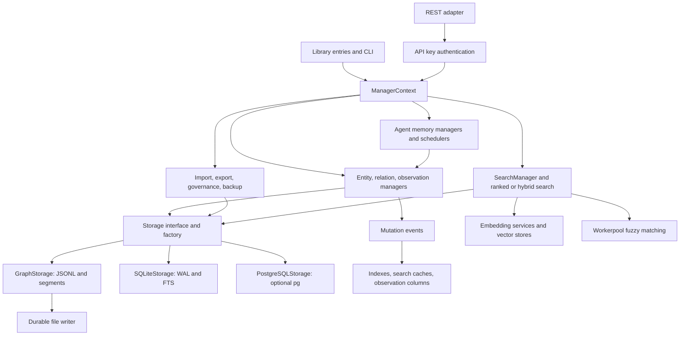

# MemoryJS: speed, stability, and security review

## Publication note

This report and its graph describe commit 549ce11, not the current branch. Before publication, GitHub master had advanced to fd87602. Intervening commits include persistence, authorization, mutex, and documentation changes. Revalidate each finding against current source before implementation. The test and gate results below apply to the inspected checkout. Running inspect-graph.mjs again replaces the graph with an inventory of the current checkout.

## Scope and conclusion

Reviewed checkout: `549ce11`, package `4.0.0`. Inspection date: 2026-09-15.

Correctness and isolation are the first priorities. Direct probes reproduced cross-storage search results, lost concurrent batch updates, shared nested mutation state, and missing project-scoped search results. These defects can invalidate performance measurements and application behavior.

This report records the inspection at the checkout above. No runtime implementation, dependencies, or security settings changed during inspection. The worktree was clean before the report files were added.

All 268 source TypeScript files were parsed for structural inventory and import dependencies. Detailed semantic review focused on storage, transactions, search, HTTP adapters, configuration, lifecycle, packaging, and verification. This is not an exhaustive proof of every function or a complete dynamic call graph. Performance proposals below are hypotheses until benchmarked.

## Verification results

| Check | Result |
|---|---|
| Fresh AST inventory | 268 source files; 95,507 lines, including comments and blanks |
| Declaration inventory | 223 classes; 648 interfaces; 156 type aliases; 8,067 variable declarators |
| Callable syntax inventory | 4,365 function declarations, expressions, and arrows, including callbacks and method implementations |
| Internal dependency edges | 669 static runtime, 411 type-only, 15 literal dynamic imports |
| Static runtime cycles | None detected by strongly connected component analysis |
| Typecheck | Passed |
| Lint | Passed with warnings; custom rules checked 268 files |
| Default tests | 7,848 passed; 1 failed; 321 test files; reported duration 12.12 seconds |
| Test failure | Windows denied symlink creation before the recovery-confinement assertion in FileSegmentStorage.test.ts:335 |
| Root dependency audit | No advisories found across 261 checked packages |
| Four tool lockfile audits | Three clear; dependency-graph tool has one high-severity js-yaml advisory |
| Native SQLite capability | Opened an in-memory database, ran SELECT 1, and closed successfully under Node 24.19.0 |
| Existing graph census check | Could not start: js-yaml is not installed for the graph tool |
| Existing generated graph | Reports 266 files, versus 268 in the fresh source parse; stale |

The default test command was used without the CI unhandled-error suppression. Performance tests are excluded by the default configuration. No production-scale latency, RSS, or power-loss measurements were made. PostgreSQL, remote embedding providers, and fresh distributable builds were not exercised.

The graph inventory is in `dependency-graph.json` beside this report. `inspect-graph.mjs` reproduces the AST inventory when run from the repository root. Counts describe syntactic edges, not unique package dependencies. Runtime classification follows explicit TypeScript import/export kinds; it is not a measurement of bundled evaluation.

## Dependency structure

This diagram summarizes operational paths. The JSON artifact contains the static import edges.

### Concentrated dependencies

| Module | Direct static runtime edges out | Static reachable files, including itself |
|---|---:|---:|
| Root index | 8 | 226 |
| ManagerContext | 86 | 179 |
| GraphStorage | 11 | 46 |
| Search barrel | 39 | 73 |
| Security barrel | 4 | 5 |

`ManagerContext` creates many instances lazily, but static imports still expose a large module closure. Instance laziness does not guarantee low module-loading cost. The utility barrel has 27 incoming runtime edges and 26 outgoing edges. Internal barrel imports widen otherwise small dependency paths.

The library has ten public module entry points plus CLI and worker builds. ESM output shares chunks. CJS entries are separate bundles, and the build configuration explicitly acknowledges duplicated module state and class identities when consumers mix entries. The SQLite registry relies on module side effects while the package declares `sideEffects: false`.

### External dependencies

| Dependency | Role and review implication |
|---|---|
| better-sqlite3 13.0.3 | Native, synchronous storage; installed package requires Node >=22 |
| async-mutex | Storage write serialization, alongside a separate custom AsyncMutex for manager mutations |
| workerpool 10.2.0 | Fuzzy-search workers; include startup, serialization, cancellation, and shutdown in benchmarks |
| zod 4.4.3 | Runtime schemas; reuse these at boundaries instead of parallel manual validation |
| chrono-node 2.9.1 | Temporal query parsing |
| commander 15.0.0 | CLI; requires Node >=22.12.0 |
| chalk 6.0.0 and cli-table3 | CLI formatting; Chalk requires Node >=22 |
| pg | Optional peer dependency for PostgreSQL |
| @xenova/transformers | Dynamic optional import in embedding code; absent from declared dependencies and peers |
| js-yaml 4.3.1 | Independent graph-tool lockfile; vulnerable version, not a root runtime dependency |

The package advertises Node >=18 and bundles for node18. Installed direct dependencies require newer runtimes. CI tests Node 22 and 24, so the advertised Node 18 contract has no matching gate.

The js-yaml advisory affects YAML loading and is fixed in 4.3.2. The inspected graph generator uses `yaml.dump`; a reachable exploit was not established. The lockfile still requires correction. See the [reviewed advisory](https://github.com/advisories/GHSA-2883-xcg3-v3hh).

## Functions and values that determine behavior

| Function or component | Observed behavior | Consequence |
|---|---|---|
| BasicSearch.searchNodes / searchByDateRange | Module-global cache; no storage identity in key | Cross-storage results; broad invalidation across contexts |
| GraphStorage.loadGraph | Returns the live cached object | Readonly typing does not protect JavaScript consumers from mutation |
| GraphStorage.getGraphForMutation | Copies entities and selected arrays, but shares nested records and relation metadata | Unsaved mutations can modify cached state |
| BatchTransaction.execute | Reads a snapshot and later saves it without a transaction-wide lock | Concurrent batches can overwrite successful updates |
| TransactionManager.commit | Backup, snapshot, mutation, full save, backup cleanup | Large write cost; rollback and concurrent-write behavior need a unified contract |
| durableWriteFile / GraphStorage.durableAppendFile | Single file-handle write, then sync | Short writes are not checked; Windows fallback truncates the live file |
| JsonlColumnStore.flush | Serializes the complete sidecar | Small observation writes can cause graph-sized I/O |
| RankedSearch.searchNodesRanked | Caps candidates before project filtering | Eligible results below the global cutoff disappear |
| HybridSearchManager.search | Concurrent channels, full entity-map allocation, merge and sort | Per-query allocation and synchronous work remain despite Promise.all |
| InMemoryVectorStore.search | Exact vector scan with a bounded top-k heap | Heap optimization already exists; vector distance remains proportional to corpus size and dimension |
| RestRouter.serve / readJsonBody | Buffers JSON before authentication; no byte cap | Unauthorized requests can consume memory before rejection |
| ManagerContext.close | Closes the underlying storage only | Does not coordinate scheduler stops, shadow-write drains, or subscriptions |
| OpenAIEmbeddingService.embedBatchInternal | Fetch has no explicit deadline or response-size bound | A stalled provider can extend an operation indefinitely |

### Important configuration values

| Setting | Current value or behavior | Plan implication |
|---|---|---|
| AsyncMutex | Queue limit 1,000; acquisition deadline 30,000 ms from enqueue | Model queue waiting separately from execution; reject overload explicitly |
| SQLite | WAL, synchronous NORMAL, busy timeout 5,000 ms, cache_size -64000 | State durability explicitly; account for cache memory per connection |
| Search limits | Default 50; maximum 200 | Apply limits after eligibility and final scoring |
| Graph limits | 100,000 entities; 1,000,000 relations; 500 MB; 1,000 observations per entity | Entity/relation manager caps are used; file-size and observation-count constants have no direct references beyond their declarations |
| Boolean query limits | Depth 10; terms 50; operators 20; length 5,000 | Existing checks provide a pattern for other expensive entry points |
| Fuzzy limits | Query 256; names 512; observations 2,048 characters | Preserve bounds while changing workers or algorithms |
| Embedding cache | 1,000 entries; one-hour TTL; default dimension estimate 384 | Memory varies greatly by provider dimensions |
| Shared cache budget | Entry counts; disabled when unset | Equal entry counts do not imply equal memory usage |
| Numeric environment parsing | parseFloat in ManagerContext and agent configuration | Values such as Infinity or numeric prefixes can bypass intended domains |
| llama.cpp provider | 10-second default deadline, 120-second maximum, 16 MiB response cap, host allowlist | Reuse this stricter provider pattern where appropriate |

## Reproduced defects

- **Cross-storage search:** BasicSearch over two minimal storage adapters returned `store-A` for both A and B. Disabling B's cache returned `store-B`. Source inspection independently confirms the shared cache and missing storage key.
- **Lost batch update:** Two concurrent BatchTransaction operations against real GraphStorage each returned success. A new GraphStorage instance reopened the file and found only B; A was lost.
- **Mutation aliasing:** After saving a nested record with value 1, changing the mutation copy to 2 also changed the live cache to 2. No save occurred.
- **Project result starvation:** A corpus with 201 higher-scoring project-A matches and one lower-scoring project-B match returned no B results. The same target was found when searched without the competing A corpus.

The two search probes use controlled storage adapters. The batch and nested-state probes use real temporary JSONL storage. These are deterministic functional probes, not throughput benchmarks.

## Ten-step implementation plan

### 1. Establish trustworthy gates and fix the known dependency advisory

**Priority:** Immediate. **Effort:** Small to medium. **Dependencies:** None.

- Upgrade the graph tool's js-yaml dependency and lockfile to a patched compatible release, at least 4.3.2.
- Install tool dependencies reproducibly. Regenerate the repository's canonical graph with its own generator.
- Replace stale-report-only duplicate checks with a source-backed freshness check.
- Resolve the symlink fixture prerequisite on the supported Windows test environment. Keep real confinement coverage on a capable runner.
- Remove CI unhandled-error suppression after pending asynchronous work has a reliable drain path. Track that completion with step 7.
- Change the import-smoke deadline to fail. Open an in-memory SQLite database and execute a statement; requiring its JavaScript wrapper alone is insufficient.
- Record cold import time, RSS, event-loop delay, search latency, write throughput, bytes written, and lock wait before optimization.

**Acceptance:** All five lockfiles have no high/critical advisories. The census matches source. The default suite is green. Injected rejected background work and a stalled import make CI fail. Preserve a baseline dataset and benchmark configuration.

### 2. Isolate cache state and define ownership of returned values

**Priority:** Immediate; confidentiality and correctness. **Effort:** Medium. **Dependencies:** Regression fixtures from step 1.

- Move BasicSearch caches and generation counters to storage/context ownership, or namespace every key by an unambiguous storage identity.
- Include project and authorization context where cached results depend on them. Never reuse caller-filtered results across principals.
- Replace shallow mutation snapshots with complete isolation for mutable nested fields. Prefer copy-on-write for large graphs once behavior is tested.
- Define separate internal borrowed-view and public snapshot contracts. Avoid adding full graph copies to every internal read.
- Ensure cached result arrays and entity objects cannot be modified to poison later requests.

**Acceptance:** Identical queries across two live stores return only their own records. A write to A does not invalidate B. Nested edits and failed transactions leave live state unchanged. Test both JavaScript and TypeScript consumers.

### 3. Bound and authorize the HTTP boundary

**Priority:** Immediate; resource exhaustion and access control. **Effort:** Medium. **Dependencies:** Step 2 for any shared result cache.

- Authenticate headers before collecting request bodies. Apply a pre-authentication request budget to failed-key traffic.
- Enforce actual streamed-byte limits, deadlines, query lengths, batch sizes, and observation sizes. Do not trust Content-Length alone.
- Return 400 for invalid JSON and 413 for oversized payloads. Map internal failures to generic errors and bounded logs.
- Bind authenticated principals to resource/project policy. The current default list handler reads the entire graph, and key scopes alone do not establish tenant isolation.
- Apply resource checks to direct entity reads, deletes, search, and export. Validate project creation and update permissions.
- Integrate RateLimiter deliberately. Add bucket expiry and a maximum bucket count. Document its single-process scope.

**Acceptance:** Oversized and slow unauthenticated requests terminate within bounded memory and time. Cross-principal reads and mutations fail. Pagination totals and cache hits reveal no unauthorized records. Existing explicit unauthenticated opt-in remains deliberate.

### 4. Repair transaction isolation and persistence guarantees

**Priority:** Immediate; confirmed data loss. **Effort:** Large. **Dependencies:** Step 2.

- Serialize the complete read-validate-mutate-commit interval for batch and legacy transactions, not only the final save.
- Use backend-native transactions for SQLite and PostgreSQL where the public contract permits them.
- Route manager-facing batch operations through the same validation and governance policy. Define low-level storage APIs as a separate trust boundary.
- Make a release function idempotent. Separate queued-request cancellation from running-operation completion.
- Correct file writes to handle short writes. Preserve a recoverable previous generation when Windows replacement fails.
- Add directory synchronization where the platform supports it. Preserve corrupt recovery manifests for diagnosis; do not assume partial recovery means the old snapshot is intact.
- State single-process JSONL ownership or add a supported interprocess protocol. An instance mutex cannot coordinate another process.

**Acceptance:** Concurrent batches and ordinary writes preserve every acknowledged operation. Inject failures at write, sync, rename, manifest, and rollback boundaries. Reopen storage and observe a valid old or new state. Verify foreign keys after database migrations and rename operations.

WAL with synchronous NORMAL can lose recent commits after power loss. FULL provides a stronger durability policy. Measure both without presenting reduced durability as a free speed gain. See [SQLite synchronous documentation](https://www.sqlite.org/pragma.html#pragma_synchronous).

### 5. Reduce write amplification and queue contention

**Priority:** High; speed and stability. **Effort:** Large. **Dependencies:** Step 4.

- Measure primary JSONL bytes, sidecar bytes, fsync count, serialization time, and lock wait separately.
- Reuse existing appendEntities, appendRelations, and updateEntities batch paths. Avoid a full graph save for small mutations.
- Coalesce observation shadow writes by entity. Bound pending work and perform one sidecar batch flush per committed group.
- Give mirrors a generation and repair state. A failed shadow write must not remain an apparently authoritative read indefinitely.
- Benchmark bounded group commit only with explicit acknowledgement and crash-recovery semantics.
- Trigger compaction by measured obsolete bytes or append ratio. Account for pauses and temporary disk space.
- Distinguish queue admission deadlines from operation deadlines. Do not simply enlarge the 30-second timeout or start it at the head without bounding total waiting.

**Acceptance:** Read-after-write and reopen tests remain correct. Small mutations avoid whole-graph I/O where supported. Compare queue depths 1, 10, 100, and 1,000; report tail latency and rejected overload. Set the throughput target from the step-1 baseline.

### 6. Correct search eligibility, then reduce candidate work

**Priority:** High; reproduced result loss and query cost. **Effort:** Medium to large. **Dependencies:** Step 2.

- Preserve corpus-wide IDF statistics while filtering eligible project candidates before top-k selection.
- Apply graph boosts before final truncation when the API promises globally boosted ranking.
- Use existing name/type/adjacency indexes and SQLite FTS to restrict candidates. Preserve substring semantics for BasicSearch; FTS is not a drop-in equivalent.
- Cache document lengths and per-corpus term statistics by mutation generation.
- Use bounded top-k selection for ranked and hybrid results. Retain the vector store's existing bounded heap.
- Delay matched-field extraction and evidence construction until the winning candidates are known.
- Reuse storage entity indexes instead of building a full entity map on each hybrid query.
- Consider approximate vector search only after exact-scan cost is measured. Treat recall and format changes as an explicit design decision.

**Acceptance:** Compare results with a simple exhaustive oracle, including ties, filters, updates, and more than 200 cross-project competitors. Benchmark cold and warm queries at 1k, 10k, and 100k entities. Report recall, candidate count, allocation, and p50/p95/p99 latency.

### 7. Own asynchronous work and provider deadlines

**Priority:** High; shutdown and availability. **Effort:** Medium. **Dependencies:** Step 4's commit contract.

- Add an awaitable context shutdown operation that stops admission, stops schedulers, drains writes, detaches listeners, and closes workers and storage.
- Define whether shutdown flushes or cancels each task category. Preserve failures for the caller.
- Dispose replaced agent managers and their dependent schedulers before overwriting references.
- Add caller cancellation and a total request deadline to remote embeddings and LLM operations.
- Bound response size and embedding shape. Require finite values, consistent dimensions, and the expected item count.
- Use bounded retries with jitter and Retry-After handling for documented transient statuses. Prevent retries from outliving the caller deadline.

**Acceptance:** Repeated create/use/reconfigure/shutdown cycles leave no growing handles or listeners. Shutdown immediately after mutation survives reopening. Mock hung, oversized, malformed, and rate-limited providers. CI has no blanket unhandled-error suppression after this step.

### 8. Validate configuration and budget memory by cost

**Priority:** High; predictable resource use. **Effort:** Medium. **Dependencies:** Steps 2 and 7.

- Introduce one typed configuration parser with units, finite-number checks, integer requirements, ranges, and cross-field checks.
- Reject numeric prefixes, Infinity, negative sizes, and invalid probabilities. Validate hybrid weights and effective limits before work starts.
- Make operational limits apply at library, import, REST, and direct storage boundaries according to each trust contract.
- Add approximate byte accounting to variable-sized caches. Include vector dimensions, retained entity graphs, and token arrays.
- Budget SQLite page caches across connection pools. Bound tiered-cache storage, decompressed output, and outstanding worker payloads.
- Keep persisted entity fields and schemas synchronized through a shared descriptor or round-trip contract tests.

**Acceptance:** A configuration matrix covers unset, valid, malformed, boundary, and conflicting values. JSONL and SQLite preserve supported fields after reopen. Large observations and high-dimensional vectors remain within documented process and cache budgets.

### 9. Simplify package loading and runtime contracts

**Priority:** Medium to high; startup and deployment stability. **Effort:** Medium to large. **Dependencies:** Step 1's baseline and artifact tests.

- Align the Node engine declaration, build target, dependency requirements, and CI matrix. Decide whether to raise the minimum or restore dependency compatibility.
- Replace broad internal barrel imports with direct imports when they materially shrink the runtime closure.
- Keep optional backend/provider loading explicit. Declare and document the optional local-transformer dependency contract.
- Resolve the SQLite registration side-effect contract instead of relying on a tree-shaking exception consumers must discover.
- Prototype module-preserving ESM/CJS output with separate compiler configurations and format boundaries. Verify emitted declarations and worker paths before replacing tsup.
- Ensure mixed CJS root/subpath imports share registries, caches, and class identities.
- Measure native install cost separately from library import cost. Native dependency optionality is a compatibility decision, not an automatic cleanup.

**Acceptance:** Test a packed install outside the checkout for every export, both module formats, mixed imports, CLI commands, and worker loading. Exercise JSONL without a native addon and SQLite with one. Compare cold import time, RSS, and shipped size against baseline.

### 10. Validate improvements under realistic load and stage adoption

**Priority:** Release gate. **Effort:** Medium. **Dependencies:** Steps 1–9.

- Build fixed-seed workloads for single-user memory, concurrent agents, project isolation, bulk imports, and large observations.
- Run Node on supported Windows, Linux, and macOS environments. Run Bun separately where supported.
- Record p50/p95/p99 latency, throughput, RSS, event-loop delay, lock wait, cache hit rate, bytes written, and provider calls.
- Separate deterministic correctness gates from isolated performance jobs. Include CPU and disk contention as named scenarios.
- Compare each change independently. Adopt a performance change only when repeated measurements exceed observed run-to-run variance.
- Require fault injection, isolation checks, dependency audits, fresh architecture reports, and packed-artifact tests before release.
- Stage optional optimizations and retain a rollback path. Storage-format changes require migration and recovery procedures.

**Acceptance:** Publish a before/after matrix with unchanged correctness and security contracts. Set numerical latency and memory budgets from baseline and product needs. Do not claim a speedup from source analysis or a single timing run.

## Recommended order

Capture the baseline and patch the tooling advisory first. Address cache isolation, the HTTP boundary, and transaction data loss next. Then reduce write and search work. Complete lifecycle and memory controls before changing packaging or enabling new optimization modes. The final step validates the combined system.

The existing strengths should remain: strict typechecking, broad tests, parameterized database statements, WAL support, append and batch primitives, name and relation indexes, query-complexity checks, API-key hashing and constant-time comparison, explicit unauthenticated-router opt-in, host-restricted llama.cpp requests, and vector top-k selection.

## Source navigation

- [Cache keys and borrowed cached results](../../src/search/BasicSearch.ts)
- [Global cache generations](../../src/utils/searchCache.ts)
- [Mutation snapshot copying](../../src/core/GraphStorage.ts)
- [Batch transaction snapshot and commit](../../src/core/TransactionManager.ts)
- [Legacy transaction backup and rollback](../../src/core/TransactionManager.ts)
- [Durable write and Windows fallback](../../src/utils/durableWriteFile.ts)
- [HTTP body processing](../../src/adapters/RestRouter.ts)
- [Project filter after scoring cutoff](../../src/search/RankedSearch.ts)
- [Remote embedding request](../../src/search/EmbeddingService.ts)
- [Context close and numeric configuration](../../src/core/ManagerContext.ts)
- [Package output strategy](../../tsup.config.ts)
- [False-positive import timeout gate](../../.github/workflows/typescript.yml)
- [CI unhandled-error suppression](../../vitest.config.ts)
- [Node file-handle write contract](https://nodejs.org/api/fs.html#filehandlewritebuffer-offset-length-position)

## Documentation publication checks

The portable inventory script reproduces the 268-file source census. JavaScript syntax and whitespace checks pass. The existing architecture documentation gate reports stale metrics. The source documentation gate reports 219 existing issues across 268 checked files. These gates inspect broader repository documentation; no runtime source changes are included with this report. The repository tracker records the remaining documentation work.
