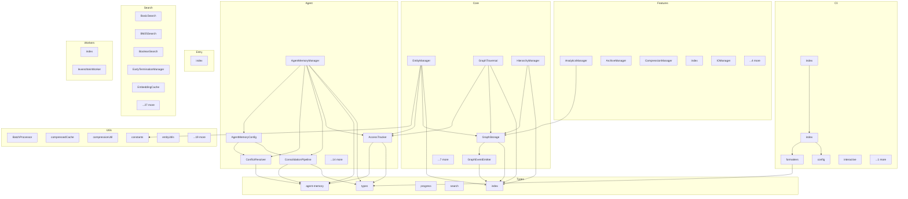

# @danielsimonjr/memoryjs - Dependency Graph

**Version**: 1.5.0 | **Last Updated**: 2026-02-11

This document provides a comprehensive dependency graph of all files, components, imports, functions, and variables in the codebase.

---

## Table of Contents

1. [Overview](#overview)
2. [Agent Dependencies](#agent-dependencies)
3. [Cli Dependencies](#cli-dependencies)
4. [Core Dependencies](#core-dependencies)
5. [Features Dependencies](#features-dependencies)
6. [Entry Dependencies](#entry-dependencies)
7. [Search Dependencies](#search-dependencies)
8. [Types Dependencies](#types-dependencies)
9. [Utils Dependencies](#utils-dependencies)
10. [Workers Dependencies](#workers-dependencies)
11. [Dependency Matrix](#dependency-matrix)
12. [Circular Dependency Analysis](#circular-dependency-analysis)
13. [Visual Dependency Graph](#visual-dependency-graph)
14. [Summary Statistics](#summary-statistics)

---

## Overview

The codebase is organized into the following modules:

- **agent**: 19 files
- **cli**: 6 files
- **core**: 12 files
- **features**: 9 files
- **entry**: 1 file
- **search**: 32 files
- **types**: 5 files
- **utils**: 24 files
- **workers**: 2 files

---

## Agent Dependencies

### `src/agent/AccessTracker.ts` - Access Tracker

**Internal Dependencies:**
| File | Imports | Type |
|------|---------|------|
| `../types/types.js` | `IGraphStorage` | Import (type-only) |
| `../types/agent-memory.js` | `AgentEntity, AccessContext, AccessPattern` | Import (type-only) |

**Exports:**
- Classes: `AccessTracker`
- Interfaces: `AccessStats`, `AccessTrackerConfig`

---

### `src/agent/AgentMemoryConfig.ts` - Agent Memory Configuration - env var and programmatic config for all agent memory components.

**Internal Dependencies:**
| File | Imports | Type |
|------|---------|------|
| `./WorkingMemoryManager.js` | `WorkingMemoryConfig` | Import (type-only) |
| `./SessionManager.js` | `SessionConfig` | Import (type-only) |
| `./EpisodicMemoryManager.js` | `EpisodicMemoryConfig` | Import (type-only) |
| `./ConsolidationPipeline.js` | `ConsolidationPipelineConfig` | Import (type-only) |
| `./SummarizationService.js` | `SummarizationConfig` | Import (type-only) |
| `./DecayEngine.js` | `DecayEngineConfig` | Import (type-only) |
| `./DecayScheduler.js` | `DecaySchedulerConfig` | Import (type-only) |
| `./SalienceEngine.js` | `SalienceEngineConfig` | Import (type-only) |
| `./ContextWindowManager.js` | `ContextWindowManagerConfig` | Import (type-only) |
| `./MemoryFormatter.js` | `MemoryFormatterConfig` | Import (type-only) |
| `./MultiAgentMemoryManager.js` | `MultiAgentConfig` | Import (type-only) |
| `./ConflictResolver.js` | `ConflictResolverConfig` | Import (type-only) |

**Exports:**
- Interfaces: `AgentMemoryConfig`
- Functions: `loadConfigFromEnv`, `mergeConfig`, `validateConfig`

---

### `src/agent/AgentMemoryManager.ts` - Agent Memory Manager - Unified Facade

**Node.js Built-in Dependencies:**
| Module | Import |
|--------|--------|
| `events` | `EventEmitter` |

**Internal Dependencies:**
| File | Imports | Type |
|------|---------|------|
| `../types/types.js` | `IGraphStorage` | Import (type-only) |
| `../types/agent-memory.js` | `AgentEntity, AgentMetadata, MemoryVisibility, ConflictStrategy, ConflictInfo, SessionEntity, ForgetResult, ConsolidationResult, ContextRetrievalOptions, ContextPackage` | Import (type-only) |
| `./AccessTracker.js` | `AccessTracker, AccessContext` | Import |
| `./DecayEngine.js` | `DecayEngine, ForgetOptions` | Import |
| `./DecayScheduler.js` | `DecayScheduler, DecayCycleResult` | Import |
| `./WorkingMemoryManager.js` | `WorkingMemoryManager, PromotionResult, ConfirmationResult` | Import |
| `./SessionManager.js` | `SessionManager, StartSessionOptions, EndSessionResult` | Import |
| `./EpisodicMemoryManager.js` | `EpisodicMemoryManager, CreateEpisodeOptions, TimelineOptions` | Import |
| `./ConsolidationPipeline.js` | `ConsolidationPipeline` | Import |
| `./SummarizationService.js` | `SummarizationService, ISummarizationProvider` | Import |
| `./PatternDetector.js` | `PatternDetector` | Import |
| `./RuleEvaluator.js` | `RuleEvaluator` | Import |
| `./SalienceEngine.js` | `SalienceEngine` | Import |
| `./ContextWindowManager.js` | `ContextWindowManager` | Import |
| `./MemoryFormatter.js` | `MemoryFormatter` | Import |
| `./MultiAgentMemoryManager.js` | `MultiAgentMemoryManager` | Import |
| `./ConflictResolver.js` | `ConflictResolver, ResolutionResult` | Import |
| `./AgentMemoryConfig.js` | `AgentMemoryConfig, loadConfigFromEnv, mergeConfig, validateConfig` | Import |

**Exports:**
- Classes: `AgentMemoryManager`
- Interfaces: `CreateMemoryOptions`, `RetrieveContextOptions`

---

### `src/agent/ConflictResolver.ts` - Conflict Resolver

**Node.js Built-in Dependencies:**
| Module | Import |
|--------|--------|
| `events` | `EventEmitter` |

**Internal Dependencies:**
| File | Imports | Type |
|------|---------|------|
| `../types/agent-memory.js` | `AgentEntity, ConflictInfo, ConflictStrategy` | Import (type-only) |
| `../types/agent-memory.js` | `AgentMetadata` | Import (type-only) |

**Exports:**
- Classes: `ConflictResolver`
- Interfaces: `ConflictResolverConfig`, `ResolutionResult`

---

### `src/agent/ConsolidationPipeline.ts` - Consolidation Pipeline

**Internal Dependencies:**
| File | Imports | Type |
|------|---------|------|
| `../types/types.js` | `IGraphStorage, Entity` | Import (type-only) |
| `../types/agent-memory.js` | `AgentEntity, ConsolidateOptions, ConsolidationResult, SummarizationResult, PatternResult, MemoryType, MemoryMergeStrategy, MergeResult, DuplicatePair, ConsolidationTrigger, ConsolidationRule` | Import (type-only) |
| `../types/agent-memory.js` | `isAgentEntity` | Import |
| `./WorkingMemoryManager.js` | `WorkingMemoryManager` | Import (type-only) |
| `./DecayEngine.js` | `DecayEngine` | Import (type-only) |
| `./SummarizationService.js` | `SummarizationService` | Import |
| `./PatternDetector.js` | `PatternDetector` | Import |
| `./RuleEvaluator.js` | `RuleEvaluator` | Import |

**Exports:**
- Classes: `ConsolidationPipeline`
- Interfaces: `ConsolidationPipelineConfig`, `PipelineStage`, `StageResult`

---

### `src/agent/ContextWindowManager.ts` - Context Window Manager

**Internal Dependencies:**
| File | Imports | Type |
|------|---------|------|
| `../types/types.js` | `IGraphStorage` | Import (type-only) |
| `../types/agent-memory.js` | `AgentEntity, SalienceContext, ContextRetrievalOptions, ContextPackage, TokenBreakdown, ExcludedEntity, ScoredEntity` | Import (type-only) |
| `../types/agent-memory.js` | `isAgentEntity` | Import |
| `./SalienceEngine.js` | `SalienceEngine` | Import |

**Exports:**
- Classes: `ContextWindowManager`
- Interfaces: `ContextWindowManagerConfig`, `SpilloverResult`

---

### `src/agent/DecayEngine.ts` - Decay Engine

**Internal Dependencies:**
| File | Imports | Type |
|------|---------|------|
| `../types/types.js` | `IGraphStorage` | Import (type-only) |
| `../types/agent-memory.js` | `AgentEntity, DecayResult, ForgetOptions, ForgetResult` | Import (type-only) |
| `../types/agent-memory.js` | `isAgentEntity` | Import |
| `./AccessTracker.js` | `AccessTracker` | Import |

**Exports:**
- Classes: `DecayEngine`
- Interfaces: `DecayEngineConfig`, `DecayOperationOptions`, `ReinforcementOptions`

---

### `src/agent/DecayScheduler.ts` - Decay Scheduler

**Internal Dependencies:**
| File | Imports | Type |
|------|---------|------|
| `../types/agent-memory.js` | `DecayResult, ForgetResult, ForgetOptions` | Import (type-only) |
| `./DecayEngine.js` | `DecayEngine` | Import (type-only) |

**Exports:**
- Classes: `DecayScheduler`
- Interfaces: `DecaySchedulerConfig`, `DecayCycleResult`

---

### `src/agent/EpisodicMemoryManager.ts` - Episodic Memory Manager

**Internal Dependencies:**
| File | Imports | Type |
|------|---------|------|
| `../types/types.js` | `IGraphStorage, Entity, Relation` | Import (type-only) |
| `../types/agent-memory.js` | `AgentEntity` | Import (type-only) |
| `../types/agent-memory.js` | `isAgentEntity` | Import |

**Exports:**
- Classes: `EpisodicMemoryManager`
- Interfaces: `EpisodicMemoryConfig`, `CreateEpisodeOptions`, `TimelineOptions`
- Constants: `EpisodicRelations`

---

### `src/agent/index.ts` - Agent Module - Barrel Export

**Internal Dependencies:**
| File | Imports | Type |
|------|---------|------|
| `./AccessTracker.js` | `AccessTracker, type AccessStats, type AccessTrackerConfig, type AccessContext` | Re-export |
| `./DecayEngine.js` | `DecayEngine, type DecayEngineConfig, type DecayOperationOptions, type ReinforcementOptions, type DecayResult, type ForgetOptions, type ForgetResult` | Re-export |
| `./DecayScheduler.js` | `DecayScheduler, type DecaySchedulerConfig, type DecayCycleResult` | Re-export |
| `./WorkingMemoryManager.js` | `WorkingMemoryManager, type WorkingMemoryConfig, type SessionMemoryFilter, type PromotionMarkOptions, type PromotionCriteria, type PromotionResult, type ConfirmationResult` | Re-export |
| `./SessionManager.js` | `SessionManager, type SessionConfig, type StartSessionOptions, type SessionHistoryOptions, type EndSessionResult` | Re-export |
| `./SessionQueryBuilder.js` | `SessionQueryBuilder, type SessionSearchOptions, type EntityWithContext, type SearchFunction` | Re-export |
| `./EpisodicMemoryManager.js` | `EpisodicMemoryManager, EpisodicRelations, type EpisodicMemoryConfig, type CreateEpisodeOptions, type TimelineOptions` | Re-export |
| `./ConsolidationPipeline.js` | `ConsolidationPipeline, type ConsolidationPipelineConfig, type PipelineStage, type StageResult` | Re-export |
| `./SummarizationService.js` | `SummarizationService, type ISummarizationProvider, type SummarizationConfig, type GroupingResult` | Re-export |
| `./PatternDetector.js` | `PatternDetector` | Re-export |
| `./RuleEvaluator.js` | `RuleEvaluator` | Re-export |
| `./SalienceEngine.js` | `SalienceEngine, type SalienceEngineConfig` | Re-export |
| `./ContextWindowManager.js` | `ContextWindowManager, type ContextWindowManagerConfig, type SpilloverResult` | Re-export |
| `./MemoryFormatter.js` | `MemoryFormatter, type MemoryFormatterConfig` | Re-export |
| `./MultiAgentMemoryManager.js` | `MultiAgentMemoryManager, type MultiAgentConfig` | Re-export |
| `./ConflictResolver.js` | `ConflictResolver, type ConflictResolverConfig, type ResolutionResult` | Re-export |
| `./AgentMemoryManager.js` | `AgentMemoryManager, type CreateMemoryOptions, type RetrieveContextOptions` | Re-export |
| `./AgentMemoryConfig.js` | `type AgentMemoryConfig, loadConfigFromEnv, mergeConfig, validateConfig` | Re-export |

**Exports:**
- Re-exports: `AccessTracker`, `type AccessStats`, `type AccessTrackerConfig`, `type AccessContext`, `DecayEngine`, `type DecayEngineConfig`, `type DecayOperationOptions`, `type ReinforcementOptions`, `type DecayResult`, `type ForgetOptions`, `type ForgetResult`, `DecayScheduler`, `type DecaySchedulerConfig`, `type DecayCycleResult`, `WorkingMemoryManager`, `type WorkingMemoryConfig`, `type SessionMemoryFilter`, `type PromotionMarkOptions`, `type PromotionCriteria`, `type PromotionResult`, `type ConfirmationResult`, `SessionManager`, `type SessionConfig`, `type StartSessionOptions`, `type SessionHistoryOptions`, `type EndSessionResult`, `SessionQueryBuilder`, `type SessionSearchOptions`, `type EntityWithContext`, `type SearchFunction`, `EpisodicMemoryManager`, `EpisodicRelations`, `type EpisodicMemoryConfig`, `type CreateEpisodeOptions`, `type TimelineOptions`, `ConsolidationPipeline`, `type ConsolidationPipelineConfig`, `type PipelineStage`, `type StageResult`, `SummarizationService`, `type ISummarizationProvider`, `type SummarizationConfig`, `type GroupingResult`, `PatternDetector`, `RuleEvaluator`, `SalienceEngine`, `type SalienceEngineConfig`, `ContextWindowManager`, `type ContextWindowManagerConfig`, `type SpilloverResult`, `MemoryFormatter`, `type MemoryFormatterConfig`, `MultiAgentMemoryManager`, `type MultiAgentConfig`, `ConflictResolver`, `type ConflictResolverConfig`, `type ResolutionResult`, `AgentMemoryManager`, `type CreateMemoryOptions`, `type RetrieveContextOptions`, `type AgentMemoryConfig`, `loadConfigFromEnv`, `mergeConfig`, `validateConfig`

---

### `src/agent/MemoryFormatter.ts` - Memory Formatter

**Internal Dependencies:**
| File | Imports | Type |
|------|---------|------|
| `../types/agent-memory.js` | `AgentEntity, ContextPackage` | Import (type-only) |

**Exports:**
- Classes: `MemoryFormatter`
- Interfaces: `MemoryFormatterConfig`

---

### `src/agent/MultiAgentMemoryManager.ts` - Multi-Agent Memory Manager

**Node.js Built-in Dependencies:**
| Module | Import |
|--------|--------|
| `events` | `EventEmitter` |

**Internal Dependencies:**
| File | Imports | Type |
|------|---------|------|
| `../types/types.js` | `IGraphStorage, Entity` | Import (type-only) |
| `../types/agent-memory.js` | `AgentEntity, AgentMetadata, AgentType, MemoryVisibility, ConflictStrategy, ConflictInfo` | Import (type-only) |
| `../types/agent-memory.js` | `isAgentEntity` | Import |
| `./ConflictResolver.js` | `ConflictResolver, ResolutionResult` | Import |

**Exports:**
- Classes: `MultiAgentMemoryManager`
- Interfaces: `MultiAgentConfig`

---

### `src/agent/PatternDetector.ts` - Pattern Detector

**Internal Dependencies:**
| File | Imports | Type |
|------|---------|------|
| `../types/agent-memory.js` | `PatternResult` | Import (type-only) |

**Exports:**
- Classes: `PatternDetector`

---

### `src/agent/RuleEvaluator.ts` - Rule Evaluator

**Internal Dependencies:**
| File | Imports | Type |
|------|---------|------|
| `../types/agent-memory.js` | `AgentEntity, RuleConditions, RuleEvaluationResult` | Import (type-only) |

**Exports:**
- Classes: `RuleEvaluator`

---

### `src/agent/SalienceEngine.ts` - Salience Engine

**Internal Dependencies:**
| File | Imports | Type |
|------|---------|------|
| `../types/types.js` | `IGraphStorage` | Import (type-only) |
| `../types/agent-memory.js` | `AgentEntity, SalienceContext, ScoredEntity, SalienceComponents` | Import (type-only) |
| `../types/agent-memory.js` | `isAgentEntity` | Import |
| `./AccessTracker.js` | `AccessTracker` | Import |
| `./DecayEngine.js` | `DecayEngine` | Import |
| `./SummarizationService.js` | `SummarizationService` | Import |

**Exports:**
- Classes: `SalienceEngine`
- Interfaces: `SalienceEngineConfig`

---

### `src/agent/SessionManager.ts` - Session Manager

**Internal Dependencies:**
| File | Imports | Type |
|------|---------|------|
| `../types/types.js` | `IGraphStorage, Entity, Relation` | Import (type-only) |
| `../types/agent-memory.js` | `AgentEntity, SessionEntity, SessionStatus` | Import (type-only) |
| `../types/agent-memory.js` | `isSessionEntity` | Import |
| `./WorkingMemoryManager.js` | `WorkingMemoryManager` | Import |
| `./EpisodicMemoryManager.js` | `EpisodicMemoryManager` | Import (type-only) |

**Exports:**
- Classes: `SessionManager`
- Interfaces: `SessionConfig`, `StartSessionOptions`, `SessionHistoryOptions`, `EndSessionResult`

---

### `src/agent/SessionQueryBuilder.ts` - Session Query Builder

**Internal Dependencies:**
| File | Imports | Type |
|------|---------|------|
| `../types/types.js` | `Entity, SearchResult` | Import (type-only) |
| `../types/agent-memory.js` | `AgentEntity, SessionEntity, MemoryType` | Import (type-only) |
| `../types/agent-memory.js` | `isAgentEntity, isSessionEntity` | Import |
| `../types/types.js` | `IGraphStorage` | Import (type-only) |
| `./SessionManager.js` | `SessionManager` | Import (type-only) |

**Exports:**
- Classes: `SessionQueryBuilder`
- Interfaces: `SessionSearchOptions`, `EntityWithContext`

---

### `src/agent/SummarizationService.ts` - Summarization Service

**Exports:**
- Classes: `SummarizationService`
- Interfaces: `ISummarizationProvider`, `SummarizationConfig`, `GroupingResult`

---

### `src/agent/WorkingMemoryManager.ts` - Working Memory Manager

**Internal Dependencies:**
| File | Imports | Type |
|------|---------|------|
| `../types/types.js` | `IGraphStorage, Entity` | Import (type-only) |
| `../types/agent-memory.js` | `AgentEntity, WorkingMemoryOptions` | Import (type-only) |
| `../types/agent-memory.js` | `isAgentEntity` | Import |

**Exports:**
- Classes: `WorkingMemoryManager`
- Interfaces: `WorkingMemoryConfig`, `SessionMemoryFilter`, `PromotionMarkOptions`, `PromotionCriteria`, `PromotionResult`, `ConfirmationResult`

---

## Cli Dependencies

### `src/cli/commands/index.ts` - CLI Command Registry

**External Dependencies:**
| Package | Import |
|---------|--------|
| `commander` | `Command` |

**Internal Dependencies:**
| File | Imports | Type |
|------|---------|------|
| `../../core/ManagerContext.js` | `ManagerContext` | Import |
| `../options.js` | `parseGlobalOptions, createLogger, GlobalOptions` | Import |
| `../config.js` | `findConfigFile, loadConfig, mergeConfig` | Import |
| `../formatters.js` | `formatEntities, formatRelations, formatEntityDetail, formatSearchResults, formatSuccess, formatError` | Import |

**Exports:**
- Functions: `registerCommands`

---

### `src/cli/config.ts` - CLI Configuration File Support

**Node.js Built-in Dependencies:**
| Module | Import |
|--------|--------|
| `fs` | `existsSync, readFileSync` |
| `path` | `resolve, dirname` |

**Internal Dependencies:**
| File | Imports | Type |
|------|---------|------|
| `./options.js` | `GlobalOptions` | Import (type-only) |

**Exports:**
- Functions: `findConfigFile`, `loadConfig`, `mergeConfig`

---

### `src/cli/formatters.ts` - CLI Output Formatters

**External Dependencies:**
| Package | Import |
|---------|--------|
| `cli-table3` | `Table` |
| `chalk` | `chalk` |

**Internal Dependencies:**
| File | Imports | Type |
|------|---------|------|
| `../types/types.js` | `Entity, Relation` | Import (type-only) |

**Exports:**
- Functions: `formatEntities`, `formatRelations`, `formatSearchResults`, `formatEntityDetail`, `formatSuccess`, `formatError`

---

### `src/cli/index.ts` - MemoryJS CLI

**External Dependencies:**
| Package | Import |
|---------|--------|
| `commander` | `Command` |

**Node.js Built-in Dependencies:**
| Module | Import |
|--------|--------|
| `fs` | `readFileSync` |
| `url` | `fileURLToPath` |
| `path` | `dirname, join` |

**Internal Dependencies:**
| File | Imports | Type |
|------|---------|------|
| `./commands/index.js` | `registerCommands` | Import |

---

### `src/cli/interactive.ts` - Interactive CLI Mode (REPL)

**External Dependencies:**
| Package | Import |
|---------|--------|
| `chalk` | `chalk` |

**Node.js Built-in Dependencies:**
| Module | Import |
|--------|--------|
| `readline` | `* as readline` |

**Internal Dependencies:**
| File | Imports | Type |
|------|---------|------|
| `../core/ManagerContext.js` | `ManagerContext` | Import |
| `./options.js` | `GlobalOptions` | Import (type-only) |

**Exports:**
- Functions: `startInteractiveMode`

---

### `src/cli/options.ts` - CLI Global Options

**Exports:**
- Interfaces: `GlobalOptions`
- Functions: `parseGlobalOptions`, `createLogger`
- Constants: `defaultOptions`

---

## Core Dependencies

### `src/core/EntityManager.ts` - Entity Manager

**Internal Dependencies:**
| File | Imports | Type |
|------|---------|------|
| `../types/index.js` | `Entity, LongRunningOperationOptions, AccessContext` | Import (type-only) |
| `./GraphStorage.js` | `GraphStorage` | Import (type-only) |
| `../agent/AccessTracker.js` | `AccessTracker` | Import (type-only) |
| `../utils/errors.js` | `EntityNotFoundError, InvalidImportanceError, ValidationError` | Import |
| `../utils/index.js` | `BatchCreateEntitiesSchema, UpdateEntitySchema, EntityNamesSchema, checkCancellation, createProgressReporter, createProgress, sanitizeObject` | Import |
| `../utils/constants.js` | `GRAPH_LIMITS` | Import |

**Exports:**
- Classes: `EntityManager`
- Interfaces: `GetEntityOptions`

---

### `src/core/GraphEventEmitter.ts` - Graph Event Emitter

**Internal Dependencies:**
| File | Imports | Type |
|------|---------|------|
| `../types/index.js` | `GraphEventType, GraphEvent, GraphEventListener, GraphEventMap, Entity, Relation, EntityCreatedEvent, EntityUpdatedEvent, EntityDeletedEvent, RelationCreatedEvent, RelationDeletedEvent, ObservationAddedEvent, ObservationDeletedEvent, GraphSavedEvent, GraphLoadedEvent` | Import (type-only) |

**Exports:**
- Classes: `GraphEventEmitter`

---

### `src/core/GraphStorage.ts` - Graph Storage

**External Dependencies:**
| Package | Import |
|---------|--------|
| `async-mutex` | `Mutex` |

**Node.js Built-in Dependencies:**
| Module | Import |
|--------|--------|
| `fs` | `promises` |

**Internal Dependencies:**
| File | Imports | Type |
|------|---------|------|
| `../types/index.js` | `KnowledgeGraph, Entity, Relation, ReadonlyKnowledgeGraph, IGraphStorage, LowercaseData` | Import (type-only) |
| `../utils/searchCache.js` | `clearAllSearchCaches` | Import |
| `../utils/indexes.js` | `NameIndex, TypeIndex, LowercaseCache, RelationIndex, ObservationIndex` | Import |
| `../utils/index.js` | `sanitizeObject, validateFilePath` | Import |
| `./TransactionManager.js` | `BatchTransaction` | Import |
| `./GraphEventEmitter.js` | `GraphEventEmitter` | Import |

**Exports:**
- Classes: `GraphStorage`

---

### `src/core/GraphTraversal.ts` - Graph Traversal

**Internal Dependencies:**
| File | Imports | Type |
|------|---------|------|
| `../types/index.js` | `Entity, Relation, TraversalOptions, TraversalResult, PathResult, ConnectedComponentsResult, CentralityResult, AccessContext` | Import (type-only) |
| `./GraphStorage.js` | `GraphStorage` | Import (type-only) |
| `../agent/AccessTracker.js` | `AccessTracker` | Import (type-only) |
| `../utils/index.js` | `checkCancellation` | Import |

**Exports:**
- Classes: `GraphTraversal`
- Interfaces: `TraversalOptionsWithTracking`

---

### `src/core/HierarchyManager.ts` - Hierarchy Manager

**Internal Dependencies:**
| File | Imports | Type |
|------|---------|------|
| `../types/index.js` | `Entity, KnowledgeGraph, ReadonlyKnowledgeGraph` | Import (type-only) |
| `./GraphStorage.js` | `GraphStorage` | Import (type-only) |
| `../utils/errors.js` | `EntityNotFoundError, CycleDetectedError` | Import |

**Exports:**
- Classes: `HierarchyManager`

---

### `src/core/index.ts` - Core Module Barrel Export

**Internal Dependencies:**
| File | Imports | Type |
|------|---------|------|
| `./GraphStorage.js` | `GraphStorage` | Re-export |
| `./SQLiteStorage.js` | `SQLiteStorage` | Re-export |
| `./EntityManager.js` | `EntityManager` | Re-export |
| `./RelationManager.js` | `RelationManager` | Re-export |
| `./ObservationManager.js` | `ObservationManager` | Re-export |
| `./HierarchyManager.js` | `HierarchyManager` | Re-export |
| `./ManagerContext.js` | `ManagerContext` | Re-export |
| `./GraphTraversal.js` | `GraphTraversal` | Re-export |
| `./ManagerContext.js` | `ManagerContext` | Re-export |
| `./TransactionManager.js` | `TransactionManager, OperationType, BatchTransaction, type TransactionOperation, type TransactionResult` | Re-export |
| `./StorageFactory.js` | `createStorage, createStorageFromPath` | Re-export |
| `./GraphEventEmitter.js` | `GraphEventEmitter` | Re-export |

**Exports:**
- Re-exports: `GraphStorage`, `SQLiteStorage`, `EntityManager`, `RelationManager`, `ObservationManager`, `HierarchyManager`, `ManagerContext`, `GraphTraversal`, `TransactionManager`, `OperationType`, `BatchTransaction`, `type TransactionOperation`, `type TransactionResult`, `createStorage`, `createStorageFromPath`, `GraphEventEmitter`

---

### `src/core/ManagerContext.ts` - Manager Context

**Node.js Built-in Dependencies:**
| Module | Import |
|--------|--------|
| `path` | `path` |

**Internal Dependencies:**
| File | Imports | Type |
|------|---------|------|
| `./GraphStorage.js` | `GraphStorage` | Import |
| `./SQLiteStorage.js` | `SQLiteStorage` | Import |
| `./EntityManager.js` | `EntityManager` | Import |
| `./RelationManager.js` | `RelationManager` | Import |
| `./ObservationManager.js` | `ObservationManager` | Import |
| `./HierarchyManager.js` | `HierarchyManager` | Import |
| `./GraphTraversal.js` | `GraphTraversal` | Import |
| `../search/SearchManager.js` | `SearchManager` | Import |
| `../search/RankedSearch.js` | `RankedSearch` | Import |
| `../search/index.js` | `SemanticSearch, createEmbeddingService, createVectorStore` | Import |
| `../features/IOManager.js` | `IOManager` | Import |
| `../features/TagManager.js` | `TagManager` | Import |
| `../features/AnalyticsManager.js` | `AnalyticsManager` | Import |
| `../features/CompressionManager.js` | `CompressionManager` | Import |
| `../features/ArchiveManager.js` | `ArchiveManager` | Import |
| `../agent/AccessTracker.js` | `AccessTracker` | Import |
| `../agent/DecayEngine.js` | `DecayEngine` | Import |
| `../agent/DecayScheduler.js` | `DecayScheduler` | Import |
| `../agent/SalienceEngine.js` | `SalienceEngine` | Import |
| `../agent/ContextWindowManager.js` | `ContextWindowManager` | Import |
| `../agent/MemoryFormatter.js` | `MemoryFormatter` | Import |
| `../agent/AgentMemoryManager.js` | `AgentMemoryManager` | Import |
| `../agent/AgentMemoryConfig.js` | `AgentMemoryConfig` | Import (type-only) |
| `../utils/constants.js` | `getEmbeddingConfig` | Import |
| `../utils/index.js` | `validateFilePath` | Import |

**Exports:**
- Classes: `ManagerContext`

---

### `src/core/ObservationManager.ts` - Observation Manager

**Internal Dependencies:**
| File | Imports | Type |
|------|---------|------|
| `./GraphStorage.js` | `GraphStorage` | Import (type-only) |
| `../utils/errors.js` | `EntityNotFoundError` | Import |

**Exports:**
- Classes: `ObservationManager`

---

### `src/core/RelationManager.ts` - Relation Manager

**Internal Dependencies:**
| File | Imports | Type |
|------|---------|------|
| `../types/index.js` | `Relation` | Import (type-only) |
| `./GraphStorage.js` | `GraphStorage` | Import (type-only) |
| `../utils/errors.js` | `ValidationError` | Import |
| `../utils/index.js` | `BatchCreateRelationsSchema, DeleteRelationsSchema` | Import |
| `../utils/constants.js` | `GRAPH_LIMITS` | Import |

**Exports:**
- Classes: `RelationManager`

---

### `src/core/SQLiteStorage.ts` - SQLite Storage

**External Dependencies:**
| Package | Import |
|---------|--------|
| `better-sqlite3` | `Database` |
| `better-sqlite3` | `Database` |
| `async-mutex` | `Mutex` |

**Internal Dependencies:**
| File | Imports | Type |
|------|---------|------|
| `../types/index.js` | `KnowledgeGraph, Entity, Relation, ReadonlyKnowledgeGraph, IGraphStorage, LowercaseData` | Import (type-only) |
| `../utils/searchCache.js` | `clearAllSearchCaches` | Import |
| `../utils/indexes.js` | `NameIndex, TypeIndex` | Import |
| `../utils/index.js` | `sanitizeObject, validateFilePath` | Import |

**Exports:**
- Classes: `SQLiteStorage`

---

### `src/core/StorageFactory.ts` - Storage Factory

**Internal Dependencies:**
| File | Imports | Type |
|------|---------|------|
| `./GraphStorage.js` | `GraphStorage` | Import |
| `./SQLiteStorage.js` | `SQLiteStorage` | Import |
| `../types/index.js` | `IGraphStorage, StorageConfig` | Import (type-only) |

**Exports:**
- Functions: `createStorage`, `createStorageFromPath`

---

### `src/core/TransactionManager.ts` - Validate all operations before executing.

**Internal Dependencies:**
| File | Imports | Type |
|------|---------|------|
| `../types/index.js` | `Entity, Relation, KnowledgeGraph, LongRunningOperationOptions, BatchOperation, BatchResult, BatchOptions` | Import (type-only) |
| `./GraphStorage.js` | `GraphStorage` | Import (type-only) |
| `../features/IOManager.js` | `IOManager` | Import |
| `../utils/errors.js` | `KnowledgeGraphError` | Import |
| `../utils/index.js` | `checkCancellation, createProgressReporter, createProgress, sanitizeObject` | Import |

**Exports:**
- Classes: `TransactionManager`, `BatchTransaction`
- Interfaces: `TransactionResult`
- Enums: `OperationType`

---

## Features Dependencies

### `src/features/AnalyticsManager.ts` - Analytics Manager

**Internal Dependencies:**
| File | Imports | Type |
|------|---------|------|
| `../core/GraphStorage.js` | `GraphStorage` | Import (type-only) |
| `../types/index.js` | `GraphStats, ValidationReport, ValidationIssue, ValidationWarning` | Import (type-only) |

**Exports:**
- Classes: `AnalyticsManager`

---

### `src/features/ArchiveManager.ts` - Archive Manager

**Node.js Built-in Dependencies:**
| Module | Import |
|--------|--------|
| `fs` | `promises` |
| `path` | `dirname, join` |

**Internal Dependencies:**
| File | Imports | Type |
|------|---------|------|
| `../types/index.js` | `Entity, LongRunningOperationOptions` | Import (type-only) |
| `../core/GraphStorage.js` | `GraphStorage` | Import (type-only) |
| `../utils/index.js` | `compress, COMPRESSION_CONFIG, checkCancellation, createProgressReporter, createProgress` | Import |

**Exports:**
- Classes: `ArchiveManager`
- Interfaces: `ArchiveCriteria`, `ArchiveOptions`, `ArchiveResult`

---

### `src/features/CompressionManager.ts` - Compression Manager

**Internal Dependencies:**
| File | Imports | Type |
|------|---------|------|
| `../types/index.js` | `Entity, Relation, GraphCompressionResult, KnowledgeGraph, LongRunningOperationOptions, PreparedEntity` | Import (type-only) |
| `../core/GraphStorage.js` | `GraphStorage` | Import (type-only) |
| `../utils/index.js` | `levenshteinDistance, checkCancellation, createProgressReporter, createProgress, fnv1aHash` | Import |
| `../utils/errors.js` | `EntityNotFoundError, InsufficientEntitiesError` | Import |
| `../utils/constants.js` | `SIMILARITY_WEIGHTS, DEFAULT_DUPLICATE_THRESHOLD` | Import |

**Exports:**
- Classes: `CompressionManager`

---

### `src/features/index.ts` - Features Module Barrel Export

**Internal Dependencies:**
| File | Imports | Type |
|------|---------|------|
| `./TagManager.js` | `TagManager` | Re-export |
| `./IOManager.js` | `IOManager, type ExportFormat, type ImportFormat, type MergeStrategy, type BackupMetadata, type BackupInfo` | Re-export |
| `./AnalyticsManager.js` | `AnalyticsManager` | Re-export |
| `./CompressionManager.js` | `CompressionManager` | Re-export |
| `./ArchiveManager.js` | `ArchiveManager, type ArchiveCriteria, type ArchiveOptions, type ArchiveResult` | Re-export |
| `./StreamingExporter.js` | `StreamingExporter, type StreamResult` | Re-export |
| `./ObservationNormalizer.js` | `ObservationNormalizer, type NormalizationOptions, type NormalizationResult` | Re-export |
| `./KeywordExtractor.js` | `KeywordExtractor, type ScoredKeyword` | Re-export |

**Exports:**
- Re-exports: `TagManager`, `IOManager`, `type ExportFormat`, `type ImportFormat`, `type MergeStrategy`, `type BackupMetadata`, `type BackupInfo`, `AnalyticsManager`, `CompressionManager`, `ArchiveManager`, `type ArchiveCriteria`, `type ArchiveOptions`, `type ArchiveResult`, `StreamingExporter`, `type StreamResult`, `ObservationNormalizer`, `type NormalizationOptions`, `type NormalizationResult`, `KeywordExtractor`, `type ScoredKeyword`

---

### `src/features/IOManager.ts` - Import graph from formatted data.

**Node.js Built-in Dependencies:**
| Module | Import |
|--------|--------|
| `fs` | `promises` |
| `path` | `dirname, join` |

**Internal Dependencies:**
| File | Imports | Type |
|------|---------|------|
| `../types/index.js` | `Entity, Relation, KnowledgeGraph, ReadonlyKnowledgeGraph, ImportResult, BackupOptions, BackupResult, RestoreResult, ExportOptions, ExportResult, LongRunningOperationOptions` | Import (type-only) |
| `../core/GraphStorage.js` | `GraphStorage` | Import (type-only) |
| `../utils/errors.js` | `FileOperationError` | Import |
| `../utils/index.js` | `compress, decompress, hasBrotliExtension, COMPRESSION_CONFIG, STREAMING_CONFIG, checkCancellation, createProgressReporter, createProgress, validateFilePath, sanitizeObject, escapeCsvFormula` | Import |
| `./StreamingExporter.js` | `StreamingExporter, StreamResult` | Import |

**Exports:**
- Classes: `IOManager`
- Interfaces: `BackupMetadata`, `BackupInfo`

---

### `src/features/KeywordExtractor.ts` - Keyword Extractor

**Exports:**
- Classes: `KeywordExtractor`
- Interfaces: `ScoredKeyword`

---

### `src/features/ObservationNormalizer.ts` - Observation Normalizer

**Internal Dependencies:**
| File | Imports | Type |
|------|---------|------|
| `../types/index.js` | `Entity` | Import (type-only) |

**Exports:**
- Classes: `ObservationNormalizer`
- Interfaces: `NormalizationOptions`, `NormalizationResult`

---

### `src/features/StreamingExporter.ts` - Streaming Export Module

**Node.js Built-in Dependencies:**
| Module | Import |
|--------|--------|
| `fs` | `createWriteStream` |

**Internal Dependencies:**
| File | Imports | Type |
|------|---------|------|
| `../types/types.js` | `Entity, ReadonlyKnowledgeGraph, LongRunningOperationOptions` | Import (type-only) |
| `../utils/index.js` | `checkCancellation, createProgressReporter, createProgress, validateFilePath` | Import |

**Exports:**
- Classes: `StreamingExporter`
- Interfaces: `StreamResult`

---

### `src/features/TagManager.ts` - Tag Manager

**Node.js Built-in Dependencies:**
| Module | Import |
|--------|--------|
| `fs/promises` | `* as fs` |

**Internal Dependencies:**
| File | Imports | Type |
|------|---------|------|
| `../types/index.js` | `TagAlias` | Import (type-only) |

**Exports:**
- Classes: `TagManager`

---

## Entry Dependencies

### `src/index.ts` - MemoryJS - Knowledge Graph Storage Library

**Internal Dependencies:**
| File | Imports | Type |
|------|---------|------|
| `./types/index.js` | `*` | Re-export |
| `./utils/index.js` | `*` | Re-export |
| `./core/index.js` | `*` | Re-export |
| `./features/index.js` | `*` | Re-export |
| `./search/index.js` | `*` | Re-export |

**Exports:**
- Re-exports: `* from ./types/index.js`, `* from ./utils/index.js`, `* from ./core/index.js`, `* from ./features/index.js`, `* from ./search/index.js`

---

## Search Dependencies

### `src/search/BasicSearch.ts` - Basic Search

**Internal Dependencies:**
| File | Imports | Type |
|------|---------|------|
| `../types/index.js` | `KnowledgeGraph` | Import (type-only) |
| `../core/GraphStorage.js` | `GraphStorage` | Import (type-only) |
| `../utils/index.js` | `isWithinDateRange, SEARCH_LIMITS, searchCaches` | Import |
| `./SearchFilterChain.js` | `SearchFilterChain, SearchFilters` | Import |

**Exports:**
- Classes: `BasicSearch`

---

### `src/search/BM25Search.ts` - BM25 Search

**Internal Dependencies:**
| File | Imports | Type |
|------|---------|------|
| `../types/index.js` | `Entity, SearchResult` | Import (type-only) |
| `../core/GraphStorage.js` | `GraphStorage` | Import (type-only) |
| `../utils/constants.js` | `SEARCH_LIMITS` | Import |

**Exports:**
- Classes: `BM25Search`
- Interfaces: `BM25DocumentEntry`, `BM25Index`, `BM25Config`
- Constants: `STOPWORDS`, `DEFAULT_BM25_CONFIG`

---

### `src/search/BooleanSearch.ts` - Boolean Search

**Internal Dependencies:**
| File | Imports | Type |
|------|---------|------|
| `../types/index.js` | `BooleanQueryNode, Entity, KnowledgeGraph` | Import (type-only) |
| `../core/GraphStorage.js` | `GraphStorage` | Import (type-only) |
| `../utils/constants.js` | `SEARCH_LIMITS, QUERY_LIMITS` | Import |
| `../utils/errors.js` | `ValidationError` | Import |
| `./SearchFilterChain.js` | `SearchFilterChain, SearchFilters` | Import |

**Exports:**
- Classes: `BooleanSearch`

---

### `src/search/EarlyTerminationManager.ts` - Early Termination Manager

**Internal Dependencies:**
| File | Imports | Type |
|------|---------|------|
| `../types/index.js` | `HybridSearchResult, QueryAnalysis, ReadonlyKnowledgeGraph` | Import (type-only) |
| `./HybridSearchManager.js` | `HybridSearchManager` | Import (type-only) |
| `./QueryCostEstimator.js` | `SearchLayer` | Import (type-only) |
| `./QueryCostEstimator.js` | `QueryCostEstimator` | Import |

**Exports:**
- Classes: `EarlyTerminationManager`
- Interfaces: `AdequacyCheck`, `EarlyTerminationOptions`, `EarlyTerminationResult`

---

### `src/search/EmbeddingCache.ts` - Embedding Cache

**Node.js Built-in Dependencies:**
| Module | Import |
|--------|--------|
| `crypto` | `createHash` |

**Exports:**
- Classes: `EmbeddingCache`
- Interfaces: `EmbeddingCacheStats`, `EmbeddingCacheOptions`
- Constants: `DEFAULT_EMBEDDING_CACHE_OPTIONS`

---

### `src/search/EmbeddingService.ts` - Embedding Service

**Internal Dependencies:**
| File | Imports | Type |
|------|---------|------|
| `../types/index.js` | `EmbeddingService, EmbeddingConfig, EmbeddingMode` | Import (type-only) |
| `../utils/constants.js` | `EMBEDDING_DEFAULTS, OPENAI_API_CONFIG, getEmbeddingConfig` | Import |

**Exports:**
- Classes: `OpenAIEmbeddingService`, `LocalEmbeddingService`, `MockEmbeddingService`
- Functions: `l2Normalize`, `createEmbeddingService`
- Constants: `QUERY_PREFIX`, `DOCUMENT_PREFIX`

---

### `src/search/FuzzySearch.ts` - Fuzzy Search

**External Dependencies:**
| Package | Import |
|---------|--------|
| `@danielsimonjr/workerpool` | `Pool, workerpool` |

**Node.js Built-in Dependencies:**
| Module | Import |
|--------|--------|
| `url` | `fileURLToPath` |
| `path` | `dirname, join, sep, normalize` |
| `fs` | `existsSync` |

**Internal Dependencies:**
| File | Imports | Type |
|------|---------|------|
| `../types/index.js` | `Entity, KnowledgeGraph` | Import (type-only) |
| `../core/GraphStorage.js` | `GraphStorage` | Import (type-only) |
| `../utils/index.js` | `levenshteinDistance` | Import |
| `../utils/constants.js` | `SEARCH_LIMITS` | Import |
| `./SearchFilterChain.js` | `SearchFilterChain, SearchFilters` | Import |

**Exports:**
- Classes: `FuzzySearch`
- Interfaces: `FuzzySearchOptions`
- Constants: `DEFAULT_FUZZY_THRESHOLD`

---

### `src/search/HybridScorer.ts` - Hybrid Scorer - combines search scores with min-max normalization and configurable weights.

**Internal Dependencies:**
| File | Imports | Type |
|------|---------|------|
| `../types/index.js` | `Entity` | Import (type-only) |

**Exports:**
- Classes: `HybridScorer`
- Interfaces: `SemanticLayerResult`, `LexicalSearchResult`, `SymbolicSearchResult`, `ScoredResult`, `HybridWeights`, `HybridScorerOptions`
- Constants: `DEFAULT_SCORER_WEIGHTS`

---

### `src/search/HybridSearchManager.ts` - Hybrid Search Manager - orchestrates semantic, lexical, and symbolic search.

**Internal Dependencies:**
| File | Imports | Type |
|------|---------|------|
| `../types/index.js` | `Entity, HybridSearchOptions, HybridSearchResult, ReadonlyKnowledgeGraph, SymbolicFilters` | Import (type-only) |
| `./SemanticSearch.js` | `SemanticSearch` | Import (type-only) |
| `./RankedSearch.js` | `RankedSearch` | Import (type-only) |
| `./SymbolicSearch.js` | `SymbolicSearch` | Import |
| `../utils/constants.js` | `SEMANTIC_SEARCH_LIMITS` | Import |

**Exports:**
- Classes: `HybridSearchManager`
- Constants: `DEFAULT_HYBRID_WEIGHTS`

---

### `src/search/IncrementalIndexer.ts` - Incremental Indexer

**Internal Dependencies:**
| File | Imports | Type |
|------|---------|------|
| `../types/index.js` | `EmbeddingService, EmbeddingMode` | Import (type-only) |
| `../types/index.js` | `IVectorStore` | Import (type-only) |
| `./EmbeddingService.js` | `EmbeddingProgressCallback` | Import (type-only) |

**Exports:**
- Classes: `IncrementalIndexer`
- Interfaces: `IndexOperation`, `IncrementalIndexerOptions`, `FlushResult`
- Constants: `DEFAULT_INDEXER_OPTIONS`

---

### `src/search/index.ts` - Search Module Barrel Export

**Internal Dependencies:**
| File | Imports | Type |
|------|---------|------|
| `./BasicSearch.js` | `BasicSearch` | Re-export |
| `./RankedSearch.js` | `RankedSearch` | Re-export |
| `./BooleanSearch.js` | `BooleanSearch` | Re-export |
| `./FuzzySearch.js` | `FuzzySearch, type FuzzySearchOptions` | Re-export |
| `./SearchSuggestions.js` | `SearchSuggestions` | Re-export |
| `./SavedSearchManager.js` | `SavedSearchManager` | Re-export |
| `./SearchManager.js` | `SearchManager` | Re-export |
| `./SearchFilterChain.js` | `SearchFilterChain, type SearchFilters, type ValidatedPagination` | Re-export |
| `./EmbeddingService.js` | `OpenAIEmbeddingService, LocalEmbeddingService, MockEmbeddingService, createEmbeddingService, l2Normalize, QUERY_PREFIX, DOCUMENT_PREFIX, type EmbeddingProgressCallback` | Re-export |
| `./EmbeddingCache.js` | `EmbeddingCache, DEFAULT_EMBEDDING_CACHE_OPTIONS, type EmbeddingCacheStats, type EmbeddingCacheOptions` | Re-export |
| `./IncrementalIndexer.js` | `IncrementalIndexer, DEFAULT_INDEXER_OPTIONS, type IndexOperationType, type IndexOperation, type IncrementalIndexerOptions, type FlushResult` | Re-export |
| `./VectorStore.js` | `InMemoryVectorStore, SQLiteVectorStore, createVectorStore, cosineSimilarity, type SQLiteStorageWithEmbeddings` | Re-export |
| `./SemanticSearch.js` | `SemanticSearch, entityToText` | Re-export |
| `./TFIDFIndexManager.js` | `TFIDFIndexManager` | Re-export |
| `./TFIDFEventSync.js` | `TFIDFEventSync` | Re-export |
| `./QueryCostEstimator.js` | `QueryCostEstimator, type SearchLayer, type ExtendedQueryCostEstimate, type LayerRecommendationOptions, type TokenEstimationOptions, type AdaptiveDepthConfig` | Re-export |
| `./SymbolicSearch.js` | `SymbolicSearch, type SymbolicResult` | Re-export |
| `./HybridSearchManager.js` | `HybridSearchManager, DEFAULT_HYBRID_WEIGHTS` | Re-export |
| `./QueryAnalyzer.js` | `QueryAnalyzer` | Re-export |
| `./QueryPlanner.js` | `QueryPlanner` | Re-export |
| `./ReflectionManager.js` | `ReflectionManager, type ReflectionOptions, type ReflectionResult, type RefinementHistoryEntry` | Re-export |
| `./BM25Search.js` | `BM25Search, STOPWORDS, DEFAULT_BM25_CONFIG, type BM25DocumentEntry, type BM25Index, type BM25Config` | Re-export |
| `./OptimizedInvertedIndex.js` | `OptimizedInvertedIndex, type IndexMemoryUsage, type PostingListResult` | Re-export |
| `./HybridScorer.js` | `HybridScorer, DEFAULT_SCORER_WEIGHTS, type SemanticLayerResult, type LexicalSearchResult, type SymbolicSearchResult, type ScoredResult, type HybridWeights, type HybridScorerOptions` | Re-export |
| `./ParallelSearchExecutor.js` | `ParallelSearchExecutor, type LayerTiming, type ParallelSearchResult, type ParallelSearchOptions` | Re-export |
| `./EarlyTerminationManager.js` | `EarlyTerminationManager, type AdequacyCheck, type EarlyTerminationOptions, type EarlyTerminationResult` | Re-export |
| `./QueryPlanCache.js` | `QueryPlanCache, type CachedQueryEntry, type QueryPlanCacheStats, type QueryPlanCacheOptions` | Re-export |
| `./QuantizedVectorStore.js` | `QuantizedVectorStore, type QuantizationParams, type QuantizedVectorStoreStats, type QuantizedSearchResult, type QuantizedVectorStoreOptions` | Re-export |
| `./QueryLogger.js` | `QueryLogger, type QueryLoggerConfig` | Re-export |
| `./QueryParser.js` | `QueryParser, matchesPhrase, isPrefixPattern, matchesPrefix` | Re-export |
| `./ProximitySearch.js` | `ProximitySearch, type ProximityMatch, type ProximityMatchLocation` | Re-export |

**Exports:**
- Re-exports: `BasicSearch`, `RankedSearch`, `BooleanSearch`, `FuzzySearch`, `type FuzzySearchOptions`, `SearchSuggestions`, `SavedSearchManager`, `SearchManager`, `SearchFilterChain`, `type SearchFilters`, `type ValidatedPagination`, `OpenAIEmbeddingService`, `LocalEmbeddingService`, `MockEmbeddingService`, `createEmbeddingService`, `l2Normalize`, `QUERY_PREFIX`, `DOCUMENT_PREFIX`, `type EmbeddingProgressCallback`, `EmbeddingCache`, `DEFAULT_EMBEDDING_CACHE_OPTIONS`, `type EmbeddingCacheStats`, `type EmbeddingCacheOptions`, `IncrementalIndexer`, `DEFAULT_INDEXER_OPTIONS`, `type IndexOperationType`, `type IndexOperation`, `type IncrementalIndexerOptions`, `type FlushResult`, `InMemoryVectorStore`, `SQLiteVectorStore`, `createVectorStore`, `cosineSimilarity`, `type SQLiteStorageWithEmbeddings`, `SemanticSearch`, `entityToText`, `TFIDFIndexManager`, `TFIDFEventSync`, `QueryCostEstimator`, `type SearchLayer`, `type ExtendedQueryCostEstimate`, `type LayerRecommendationOptions`, `type TokenEstimationOptions`, `type AdaptiveDepthConfig`, `SymbolicSearch`, `type SymbolicResult`, `HybridSearchManager`, `DEFAULT_HYBRID_WEIGHTS`, `QueryAnalyzer`, `QueryPlanner`, `ReflectionManager`, `type ReflectionOptions`, `type ReflectionResult`, `type RefinementHistoryEntry`, `BM25Search`, `STOPWORDS`, `DEFAULT_BM25_CONFIG`, `type BM25DocumentEntry`, `type BM25Index`, `type BM25Config`, `OptimizedInvertedIndex`, `type IndexMemoryUsage`, `type PostingListResult`, `HybridScorer`, `DEFAULT_SCORER_WEIGHTS`, `type SemanticLayerResult`, `type LexicalSearchResult`, `type SymbolicSearchResult`, `type ScoredResult`, `type HybridWeights`, `type HybridScorerOptions`, `ParallelSearchExecutor`, `type LayerTiming`, `type ParallelSearchResult`, `type ParallelSearchOptions`, `EarlyTerminationManager`, `type AdequacyCheck`, `type EarlyTerminationOptions`, `type EarlyTerminationResult`, `QueryPlanCache`, `type CachedQueryEntry`, `type QueryPlanCacheStats`, `type QueryPlanCacheOptions`, `QuantizedVectorStore`, `type QuantizationParams`, `type QuantizedVectorStoreStats`, `type QuantizedSearchResult`, `type QuantizedVectorStoreOptions`, `QueryLogger`, `type QueryLoggerConfig`, `QueryParser`, `matchesPhrase`, `isPrefixPattern`, `matchesPrefix`, `ProximitySearch`, `type ProximityMatch`, `type ProximityMatchLocation`

---

### `src/search/OptimizedInvertedIndex.ts` - Optimized Inverted Index

**Exports:**
- Classes: `OptimizedInvertedIndex`
- Interfaces: `IndexMemoryUsage`, `PostingListResult`

---

### `src/search/ParallelSearchExecutor.ts` - Parallel Search Executor

**Internal Dependencies:**
| File | Imports | Type |
|------|---------|------|
| `../types/index.js` | `Entity, ReadonlyKnowledgeGraph, SymbolicFilters` | Import (type-only) |
| `./SemanticSearch.js` | `SemanticSearch` | Import (type-only) |
| `./RankedSearch.js` | `RankedSearch` | Import (type-only) |
| `./SymbolicSearch.js` | `SymbolicSearch` | Import |
| `../utils/constants.js` | `SEMANTIC_SEARCH_LIMITS` | Import |

**Exports:**
- Classes: `ParallelSearchExecutor`
- Interfaces: `LayerTiming`, `ParallelSearchResult`, `ParallelSearchOptions`

---

### `src/search/ProximitySearch.ts` - Proximity Search

**Internal Dependencies:**
| File | Imports | Type |
|------|---------|------|
| `../types/types.js` | `Entity` | Import (type-only) |
| `../types/search.js` | `ProximityNode` | Import (type-only) |

**Exports:**
- Classes: `ProximitySearch`
- Interfaces: `ProximityMatch`, `ProximityMatchLocation`

---

### `src/search/QuantizedVectorStore.ts` - Quantized Vector Store

**Exports:**
- Classes: `QuantizedVectorStore`
- Interfaces: `QuantizationParams`, `QuantizedVectorStoreStats`, `QuantizedSearchResult`, `QuantizedVectorStoreOptions`

---

### `src/search/QueryAnalyzer.ts` - Query Analyzer

**Internal Dependencies:**
| File | Imports | Type |
|------|---------|------|
| `../types/index.js` | `QueryAnalysis, ExtractedEntity, TemporalRange` | Import (type-only) |

**Exports:**
- Classes: `QueryAnalyzer`

---

### `src/search/QueryCostEstimator.ts` - Estimates the cost of different search methods and recommends the optimal

**Internal Dependencies:**
| File | Imports | Type |
|------|---------|------|
| `../types/index.js` | `SearchMethod, QueryCostEstimate, QueryCostEstimatorOptions, QueryAnalysis` | Import (type-only) |

**Exports:**
- Classes: `QueryCostEstimator`
- Interfaces: `ExtendedQueryCostEstimate`, `LayerRecommendationOptions`, `TokenEstimationOptions`, `AdaptiveDepthConfig`

---

### `src/search/QueryLogger.ts` - Query Logger

**Node.js Built-in Dependencies:**
| Module | Import |
|--------|--------|
| `fs` | `appendFileSync` |

**Internal Dependencies:**
| File | Imports | Type |
|------|---------|------|
| `../types/search.js` | `LogLevel, QueryLogEntry` | Import (type-only) |

**Exports:**
- Classes: `QueryLogger`
- Interfaces: `QueryLoggerConfig`

---

### `src/search/QueryParser.ts` - Query Parser

**Internal Dependencies:**
| File | Imports | Type |
|------|---------|------|
| `../types/search.js` | `QueryNode, BooleanOpNode` | Import (type-only) |

**Exports:**
- Classes: `QueryParser`
- Functions: `matchesPhrase`, `isPrefixPattern`, `matchesPrefix`

---

### `src/search/QueryPlanCache.ts` - Query Plan Cache

**Internal Dependencies:**
| File | Imports | Type |
|------|---------|------|
| `../types/index.js` | `QueryAnalysis, QueryPlan` | Import (type-only) |

**Exports:**
- Classes: `QueryPlanCache`
- Interfaces: `CachedQueryEntry`, `QueryPlanCacheStats`, `QueryPlanCacheOptions`

---

### `src/search/QueryPlanner.ts` - Query Planner - generates execution plans for queries based on analysis.

**Internal Dependencies:**
| File | Imports | Type |
|------|---------|------|
| `../types/index.js` | `QueryAnalysis, QueryPlan, SubQuery, SymbolicFilters` | Import (type-only) |

**Exports:**
- Classes: `QueryPlanner`

---

### `src/search/RankedSearch.ts` - Ranked Search

**Internal Dependencies:**
| File | Imports | Type |
|------|---------|------|
| `../types/index.js` | `Entity, SearchResult, TFIDFIndex, TokenizedEntity` | Import (type-only) |
| `../core/GraphStorage.js` | `GraphStorage` | Import (type-only) |
| `../utils/index.js` | `calculateTF, calculateIDFFromTokenSets, tokenize` | Import |
| `../utils/constants.js` | `SEARCH_LIMITS` | Import |
| `./TFIDFIndexManager.js` | `TFIDFIndexManager` | Import |
| `./SearchFilterChain.js` | `SearchFilterChain, SearchFilters` | Import |

**Exports:**
- Classes: `RankedSearch`

---

### `src/search/ReflectionManager.ts` - Reflection Manager

**Internal Dependencies:**
| File | Imports | Type |
|------|---------|------|
| `../types/index.js` | `ReadonlyKnowledgeGraph, QueryAnalysis, HybridSearchResult, HybridSearchOptions` | Import (type-only) |
| `./HybridSearchManager.js` | `HybridSearchManager` | Import (type-only) |
| `./QueryAnalyzer.js` | `QueryAnalyzer` | Import (type-only) |

**Exports:**
- Classes: `ReflectionManager`
- Interfaces: `ReflectionOptions`, `RefinementHistoryEntry`, `ReflectionResult`

---

### `src/search/SavedSearchManager.ts` - Saved Search Manager

**Node.js Built-in Dependencies:**
| Module | Import |
|--------|--------|
| `fs/promises` | `* as fs` |

**Internal Dependencies:**
| File | Imports | Type |
|------|---------|------|
| `../types/index.js` | `SavedSearch, KnowledgeGraph` | Import (type-only) |
| `./BasicSearch.js` | `BasicSearch` | Import (type-only) |
| `../utils/index.js` | `sanitizeObject` | Import |

**Exports:**
- Classes: `SavedSearchManager`

---

### `src/search/SearchFilterChain.ts` - Search Filter Chain

**Internal Dependencies:**
| File | Imports | Type |
|------|---------|------|
| `../types/index.js` | `Entity` | Import (type-only) |
| `../utils/index.js` | `normalizeTags, hasMatchingTag, isWithinImportanceRange, validatePagination, applyPagination, ValidatedPagination` | Import |

**Exports:**
- Classes: `SearchFilterChain`
- Interfaces: `SearchFilters`

---

### `src/search/SearchManager.ts` - Search Manager

**Internal Dependencies:**
| File | Imports | Type |
|------|---------|------|
| `../types/index.js` | `KnowledgeGraph, SearchResult, SavedSearch, AutoSearchResult, Entity, AccessContext` | Import (type-only) |
| `../core/GraphStorage.js` | `GraphStorage` | Import (type-only) |
| `./BasicSearch.js` | `BasicSearch` | Import |
| `./RankedSearch.js` | `RankedSearch` | Import |
| `./BooleanSearch.js` | `BooleanSearch` | Import |
| `./FuzzySearch.js` | `FuzzySearch` | Import |
| `./SearchSuggestions.js` | `SearchSuggestions` | Import |
| `./SavedSearchManager.js` | `SavedSearchManager` | Import |
| `./QueryCostEstimator.js` | `QueryCostEstimator` | Import |
| `../agent/AccessTracker.js` | `AccessTracker` | Import (type-only) |

**Exports:**
- Classes: `SearchManager`
- Interfaces: `SearchOptionsWithTracking`

---

### `src/search/SearchSuggestions.ts` - Search Suggestions

**Internal Dependencies:**
| File | Imports | Type |
|------|---------|------|
| `../core/GraphStorage.js` | `GraphStorage` | Import (type-only) |
| `../utils/index.js` | `levenshteinDistance` | Import |

**Exports:**
- Classes: `SearchSuggestions`

---

### `src/search/SemanticSearch.ts` - Semantic Search Manager

**Internal Dependencies:**
| File | Imports | Type |
|------|---------|------|
| `../types/index.js` | `Entity, EmbeddingService, IVectorStore, SemanticSearchResult, SemanticIndexOptions, ReadonlyKnowledgeGraph` | Import (type-only) |
| `./VectorStore.js` | `InMemoryVectorStore` | Import |
| `../utils/constants.js` | `EMBEDDING_DEFAULTS, SEMANTIC_SEARCH_LIMITS` | Import |
| `../utils/index.js` | `checkCancellation` | Import |

**Exports:**
- Classes: `SemanticSearch`
- Functions: `entityToText`

---

### `src/search/SymbolicSearch.ts` - Symbolic Search Layer - metadata-based filtering using structured predicates.

**Internal Dependencies:**
| File | Imports | Type |
|------|---------|------|
| `../types/index.js` | `Entity, SymbolicFilters` | Import (type-only) |

**Exports:**
- Classes: `SymbolicSearch`
- Interfaces: `SymbolicResult`

---

### `src/search/TFIDFEventSync.ts` - TF-IDF Event Sync

**Internal Dependencies:**
| File | Imports | Type |
|------|---------|------|
| `../core/GraphEventEmitter.js` | `GraphEventEmitter` | Import (type-only) |
| `./TFIDFIndexManager.js` | `TFIDFIndexManager` | Import (type-only) |
| `../types/index.js` | `IGraphStorage` | Import (type-only) |
| `../types/types.js` | `EntityCreatedEvent, EntityUpdatedEvent, EntityDeletedEvent` | Import (type-only) |

**Exports:**
- Classes: `TFIDFEventSync`

---

### `src/search/TFIDFIndexManager.ts` - TF-IDF Index Manager

**Node.js Built-in Dependencies:**
| Module | Import |
|--------|--------|
| `fs/promises` | `* as fs` |
| `path` | `* as path` |

**Internal Dependencies:**
| File | Imports | Type |
|------|---------|------|
| `../types/index.js` | `TFIDFIndex, DocumentVector, KnowledgeGraph, ReadonlyKnowledgeGraph` | Import (type-only) |
| `../utils/index.js` | `calculateIDFFromTokenSets, tokenize` | Import |

**Exports:**
- Classes: `TFIDFIndexManager`

---

### `src/search/VectorStore.ts` - Vector Store

**Internal Dependencies:**
| File | Imports | Type |
|------|---------|------|
| `../types/index.js` | `IVectorStore, VectorSearchResult` | Import (type-only) |

**Exports:**
- Classes: `InMemoryVectorStore`, `SQLiteVectorStore`
- Interfaces: `SQLiteStorageWithEmbeddings`
- Functions: `cosineSimilarity`, `createVectorStore`

---

## Types Dependencies

### `src/types/agent-memory.ts` - Agent Memory Type Definitions

**Internal Dependencies:**
| File | Imports | Type |
|------|---------|------|
| `./types.js` | `Entity` | Import (type-only) |

**Exports:**
- Classes: `AccessContextBuilder`
- Interfaces: `ConflictInfo`, `ObservationSource`, `MemorySource`, `AgentEntity`, `AgentObservation`, `SessionEntity`, `AccessContext`, `SalienceContext`, `SalienceWeights`, `SalienceComponents`, `ScoredEntity`, `WorkingMemoryOptions`, `DecayOptions`, `ForgetOptions`, `DecayResult`, `ForgetResult`, `ConsolidateOptions`, `ConsolidationResult`, `SummarizationResult`, `PatternResult`, `MergeResult`, `DuplicatePair`, `RuleConditions`, `ConsolidationRule`, `RuleEvaluationResult`, `ContextRetrievalOptions`, `TokenBreakdown`, `ContextPackage`, `ExcludedEntity`, `AgentMetadata`
- Functions: `isAgentEntity`, `isSessionEntity`, `isWorkingMemory`, `isEpisodicMemory`, `isSemanticMemory`, `isProceduralMemory`

---

### `src/types/index.ts` - Types Module - Barrel Export

**Internal Dependencies:**
| File | Imports | Type |
|------|---------|------|
| `./types/index.js` | `Entity, Relation, KnowledgeGraph, SearchResult` | Import |
| `./search.js` | `QueryTraceBuilder` | Re-export |
| `./agent-memory.js` | `isAgentEntity, isSessionEntity, isWorkingMemory, isEpisodicMemory, isSemanticMemory, isProceduralMemory, AccessContextBuilder` | Re-export |
| `./progress.js` | `createProgressInfo, createThrottledProgress, createDetailedProgressReporter` | Re-export |

**Exports:**
- Re-exports: `QueryTraceBuilder`, `isAgentEntity`, `isSessionEntity`, `isWorkingMemory`, `isEpisodicMemory`, `isSemanticMemory`, `isProceduralMemory`, `AccessContextBuilder`, `createProgressInfo`, `createThrottledProgress`, `createDetailedProgressReporter`

---

### `src/types/progress.ts` - Progress Types

**Exports:**
- Interfaces: `ProgressInfo`, `ProgressOptions`
- Functions: `createProgressInfo`, `createThrottledProgress`, `createDetailedProgressReporter`

---

### `src/types/search.ts` - Search Types

**Exports:**
- Classes: `QueryTraceBuilder`
- Interfaces: `QueryLogEntry`, `QueryTrace`, `QueryStage`, `SearchExplanation`, `ScoringSignal`, `MatchedTerm`, `ScoreBoost`, `ExplainedSearchResult`, `TermNode`, `PhraseNode`, `WildcardNode`, `ProximityNode`, `FieldNode`, `BooleanOpNode`

---

### `src/types/types.ts` - Type Definitions

**Internal Dependencies:**
| File | Imports | Type |
|------|---------|------|
| `../utils/taskScheduler.js` | `ProgressCallback, TaskPriority` | Import (type-only) |

---

## Utils Dependencies

### `src/utils/BatchProcessor.ts` - Batch Processor

**Exports:**
- Classes: `BatchProcessor`
- Interfaces: `BatchProgress`, `BatchItemResult`, `BatchProcessResult`, `BatchProcessorOptions`
- Functions: `processBatch`, `processWithRetry`, `chunkArray`, `parallelLimit`, `mapParallel`, `filterParallel`

---

### `src/utils/compressedCache.ts` - Compressed Cache Utility

**Node.js Built-in Dependencies:**
| Module | Import |
|--------|--------|
| `zlib` | `brotliCompressSync, brotliDecompressSync, constants` |

**Internal Dependencies:**
| File | Imports | Type |
|------|---------|------|
| `../types/index.js` | `Entity` | Import (type-only) |
| `./constants.js` | `COMPRESSION_CONFIG` | Import |

**Exports:**
- Classes: `CompressedCache`
- Interfaces: `CompressedCacheOptions`, `CompressedCacheStats`

---

### `src/utils/compressionUtil.ts` - Compression Utility Module

**Node.js Built-in Dependencies:**
| Module | Import |
|--------|--------|
| `zlib` | `brotliCompress, brotliDecompress, constants` |
| `util` | `promisify` |
| `fs` | `promises` |

**Internal Dependencies:**
| File | Imports | Type |
|------|---------|------|
| `./constants.js` | `COMPRESSION_CONFIG` | Import |

**Exports:**
- Interfaces: `CompressionOptions`, `CompressionResult`, `CompressionMetadata`
- Functions: `hasBrotliExtension`, `compress`, `decompress`, `getCompressionRatio`, `compressFile`, `decompressFile`, `createMetadata`, `createUncompressedMetadata`, `compressToBase64`, `decompressFromBase64`

---

### `src/utils/constants.ts` - Application Constants

**Exports:**
- Functions: `getEmbeddingConfig`
- Constants: `FILE_EXTENSIONS`, `FILE_SUFFIXES`, `DEFAULT_FILE_NAMES`, `ENV_VARS`, `DEFAULT_BASE_DIR`, `LOG_PREFIXES`, `SIMILARITY_WEIGHTS`, `DEFAULT_DUPLICATE_THRESHOLD`, `SEARCH_LIMITS`, `IMPORTANCE_RANGE`, `GRAPH_LIMITS`, `QUERY_LIMITS`, `COMPRESSION_CONFIG`, `EMBEDDING_ENV_VARS`, `EMBEDDING_DEFAULTS`, `SEMANTIC_SEARCH_LIMITS`, `OPENAI_API_CONFIG`, `STREAMING_CONFIG`

---

### `src/utils/entityUtils.ts` - Entity Utilities

**Node.js Built-in Dependencies:**
| Module | Import |
|--------|--------|
| `fs` | `promises` |
| `path` | `path` |

**Internal Dependencies:**
| File | Imports | Type |
|------|---------|------|
| `../types/index.js` | `Entity, KnowledgeGraph` | Import (type-only) |
| `./errors.js` | `EntityNotFoundError, FileOperationError` | Import |

**Exports:**
- Interfaces: `CommonSearchFilters`
- Functions: `fnv1aHash`, `findEntityByName`, `findEntityByName`, `findEntityByName`, `findEntityByName`, `findEntitiesByNames`, `entityExists`, `getEntityIndex`, `removeEntityByName`, `getEntityNameSet`, `groupEntitiesByType`, `touchEntity`, `normalizeTag`, `normalizeTags`, `hasMatchingTag`, `hasAllTags`, `filterByTags`, `addUniqueTags`, `removeTags`, `isWithinDateRange`, `parseDateRange`, `isValidISODate`, `getCurrentTimestamp`, `isWithinImportanceRange`, `filterByImportance`, `filterByCreatedDate`, `filterByModifiedDate`, `filterByEntityType`, `entityPassesFilters`, `sanitizeObject`, `escapeCsvFormula`, `validateFilePath`, `ensureMemoryFilePath`
- Constants: `defaultMemoryPath`

---

### `src/utils/EntityValidator.ts` - Entity Validator

**Internal Dependencies:**
| File | Imports | Type |
|------|---------|------|
| `../types/types.js` | `Entity` | Import (type-only) |
| `./EntityValidator.js` | `EntityValidator, required, minLength, pattern` | Import |

**Exports:**
- Classes: `EntityValidator`
- Interfaces: `EntityValidationRule`, `EntityRuleResult`, `EntityValidationIssue`, `EntityValidationResult`, `EntityValidatorConfig`

---

### `src/utils/errors.ts` - errors module

**Exports:**
- Classes: `KnowledgeGraphError`, `EntityNotFoundError`, `RelationNotFoundError`, `DuplicateEntityError`, `ValidationError`, `CycleDetectedError`, `InvalidImportanceError`, `FileOperationError`, `ImportError`, `ExportError`, `InsufficientEntitiesError`, `OperationCancelledError`
- Interfaces: `ErrorOptions`
- Enums: `ErrorCode`

---

### `src/utils/errorSuggestions.ts` - Error Suggestion Generator

**Internal Dependencies:**
| File | Imports | Type |
|------|---------|------|
| `./errors.js` | `ErrorCode` | Import |

**Exports:**
- Functions: `generateSuggestions`, `getQuickHint`

---

### `src/utils/formatters.ts` - Response and Pagination Formatters

**Internal Dependencies:**
| File | Imports | Type |
|------|---------|------|
| `./constants.js` | `SEARCH_LIMITS` | Import |

**Exports:**
- Interfaces: `ValidatedPagination`
- Functions: `formatToolResponse`, `formatTextResponse`, `formatRawResponse`, `formatErrorResponse`, `validatePagination`, `applyPagination`, `paginateArray`, `getPaginationMeta`

---

### `src/utils/index.ts` - Utilities Module Barrel Export

**Internal Dependencies:**
| File | Imports | Type |
|------|---------|------|
| `./errors.js` | `ErrorCode, KnowledgeGraphError, EntityNotFoundError, RelationNotFoundError, DuplicateEntityError, ValidationError, CycleDetectedError, InvalidImportanceError, FileOperationError, ImportError, ExportError, InsufficientEntitiesError, OperationCancelledError, type ErrorOptions` | Re-export |
| `./errorSuggestions.js` | `generateSuggestions, getQuickHint` | Re-export |
| `./constants.js` | `FILE_EXTENSIONS, FILE_SUFFIXES, DEFAULT_FILE_NAMES, ENV_VARS, DEFAULT_BASE_DIR, LOG_PREFIXES, SIMILARITY_WEIGHTS, DEFAULT_DUPLICATE_THRESHOLD, SEARCH_LIMITS, IMPORTANCE_RANGE, GRAPH_LIMITS, QUERY_LIMITS, COMPRESSION_CONFIG, STREAMING_CONFIG, type CompressionQuality` | Re-export |
| `./compressionUtil.js` | `compress, decompress, compressFile, decompressFile, compressToBase64, decompressFromBase64, hasBrotliExtension, getCompressionRatio, createMetadata, createUncompressedMetadata, type CompressionOptions, type CompressionResult, type CompressionMetadata` | Re-export |
| `./compressedCache.js` | `CompressedCache, type CompressedCacheOptions, type CompressedCacheStats` | Re-export |
| `./logger.js` | `logger` | Re-export |
| `./searchAlgorithms.js` | `levenshteinDistance, calculateTF, calculateIDF, calculateIDFFromTokenSets, calculateTFIDF, tokenize` | Re-export |
| `./indexes.js` | `NameIndex, TypeIndex, LowercaseCache, RelationIndex` | Re-export |
| `./searchCache.js` | `SearchCache, searchCaches, clearAllSearchCaches, getAllCacheStats, cleanupAllCaches, type CacheStats` | Re-export |
| `./schemas.js` | `// Zod schemas - Entity/Relation
  EntitySchema, CreateEntitySchema, UpdateEntitySchema, RelationSchema, CreateRelationSchema, SearchQuerySchema, DateRangeSchema, TagAliasSchema, ExportFormatSchema, BatchCreateEntitiesSchema, BatchCreateRelationsSchema, EntityNamesSchema, DeleteRelationsSchema, // Zod schemas - Observations
  AddObservationInputSchema, AddObservationsInputSchema, DeleteObservationInputSchema, DeleteObservationsInputSchema, // Zod schemas - Archive
  ArchiveCriteriaSchema, // Zod schemas - Saved Search
  SavedSearchInputSchema, SavedSearchUpdateSchema, // Zod schemas - Import/Export
  ImportFormatSchema, ExtendedExportFormatSchema, MergeStrategySchema, ExportFilterSchema, // Zod schemas - Search
  OptionalTagsSchema, OptionalEntityNamesSchema, // Schema types
  type EntityInput, type CreateEntityInput, type UpdateEntityInput, type RelationInput, type CreateRelationInput, type SearchQuery, type DateRange, type TagAliasInput, type AddObservationInput, type DeleteObservationInput, type ArchiveCriteriaInput, type SavedSearchInput, type SavedSearchUpdateInput, type ImportFormatInput, type ExtendedExportFormatInput, type MergeStrategyInput, type ExportFilterInput, // Validation result type
  type ValidationResult, // Zod helpers
  formatZodErrors, validateWithSchema, validateSafe, validateArrayWithSchema, // Manual validation functions
  validateEntity, validateRelation, validateImportance, validateTags` | Re-export |
| `./formatters.js` | `// Response formatting
  formatToolResponse, formatTextResponse, formatRawResponse, formatErrorResponse, type ToolResponse, // Pagination utilities
  validatePagination, applyPagination, paginateArray, getPaginationMeta, type ValidatedPagination` | Re-export |
| `./entityUtils.js` | `// Hash functions (Phase 12 Sprint 1)
  fnv1aHash, // Entity lookup
  findEntityByName, findEntitiesByNames, entityExists, getEntityIndex, removeEntityByName, getEntityNameSet, groupEntitiesByType, touchEntity, // Tag utilities
  normalizeTag, normalizeTags, hasMatchingTag, hasAllTags, filterByTags, addUniqueTags, removeTags, // Date utilities
  isWithinDateRange, parseDateRange, isValidISODate, getCurrentTimestamp, // Filter utilities
  isWithinImportanceRange, filterByImportance, filterByCreatedDate, filterByModifiedDate, filterByEntityType, entityPassesFilters, type CommonSearchFilters, // Path utilities
  validateFilePath, defaultMemoryPath, ensureMemoryFilePath, // Security utilities
  sanitizeObject, escapeCsvFormula` | Re-export |
| `./parallelUtils.js` | `parallelMap, parallelFilter, getPoolStats, shutdownParallelUtils` | Re-export |
| `./taskScheduler.js` | `// Types and Enums
  TaskPriority, TaskStatus, type Task, type TaskResult, type ProgressCallback, type TaskBatchOptions, type QueueStats, // Task Queue
  TaskQueue, // Batch Processing
  batchProcess, rateLimitedProcess, withRetry, // Rate Limiting
  debounce, throttle` | Re-export |
| `./operationUtils.js` | `checkCancellation, createProgressReporter, createProgress, executeWithPhases, processBatchesWithProgress, type PhaseDefinition` | Re-export |
| `./WorkerPoolManager.js` | `WorkerPoolManager, getWorkerPoolManager, type WorkerPoolConfig, type ExtendedPoolStats, type PoolEventCallback` | Re-export |
| `./BatchProcessor.js` | `BatchProcessor, processBatch, processWithRetry, chunkArray, parallelLimit, mapParallel, filterParallel, type BatchProgress, type BatchProgressCallback, type BatchItemResult, type BatchProcessResult, type BatchProcessorOptions` | Re-export |
| `./MemoryMonitor.js` | `MemoryMonitor, globalMemoryMonitor, type ComponentMemoryUsage, type MemoryUsageStats, type MemoryThresholds, type MemoryAlert, type MemoryChangeCallback` | Re-export |
| `./relationHelpers.js` | `isWeightedRelation, isTemporalRelation, isBidirectionalRelation, hasConfidence, isCurrentlyValid, RelationBuilder` | Re-export |
| `./relationValidation.js` | `validateRelationMetadata, validateRelationsMetadata, allRelationsValidMetadata, type RelationValidationResult, type RelationValidationError, type RelationValidationWarning` | Re-export |
| `./EntityValidator.js` | `EntityValidator, type EntityValidatorConfig, type EntityValidationRule, type EntityRuleResult, type EntityValidationIssue, type EntityValidationResult` | Re-export |
| `./validators.js` | `required, minLength, maxLength, pattern, range, min, max, oneOf, minItems, maxItems, email, url, isoDate, typeOf, custom, customSync, asWarning, all, when` | Re-export |
| `./SchemaValidator.js` | `SchemaValidator, type JsonSchema` | Re-export |

**Exports:**
- Re-exports: `ErrorCode`, `KnowledgeGraphError`, `EntityNotFoundError`, `RelationNotFoundError`, `DuplicateEntityError`, `ValidationError`, `CycleDetectedError`, `InvalidImportanceError`, `FileOperationError`, `ImportError`, `ExportError`, `InsufficientEntitiesError`, `OperationCancelledError`, `type ErrorOptions`, `generateSuggestions`, `getQuickHint`, `FILE_EXTENSIONS`, `FILE_SUFFIXES`, `DEFAULT_FILE_NAMES`, `ENV_VARS`, `DEFAULT_BASE_DIR`, `LOG_PREFIXES`, `SIMILARITY_WEIGHTS`, `DEFAULT_DUPLICATE_THRESHOLD`, `SEARCH_LIMITS`, `IMPORTANCE_RANGE`, `GRAPH_LIMITS`, `QUERY_LIMITS`, `COMPRESSION_CONFIG`, `STREAMING_CONFIG`, `type CompressionQuality`, `compress`, `decompress`, `compressFile`, `decompressFile`, `compressToBase64`, `decompressFromBase64`, `hasBrotliExtension`, `getCompressionRatio`, `createMetadata`, `createUncompressedMetadata`, `type CompressionOptions`, `type CompressionResult`, `type CompressionMetadata`, `CompressedCache`, `type CompressedCacheOptions`, `type CompressedCacheStats`, `logger`, `levenshteinDistance`, `calculateTF`, `calculateIDF`, `calculateIDFFromTokenSets`, `calculateTFIDF`, `tokenize`, `NameIndex`, `TypeIndex`, `LowercaseCache`, `RelationIndex`, `SearchCache`, `searchCaches`, `clearAllSearchCaches`, `getAllCacheStats`, `cleanupAllCaches`, `type CacheStats`, `// Zod schemas - Entity/Relation
  EntitySchema`, `CreateEntitySchema`, `UpdateEntitySchema`, `RelationSchema`, `CreateRelationSchema`, `SearchQuerySchema`, `DateRangeSchema`, `TagAliasSchema`, `ExportFormatSchema`, `BatchCreateEntitiesSchema`, `BatchCreateRelationsSchema`, `EntityNamesSchema`, `DeleteRelationsSchema`, `// Zod schemas - Observations
  AddObservationInputSchema`, `AddObservationsInputSchema`, `DeleteObservationInputSchema`, `DeleteObservationsInputSchema`, `// Zod schemas - Archive
  ArchiveCriteriaSchema`, `// Zod schemas - Saved Search
  SavedSearchInputSchema`, `SavedSearchUpdateSchema`, `// Zod schemas - Import/Export
  ImportFormatSchema`, `ExtendedExportFormatSchema`, `MergeStrategySchema`, `ExportFilterSchema`, `// Zod schemas - Search
  OptionalTagsSchema`, `OptionalEntityNamesSchema`, `// Schema types
  type EntityInput`, `type CreateEntityInput`, `type UpdateEntityInput`, `type RelationInput`, `type CreateRelationInput`, `type SearchQuery`, `type DateRange`, `type TagAliasInput`, `type AddObservationInput`, `type DeleteObservationInput`, `type ArchiveCriteriaInput`, `type SavedSearchInput`, `type SavedSearchUpdateInput`, `type ImportFormatInput`, `type ExtendedExportFormatInput`, `type MergeStrategyInput`, `type ExportFilterInput`, `// Validation result type
  type ValidationResult`, `// Zod helpers
  formatZodErrors`, `validateWithSchema`, `validateSafe`, `validateArrayWithSchema`, `// Manual validation functions
  validateEntity`, `validateRelation`, `validateImportance`, `validateTags`, `// Response formatting
  formatToolResponse`, `formatTextResponse`, `formatRawResponse`, `formatErrorResponse`, `type ToolResponse`, `// Pagination utilities
  validatePagination`, `applyPagination`, `paginateArray`, `getPaginationMeta`, `type ValidatedPagination`, `// Hash functions (Phase 12 Sprint 1)
  fnv1aHash`, `// Entity lookup
  findEntityByName`, `findEntitiesByNames`, `entityExists`, `getEntityIndex`, `removeEntityByName`, `getEntityNameSet`, `groupEntitiesByType`, `touchEntity`, `// Tag utilities
  normalizeTag`, `normalizeTags`, `hasMatchingTag`, `hasAllTags`, `filterByTags`, `addUniqueTags`, `removeTags`, `// Date utilities
  isWithinDateRange`, `parseDateRange`, `isValidISODate`, `getCurrentTimestamp`, `// Filter utilities
  isWithinImportanceRange`, `filterByImportance`, `filterByCreatedDate`, `filterByModifiedDate`, `filterByEntityType`, `entityPassesFilters`, `type CommonSearchFilters`, `// Path utilities
  validateFilePath`, `defaultMemoryPath`, `ensureMemoryFilePath`, `// Security utilities
  sanitizeObject`, `escapeCsvFormula`, `parallelMap`, `parallelFilter`, `getPoolStats`, `shutdownParallelUtils`, `// Types and Enums
  TaskPriority`, `TaskStatus`, `type Task`, `type TaskResult`, `type ProgressCallback`, `type TaskBatchOptions`, `type QueueStats`, `// Task Queue
  TaskQueue`, `// Batch Processing
  batchProcess`, `rateLimitedProcess`, `withRetry`, `// Rate Limiting
  debounce`, `throttle`, `checkCancellation`, `createProgressReporter`, `createProgress`, `executeWithPhases`, `processBatchesWithProgress`, `type PhaseDefinition`, `WorkerPoolManager`, `getWorkerPoolManager`, `type WorkerPoolConfig`, `type ExtendedPoolStats`, `type PoolEventCallback`, `BatchProcessor`, `processBatch`, `processWithRetry`, `chunkArray`, `parallelLimit`, `mapParallel`, `filterParallel`, `type BatchProgress`, `type BatchProgressCallback`, `type BatchItemResult`, `type BatchProcessResult`, `type BatchProcessorOptions`, `MemoryMonitor`, `globalMemoryMonitor`, `type ComponentMemoryUsage`, `type MemoryUsageStats`, `type MemoryThresholds`, `type MemoryAlert`, `type MemoryChangeCallback`, `isWeightedRelation`, `isTemporalRelation`, `isBidirectionalRelation`, `hasConfidence`, `isCurrentlyValid`, `RelationBuilder`, `validateRelationMetadata`, `validateRelationsMetadata`, `allRelationsValidMetadata`, `type RelationValidationResult`, `type RelationValidationError`, `type RelationValidationWarning`, `EntityValidator`, `type EntityValidatorConfig`, `type EntityValidationRule`, `type EntityRuleResult`, `type EntityValidationIssue`, `type EntityValidationResult`, `required`, `minLength`, `maxLength`, `pattern`, `range`, `min`, `max`, `oneOf`, `minItems`, `maxItems`, `email`, `url`, `isoDate`, `typeOf`, `custom`, `customSync`, `asWarning`, `all`, `when`, `SchemaValidator`, `type JsonSchema`

---

### `src/utils/indexes.ts` - O(1) lookup indexes for entities, types, relations, and observations.

**Internal Dependencies:**
| File | Imports | Type |
|------|---------|------|
| `../types/index.js` | `Entity, LowercaseData, Relation` | Import (type-only) |

**Exports:**
- Classes: `NameIndex`, `TypeIndex`, `LowercaseCache`, `RelationIndex`, `ObservationIndex`

---

### `src/utils/logger.ts` - Simple logging utility for the Memory MCP Server

**Exports:**
- Constants: `logger`

---

### `src/utils/MemoryMonitor.ts` - Memory Usage Monitor

**Exports:**
- Classes: `MemoryMonitor`
- Interfaces: `ComponentMemoryUsage`, `MemoryUsageStats`, `MemoryThresholds`, `MemoryAlert`
- Constants: `globalMemoryMonitor`

---

### `src/utils/operationUtils.ts` - Operation Utilities

**Internal Dependencies:**
| File | Imports | Type |
|------|---------|------|
| `./errors.js` | `OperationCancelledError` | Import |
| `./taskScheduler.js` | `ProgressCallback` | Import (type-only) |

**Exports:**
- Interfaces: `PhaseDefinition`
- Functions: `checkCancellation`, `createProgressReporter`, `createProgress`, `executeWithPhases`, `processBatchesWithProgress`

---

### `src/utils/parallelUtils.ts` - Parallel Utilities

**External Dependencies:**
| Package | Import |
|---------|--------|
| `@danielsimonjr/workerpool` | `workerpool` |

**Exports:**
- Functions: `shutdownParallelUtils`, `parallelMap`, `parallelFilter`, `getPoolStats`

---

### `src/utils/relationHelpers.ts` - Relation Helper Utilities

**Internal Dependencies:**
| File | Imports | Type |
|------|---------|------|
| `../types/types.js` | `Relation, WeightedRelation, TemporalRelation, BidirectionalRelation, RelationProperties` | Import (type-only) |

**Exports:**
- Classes: `RelationBuilder`
- Functions: `isWeightedRelation`, `isTemporalRelation`, `isBidirectionalRelation`, `hasConfidence`, `isCurrentlyValid`

---

### `src/utils/relationValidation.ts` - Relation Validation Utilities

**Internal Dependencies:**
| File | Imports | Type |
|------|---------|------|
| `../types/types.js` | `Relation` | Import (type-only) |

**Exports:**
- Interfaces: `RelationValidationError`, `RelationValidationWarning`, `RelationValidationResult`
- Functions: `validateRelationMetadata`, `validateRelationsMetadata`, `allRelationsValidMetadata`

---

### `src/utils/schemas.ts` - Validation Schemas and Helpers

**External Dependencies:**
| Package | Import |
|---------|--------|
| `zod` | `z, ZodSchema, ZodError` |

**Internal Dependencies:**
| File | Imports | Type |
|------|---------|------|
| `./constants.js` | `IMPORTANCE_RANGE` | Import |
| `./errors.js` | `ValidationError` | Import |

**Exports:**
- Interfaces: `ValidationResult`
- Functions: `formatZodErrors`, `validateWithSchema`, `validateSafe`, `validateArrayWithSchema`, `validateEntity`, `validateRelation`, `validateImportance`, `validateTags`
- Constants: `EntitySchema`, `CreateEntitySchema`, `UpdateEntitySchema`, `RelationSchema`, `CreateRelationSchema`, `SearchQuerySchema`, `DateRangeSchema`, `TagAliasSchema`, `ExportFormatSchema`, `BatchCreateEntitiesSchema`, `BatchCreateRelationsSchema`, `EntityNamesSchema`, `DeleteRelationsSchema`, `AddObservationInputSchema`, `AddObservationsInputSchema`, `DeleteObservationInputSchema`, `DeleteObservationsInputSchema`, `ArchiveCriteriaSchema`, `SavedSearchInputSchema`, `SavedSearchUpdateSchema`, `ImportFormatSchema`, `ExtendedExportFormatSchema`, `MergeStrategySchema`, `ExportFilterSchema`, `OptionalTagsSchema`, `OptionalEntityNamesSchema`

---

### `src/utils/SchemaValidator.ts` - Schema Validator

**Internal Dependencies:**
| File | Imports | Type |
|------|---------|------|
| `../types/types.js` | `Entity` | Import (type-only) |
| `./EntityValidator.js` | `EntityValidationResult, EntityValidationIssue` | Import (type-only) |

**Exports:**
- Classes: `SchemaValidator`
- Interfaces: `JsonSchema`

---

### `src/utils/searchAlgorithms.ts` - Search Algorithms

**Exports:**
- Functions: `levenshteinDistance`, `calculateTF`, `calculateIDF`, `calculateIDFFromTokenSets`, `calculateTFIDF`, `tokenize`

---

### `src/utils/searchCache.ts` - Search Result Cache

**Internal Dependencies:**
| File | Imports | Type |
|------|---------|------|
| `../types/index.js` | `SearchResult, KnowledgeGraph` | Import (type-only) |

**Exports:**
- Classes: `SearchCache`
- Interfaces: `CacheStats`
- Functions: `clearAllSearchCaches`, `getAllCacheStats`, `cleanupAllCaches`
- Constants: `searchCaches`

---

### `src/utils/taskScheduler.ts` - Task Scheduler

**External Dependencies:**
| Package | Import |
|---------|--------|
| `@danielsimonjr/workerpool` | `workerpool` |

**Exports:**
- Classes: `TaskQueue`
- Interfaces: `Task`, `TaskResult`, `TaskBatchOptions`, `QueueStats`
- Enums: `TaskPriority`, `TaskStatus`
- Functions: `batchProcess`, `rateLimitedProcess`, `withRetry`, `debounce`, `throttle`

---

### `src/utils/validators.ts` - Built-in Validators

**Internal Dependencies:**
| File | Imports | Type |
|------|---------|------|
| `../types/types.js` | `Entity` | Import (type-only) |
| `./EntityValidator.js` | `EntityValidationRule, EntityRuleResult` | Import (type-only) |

**Exports:**
- Functions: `required`, `minLength`, `maxLength`, `pattern`, `range`, `min`, `max`, `oneOf`, `minItems`, `maxItems`, `email`, `url`, `isoDate`, `typeOf`, `custom`, `customSync`, `asWarning`, `all`, `when`

---

### `src/utils/WorkerPoolManager.ts` - WorkerPoolManager module

**External Dependencies:**
| Package | Import |
|---------|--------|
| `@danielsimonjr/workerpool` | `workerpool` |
| `@danielsimonjr/workerpool` | `Pool, PoolStats` |

**Exports:**
- Classes: `WorkerPoolManager`
- Interfaces: `WorkerPoolConfig`, `ExtendedPoolStats`
- Functions: `getWorkerPoolManager`

---

## Workers Dependencies

### `src/workers/index.ts` - Workers Module

**Internal Dependencies:**
| File | Imports | Type |
|------|---------|------|
| `./levenshteinWorker.js` | `levenshteinDistance, similarity, searchEntities` | Re-export |

**Exports:**
- Re-exports: `levenshteinDistance`, `similarity`, `searchEntities`

---

### `src/workers/levenshteinWorker.ts` - Levenshtein Worker

**External Dependencies:**
| Package | Import |
|---------|--------|
| `@danielsimonjr/workerpool` | `workerpool` |

**Exports:**
- Interfaces: `WorkerInput`, `MatchResult`
- Functions: `levenshteinDistance`, `similarity`, `searchEntities`

---

## Dependency Matrix

### File Import/Export Matrix

| File | Imports From | Exports To |
|------|--------------|------------|
| `AccessTracker` | 2 files | 8 files |
| `AgentMemoryConfig` | 12 files | 3 files |
| `AgentMemoryManager` | 18 files | 2 files |
| `ConflictResolver` | 1 files | 4 files |
| `ConsolidationPipeline` | 7 files | 3 files |
| `ContextWindowManager` | 3 files | 4 files |
| `DecayEngine` | 3 files | 7 files |
| `DecayScheduler` | 2 files | 4 files |
| `EpisodicMemoryManager` | 2 files | 4 files |
| `index` | 18 files | 0 files |
| `MemoryFormatter` | 1 files | 4 files |
| `MultiAgentMemoryManager` | 3 files | 3 files |
| `PatternDetector` | 1 files | 3 files |
| `RuleEvaluator` | 1 files | 3 files |
| `SalienceEngine` | 5 files | 5 files |
| `SessionManager` | 4 files | 4 files |
| `SessionQueryBuilder` | 3 files | 1 files |
| `SummarizationService` | 0 files | 5 files |
| `WorkingMemoryManager` | 2 files | 5 files |
| `index` | 4 files | 1 files |
| `config` | 1 files | 1 files |
| `formatters` | 1 files | 1 files |
| `index` | 1 files | 0 files |
| `interactive` | 2 files | 0 files |
| `options` | 0 files | 3 files |
| `EntityManager` | 6 files | 2 files |
| `GraphEventEmitter` | 1 files | 3 files |
| `GraphStorage` | 6 files | 20 files |
| `GraphTraversal` | 4 files | 2 files |
| `HierarchyManager` | 3 files | 2 files |

---

## Circular Dependency Analysis

**3 circular dependencies detected:**

- **Runtime cycles**: 1 (require attention)
- **Type-only cycles**: 2 (safe, no runtime impact)

### Runtime Circular Dependencies

These cycles involve runtime imports and may cause issues:

- src/utils/EntityValidator.ts -> src/utils/EntityValidator.ts

### Type-Only Circular Dependencies

These cycles only involve type imports and are safe (erased at runtime):

- src/core/GraphStorage.ts -> src/core/TransactionManager.ts -> src/core/GraphStorage.ts
- src/core/GraphStorage.ts -> src/core/TransactionManager.ts -> src/features/IOManager.ts -> src/core/GraphStorage.ts

---

## Visual Dependency Graph

---

## Summary Statistics

| Category | Count |
|----------|-------|
| Total TypeScript Files | 110 |
| Total Modules | 9 |
| Total Lines of Code | 43392 |
| Total Exports | 770 |
| Total Re-exports | 460 |
| Total Classes | 98 |
| Total Interfaces | 249 |
| Total Functions | 157 |
| Total Type Guards | 15 |
| Total Enums | 4 |
| Type-only Imports | 142 |
| Runtime Circular Deps | 1 |
| Type-only Circular Deps | 2 |

---

*Last Updated*: 2026-02-11
*Version*: 1.5.0
