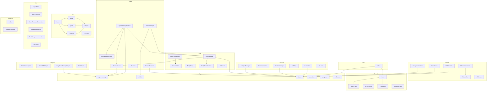

# @danielsimonjr/memoryjs - Dependency Graph

**Version**: 1.15.0 | **Last Updated**: 2026-05-14

This document provides a comprehensive dependency graph of all files, components, imports, functions, and variables in the codebase.

---

## Table of Contents

1. [Overview](#overview)
2. [Adapters Dependencies](#adapters-dependencies)
3. [Agent Dependencies](#agent-dependencies)
4. [Cli Dependencies](#cli-dependencies)
5. [Core Dependencies](#core-dependencies)
6. [Features Dependencies](#features-dependencies)
7. [Entry Dependencies](#entry-dependencies)
8. [Search Dependencies](#search-dependencies)
9. [Security Dependencies](#security-dependencies)
10. [Types Dependencies](#types-dependencies)
11. [Utils Dependencies](#utils-dependencies)
12. [Workers Dependencies](#workers-dependencies)
13. [Dependency Matrix](#dependency-matrix)
14. [Circular Dependency Analysis](#circular-dependency-analysis)
15. [Visual Dependency Graph](#visual-dependency-graph)
16. [Summary Statistics](#summary-statistics)

---

## Overview

The codebase is organized into the following modules:

- **adapters**: 4 files
- **agent**: 66 files
- **cli**: 16 files
- **core**: 25 files
- **features**: 20 files
- **entry**: 1 file
- **search**: 55 files
- **security**: 5 files
- **types**: 7 files
- **utils**: 34 files
- **workers**: 2 files

---

## Adapters Dependencies

### `src/adapters/IDatabaseAdapter.ts` - Database Adapter Interface

**Internal Dependencies:**
| File | Imports | Type |
|------|---------|------|
| `../types/types.js` | `Entity, Relation, KnowledgeGraph` | Import (type-only) |

**Exports:**
- Classes: `NullDatabaseAdapter`, `InMemoryDatabaseAdapter`
- Interfaces: `IDatabaseAdapter`

---

### `src/adapters/IVectorDBAdapter.ts` - Vector Database Adapter Interface

**Exports:**
- Classes: `InMemoryVectorAdapter`
- Interfaces: `VectorUpsert`, `VectorMatch`, `VectorAdapterStats`, `IVectorDBAdapter`

---

### `src/adapters/LangChainMemoryAdapter.ts` - LangChain Memory Adapter

**Internal Dependencies:**
| File | Imports | Type |
|------|---------|------|
| `../core/ManagerContext.js` | `ManagerContext` | Import (type-only) |
| `../agent/MemoryEngine.js` | `MemoryEngine` | Import (type-only) |
| `../types/agent-memory.js` | `AgentEntity` | Import (type-only) |

**Exports:**
- Classes: `LangChainMemoryAdapter`
- Interfaces: `ChatMessage`, `MemoryInputs`, `MemoryVariables`, `LangChainMemoryAdapterOptions`

---

### `src/adapters/RestRouter.ts` - REST Router

**Node.js Built-in Dependencies:**
| Module | Import |
|--------|--------|
| `http` | `IncomingMessage, ServerResponse` |
| `http` | `createServer` |

**Internal Dependencies:**
| File | Imports | Type |
|------|---------|------|
| `../core/ManagerContext.js` | `ManagerContext` | Import (type-only) |
| `../utils/logger.js` | `logger` | Import |

**Exports:**
- Classes: `RestRouter`
- Interfaces: `RestRequest`, `RestResponse`, `RouteDefinition`

---

## Agent Dependencies

### `src/agent/AccessTracker.ts` - Access Tracker

**Internal Dependencies:**
| File | Imports | Type |
|------|---------|------|
| `../types/types.js` | `IGraphStorage` | Import (type-only) |
| `../types/agent-memory.js` | `AgentEntity, AccessContext, AccessPattern` | Import (type-only) |

**Exports:**
- Classes: `AccessTracker`
- Interfaces: `AccessStats`, `AccessTrackerConfig`

---

### `src/agent/AgentMemoryConfig.ts` - Agent Memory Configuration - env var and programmatic config for all agent memory components.

**Internal Dependencies:**
| File | Imports | Type |
|------|---------|------|
| `./WorkingMemoryManager.js` | `WorkingMemoryConfig` | Import (type-only) |
| `./SessionManager.js` | `SessionConfig` | Import (type-only) |
| `./EpisodicMemoryManager.js` | `EpisodicMemoryConfig` | Import (type-only) |
| `./ConsolidationPipeline.js` | `ConsolidationPipelineConfig` | Import (type-only) |
| `./SummarizationService.js` | `SummarizationConfig` | Import (type-only) |
| `./DecayEngine.js` | `DecayEngineConfig` | Import (type-only) |
| `./DecayScheduler.js` | `DecaySchedulerConfig` | Import (type-only) |
| `./SalienceEngine.js` | `SalienceEngineConfig` | Import (type-only) |
| `./ContextWindowManager.js` | `ContextWindowManagerConfig` | Import (type-only) |
| `./MemoryFormatter.js` | `MemoryFormatterConfig` | Import (type-only) |
| `./MultiAgentMemoryManager.js` | `MultiAgentConfig` | Import (type-only) |
| `./ConflictResolver.js` | `ConflictResolverConfig` | Import (type-only) |
| `./CollaborativeSynthesis.js` | `CollaborativeSynthesisConfig` | Import (type-only) |
| `../core/GraphTraversal.js` | `GraphTraversal` | Import (type-only) |
| `./ProfileManager.js` | `ProfileManagerConfig` | Import (type-only) |

**Exports:**
- Interfaces: `AgentMemoryConfig`
- Functions: `loadConfigFromEnv`, `mergeConfig`, `validateConfig`

---

### `src/agent/AgentMemoryManager.ts` - Agent Memory Manager - Unified Facade

**Node.js Built-in Dependencies:**
| Module | Import |
|--------|--------|
| `events` | `EventEmitter` |

**Internal Dependencies:**
| File | Imports | Type |
|------|---------|------|
| `../utils/logger.js` | `logger` | Import |
| `../types/types.js` | `IGraphStorage` | Import (type-only) |
| `../core/GraphStorage.js` | `GraphStorage` | Import (type-only) |
| `../core/EntityManager.js` | `EntityManager` | Import |
| `../core/ObservationManager.js` | `ObservationManager` | Import |
| `../types/agent-memory.js` | `AgentEntity, AgentMetadata, MemoryVisibility, ConflictStrategy, ConflictInfo, SessionEntity, ForgetResult, ConsolidationResult, ContextRetrievalOptions, ContextPackage` | Import (type-only) |
| `./AccessTracker.js` | `AccessTracker, AccessContext` | Import |
| `./DecayEngine.js` | `DecayEngine, ForgetOptions` | Import |
| `./DecayScheduler.js` | `DecayScheduler, DecayCycleResult` | Import |
| `./WorkingMemoryManager.js` | `WorkingMemoryManager, PromotionResult, ConfirmationResult` | Import |
| `./SessionManager.js` | `SessionManager, StartSessionOptions, EndSessionResult` | Import |
| `./EpisodicMemoryManager.js` | `EpisodicMemoryManager, CreateEpisodeOptions, TimelineOptions` | Import |
| `./ConsolidationPipeline.js` | `ConsolidationPipeline` | Import |
| `./SummarizationService.js` | `SummarizationService, ISummarizationProvider` | Import |
| `./PatternDetector.js` | `PatternDetector` | Import |
| `./RuleEvaluator.js` | `RuleEvaluator` | Import |
| `./SalienceEngine.js` | `SalienceEngine` | Import |
| `./ContextWindowManager.js` | `ContextWindowManager` | Import |
| `./MemoryFormatter.js` | `MemoryFormatter` | Import |
| `./MultiAgentMemoryManager.js` | `MultiAgentMemoryManager` | Import |
| `./ConflictResolver.js` | `ConflictResolver, ResolutionResult` | Import |
| `./SessionCheckpoint.js` | `SessionCheckpointManager, SessionCheckpointData` | Import |
| `./WorkThreadManager.js` | `WorkThreadManager` | Import |
| `./AgentMemoryConfig.js` | `AgentMemoryConfig, loadConfigFromEnv, mergeConfig, validateConfig` | Import |
| `./DistillationPolicy.js` | `IDistillationPolicy` | Import (type-only) |
| `./RoleProfiles.js` | `resolveRoleProfile` | Import |
| `./DreamEngine.js` | `DreamEngine, DreamEngineConfig, DreamCycleResult` | Import |
| `./ProfileManager.js` | `ProfileManager` | Import |

**Exports:**
- Classes: `AgentMemoryManager`
- Interfaces: `CreateMemoryOptions`, `RetrieveContextOptions`

---

### `src/agent/ArtifactManager.ts` - Artifact Manager

**Node.js Built-in Dependencies:**
| Module | Import |
|--------|--------|
| `crypto` | `randomBytes` |

**Internal Dependencies:**
| File | Imports | Type |
|------|---------|------|
| `../types/types.js` | `IGraphStorage, Entity` | Import (type-only) |
| `../core/EntityManager.js` | `EntityManager` | Import (type-only) |
| `../core/RefIndex.js` | `RefIndex` | Import (type-only) |
| `../utils/errors.js` | `RefConflictError` | Import |
| `../types/artifact.js` | `ArtifactType, CreateArtifactOptions, ArtifactEntity, ArtifactFilter` | Import (type-only) |
| `../types/artifact.js` | `isArtifactEntity` | Import |

**Exports:**
- Classes: `ArtifactManager`

---

### `src/agent/causal/CausalReasoner.ts` - Causal Reasoner (3B.6)

**Internal Dependencies:**
| File | Imports | Type |
|------|---------|------|
| `../../core/GraphTraversal.js` | `GraphTraversal` | Import (type-only) |
| `../../types/index.js` | `Relation` | Import (type-only) |

**Exports:**
- Classes: `CausalReasoner`
- Interfaces: `CausalChain`, `CausalCycle`, `CausalReasonerConfig`
- Constants: `DEFAULT_CAUSAL_RELATION_TYPES`

---

### `src/agent/causal/index.ts` - Causal Module — Barrel Export (3B.6)

**Internal Dependencies:**
| File | Imports | Type |
|------|---------|------|
| `./CausalReasoner.js` | `CausalReasoner, DEFAULT_CAUSAL_RELATION_TYPES, type CausalRelationType, type CausalChain, type CausalCycle, type CausalReasonerConfig` | Re-export |

**Exports:**
- Re-exports: `CausalReasoner`, `DEFAULT_CAUSAL_RELATION_TYPES`, `type CausalRelationType`, `type CausalChain`, `type CausalCycle`, `type CausalReasonerConfig`

---

### `src/agent/CognitiveLoadAnalyzer.ts` - Cognitive Load Analyzer

**Internal Dependencies:**
| File | Imports | Type |
|------|---------|------|
| `../types/agent-memory.js` | `AgentEntity, CognitiveLoadMetrics, AdaptiveReductionResult` | Import (type-only) |

**Exports:**
- Classes: `CognitiveLoadAnalyzer`
- Interfaces: `CognitiveLoadConfig`

---

### `src/agent/collaboration/CollaborationAuditEnforcer.ts` - Collaboration Audit Enforcer (η.5.5.d)

**Internal Dependencies:**
| File | Imports | Type |
|------|---------|------|
| `../../types/index.js` | `Entity` | Import (type-only) |
| `../../core/EntityManager.js` | `EntityManager` | Import (type-only) |
| `../../features/AuditLog.js` | `AuditLog` | Import (type-only) |
| `../../utils/errors.js` | `AttributionRequiredError` | Import |

**Exports:**
- Classes: `CollaborationAuditEnforcer`
- Interfaces: `CollaborationAuditEnforcerOptions`

---

### `src/agent/CollaborativeSynthesis.ts` - Collaborative Memory Synthesis

**Internal Dependencies:**
| File | Imports | Type |
|------|---------|------|
| `../types/types.js` | `IGraphStorage` | Import (type-only) |
| `../types/agent-memory.js` | `AgentEntity, SalienceContext, ScoredEntity` | Import (type-only) |
| `../core/GraphTraversal.js` | `GraphTraversal` | Import (type-only) |
| `./SalienceEngine.js` | `SalienceEngine` | Import (type-only) |

**Exports:**
- Classes: `CollaborativeSynthesis`
- Interfaces: `CollaborativeSynthesisConfig`, `ConflictView`, `SynthesisResult`

---

### `src/agent/ConflictResolver.ts` - Conflict Resolver

**Node.js Built-in Dependencies:**
| Module | Import |
|--------|--------|
| `events` | `EventEmitter` |

**Internal Dependencies:**
| File | Imports | Type |
|------|---------|------|
| `../types/agent-memory.js` | `AgentEntity, AgentMetadata, ConflictInfo, ConflictStrategy` | Import (type-only) |
| `../types/agent-memory.js` | `compareTrustLevel, inferTrustLevel` | Import |

**Exports:**
- Classes: `ConflictResolver`
- Interfaces: `ConflictResolverConfig`, `ResolutionResult`

---

### `src/agent/ConsolidationPipeline.ts` - Consolidation Pipeline

**Internal Dependencies:**
| File | Imports | Type |
|------|---------|------|
| `../types/types.js` | `IGraphStorage, Entity` | Import (type-only) |
| `../types/agent-memory.js` | `AgentEntity, ConsolidateOptions, ConsolidationResult, SummarizationResult, PatternResult, MemoryType, MemoryMergeStrategy, MergeResult, DuplicatePair, ConsolidationTrigger, ConsolidationRule` | Import (type-only) |
| `../types/agent-memory.js` | `isAgentEntity, isProspectiveMemory` | Import |
| `./WorkingMemoryManager.js` | `WorkingMemoryManager` | Import (type-only) |
| `./DecayEngine.js` | `DecayEngine` | Import (type-only) |
| `./SummarizationService.js` | `SummarizationService` | Import |
| `./PatternDetector.js` | `PatternDetector` | Import |
| `./RuleEvaluator.js` | `RuleEvaluator` | Import |
| `./ReflectionManager.js` | `ReflectionManager` | Import (type-only) |
| `./TrajectoryCompressor.js` | `TrajectoryCompressor` | Import (type-only) |
| `../types/agent-memory.js` | `ReflectionScope` | Import (type-only) |

**Exports:**
- Classes: `ConsolidationPipeline`, `ProspectivePromotionStage`, `ReflectionStage`
- Interfaces: `ConsolidationPipelineConfig`, `PipelineStage`, `StageResult`, `ReflectionStageConfig`

---

### `src/agent/ConsolidationScheduler.ts` - Consolidation Scheduler

**Node.js Built-in Dependencies:**
| Module | Import |
|--------|--------|
| `events` | `EventEmitter` |

**Internal Dependencies:**
| File | Imports | Type |
|------|---------|------|
| `../utils/logger.js` | `logger` | Import |
| `./ConsolidationPipeline.js` | `ConsolidationPipeline` | Import (type-only) |
| `../features/CompressionManager.js` | `CompressionManager` | Import (type-only) |
| `../types/agent-memory.js` | `ConsolidationResult` | Import (type-only) |

**Exports:**
- Classes: `ConsolidationScheduler`
- Interfaces: `ConsolidationSchedulerConfig`, `ConsolidationCycleResult`

---

### `src/agent/ContextProfileManager.ts` - Context Profile Manager

**Internal Dependencies:**
| File | Imports | Type |
|------|---------|------|
| `../types/agent-memory.js` | `SalienceContext, TemporalFocus` | Import (type-only) |

**Exports:**
- Classes: `ContextProfileManager`
- Interfaces: `ProfileConfig`

---

### `src/agent/ContextWindowManager.ts` - Context Window Manager

**Internal Dependencies:**
| File | Imports | Type |
|------|---------|------|
| `../utils/logger.js` | `logger` | Import |
| `../types/types.js` | `IGraphStorage, Entity` | Import (type-only) |
| `../core/GraphStorage.js` | `GraphStorage` | Import (type-only) |
| `../types/agent-memory.js` | `AgentEntity, SalienceContext, ContextRetrievalOptions, ContextPackage, TokenBreakdown, ExcludedEntity, ScoredEntity, ProspectiveTrigger, TriggerCondition` | Import (type-only) |
| `../types/agent-memory.js` | `isAgentEntity` | Import |
| `./SalienceEngine.js` | `SalienceEngine` | Import |
| `./DistillationPolicy.js` | `IDistillationPolicy` | Import (type-only) |
| `./ContextProfileManager.js` | `ContextProfileManager, ProfileConfig` | Import |

**Exports:**
- Classes: `ContextWindowManager`
- Interfaces: `ContextWindowManagerConfig`, `ContextCompressionResult`, `WakeUpOptions`, `WakeUpResult`, `SpilloverResult`

---

### `src/agent/DecayEngine.ts` - Decay Engine

**Internal Dependencies:**
| File | Imports | Type |
|------|---------|------|
| `../types/types.js` | `IGraphStorage` | Import (type-only) |
| `../types/agent-memory.js` | `AgentEntity, DecayResult, ForgetOptions, ForgetResult` | Import (type-only) |
| `../types/agent-memory.js` | `isAgentEntity` | Import |
| `./AccessTracker.js` | `AccessTracker` | Import |
| `../features/FreshnessManager.js` | `FreshnessManager` | Import |
| `../utils/textSimilarity.js` | `tokenize` | Import |

**Exports:**
- Classes: `DecayEngine`
- Interfaces: `DecayEngineConfig`, `DecayOperationOptions`, `ReinforcementOptions`

---

### `src/agent/DecayScheduler.ts` - Decay Scheduler

**Internal Dependencies:**
| File | Imports | Type |
|------|---------|------|
| `../types/agent-memory.js` | `DecayResult, ForgetResult, ForgetOptions` | Import (type-only) |
| `./DecayEngine.js` | `DecayEngine` | Import (type-only) |
| `../utils/logger.js` | `logger` | Import |

**Exports:**
- Classes: `DecayScheduler`
- Interfaces: `DecaySchedulerConfig`, `DecayCycleResult`

---

### `src/agent/DistillationPipeline.ts` - Distillation Pipeline

**Internal Dependencies:**
| File | Imports | Type |
|------|---------|------|
| `../types/types.js` | `HybridSearchResult` | Import (type-only) |
| `./DistillationPolicy.js` | `IDistillationPolicy, DistilledMemory, DistillationConfig` | Import (type-only) |

**Exports:**
- Classes: `DistillationPipeline`
- Interfaces: `DistillationStats`, `DistillationResult`

---

### `src/agent/DistillationPolicy.ts` - Memory Distillation Policy

**Internal Dependencies:**
| File | Imports | Type |
|------|---------|------|
| `../types/types.js` | `Entity` | Import (type-only) |
| `../types/types.js` | `HybridSearchResult` | Import (type-only) |
| `../features/FreshnessManager.js` | `FreshnessManager` | Import |

**Exports:**
- Classes: `NoOpDistillationPolicy`, `DefaultDistillationPolicy`, `CompositeDistillationPolicy`
- Interfaces: `DistilledMemory`, `DistillationConfig`, `IDistillationPolicy`

---

### `src/agent/DreamEngine.ts` - DreamEngine — Background Memory Maintenance System

**Node.js Built-in Dependencies:**
| Module | Import |
|--------|--------|
| `events` | `EventEmitter` |
| `crypto` | `randomUUID` |

**Internal Dependencies:**
| File | Imports | Type |
|------|---------|------|
| `../types/types.js` | `Entity, IGraphStorage, Relation` | Import (type-only) |
| `../core/GraphStorage.js` | `GraphStorage` | Import (type-only) |
| `../features/FreshnessManager.js` | `FreshnessManager` | Import |
| `../features/CompressionManager.js` | `CompressionManager` | Import |
| `../features/ObservationNormalizer.js` | `ObservationNormalizer` | Import |
| `./PatternDetector.js` | `PatternDetector` | Import |
| `./ConsolidationPipeline.js` | `ConsolidationPipeline` | Import |
| `./EntropyFilter.js` | `passesEntropyFilter` | Import |

**Exports:**
- Classes: `DreamEngine`
- Interfaces: `DreamPhaseConfig`, `DreamEngineCallbacks`, `DreamEngineConfig`, `DreamPhaseResult`, `DreamCycleResult`

---

### `src/agent/EntropyFilter.ts` - Entropy-Aware Content Filter

**Internal Dependencies:**
| File | Imports | Type |
|------|---------|------|
| `../types/agent-memory.js` | `AgentEntity, ConsolidateOptions` | Import (type-only) |
| `./ConsolidationPipeline.js` | `PipelineStage, StageResult` | Import (type-only) |
| `../utils/errors.js` | `LowEntropyContentError` | Re-export |

**Exports:**
- Classes: `EntropyFilterStage`
- Interfaces: `EntropyFilterConfig`
- Functions: `computeEntropy`, `passesEntropyFilter`
- Re-exports: `LowEntropyContentError`

---

### `src/agent/EpisodicMemoryManager.ts` - Episodic Memory Manager

**Node.js Built-in Dependencies:**
| Module | Import |
|--------|--------|
| `crypto` | `randomBytes` |

**Internal Dependencies:**
| File | Imports | Type |
|------|---------|------|
| `../types/types.js` | `IGraphStorage, Entity, Relation` | Import (type-only) |
| `../types/agent-memory.js` | `AgentEntity` | Import (type-only) |
| `../types/agent-memory.js` | `isAgentEntity` | Import |

**Exports:**
- Classes: `EpisodicMemoryManager`
- Interfaces: `EpisodicMemoryConfig`, `CreateEpisodeOptions`, `TimelineOptions`
- Constants: `EpisodicRelations`

---

### `src/agent/ExperienceExtractor.ts` - ExperienceExtractor — Phase δ.3 (ROADMAP §3B.3).

**Internal Dependencies:**
| File | Imports | Type |
|------|---------|------|
| `./PatternDetector.js` | `PatternDetector` | Import (type-only) |
| `../types/agent-memory.js` | `PatternResult` | Import (type-only) |

**Exports:**
- Classes: `ExperienceExtractor`
- Interfaces: `Action`, `Trajectory`, `Rule`, `HeuristicGuideline`, `DecisionRule`, `TrajectoryCluster`, `Experience`, `ExperienceExtractorConfig`

---

### `src/agent/FailureDistillation.ts` - Failure-Driven Memory Distillation

**Node.js Built-in Dependencies:**
| Module | Import |
|--------|--------|
| `crypto` | `randomUUID` |

**Internal Dependencies:**
| File | Imports | Type |
|------|---------|------|
| `../types/types.js` | `IGraphStorage, Entity` | Import (type-only) |
| `../types/agent-memory.js` | `AgentEntity, DistilledLesson` | Import (type-only) |
| `../types/agent-memory.js` | `isAgentEntity, isSessionEntity` | Import |
| `./EpisodicMemoryManager.js` | `EpisodicRelations` | Import |

**Exports:**
- Classes: `FailureDistillation`
- Interfaces: `FailureDistillationConfig`, `FailureDistillationResult`

---

### `src/agent/FailureManager.ts` - Failure Memory Manager (Phase 2 Sprint 4)

**Node.js Built-in Dependencies:**
| Module | Import |
|--------|--------|
| `crypto` | `randomUUID` |

**Internal Dependencies:**
| File | Imports | Type |
|------|---------|------|
| `../types/types.js` | `Entity, IGraphStorage` | Import (type-only) |
| `../types/agent-memory.js` | `FailureEntity, FailureLifecycle, FailureRecord, MarkResolvedResult` | Import (type-only) |
| `../types/agent-memory.js` | `isFailureMemory, toIsoDateTime` | Import |

**Exports:**
- Classes: `FailureManager`
- Interfaces: `FailureManagerConfig`, `FailureEntityOptions`, `LookupOptions`, `GetAllOptions`

---

### `src/agent/HeuristicManager.ts` - Heuristic Guidelines Manager

**Exports:**
- Classes: `HeuristicManager`
- Interfaces: `Heuristic`, `AddHeuristicOptions`, `HeuristicMatch`, `HeuristicConflict`

---

### `src/agent/ImportanceScorer.ts` - Score new content at creation time.

**Exports:**
- Classes: `ImportanceScorer`
- Interfaces: `ImportanceScorerConfig`, `ScoreOptions`

---

### `src/agent/index.ts` - Agent Module - Barrel Export

**Internal Dependencies:**
| File | Imports | Type |
|------|---------|------|
| `./AccessTracker.js` | `AccessTracker, type AccessStats, type AccessTrackerConfig, type AccessContext` | Re-export |
| `./DecayEngine.js` | `DecayEngine, type DecayEngineConfig, type DecayOperationOptions, type ReinforcementOptions, type DecayResult, type ForgetOptions, type ForgetResult` | Re-export |
| `./DecayScheduler.js` | `DecayScheduler, type DecaySchedulerConfig, type DecayCycleResult` | Re-export |
| `./WorkingMemoryManager.js` | `WorkingMemoryManager, type WorkingMemoryConfig, type SessionMemoryFilter, type PromotionMarkOptions, type PromotionCriteria, type PromotionResult, type ConfirmationResult` | Re-export |
| `./SessionManager.js` | `SessionManager, type SessionConfig, type StartSessionOptions, type SessionHistoryOptions, type EndSessionResult` | Re-export |
| `./SessionQueryBuilder.js` | `SessionQueryBuilder, type SessionSearchOptions, type EntityWithContext, type SearchFunction` | Re-export |
| `./EpisodicMemoryManager.js` | `EpisodicMemoryManager, EpisodicRelations, type EpisodicMemoryConfig, type CreateEpisodeOptions, type TimelineOptions` | Re-export |
| `./ProspectiveMemoryManager.js` | `ProspectiveMemoryManager, type ProspectiveMemoryConfig, type ProcedureInvoker, type ScheduleOptions` | Re-export |
| `./FailureManager.js` | `FailureManager, type FailureManagerConfig, type FailureInput, type FailureEntityOptions, type LookupOptions, type GetAllOptions` | Re-export |
| `./PlanManager.js` | `PlanManager, type PlanManagerConfig, type CreatePlanOptions, type PushSubGoalOptions, type ListPlansOptions` | Re-export |
| `./ReflectionManager.js` | `// Aliased to avoid name collision with `src/search/ReflectionManager`
  // (progressive search refinement, predates this module). The class
  // itself is named `ReflectionManager` inside `src/agent/`; this
  // barrel re-exports it under the more specific public name.
  ReflectionManager, type ArchiveReflectionResult, type ReflectionManagerConfig, type ReflectionInput, type ReflectionEntityOptions, type ListReflectionsOptions, type RelevanceOptions` | Re-export |
| `./ConsolidationPipeline.js` | `ConsolidationPipeline, ProspectivePromotionStage, ReflectionStage, type ConsolidationPipelineConfig, type PipelineStage, type ReflectionStageConfig, type StageResult` | Re-export |
| `./SummarizationService.js` | `SummarizationService, type ISummarizationProvider, type SummarizationConfig, type GroupingResult` | Re-export |
| `./PatternDetector.js` | `PatternDetector` | Re-export |
| `./RuleEvaluator.js` | `RuleEvaluator` | Re-export |
| `./SalienceEngine.js` | `SalienceEngine, type SalienceEngineConfig` | Re-export |
| `./ContextWindowManager.js` | `ContextWindowManager, type ContextWindowManagerConfig, type SpilloverResult, type WakeUpOptions, type WakeUpResult` | Re-export |
| `./MemoryFormatter.js` | `MemoryFormatter, type MemoryFormatterConfig` | Re-export |
| `./MultiAgentMemoryManager.js` | `MultiAgentMemoryManager, type MultiAgentConfig` | Re-export |
| `./ConflictResolver.js` | `ConflictResolver, type ConflictResolverConfig, type ResolutionResult` | Re-export |
| `./SessionCheckpoint.js` | `SessionCheckpointManager, type SessionCheckpointData` | Re-export |
| `./AgentMemoryManager.js` | `AgentMemoryManager, type CreateMemoryOptions, type RetrieveContextOptions` | Re-export |
| `./CollaborativeSynthesis.js` | `CollaborativeSynthesis, type CollaborativeSynthesisConfig, type SynthesisResult` | Re-export |
| `./AgentMemoryConfig.js` | `type AgentMemoryConfig, loadConfigFromEnv, mergeConfig, validateConfig` | Re-export |
| `./ArtifactManager.js` | `ArtifactManager` | Re-export |
| `./DistillationPolicy.js` | `type IDistillationPolicy, type DistilledMemory, type DistillationConfig, NoOpDistillationPolicy, DefaultDistillationPolicy, CompositeDistillationPolicy` | Re-export |
| `./DistillationPipeline.js` | `DistillationPipeline, type DistillationStats, type DistillationResult` | Re-export |
| `./RoleProfiles.js` | `type AgentRole, type RoleProfile, getRoleProfile, listRoleProfiles, resolveRoleProfile, createCustomProfile` | Re-export |
| `./EntropyFilter.js` | `EntropyFilterStage, computeEntropy, passesEntropyFilter, type EntropyFilterConfig, LowEntropyContentError` | Re-export |
| `./FailureDistillation.js` | `FailureDistillation, type FailureDistillationResult, type FailureDistillationConfig` | Re-export |
| `./CognitiveLoadAnalyzer.js` | `CognitiveLoadAnalyzer, type CognitiveLoadConfig` | Re-export |
| `./VisibilityResolver.js` | `VisibilityResolver` | Re-export |
| `./ConsolidationScheduler.js` | `ConsolidationScheduler, type ConsolidationSchedulerConfig, type ConsolidationCycleResult` | Re-export |
| `./DreamEngine.js` | `DreamEngine, type DreamEngineConfig, type DreamPhaseConfig, type DreamEngineCallbacks, type DreamPhaseResult, type DreamCycleResult` | Re-export |
| `./ProfileManager.js` | `ProfileManager, type ProfileResponse, type ProfileManagerConfig, type ProfileOptions` | Re-export |
| `./ObserverPipeline.js` | `ObserverPipeline, type ObservationScore, type ObserverPipelineOptions, type ObserverPipelineStats` | Re-export |
| `./WorkThreadManager.js` | `WorkThreadManager, type WorkThread, type WorkThreadStatus, type WorkThreadFilter, type CreateWorkThreadOptions` | Re-export |
| `./ContextProfileManager.js` | `ContextProfileManager, type ContextProfile, type ProfileConfig` | Re-export |
| `./MemoryEngine.js` | `MemoryEngine, type MemoryEngineConfig, type AddTurnOptions, type AddTurnResult, type DedupTier, type DuplicateCheckResult, type MemoryEngineEventName` | Re-export |
| `./ImportanceScorer.js` | `ImportanceScorer, type ImportanceScorerConfig, type ScoreOptions` | Re-export |
| `./InMemoryBackend.js` | `InMemoryBackend` | Re-export |
| `./SQLiteBackend.js` | `SQLiteBackend, type SQLiteBackendOptions` | Re-export |
| `./MemoryValidator.js` | `MemoryValidator, type MemoryValidatorConfig, type MemoryValidationResult, type MemoryValidationIssue, type Contradiction` | Re-export |
| `./TrajectoryCompressor.js` | `TrajectoryCompressor, type TrajectoryCompressorConfig, type DistillOptions, type CompressedMemory, type Granularity, type RedundancyGroup, type TrajectoryMergeStrategy` | Re-export |
| `./ExperienceExtractor.js` | `ExperienceExtractor, type ExperienceExtractorConfig, type Trajectory, type Action, type Outcome, type Rule, type HeuristicGuideline, type DecisionRule, type ClusterMethod, type TrajectoryCluster, type ExperienceType, type Experience` | Re-export |
| `./collaboration/CollaborationAuditEnforcer.js` | `CollaborationAuditEnforcer, type AttributionMode, type CollaborationAuditEnforcerOptions` | Re-export |
| `./retrieval/index.js` | `QueryRewriter, ActiveRetrievalController, type RewriteResult, type RetrievalContext, type RetrievalDecision, type RetrievalRound, type AdaptiveResult, type ActiveRetrievalConfig` | Re-export |
| `./world/index.js` | `WorldStateSnapshot, WorldModelManager, type WorldStateEntity, type WorldStateChange, type WorldModelManagerOptions` | Re-export |
| `./procedural/index.js` | `ProcedureManager, ProcedureStore, StepSequencer, decodeProcedure, PROCEDURE_ENTITY_TYPE, type ProcedureManagerConfig` | Re-export |
| `./causal/index.js` | `CausalReasoner, DEFAULT_CAUSAL_RELATION_TYPES, type CausalRelationType, type CausalChain, type CausalCycle, type CausalReasonerConfig` | Re-export |
| `./rbac/index.js` | `DEFAULT_PERMISSION_MATRIX, permissionsForRole, RoleAssignmentStore, RbacMiddleware, type Role, type Permission, type ResourceType, type RoleAssignment, type RbacPolicy, type PermissionMatrix, type PermissionMatrixRow, type ResourcePermissionOverrides, type RoleAssignmentStoreOptions, type RbacMiddlewareOptions` | Re-export |

**Exports:**
- Re-exports: `AccessTracker`, `type AccessStats`, `type AccessTrackerConfig`, `type AccessContext`, `DecayEngine`, `type DecayEngineConfig`, `type DecayOperationOptions`, `type ReinforcementOptions`, `type DecayResult`, `type ForgetOptions`, `type ForgetResult`, `DecayScheduler`, `type DecaySchedulerConfig`, `type DecayCycleResult`, `WorkingMemoryManager`, `type WorkingMemoryConfig`, `type SessionMemoryFilter`, `type PromotionMarkOptions`, `type PromotionCriteria`, `type PromotionResult`, `type ConfirmationResult`, `SessionManager`, `type SessionConfig`, `type StartSessionOptions`, `type SessionHistoryOptions`, `type EndSessionResult`, `SessionQueryBuilder`, `type SessionSearchOptions`, `type EntityWithContext`, `type SearchFunction`, `EpisodicMemoryManager`, `EpisodicRelations`, `type EpisodicMemoryConfig`, `type CreateEpisodeOptions`, `type TimelineOptions`, `ProspectiveMemoryManager`, `type ProspectiveMemoryConfig`, `type ProcedureInvoker`, `type ScheduleOptions`, `FailureManager`, `type FailureManagerConfig`, `type FailureInput`, `type FailureEntityOptions`, `type LookupOptions`, `type GetAllOptions`, `PlanManager`, `type PlanManagerConfig`, `type CreatePlanOptions`, `type PushSubGoalOptions`, `type ListPlansOptions`, `// Aliased to avoid name collision with `src/search/ReflectionManager`
  // (progressive search refinement`, `predates this module). The class
  // itself is named `ReflectionManager` inside `src/agent/`; this
  // barrel re-exports it under the more specific public name.
  ReflectionManager`, `type ArchiveReflectionResult`, `type ReflectionManagerConfig`, `type ReflectionInput`, `type ReflectionEntityOptions`, `type ListReflectionsOptions`, `type RelevanceOptions`, `ConsolidationPipeline`, `ProspectivePromotionStage`, `ReflectionStage`, `type ConsolidationPipelineConfig`, `type PipelineStage`, `type ReflectionStageConfig`, `type StageResult`, `SummarizationService`, `type ISummarizationProvider`, `type SummarizationConfig`, `type GroupingResult`, `PatternDetector`, `RuleEvaluator`, `SalienceEngine`, `type SalienceEngineConfig`, `ContextWindowManager`, `type ContextWindowManagerConfig`, `type SpilloverResult`, `type WakeUpOptions`, `type WakeUpResult`, `MemoryFormatter`, `type MemoryFormatterConfig`, `MultiAgentMemoryManager`, `type MultiAgentConfig`, `ConflictResolver`, `type ConflictResolverConfig`, `type ResolutionResult`, `SessionCheckpointManager`, `type SessionCheckpointData`, `AgentMemoryManager`, `type CreateMemoryOptions`, `type RetrieveContextOptions`, `CollaborativeSynthesis`, `type CollaborativeSynthesisConfig`, `type SynthesisResult`, `type AgentMemoryConfig`, `loadConfigFromEnv`, `mergeConfig`, `validateConfig`, `ArtifactManager`, `type IDistillationPolicy`, `type DistilledMemory`, `type DistillationConfig`, `NoOpDistillationPolicy`, `DefaultDistillationPolicy`, `CompositeDistillationPolicy`, `DistillationPipeline`, `type DistillationStats`, `type DistillationResult`, `type AgentRole`, `type RoleProfile`, `getRoleProfile`, `listRoleProfiles`, `resolveRoleProfile`, `createCustomProfile`, `EntropyFilterStage`, `computeEntropy`, `passesEntropyFilter`, `type EntropyFilterConfig`, `LowEntropyContentError`, `FailureDistillation`, `type FailureDistillationResult`, `type FailureDistillationConfig`, `CognitiveLoadAnalyzer`, `type CognitiveLoadConfig`, `VisibilityResolver`, `ConsolidationScheduler`, `type ConsolidationSchedulerConfig`, `type ConsolidationCycleResult`, `DreamEngine`, `type DreamEngineConfig`, `type DreamPhaseConfig`, `type DreamEngineCallbacks`, `type DreamPhaseResult`, `type DreamCycleResult`, `ProfileManager`, `type ProfileResponse`, `type ProfileManagerConfig`, `type ProfileOptions`, `ObserverPipeline`, `type ObservationScore`, `type ObserverPipelineOptions`, `type ObserverPipelineStats`, `WorkThreadManager`, `type WorkThread`, `type WorkThreadStatus`, `type WorkThreadFilter`, `type CreateWorkThreadOptions`, `ContextProfileManager`, `type ContextProfile`, `type ProfileConfig`, `MemoryEngine`, `type MemoryEngineConfig`, `type AddTurnOptions`, `type AddTurnResult`, `type DedupTier`, `type DuplicateCheckResult`, `type MemoryEngineEventName`, `ImportanceScorer`, `type ImportanceScorerConfig`, `type ScoreOptions`, `InMemoryBackend`, `SQLiteBackend`, `type SQLiteBackendOptions`, `MemoryValidator`, `type MemoryValidatorConfig`, `type MemoryValidationResult`, `type MemoryValidationIssue`, `type Contradiction`, `TrajectoryCompressor`, `type TrajectoryCompressorConfig`, `type DistillOptions`, `type CompressedMemory`, `type Granularity`, `type RedundancyGroup`, `type TrajectoryMergeStrategy`, `ExperienceExtractor`, `type ExperienceExtractorConfig`, `type Trajectory`, `type Action`, `type Outcome`, `type Rule`, `type HeuristicGuideline`, `type DecisionRule`, `type ClusterMethod`, `type TrajectoryCluster`, `type ExperienceType`, `type Experience`, `CollaborationAuditEnforcer`, `type AttributionMode`, `type CollaborationAuditEnforcerOptions`, `QueryRewriter`, `ActiveRetrievalController`, `type RewriteResult`, `type RetrievalContext`, `type RetrievalDecision`, `type RetrievalRound`, `type AdaptiveResult`, `type ActiveRetrievalConfig`, `WorldStateSnapshot`, `WorldModelManager`, `type WorldStateEntity`, `type WorldStateChange`, `type WorldModelManagerOptions`, `ProcedureManager`, `ProcedureStore`, `StepSequencer`, `decodeProcedure`, `PROCEDURE_ENTITY_TYPE`, `type ProcedureManagerConfig`, `CausalReasoner`, `DEFAULT_CAUSAL_RELATION_TYPES`, `type CausalRelationType`, `type CausalChain`, `type CausalCycle`, `type CausalReasonerConfig`, `DEFAULT_PERMISSION_MATRIX`, `permissionsForRole`, `RoleAssignmentStore`, `RbacMiddleware`, `type Role`, `type Permission`, `type ResourceType`, `type RoleAssignment`, `type RbacPolicy`, `type PermissionMatrix`, `type PermissionMatrixRow`, `type ResourcePermissionOverrides`, `type RoleAssignmentStoreOptions`, `type RbacMiddlewareOptions`

---

### `src/agent/InMemoryBackend.ts` - `InMemoryBackend` — ephemeral, process-lifetime `IMemoryBackend` adapter.

**Internal Dependencies:**
| File | Imports | Type |
|------|---------|------|
| `./DecayEngine.js` | `DecayEngine` | Import (type-only) |
| `./MemoryBackend.js` | `IMemoryBackend, MemoryTurn, WeightedTurn, GetWeightedOptions` | Import (type-only) |
| `../types/agent-memory.js` | `AgentEntity` | Import (type-only) |

**Exports:**
- Classes: `InMemoryBackend`

---

### `src/agent/MemoryBackend.ts` - Memory Backend Interface (`IMemoryBackend`)

---

### `src/agent/MemoryEngine.ts` - MemoryEngine module

**Node.js Built-in Dependencies:**
| Module | Import |
|--------|--------|
| `events` | `EventEmitter` |
| `crypto` | `createHash` |

**Internal Dependencies:**
| File | Imports | Type |
|------|---------|------|
| `../types/types.js` | `IGraphStorage` | Import (type-only) |
| `../types/agent-memory.js` | `AgentEntity` | Import (type-only) |
| `../core/EntityManager.js` | `EntityManager` | Import (type-only) |
| `./EpisodicMemoryManager.js` | `EpisodicMemoryManager` | Import (type-only) |
| `./WorkingMemoryManager.js` | `WorkingMemoryManager` | Import (type-only) |
| `../search/SemanticSearch.js` | `SemanticSearch` | Import (type-only) |
| `../types/index.js` | `EmbeddingService` | Import (type-only) |
| `./ImportanceScorer.js` | `ImportanceScorer` | Import (type-only) |

**Exports:**
- Classes: `MemoryEngine`
- Interfaces: `MemoryEngineConfig`, `AddTurnOptions`, `AddTurnResult`, `DuplicateCheckResult`

---

### `src/agent/MemoryFormatter.ts` - Memory Formatter

**Internal Dependencies:**
| File | Imports | Type |
|------|---------|------|
| `../types/agent-memory.js` | `AgentEntity, ContextPackage` | Import (type-only) |

**Exports:**
- Classes: `MemoryFormatter`
- Interfaces: `MemoryFormatterConfig`

---

### `src/agent/MemoryValidator.ts` - MemoryValidator — Phase δ.1 (ROADMAP §3B.1).

**Internal Dependencies:**
| File | Imports | Type |
|------|---------|------|
| `../types/types.js` | `Entity` | Import (type-only) |
| `../types/agent-memory.js` | `AgentEntity, AgentMetadata, ConflictStrategy` | Import (type-only) |
| `../features/ContradictionDetector.js` | `ContradictionDetector, Contradiction` | Import (type-only) |
| `./ConflictResolver.js` | `ConflictResolver` | Import (type-only) |

**Exports:**
- Classes: `MemoryValidator`
- Interfaces: `MemoryValidationIssue`, `MemoryValidationResult`, `Contradiction`, `MemoryValidatorConfig`

---

### `src/agent/MultiAgentMemoryManager.ts` - Multi-Agent Memory Manager

**Node.js Built-in Dependencies:**
| Module | Import |
|--------|--------|
| `events` | `EventEmitter` |

**Internal Dependencies:**
| File | Imports | Type |
|------|---------|------|
| `../types/types.js` | `IGraphStorage, Entity` | Import (type-only) |
| `../types/agent-memory.js` | `AgentEntity, AgentMetadata, AgentType, MemoryVisibility, ConflictStrategy, ConflictInfo` | Import (type-only) |
| `../types/agent-memory.js` | `isAgentEntity` | Import |
| `./ConflictResolver.js` | `ConflictResolver, ResolutionResult` | Import |
| `./VisibilityResolver.js` | `VisibilityResolver` | Import |

**Exports:**
- Classes: `MultiAgentMemoryManager`
- Interfaces: `MultiAgentConfig`

---

### `src/agent/ObserverPipeline.ts` - Observer Pipeline

**Internal Dependencies:**
| File | Imports | Type |
|------|---------|------|
| `../core/EntityManager.js` | `EntityManager` | Import (type-only) |
| `../core/GraphEventEmitter.js` | `GraphEventEmitter` | Import (type-only) |
| `../types/types.js` | `ObservationAddedEvent` | Import (type-only) |

**Exports:**
- Classes: `ObserverPipeline`
- Interfaces: `ObservationScore`, `ObserverPipelineOptions`, `ObserverPipelineStats`

---

### `src/agent/PatternDetector.ts` - Pattern Detector

**Internal Dependencies:**
| File | Imports | Type |
|------|---------|------|
| `../types/agent-memory.js` | `PatternResult` | Import (type-only) |

**Exports:**
- Classes: `PatternDetector`

---

### `src/agent/PlanManager.ts` - Plan / Goal-Stack Manager (Phase 2 Sprint 5)

**Node.js Built-in Dependencies:**
| Module | Import |
|--------|--------|
| `crypto` | `randomUUID` |

**Internal Dependencies:**
| File | Imports | Type |
|------|---------|------|
| `../types/types.js` | `Entity, IGraphStorage` | Import (type-only) |
| `../types/agent-memory.js` | `GoalNode, GoalNodeId, GoalNodeLifecycle, GoalNodeTransition, MarkResolvedResult, PlanEntity, PlanId, PlanLifecycle, PlanRecord` | Import (type-only) |
| `../types/agent-memory.js` | `isPlanMemory, toIsoDateTime` | Import |

**Exports:**
- Classes: `PlanManager`
- Interfaces: `PlanManagerConfig`, `CreatePlanOptions`, `PushSubGoalOptions`, `ListPlansOptions`

---

### `src/agent/procedural/index.ts` - Procedural Memory Module — Barrel Export (3B.4)

**Internal Dependencies:**
| File | Imports | Type |
|------|---------|------|
| `./ProcedureManager.js` | `ProcedureManager, type ProcedureManagerConfig, type InvocationResult` | Re-export |
| `./ProcedureStore.js` | `ProcedureStore, decodeProcedure, PROCEDURE_ENTITY_TYPE` | Re-export |
| `./StepSequencer.js` | `StepSequencer` | Re-export |

**Exports:**
- Re-exports: `ProcedureManager`, `type ProcedureManagerConfig`, `type InvocationResult`, `ProcedureStore`, `decodeProcedure`, `PROCEDURE_ENTITY_TYPE`, `StepSequencer`

---

### `src/agent/procedural/ProcedureManager.ts` - Procedure Manager (3B.4)

**Node.js Built-in Dependencies:**
| Module | Import |
|--------|--------|
| `crypto` | `randomUUID` |

**Internal Dependencies:**
| File | Imports | Type |
|------|---------|------|
| `../../core/EntityManager.js` | `EntityManager` | Import (type-only) |
| `../../types/procedure.js` | `Procedure, ProcedureStep, ProcedureMatch, ProcedureFeedback` | Import (type-only) |
| `./ProcedureStore.js` | `ProcedureStore` | Import |
| `./StepSequencer.js` | `StepSequencer` | Import |

**Exports:**
- Classes: `ProcedureManager`
- Interfaces: `ProcedureManagerConfig`

---

### `src/agent/procedural/ProcedureStore.ts` - Procedure Store (3B.4)

**Internal Dependencies:**
| File | Imports | Type |
|------|---------|------|
| `../../core/EntityManager.js` | `EntityManager` | Import (type-only) |
| `../../types/procedure.js` | `Procedure, ProcedureStep` | Import (type-only) |

**Exports:**
- Classes: `ProcedureStore`
- Functions: `decodeProcedure`
- Constants: `PROCEDURE_ENTITY_TYPE`

---

### `src/agent/procedural/StepSequencer.ts` - Step Sequencer (3B.4)

**Internal Dependencies:**
| File | Imports | Type |
|------|---------|------|
| `../../types/procedure.js` | `Procedure, ProcedureStep` | Import (type-only) |

**Exports:**
- Classes: `StepSequencer`

---

### `src/agent/ProfileManager.ts` - Profile Manager

**Internal Dependencies:**
| File | Imports | Type |
|------|---------|------|
| `../types/types.js` | `IGraphStorage` | Import (type-only) |
| `../core/EntityManager.js` | `EntityManager` | Import (type-only) |
| `../core/ObservationManager.js` | `ObservationManager` | Import (type-only) |
| `./SessionManager.js` | `SessionManager` | Import (type-only) |
| `../types/agent-memory.js` | `isSessionEntity` | Import |
| `../types/agent-memory.js` | `AgentEntity` | Import (type-only) |
| `./SalienceEngine.js` | `SalienceEngine` | Import (type-only) |

**Exports:**
- Classes: `ProfileManager`
- Interfaces: `ProfileResponse`, `ProfileManagerConfig`, `ProfileOptions`

---

### `src/agent/ProspectiveMemoryManager.ts` - Prospective Memory Manager

**Node.js Built-in Dependencies:**
| Module | Import |
|--------|--------|
| `crypto` | `randomBytes` |

**Internal Dependencies:**
| File | Imports | Type |
|------|---------|------|
| `../types/types.js` | `Entity, IGraphStorage` | Import (type-only) |
| `../types/agent-memory.js` | `CancelResult, FiredEvent, IsoDateTime, ObservationContext, ProspectiveAction, ProspectiveEntity, ProspectiveLifecycle, ProspectiveTrigger, TriggerCondition` | Import (type-only) |
| `../types/agent-memory.js` | `isProspectiveMemory, toIsoDateTime, toPositiveInt` | Import |
| `../utils/logger.js` | `logger` | Import |

**Exports:**
- Classes: `ProspectiveMemoryManager`
- Interfaces: `ProspectiveMemoryConfig`, `ScheduleOptions`

---

### `src/agent/rbac/index.ts` - RBAC Module — Barrel Export (η.6.1)

**Internal Dependencies:**
| File | Imports | Type |
|------|---------|------|
| `./PermissionMatrix.js` | `DEFAULT_PERMISSION_MATRIX, permissionsForRole, type PermissionMatrix, type PermissionMatrixRow, type ResourcePermissionOverrides` | Re-export |
| `./RoleAssignmentStore.js` | `RoleAssignmentStore, type RoleAssignmentStoreOptions` | Re-export |
| `./RbacMiddleware.js` | `RbacMiddleware, type RbacMiddlewareOptions` | Re-export |

**Exports:**
- Re-exports: `DEFAULT_PERMISSION_MATRIX`, `permissionsForRole`, `type PermissionMatrix`, `type PermissionMatrixRow`, `type ResourcePermissionOverrides`, `RoleAssignmentStore`, `type RoleAssignmentStoreOptions`, `RbacMiddleware`, `type RbacMiddlewareOptions`

---

### `src/agent/rbac/PermissionMatrix.ts` - Permission Matrix (η.6.1)

**Internal Dependencies:**
| File | Imports | Type |
|------|---------|------|
| `./RbacTypes.js` | `Permission, ResourceType, Role` | Import (type-only) |

**Exports:**
- Functions: `permissionsForRole`
- Constants: `DEFAULT_PERMISSION_MATRIX`

---

### `src/agent/rbac/RbacMiddleware.ts` - RBAC Middleware (η.6.1)

**Internal Dependencies:**
| File | Imports | Type |
|------|---------|------|
| `./RbacTypes.js` | `Permission, ResourceType, RbacPolicy, RoleAssignment` | Import (type-only) |
| `./PermissionMatrix.js` | `DEFAULT_PERMISSION_MATRIX, PermissionMatrix, ResourcePermissionOverrides, permissionsForRole` | Import |
| `./RoleAssignmentStore.js` | `RoleAssignmentStore` | Import (type-only) |

**Exports:**
- Classes: `RbacMiddleware`
- Interfaces: `RbacMiddlewareOptions`

---

### `src/agent/rbac/RbacTypes.ts` - RBAC Types (η.6.1)

---

### `src/agent/rbac/RoleAssignmentStore.ts` - Role Assignment Store (η.6.1)

**Node.js Built-in Dependencies:**
| Module | Import |
|--------|--------|
| `fs` | `promises` |

**Internal Dependencies:**
| File | Imports | Type |
|------|---------|------|
| `./RbacTypes.js` | `RoleAssignment, Role, ResourceType` | Import (type-only) |

**Exports:**
- Classes: `RoleAssignmentStore`
- Interfaces: `RoleAssignmentStoreOptions`

---

### `src/agent/ReflectionManager.ts` - Reflection Memory Manager (Phase 2 Sprint 8)

**Node.js Built-in Dependencies:**
| Module | Import |
|--------|--------|
| `crypto` | `createHash, randomUUID` |

**Internal Dependencies:**
| File | Imports | Type |
|------|---------|------|
| `../types/types.js` | `Entity, IGraphStorage` | Import (type-only) |
| `../types/agent-memory.js` | `ReflectionEntity, ReflectionId, ReflectionRecord, ReflectionScope` | Import (type-only) |
| `../types/agent-memory.js` | `isReflectionMemory, toIsoDateTime` | Import |

**Exports:**
- Classes: `ReflectionManager`
- Interfaces: `ReflectionManagerConfig`, `ReflectionInput`, `ReflectionEntityOptions`, `ListReflectionsOptions`, `RelevanceOptions`

---

### `src/agent/retrieval/ActiveRetrievalController.ts` - Active Retrieval Controller (3B.5)

**Internal Dependencies:**
| File | Imports | Type |
|------|---------|------|
| `../../search/RankedSearch.js` | `RankedSearch` | Import (type-only) |
| `../../types/index.js` | `SearchResult` | Import (type-only) |
| `./QueryRewriter.js` | `QueryRewriter` | Import |

**Exports:**
- Classes: `ActiveRetrievalController`
- Interfaces: `RetrievalContext`, `RetrievalDecision`, `RetrievalRound`, `AdaptiveResult`, `ActiveRetrievalConfig`

---

### `src/agent/retrieval/index.ts` - Active Retrieval Module — Barrel Export (3B.5)

**Internal Dependencies:**
| File | Imports | Type |
|------|---------|------|
| `./QueryRewriter.js` | `QueryRewriter, type RewriteResult` | Re-export |
| `./ActiveRetrievalController.js` | `ActiveRetrievalController, type RetrievalContext, type RetrievalDecision, type RetrievalRound, type AdaptiveResult, type ActiveRetrievalConfig` | Re-export |

**Exports:**
- Re-exports: `QueryRewriter`, `type RewriteResult`, `ActiveRetrievalController`, `type RetrievalContext`, `type RetrievalDecision`, `type RetrievalRound`, `type AdaptiveResult`, `type ActiveRetrievalConfig`

---

### `src/agent/retrieval/QueryRewriter.ts` - Query Rewriter (3B.5)

**Exports:**
- Classes: `QueryRewriter`
- Interfaces: `RewriteResult`

---

### `src/agent/RoleProfiles.ts` - Role Profiles

**Internal Dependencies:**
| File | Imports | Type |
|------|---------|------|
| `./SalienceEngine.js` | `SalienceEngineConfig` | Import (type-only) |
| `./ContextWindowManager.js` | `ContextWindowManagerConfig` | Import (type-only) |
| `../types/agent-memory.js` | `AgentType` | Import (type-only) |

**Exports:**
- Interfaces: `RoleProfile`
- Functions: `getRoleProfile`, `listRoleProfiles`, `resolveRoleProfile`, `createCustomProfile`

---

### `src/agent/RuleEvaluator.ts` - Rule Evaluator

**Internal Dependencies:**
| File | Imports | Type |
|------|---------|------|
| `../types/agent-memory.js` | `AgentEntity, RuleConditions, RuleEvaluationResult` | Import (type-only) |

**Exports:**
- Classes: `RuleEvaluator`

---

### `src/agent/SalienceEngine.ts` - Salience Engine

**Internal Dependencies:**
| File | Imports | Type |
|------|---------|------|
| `../types/types.js` | `IGraphStorage` | Import (type-only) |
| `../types/agent-memory.js` | `AgentEntity, SalienceContext, ScoredEntity, SalienceComponents` | Import (type-only) |
| `../types/agent-memory.js` | `isAgentEntity` | Import |
| `./AccessTracker.js` | `AccessTracker` | Import |
| `./DecayEngine.js` | `DecayEngine` | Import |
| `./SummarizationService.js` | `SummarizationService` | Import |
| `../features/FreshnessManager.js` | `FreshnessManager` | Import |

**Exports:**
- Classes: `SalienceEngine`
- Interfaces: `SalienceEngineConfig`

---

### `src/agent/SessionCheckpoint.ts` - Session Checkpoint Manager

**Internal Dependencies:**
| File | Imports | Type |
|------|---------|------|
| `../types/types.js` | `IGraphStorage` | Import (type-only) |
| `../types/agent-memory.js` | `SessionEntity` | Import (type-only) |
| `../types/agent-memory.js` | `isSessionEntity` | Import |
| `./WorkingMemoryManager.js` | `WorkingMemoryManager` | Import (type-only) |
| `./DecayEngine.js` | `DecayEngine` | Import (type-only) |

**Exports:**
- Classes: `SessionCheckpointManager`
- Interfaces: `SessionCheckpointData`

---

### `src/agent/SessionManager.ts` - Session Manager

**Node.js Built-in Dependencies:**
| Module | Import |
|--------|--------|
| `crypto` | `randomBytes` |

**Internal Dependencies:**
| File | Imports | Type |
|------|---------|------|
| `../types/types.js` | `IGraphStorage, Entity, Relation` | Import (type-only) |
| `../types/agent-memory.js` | `AgentEntity, SessionEntity, SessionStatus, SessionOutcome` | Import (type-only) |
| `../types/agent-memory.js` | `isSessionEntity` | Import |
| `./WorkingMemoryManager.js` | `WorkingMemoryManager` | Import |
| `./EpisodicMemoryManager.js` | `EpisodicMemoryManager` | Import (type-only) |

**Exports:**
- Classes: `SessionManager`
- Interfaces: `SessionConfig`, `StartSessionOptions`, `SessionHistoryOptions`, `EndSessionResult`

---

### `src/agent/SessionQueryBuilder.ts` - Session Query Builder

**Internal Dependencies:**
| File | Imports | Type |
|------|---------|------|
| `../types/types.js` | `Entity, SearchResult` | Import (type-only) |
| `../types/agent-memory.js` | `AgentEntity, SessionEntity, MemoryType` | Import (type-only) |
| `../types/agent-memory.js` | `isAgentEntity, isSessionEntity` | Import |
| `../types/types.js` | `IGraphStorage` | Import (type-only) |
| `./SessionManager.js` | `SessionManager` | Import (type-only) |

**Exports:**
- Classes: `SessionQueryBuilder`
- Interfaces: `SessionSearchOptions`, `EntityWithContext`

---

### `src/agent/SQLiteBackend.ts` - `SQLiteBackend` — durable `IMemoryBackend` adapter wrapping the

**Internal Dependencies:**
| File | Imports | Type |
|------|---------|------|
| `./DecayEngine.js` | `DecayEngine` | Import (type-only) |
| `./MemoryEngine.js` | `MemoryEngine` | Import (type-only) |
| `./MemoryBackend.js` | `IMemoryBackend, MemoryTurn, WeightedTurn, GetWeightedOptions` | Import (type-only) |
| `../types/agent-memory.js` | `AgentEntity` | Import (type-only) |

**Exports:**
- Classes: `SQLiteBackend`
- Interfaces: `SQLiteBackendOptions`

---

### `src/agent/SummarizationService.ts` - Summarization Service

**Internal Dependencies:**
| File | Imports | Type |
|------|---------|------|
| `../utils/textSimilarity.js` | `calculateTextSimilarity` | Import |

**Exports:**
- Classes: `SummarizationService`
- Interfaces: `ISummarizationProvider`, `SummarizationConfig`, `GroupingResult`

---

### `src/agent/TrajectoryCompressor.ts` - TrajectoryCompressor — Phase δ.2 (ROADMAP §3B.2).

**Internal Dependencies:**
| File | Imports | Type |
|------|---------|------|
| `../types/types.js` | `Entity` | Import (type-only) |
| `./ContextWindowManager.js` | `ContextWindowManager` | Import (type-only) |

**Exports:**
- Classes: `TrajectoryCompressor`
- Interfaces: `DistillOptions`, `CompressedMemory`, `RedundancyGroup`, `TrajectoryCompressorConfig`

---

### `src/agent/VisibilityResolver.ts` - Visibility Resolver

**Internal Dependencies:**
| File | Imports | Type |
|------|---------|------|
| `../types/agent-memory.js` | `AgentEntity, AgentMetadata` | Import (type-only) |

**Exports:**
- Classes: `VisibilityResolver`

---

### `src/agent/WorkingMemoryManager.ts` - Working Memory Manager

**Internal Dependencies:**
| File | Imports | Type |
|------|---------|------|
| `../types/types.js` | `IGraphStorage, Entity` | Import (type-only) |
| `../types/agent-memory.js` | `AgentEntity, WorkingMemoryOptions` | Import (type-only) |
| `../types/agent-memory.js` | `isAgentEntity` | Import |
| `./EntropyFilter.js` | `passesEntropyFilter, EntropyFilterConfig` | Import |
| `../utils/errors.js` | `LowEntropyContentError` | Import |

**Exports:**
- Classes: `WorkingMemoryManager`
- Interfaces: `WorkingMemoryConfig`, `SessionMemoryFilter`, `PromotionMarkOptions`, `PromotionCriteria`, `PromotionResult`, `ConfirmationResult`

---

### `src/agent/WorkThreadManager.ts` - Work Thread Manager

**Node.js Built-in Dependencies:**
| Module | Import |
|--------|--------|
| `crypto` | `randomBytes` |

**Internal Dependencies:**
| File | Imports | Type |
|------|---------|------|
| `../types/types.js` | `IGraphStorage, Entity, Relation` | Import (type-only) |

**Exports:**
- Classes: `WorkThreadManager`
- Interfaces: `WorkThread`, `WorkThreadFilter`, `CreateWorkThreadOptions`

---

### `src/agent/world/index.ts` - World Model Module — Barrel Export (3B.7)

**Internal Dependencies:**
| File | Imports | Type |
|------|---------|------|
| `./WorldStateSnapshot.js` | `WorldStateSnapshot, type WorldStateEntity, type WorldStateChange` | Re-export |
| `./WorldModelManager.js` | `WorldModelManager, type WorldModelManagerOptions` | Re-export |

**Exports:**
- Re-exports: `WorldStateSnapshot`, `type WorldStateEntity`, `type WorldStateChange`, `WorldModelManager`, `type WorldModelManagerOptions`

---

### `src/agent/world/WorldModelManager.ts` - World Model Manager (3B.7)

**Internal Dependencies:**
| File | Imports | Type |
|------|---------|------|
| `../../types/index.js` | `Entity` | Import (type-only) |
| `../../core/EntityManager.js` | `EntityManager` | Import (type-only) |
| `../causal/CausalReasoner.js` | `CausalReasoner, CausalChain` | Import (type-only) |
| `../MemoryValidator.js` | `MemoryValidator, MemoryValidationResult` | Import (type-only) |
| `./WorldStateSnapshot.js` | `WorldStateSnapshot, WorldStateChange, WorldStateEntity` | Import |

**Exports:**
- Classes: `WorldModelManager`
- Interfaces: `WorldModelManagerOptions`

---

### `src/agent/world/WorldStateSnapshot.ts` - World State Snapshot (3B.7)

**Exports:**
- Classes: `WorldStateSnapshot`
- Interfaces: `WorldStateEntity`, `WorldStateChange`

---

## Cli Dependencies

### `src/cli/commands/entity.ts` - Entity CLI Commands

**External Dependencies:**
| Package | Import |
|---------|--------|
| `commander` | `Command` |

**Internal Dependencies:**
| File | Imports | Type |
|------|---------|------|
| `./helpers.js` | `getOptions, createContext, createLogger` | Import |
| `../formatters.js` | `formatEntities, formatEntityDetail, formatSuccess, formatError` | Import |

**Exports:**
- Functions: `registerEntityCommands`

---

### `src/cli/commands/graph.ts` - Graph Algorithm CLI Commands

**External Dependencies:**
| Package | Import |
|---------|--------|
| `commander` | `Command` |

**Internal Dependencies:**
| File | Imports | Type |
|------|---------|------|
| `./helpers.js` | `getOptions, createContext, createLogger` | Import |
| `../formatters.js` | `formatPath, formatCentrality, formatComponents, formatError` | Import |

**Exports:**
- Functions: `registerGraphCommands`

---

### `src/cli/commands/helpers.ts` - CLI Command Helpers

**External Dependencies:**
| Package | Import |
|---------|--------|
| `commander` | `Command` |

**Internal Dependencies:**
| File | Imports | Type |
|------|---------|------|
| `../../core/ManagerContext.js` | `ManagerContext` | Import |
| `../options.js` | `parseGlobalOptions, createLogger, GlobalOptions` | Import |
| `../config.js` | `findConfigFile, loadConfig, mergeConfig` | Import |
| `../formatters.js` | `formatError` | Import |

**Exports:**
- Functions: `getOptions`, `createContext`, `withErrorHandling`

---

### `src/cli/commands/hierarchy.ts` - Hierarchy CLI Commands

**External Dependencies:**
| Package | Import |
|---------|--------|
| `commander` | `Command` |

**Internal Dependencies:**
| File | Imports | Type |
|------|---------|------|
| `./helpers.js` | `getOptions, createContext, createLogger` | Import |
| `../formatters.js` | `formatEntities, formatSuccess, formatError` | Import |

**Exports:**
- Functions: `registerHierarchyCommands`

---

### `src/cli/commands/index.ts` - CLI Command Registry

**External Dependencies:**
| Package | Import |
|---------|--------|
| `commander` | `Command` |

**Internal Dependencies:**
| File | Imports | Type |
|------|---------|------|
| `./entity.js` | `registerEntityCommands` | Import |
| `./relation.js` | `registerRelationCommands` | Import |
| `./search.js` | `registerSearchCommands` | Import |
| `./observation.js` | `registerObservationCommands` | Import |
| `./tag.js` | `registerTagCommands` | Import |
| `./hierarchy.js` | `registerHierarchyCommands` | Import |
| `./graph.js` | `registerGraphCommands` | Import |
| `./io.js` | `registerIOCommands` | Import |
| `./maintenance.js` | `registerMaintenanceCommands` | Import |

**Exports:**
- Functions: `registerCommands`

---

### `src/cli/commands/io.ts` - Import/Export CLI Commands

**External Dependencies:**
| Package | Import |
|---------|--------|
| `commander` | `Command, Option` |

**Node.js Built-in Dependencies:**
| Module | Import |
|--------|--------|
| `fs` | `readFileSync, writeFileSync` |
| `path` | `resolve` |

**Internal Dependencies:**
| File | Imports | Type |
|------|---------|------|
| `./helpers.js` | `getOptions, createContext, createLogger` | Import |
| `../formatters.js` | `formatSuccess, formatError` | Import |
| `../../utils/entityUtils.js` | `validateFilePath` | Import |

**Exports:**
- Functions: `registerIOCommands`

---

### `src/cli/commands/maintenance.ts` - Maintenance CLI Commands (stats, archive, compress, validate)

**External Dependencies:**
| Package | Import |
|---------|--------|
| `commander` | `Command` |

**Internal Dependencies:**
| File | Imports | Type |
|------|---------|------|
| `./helpers.js` | `getOptions, createContext, createLogger` | Import |
| `../formatters.js` | `formatValidation, formatSuccess, formatError` | Import |

**Exports:**
- Functions: `registerMaintenanceCommands`

---

### `src/cli/commands/observation.ts` - Observation CLI Commands

**External Dependencies:**
| Package | Import |
|---------|--------|
| `commander` | `Command` |

**Internal Dependencies:**
| File | Imports | Type |
|------|---------|------|
| `./helpers.js` | `getOptions, createContext, createLogger` | Import |
| `../formatters.js` | `formatSuccess, formatError, escapeCSV` | Import |

**Exports:**
- Functions: `registerObservationCommands`

---

### `src/cli/commands/relation.ts` - Relation CLI Commands

**External Dependencies:**
| Package | Import |
|---------|--------|
| `commander` | `Command` |

**Internal Dependencies:**
| File | Imports | Type |
|------|---------|------|
| `./helpers.js` | `getOptions, createContext, createLogger` | Import |
| `../formatters.js` | `formatRelations, formatSuccess, formatError` | Import |

**Exports:**
- Functions: `registerRelationCommands`

---

### `src/cli/commands/search.ts` - Search CLI Commands

**External Dependencies:**
| Package | Import |
|---------|--------|
| `commander` | `Command` |

**Internal Dependencies:**
| File | Imports | Type |
|------|---------|------|
| `./helpers.js` | `getOptions, createContext, createLogger` | Import |
| `../formatters.js` | `formatSearchResults, formatError` | Import |
| `../../types/types.js` | `Entity` | Import (type-only) |

**Exports:**
- Functions: `registerSearchCommands`

---

### `src/cli/commands/tag.ts` - Tag CLI Commands

**External Dependencies:**
| Package | Import |
|---------|--------|
| `commander` | `Command` |

**Internal Dependencies:**
| File | Imports | Type |
|------|---------|------|
| `./helpers.js` | `getOptions, createContext, createLogger` | Import |
| `../formatters.js` | `formatSuccess, formatError, escapeCSV` | Import |

**Exports:**
- Functions: `registerTagCommands`

---

### `src/cli/config.ts` - CLI Configuration File Support

**Node.js Built-in Dependencies:**
| Module | Import |
|--------|--------|
| `fs` | `existsSync, readFileSync` |
| `path` | `resolve, dirname` |

**Internal Dependencies:**
| File | Imports | Type |
|------|---------|------|
| `./options.js` | `GlobalOptions` | Import (type-only) |

**Exports:**
- Functions: `findConfigFile`, `loadConfig`, `mergeConfig`

---

### `src/cli/formatters.ts` - CLI Output Formatters

**External Dependencies:**
| Package | Import |
|---------|--------|
| `cli-table3` | `Table` |
| `chalk` | `chalk` |

**Internal Dependencies:**
| File | Imports | Type |
|------|---------|------|
| `../types/types.js` | `Entity, Relation, PathResult, CentralityResult, ConnectedComponentsResult, ValidationReport` | Import (type-only) |

**Exports:**
- Functions: `formatEntities`, `formatRelations`, `formatSearchResults`, `formatEntityDetail`, `formatSuccess`, `formatError`, `formatPath`, `formatCentrality`, `formatComponents`, `formatValidation`, `escapeCSV`

---

### `src/cli/index.ts` - MemoryJS CLI

**External Dependencies:**
| Package | Import |
|---------|--------|
| `commander` | `Command` |

**Node.js Built-in Dependencies:**
| Module | Import |
|--------|--------|
| `fs` | `readFileSync` |
| `readline` | `createInterface` |
| `url` | `fileURLToPath` |
| `path` | `dirname, join` |

**Internal Dependencies:**
| File | Imports | Type |
|------|---------|------|
| `./commands/index.js` | `registerCommands` | Import |
| `../utils/logger.js` | `logger` | Import |

---

### `src/cli/interactive.ts` - Interactive CLI Mode (REPL)

**External Dependencies:**
| Package | Import |
|---------|--------|
| `chalk` | `chalk` |

**Node.js Built-in Dependencies:**
| Module | Import |
|--------|--------|
| `readline` | `* as readline` |

**Internal Dependencies:**
| File | Imports | Type |
|------|---------|------|
| `../core/ManagerContext.js` | `ManagerContext` | Import |
| `./options.js` | `GlobalOptions` | Import (type-only) |

**Exports:**
- Functions: `startInteractiveMode`

---

### `src/cli/options.ts` - CLI Global Options

**Exports:**
- Interfaces: `GlobalOptions`
- Functions: `parseGlobalOptions`, `createLogger`
- Constants: `defaultOptions`

---

## Core Dependencies

### `src/core/columns/IColumnStore.ts` - Column Store — Interface + In-Memory Reference Impl

**Exports:**
- Classes: `InMemoryColumnStore`
- Interfaces: `IColumnStore`

---

### `src/core/columns/JsonlColumnStore.ts` - JsonlColumnStore — JSONL-sidecar-backed `IColumnStore<T>`

**Node.js Built-in Dependencies:**
| Module | Import |
|--------|--------|
| `fs` | `promises` |

**Internal Dependencies:**
| File | Imports | Type |
|------|---------|------|
| `../../utils/logger.js` | `logger` | Import |
| `../../utils/durableWriteFile.js` | `durableWriteFile` | Import |
| `./IColumnStore.js` | `IColumnStore` | Import (type-only) |

**Exports:**
- Classes: `JsonlColumnStore`

---

### `src/core/EntityManager.ts` - Entity Manager

**Internal Dependencies:**
| File | Imports | Type |
|------|---------|------|
| `../types/index.js` | `Entity, LongRunningOperationOptions, AccessContext` | Import (type-only) |
| `./GraphStorage.js` | `GraphStorage` | Import (type-only) |
| `../agent/AccessTracker.js` | `AccessTracker` | Import (type-only) |
| `../utils/errors.js` | `EntityNotFoundError, InvalidImportanceError, ValidationError, VersionConflictError` | Import |
| `./RefIndex.js` | `RefIndex, RefEntry` | Import (type-only) |
| `./EntityStateMachine.js` | `EntityStateMachine` | Import |
| `../utils/index.js` | `BatchCreateEntitiesSchema, UpdateEntitySchema, EntityNamesSchema, checkCancellation, createProgressReporter, createProgress, sanitizeObject` | Import |
| `../utils/constants.js` | `GRAPH_LIMITS` | Import |

**Exports:**
- Classes: `EntityManager`
- Interfaces: `EntityManagerOptions`, `GetEntityOptions`

---

### `src/core/EntityProxy.ts` - Lazy Entity Hydration (`EntityProxy`)

**Internal Dependencies:**
| File | Imports | Type |
|------|---------|------|
| `../types/types.js` | `Entity` | Import (type-only) |

**Exports:**
- Classes: `EntityProxy`, `EntityProxyFactory`
- Interfaces: `EntityProxyStorage`

---

### `src/core/EntityStateMachine.ts` - Entity State Machine

**Internal Dependencies:**
| File | Imports | Type |
|------|---------|------|
| `../types/types.js` | `ENTITY_STATUS_TRANSITIONS, EntityStatus` | Import |

**Exports:**
- Classes: `IllegalStatusTransitionError`, `EntityStateMachine`
- Functions: `effectiveStatus`, `canTransition`
- Constants: `DEFAULT_ENTITY_STATUS`

---

### `src/core/GraphEventEmitter.ts` - Graph Event Emitter

**Internal Dependencies:**
| File | Imports | Type |
|------|---------|------|
| `../types/index.js` | `GraphEventType, GraphEvent, GraphEventListener, GraphEventMap, Entity, Relation, EntityCreatedEvent, EntityUpdatedEvent, EntityDeletedEvent, RelationCreatedEvent, RelationDeletedEvent, ObservationAddedEvent, ObservationDeletedEvent, GraphSavedEvent, GraphLoadedEvent` | Import (type-only) |
| `../utils/logger.js` | `logger` | Import |

**Exports:**
- Classes: `GraphEventEmitter`

---

### `src/core/GraphStorage.ts` - Graph Storage

**External Dependencies:**
| Package | Import |
|---------|--------|
| `async-mutex` | `Mutex` |

**Node.js Built-in Dependencies:**
| Module | Import |
|--------|--------|
| `fs` | `promises` |
| `path` | `dirname` |

**Internal Dependencies:**
| File | Imports | Type |
|------|---------|------|
| `../utils/durableWriteFile.js` | `durableWriteFile` | Import |
| `../types/index.js` | `KnowledgeGraph, Entity, Relation, ReadonlyKnowledgeGraph, IGraphStorage, LowercaseData` | Import (type-only) |
| `../utils/searchCache.js` | `clearAllSearchCaches` | Import |
| `../utils/indexes.js` | `NameIndex, TypeIndex, LowercaseCache, RelationIndex, ObservationIndex` | Import |
| `../utils/index.js` | `sanitizeObject, validateFilePath, AsyncMutex` | Import |
| `./TransactionManager.js` | `BatchTransaction` | Import |
| `./GraphEventEmitter.js` | `GraphEventEmitter` | Import |
| `./segments/FileSegmentStorage.js` | `FileSegmentStorage` | Import |
| `./segments/ISegmentStorage.js` | `FnvSegmentRouter` | Import |
| `./mmap/FsReadMmapBackend.js` | `FsReadMmapBackend` | Import |
| `./mmap/IMmapBackend.js` | `streamLines` | Import |

**Exports:**
- Classes: `GraphStorage`

---

### `src/core/GraphTraversal.ts` - Graph Traversal

**Internal Dependencies:**
| File | Imports | Type |
|------|---------|------|
| `../types/index.js` | `Entity, Relation, TraversalOptions, TraversalResult, PathResult, ConnectedComponentsResult, CentralityResult, AccessContext` | Import (type-only) |
| `./GraphStorage.js` | `GraphStorage` | Import (type-only) |
| `../agent/AccessTracker.js` | `AccessTracker` | Import (type-only) |
| `../utils/index.js` | `checkCancellation` | Import |

**Exports:**
- Classes: `GraphTraversal`
- Interfaces: `TraversalOptionsWithTracking`

---

### `src/core/HierarchyManager.ts` - Hierarchy Manager

**Internal Dependencies:**
| File | Imports | Type |
|------|---------|------|
| `../types/index.js` | `Entity, KnowledgeGraph, ReadonlyKnowledgeGraph` | Import (type-only) |
| `./GraphStorage.js` | `GraphStorage` | Import (type-only) |
| `../utils/errors.js` | `EntityNotFoundError, CycleDetectedError` | Import |

**Exports:**
- Classes: `HierarchyManager`

---

### `src/core/index.ts` - Core Module Barrel Export

**Internal Dependencies:**
| File | Imports | Type |
|------|---------|------|
| `./GraphStorage.js` | `GraphStorage` | Re-export |
| `./SQLiteStorage.js` | `SQLiteStorage` | Re-export |
| `./EntityManager.js` | `EntityManager` | Re-export |
| `./RelationManager.js` | `RelationManager` | Re-export |
| `./ObservationManager.js` | `ObservationManager` | Re-export |
| `./HierarchyManager.js` | `HierarchyManager` | Re-export |
| `./ManagerContext.js` | `ManagerContext` | Re-export |
| `./GraphTraversal.js` | `GraphTraversal` | Re-export |
| `./ManagerContext.js` | `ManagerContext` | Re-export |
| `./TransactionManager.js` | `TransactionManager, OperationType, BatchTransaction, type TransactionOperation, type TransactionResult` | Re-export |
| `./StorageFactory.js` | `createStorage, createStorageFromPath` | Re-export |
| `./GraphEventEmitter.js` | `GraphEventEmitter` | Re-export |
| `./RefIndex.js` | `RefIndex, type RefEntry, type RefIndexStats` | Re-export |
| `./TransitionLedger.js` | `TransitionLedger` | Re-export |

**Exports:**
- Re-exports: `GraphStorage`, `SQLiteStorage`, `EntityManager`, `RelationManager`, `ObservationManager`, `HierarchyManager`, `ManagerContext`, `GraphTraversal`, `TransactionManager`, `OperationType`, `BatchTransaction`, `type TransactionOperation`, `type TransactionResult`, `createStorage`, `createStorageFromPath`, `GraphEventEmitter`, `RefIndex`, `type RefEntry`, `type RefIndexStats`, `TransitionLedger`

---

### `src/core/ManagerContext.ts` - Manager Context

**Node.js Built-in Dependencies:**
| Module | Import |
|--------|--------|
| `path` | `path` |

**Internal Dependencies:**
| File | Imports | Type |
|------|---------|------|
| `../utils/logger.js` | `logger` | Import |
| `../utils/IndexHealthMonitor.js` | `IndexHealthMonitor, IndexHealthReport` | Import |
| `../utils/Diagnostics.js` | `buildDiagnosticsReport, DiagnosticsReport` | Import |
| `./TransactionManager.js` | `BatchTransaction` | Import |
| `../types/index.js` | `BatchResult, BatchOptions, Entity` | Import (type-only) |
| `../utils/CachePressureCoordinator.js` | `CachePressureCoordinator` | Import |
| `../search/MaterializedViews.js` | `MaterializedViewsManager` | Import |
| `./ObservationStore.js` | `ObservationStore` | Import |
| `./GraphStorage.js` | `GraphStorage` | Import |
| `./StorageFactory.js` | `createStorageFromPath` | Import |
| `./EntityManager.js` | `EntityManager` | Import |
| `./RelationManager.js` | `RelationManager` | Import |
| `./ObservationManager.js` | `ObservationManager` | Import |
| `./columns/JsonlColumnStore.js` | `JsonlColumnStore` | Import |
| `../search/tiered/TieredIndex.js` | `TieredIndex, buildTieredIndex` | Import |
| `../search/tiered/LRUHotTier.js` | `LRUHotTier` | Import |
| `../search/tiered/DiskWarmTier.js` | `DiskWarmTier` | Import |
| `../search/tiered/BrotliColdTier.js` | `BrotliColdTier` | Import |
| `../utils/compression/CompressedMap.js` | `CompressedMap` | Import |
| `../utils/compression/ICompressionAdapter.js` | `ZlibCompressionAdapter` | Import |
| `./columns/IColumnStore.js` | `IColumnStore, ObservationColumn` | Import (type-only) |
| `./HierarchyManager.js` | `HierarchyManager` | Import |
| `./GraphTraversal.js` | `GraphTraversal` | Import |
| `../search/SearchManager.js` | `SearchManager` | Import |
| `../search/RankedSearch.js` | `RankedSearch` | Import |
| `../search/LLMQueryPlanner.js` | `LLMQueryPlanner` | Import |
| `../search/LLMSearchExecutor.js` | `LLMSearchExecutor` | Import |
| `../search/LLMQueryPlanner.js` | `LLMQueryPlannerConfig` | Import (type-only) |
| `../search/index.js` | `SemanticSearch, createEmbeddingService, createVectorStore` | Import |
| `../features/IOManager.js` | `IOManager` | Import |
| `../features/TagManager.js` | `TagManager` | Import |
| `../features/AnalyticsManager.js` | `AnalyticsManager` | Import |
| `../features/CompressionManager.js` | `CompressionManager` | Import |
| `../features/ArchiveManager.js` | `ArchiveManager` | Import |
| `../features/AutoLinker.js` | `AutoLinker` | Import |
| `../features/FactExtractor.js` | `FactExtractor` | Import |
| `./TransitionLedger.js` | `TransitionLedger` | Import |
| `../agent/AccessTracker.js` | `AccessTracker` | Import |
| `../agent/DecayEngine.js` | `DecayEngine` | Import |
| `../agent/DecayScheduler.js` | `DecayScheduler` | Import |
| `../agent/ConsolidationScheduler.js` | `ConsolidationScheduler` | Import |
| `../agent/SalienceEngine.js` | `SalienceEngine` | Import |
| `../agent/ContextWindowManager.js` | `ContextWindowManager` | Import |
| `../agent/MemoryFormatter.js` | `MemoryFormatter` | Import |
| `../agent/AgentMemoryManager.js` | `AgentMemoryManager` | Import |
| `../agent/ArtifactManager.js` | `ArtifactManager` | Import |
| `../agent/DreamEngine.js` | `DreamEngine, DreamEngineConfig` | Import |
| `./RefIndex.js` | `RefIndex` | Import |
| `../agent/ObserverPipeline.js` | `ObserverPipeline` | Import |
| `../agent/ObserverPipeline.js` | `ObserverPipelineOptions` | Import (type-only) |
| `../agent/AgentMemoryConfig.js` | `AgentMemoryConfig` | Import (type-only) |
| `../utils/constants.js` | `getEmbeddingConfig` | Import |
| `../utils/index.js` | `validateFilePath` | Import |
| `../features/ContradictionDetector.js` | `ContradictionDetector` | Import |
| `../features/SemanticForget.js` | `SemanticForget` | Import |
| `../agent/MemoryEngine.js` | `MemoryEngine` | Import |
| `../agent/ImportanceScorer.js` | `ImportanceScorer` | Import |
| `../agent/MemoryBackend.js` | `IMemoryBackend` | Import (type-only) |
| `../agent/InMemoryBackend.js` | `InMemoryBackend` | Import |
| `../agent/SQLiteBackend.js` | `SQLiteBackend` | Import |
| `../agent/MemoryValidator.js` | `MemoryValidator` | Import |
| `../agent/TrajectoryCompressor.js` | `TrajectoryCompressor` | Import |
| `../agent/ExperienceExtractor.js` | `ExperienceExtractor` | Import |
| `../agent/PatternDetector.js` | `PatternDetector` | Import |
| `../agent/procedural/ProcedureManager.js` | `ProcedureManager` | Import |
| `../agent/ProspectiveMemoryManager.js` | `ProspectiveMemoryManager, ProcedureInvoker` | Import |
| `../agent/FailureManager.js` | `FailureManager` | Import |
| `../agent/PlanManager.js` | `PlanManager` | Import |
| `../agent/ReflectionManager.js` | `ReflectionManager` | Import |
| `../agent/causal/CausalReasoner.js` | `CausalReasoner` | Import |
| `../agent/rbac/RbacMiddleware.js` | `RbacMiddleware` | Import |
| `../agent/rbac/RoleAssignmentStore.js` | `RoleAssignmentStore` | Import |
| `../agent/world/WorldModelManager.js` | `WorldModelManager` | Import |
| `../agent/retrieval/ActiveRetrievalController.js` | `ActiveRetrievalController` | Import |

**Exports:**
- Classes: `ManagerContext`
- Interfaces: `ManagerContextOptions`

---

### `src/core/mmap/BufferMmapBackend.ts` - BufferMmapBackend — slurp-the-whole-file reference impl

**Node.js Built-in Dependencies:**
| Module | Import |
|--------|--------|
| `fs` | `promises` |
| `path` | `resolve` |

**Internal Dependencies:**
| File | Imports | Type |
|------|---------|------|
| `./IMmapBackend.js` | `IMmapBackend, MmapHandle` | Import (type-only) |

**Exports:**
- Classes: `BufferMmapBackend`
- Interfaces: `BufferMmapBackendOptions`

---

### `src/core/mmap/FsReadMmapBackend.ts` - FsReadMmapBackend — Range-Read Over a Pinned File Descriptor

**Node.js Built-in Dependencies:**
| Module | Import |
|--------|--------|
| `fs` | `promises` |
| `path` | `resolve` |
| `fs/promises` | `FileHandle` |

**Internal Dependencies:**
| File | Imports | Type |
|------|---------|------|
| `./IMmapBackend.js` | `IMmapBackend, MmapHandle` | Import (type-only) |

**Exports:**
- Classes: `FsReadMmapBackend`
- Interfaces: `FsReadMmapBackendOptions`

---

### `src/core/mmap/IMmapBackend.ts` - IMmapBackend — Range-Read Interface

---

### `src/core/ObservationManager.ts` - Observation Manager

**Internal Dependencies:**
| File | Imports | Type |
|------|---------|------|
| `./GraphStorage.js` | `GraphStorage` | Import (type-only) |
| `../utils/logger.js` | `logger` | Import |
| `../features/AutoLinker.js` | `AutoLinker, AutoLinkOptions, AutoLinkResult` | Import (type-only) |
| `../types/types.js` | `DeduplicationOptions, Entity` | Import (type-only) |
| `../utils/errors.js` | `EntityNotFoundError, ValidationError` | Import |
| `../features/ContradictionDetector.js` | `ContradictionDetector` | Import (type-only) |
| `../agent/MemoryValidator.js` | `MemoryValidator, MemoryValidationIssue` | Import (type-only) |
| `./EntityManager.js` | `EntityManager` | Import (type-only) |
| `../utils/textSimilarity.js` | `calculateTextSimilarity` | Import |
| `./columns/IColumnStore.js` | `IColumnStore, ObservationColumn` | Import (type-only) |
| `../types/types.js` | `EntityCreatedEvent, EntityUpdatedEvent, EntityDeletedEvent, GraphSavedEvent` | Import (type-only) |

**Exports:**
- Classes: `ObservationManager`

---

### `src/core/ObservationStore.ts` - Observation Store

**Node.js Built-in Dependencies:**
| Module | Import |
|--------|--------|
| `crypto` | `createHash` |

**Exports:**
- Classes: `ObservationStore`
- Interfaces: `ObservationStoreStats`

---

### `src/core/RefIndex.ts` - Ref Index

**External Dependencies:**
| Package | Import |
|---------|--------|
| `async-mutex` | `Mutex` |

**Node.js Built-in Dependencies:**
| Module | Import |
|--------|--------|
| `fs` | `promises` |

**Internal Dependencies:**
| File | Imports | Type |
|------|---------|------|
| `../utils/errors.js` | `RefConflictError` | Import |

**Exports:**
- Classes: `RefIndex`
- Interfaces: `RefEntry`, `RefIndexStats`

---

### `src/core/RelationManager.ts` - Relation Manager

**Internal Dependencies:**
| File | Imports | Type |
|------|---------|------|
| `../types/index.js` | `Relation` | Import (type-only) |
| `./GraphStorage.js` | `GraphStorage` | Import (type-only) |
| `../utils/errors.js` | `ValidationError, RelationNotFoundError` | Import |
| `../utils/index.js` | `BatchCreateRelationsSchema, DeleteRelationsSchema` | Import |
| `../utils/constants.js` | `GRAPH_LIMITS` | Import |

**Exports:**
- Classes: `RelationManager`

---

### `src/core/segments/FileSegmentStorage.ts` - File Segment Storage — JSONL-per-segment backend

**Node.js Built-in Dependencies:**
| Module | Import |
|--------|--------|
| `fs` | `promises` |
| `crypto` | `randomBytes` |
| `path` | `join` |

**Internal Dependencies:**
| File | Imports | Type |
|------|---------|------|
| `../../types/types.js` | `Entity, KnowledgeGraph, Relation` | Import (type-only) |
| `../../utils/logger.js` | `logger` | Import |
| `../../utils/durableWriteFile.js` | `durableWriteFile` | Import |
| `./ISegmentStorage.js` | `ISegmentStorage, Segment, SegmentId, SegmentRouter, mergeSegmentsIntoGraph, splitGraphIntoSegments` | Import |

**Exports:**
- Classes: `FileSegmentStorage`

---

### `src/core/segments/ISegmentStorage.ts` - Segment Storage — Interface + Reference Impl

**Internal Dependencies:**
| File | Imports | Type |
|------|---------|------|
| `../../types/types.js` | `Entity, Relation, KnowledgeGraph` | Import (type-only) |

**Exports:**
- Classes: `FnvSegmentRouter`, `InMemorySegmentStorage`
- Interfaces: `SegmentRouter`, `Segment`, `ISegmentStorage`
- Functions: `fnv1a32`, `splitGraphIntoSegments`, `mergeSegmentsIntoGraph`

---

### `src/core/SQLiteStorage.ts` - SQLite Storage

**External Dependencies:**
| Package | Import |
|---------|--------|
| `better-sqlite3` | `Database` |
| `better-sqlite3` | `Database` |
| `async-mutex` | `Mutex` |

**Internal Dependencies:**
| File | Imports | Type |
|------|---------|------|
| `../types/index.js` | `KnowledgeGraph, Entity, Relation, ReadonlyKnowledgeGraph, IGraphStorage, LowercaseData` | Import (type-only) |
| `../utils/searchCache.js` | `clearAllSearchCaches` | Import |
| `../utils/indexes.js` | `NameIndex, TypeIndex` | Import |
| `../utils/index.js` | `sanitizeObject, validateFilePath` | Import |
| `../utils/logger.js` | `logger` | Import |
| `../search/PartialIndexAdvisor.js` | `PartialIndexAdvisor, FilterObservation` | Import |

**Exports:**
- Classes: `SQLiteStorage`

---

### `src/core/StorageFactory.ts` - Storage Factory

**Internal Dependencies:**
| File | Imports | Type |
|------|---------|------|
| `./GraphStorage.js` | `GraphStorage` | Import |
| `./SQLiteStorage.js` | `SQLiteStorage` | Import |
| `../types/index.js` | `IGraphStorage, StorageConfig` | Import (type-only) |

**Exports:**
- Functions: `createStorage`, `createStorageFromPath`

---

### `src/core/TransactionManager.ts` - Validate all operations before executing.

**Internal Dependencies:**
| File | Imports | Type |
|------|---------|------|
| `../types/index.js` | `Entity, Relation, KnowledgeGraph, LongRunningOperationOptions, BatchOperation, BatchResult, BatchOptions` | Import (type-only) |
| `./GraphStorage.js` | `GraphStorage` | Import (type-only) |
| `../features/IOManager.js` | `IOManager` | Import |
| `../utils/errors.js` | `KnowledgeGraphError` | Import |
| `../utils/index.js` | `checkCancellation, createProgressReporter, createProgress, sanitizeObject` | Import |

**Exports:**
- Classes: `TransactionManager`, `BatchTransaction`
- Interfaces: `TransactionResult`
- Enums: `OperationType`

---

### `src/core/TransitionLedger.ts` - Transition Ledger

**Node.js Built-in Dependencies:**
| Module | Import |
|--------|--------|
| `fs` | `promises` |
| `crypto` | `randomBytes` |
| `path` | `* as path` |

**Internal Dependencies:**
| File | Imports | Type |
|------|---------|------|
| `./GraphEventEmitter.js` | `GraphEventEmitter` | Import (type-only) |
| `../types/index.js` | `Entity, EntityCreatedEvent, EntityUpdatedEvent, EntityDeletedEvent, RelationCreatedEvent, RelationDeletedEvent, ObservationAddedEvent, ObservationDeletedEvent` | Import (type-only) |

**Exports:**
- Classes: `TransitionLedger`
- Interfaces: `TransitionEvent`, `TransitionFilter`

---

### `src/core/WriteAheadLog.ts` - Write-Ahead Log (WAL)

**Node.js Built-in Dependencies:**
| Module | Import |
|--------|--------|
| `fs` | `promises, openSync, writeSync, fsyncSync, closeSync, existsSync, statSync, constants` |
| `path` | `dirname, join` |

**Internal Dependencies:**
| File | Imports | Type |
|------|---------|------|
| `../types/types.js` | `Entity, Relation` | Import (type-only) |
| `../utils/logger.js` | `logger` | Import |

**Exports:**
- Classes: `WriteAheadLog`
- Interfaces: `WALOptions`
- Functions: `applyWALToGraph`
- Constants: `_internal`

---

## Features Dependencies

### `src/features/AnalyticsManager.ts` - Analytics Manager

**Internal Dependencies:**
| File | Imports | Type |
|------|---------|------|
| `../core/GraphStorage.js` | `GraphStorage` | Import (type-only) |
| `../types/index.js` | `GraphStats, ValidationReport, ValidationIssue, ValidationWarning` | Import (type-only) |

**Exports:**
- Classes: `AnalyticsManager`

---

### `src/features/AnomalyDetector.ts` - Anomaly Detector

**Internal Dependencies:**
| File | Imports | Type |
|------|---------|------|
| `../types/types.js` | `Entity, KnowledgeGraph, Relation` | Import (type-only) |

**Exports:**
- Interfaces: `AnomalyReport`, `StructuralAnomalyOptions`, `SemanticAnomalyOptions`
- Functions: `detectStructuralAnomalies`, `detectSemanticAnomalies`, `detectAllAnomalies`

---

### `src/features/ArchiveManager.ts` - Archive Manager

**Node.js Built-in Dependencies:**
| Module | Import |
|--------|--------|
| `fs` | `promises` |
| `path` | `dirname, join` |

**Internal Dependencies:**
| File | Imports | Type |
|------|---------|------|
| `../types/index.js` | `Entity, LongRunningOperationOptions` | Import (type-only) |
| `../core/GraphStorage.js` | `GraphStorage` | Import (type-only) |
| `../utils/index.js` | `compress, COMPRESSION_CONFIG, checkCancellation, createProgressReporter, createProgress` | Import |

**Exports:**
- Classes: `ArchiveManager`
- Interfaces: `ArchiveCriteria`, `ArchiveOptions`, `ArchiveResult`

---

### `src/features/AuditLog.ts` - Audit Log

**Node.js Built-in Dependencies:**
| Module | Import |
|--------|--------|
| `fs` | `promises` |
| `crypto` | `randomUUID` |

**Exports:**
- Classes: `AuditLog`
- Interfaces: `AuditEntry`, `AuditFilter`, `AuditStats`

---

### `src/features/AutoLinker.ts` - Auto-Linker

**Internal Dependencies:**
| File | Imports | Type |
|------|---------|------|
| `../types/index.js` | `Entity, Relation, IGraphStorage` | Import (type-only) |
| `../core/RelationManager.js` | `RelationManager` | Import (type-only) |

**Exports:**
- Classes: `AutoLinker`
- Interfaces: `AutoLinkOptions`, `AutoLinkResult`

---

### `src/features/BackupManager.ts` - Backup Manager

**Node.js Built-in Dependencies:**
| Module | Import |
|--------|--------|
| `fs` | `promises` |
| `path` | `basename, join` |

**Internal Dependencies:**
| File | Imports | Type |
|------|---------|------|
| `../core/GraphStorage.js` | `GraphStorage` | Import (type-only) |
| `../utils/errors.js` | `FileOperationError` | Import |
| `../utils/index.js` | `compress, decompress, hasBrotliExtension, COMPRESSION_CONFIG` | Import |
| `../utils/entityUtils.js` | `validateFilePath` | Import |
| `../types/index.js` | `BackupOptions, BackupResult, RestoreResult` | Import (type-only) |

**Exports:**
- Classes: `BackupManager`
- Interfaces: `BackupMetadata`, `BackupInfo`

---

### `src/features/CompressionManager.ts` - Compression Manager

**Internal Dependencies:**
| File | Imports | Type |
|------|---------|------|
| `../types/index.js` | `Entity, Relation, GraphCompressionResult, KnowledgeGraph, LongRunningOperationOptions, PreparedEntity` | Import (type-only) |
| `../core/GraphStorage.js` | `GraphStorage` | Import (type-only) |
| `../utils/index.js` | `levenshteinDistance, checkCancellation, createProgressReporter, createProgress, fnv1aHash` | Import |
| `../utils/errors.js` | `EntityNotFoundError, InsufficientEntitiesError, ValidationError` | Import |
| `../utils/logger.js` | `logger` | Import |
| `../utils/constants.js` | `SIMILARITY_WEIGHTS, DEFAULT_DUPLICATE_THRESHOLD` | Import |

**Exports:**
- Classes: `CompressionManager`

---

### `src/features/ContradictionDetector.ts` - Contradiction Detector

**Internal Dependencies:**
| File | Imports | Type |
|------|---------|------|
| `../types/types.js` | `Entity` | Import (type-only) |
| `../search/SemanticSearch.js` | `SemanticSearch` | Import (type-only) |
| `../core/EntityManager.js` | `EntityManager` | Import (type-only) |

**Exports:**
- Classes: `ContradictionDetector`
- Interfaces: `Contradiction`

---

### `src/features/CRDT.ts` - CRDT Collaboration Primitives

**Node.js Built-in Dependencies:**
| Module | Import |
|--------|--------|
| `crypto` | `randomBytes` |

**Internal Dependencies:**
| File | Imports | Type |
|------|---------|------|
| `../types/types.js` | `Entity, Relation` | Import (type-only) |

**Exports:**
- Classes: `VectorClock`, `LWWRegister`, `ORSet`, `CRDTGraph`
- Interfaces: `VectorClockState`, `LWWRegisterState`, `ORSetState`, `CRDTEntityState`, `CRDTRelationState`, `CRDTGraphState`

---

### `src/features/FactExtractor.ts` - Fact Extractor

**Internal Dependencies:**
| File | Imports | Type |
|------|---------|------|
| `../core/EntityManager.js` | `EntityManager` | Import (type-only) |
| `../core/RelationManager.js` | `RelationManager` | Import (type-only) |

**Exports:**
- Classes: `FactExtractor`
- Interfaces: `ExtractedFact`, `FactExtractionOptions`, `FactExtractionResult`

---

### `src/features/FreshnessManager.ts` - Freshness Manager

**Internal Dependencies:**
| File | Imports | Type |
|------|---------|------|
| `../types/types.js` | `Entity, IGraphStorage` | Import (type-only) |

**Exports:**
- Classes: `FreshnessManager`
- Interfaces: `FreshnessReport`, `FreshnessManagerConfig`

---

### `src/features/GovernanceManager.ts` - Governance Manager

**Internal Dependencies:**
| File | Imports | Type |
|------|---------|------|
| `../types/index.js` | `Entity` | Import (type-only) |
| `../core/GraphStorage.js` | `GraphStorage` | Import (type-only) |
| `./AuditLog.js` | `AuditLog, AuditEntry` | Import |
| `../utils/errors.js` | `KnowledgeGraphError` | Import |

**Exports:**
- Classes: `GovernanceTransaction`, `GovernanceManager`
- Interfaces: `GovernancePolicy`, `GovernanceOperationOptions`

---

### `src/features/index.ts` - Features Module Barrel Export

**Internal Dependencies:**
| File | Imports | Type |
|------|---------|------|
| `./TagManager.js` | `TagManager` | Re-export |
| `./IOManager.js` | `IOManager, type ExportFormat, type ImportFormat, type MergeStrategy, type BackupMetadata, type BackupInfo, type IngestInput, type IngestOptions, type IngestResult, type SplitOptions, type SplitResult, type VisualizeOptions` | Re-export |
| `./AnalyticsManager.js` | `AnalyticsManager` | Re-export |
| `./CompressionManager.js` | `CompressionManager` | Re-export |
| `./ArchiveManager.js` | `ArchiveManager, type ArchiveCriteria, type ArchiveOptions, type ArchiveResult` | Re-export |
| `./StreamingExporter.js` | `StreamingExporter, type StreamResult` | Re-export |
| `./AutoLinker.js` | `AutoLinker, type AutoLinkOptions, type AutoLinkResult` | Re-export |
| `./FactExtractor.js` | `FactExtractor, type ExtractedFact, type FactExtractionOptions, type FactExtractionResult` | Re-export |
| `./ObservationNormalizer.js` | `ObservationNormalizer, type NormalizationOptions, type NormalizationResult` | Re-export |
| `./KeywordExtractor.js` | `KeywordExtractor, type ScoredKeyword` | Re-export |
| `./AuditLog.js` | `AuditLog, type AuditEntry, type AuditOperation, type AuditFilter, type AuditStats` | Re-export |
| `./GovernanceManager.js` | `GovernanceManager, GovernanceTransaction, type GovernancePolicy, type GovernanceOperationOptions` | Re-export |
| `./FreshnessManager.js` | `FreshnessManager, type FreshnessManagerConfig, type FreshnessReport` | Re-export |
| `./ContradictionDetector.js` | `ContradictionDetector` | Re-export |
| `./SemanticForget.js` | `SemanticForget` | Re-export |
| `./ObservableDataModelAdapter.js` | `createObservableDataModelFromGraph, ReadOnlyMemoryGraphDataError, type ObservableDataModelShape, type ObservableDataModelAdapterOptions, type GraphProjection, type JSONValue` | Re-export |

**Exports:**
- Re-exports: `TagManager`, `IOManager`, `type ExportFormat`, `type ImportFormat`, `type MergeStrategy`, `type BackupMetadata`, `type BackupInfo`, `type IngestInput`, `type IngestOptions`, `type IngestResult`, `type SplitOptions`, `type SplitResult`, `type VisualizeOptions`, `AnalyticsManager`, `CompressionManager`, `ArchiveManager`, `type ArchiveCriteria`, `type ArchiveOptions`, `type ArchiveResult`, `StreamingExporter`, `type StreamResult`, `AutoLinker`, `type AutoLinkOptions`, `type AutoLinkResult`, `FactExtractor`, `type ExtractedFact`, `type FactExtractionOptions`, `type FactExtractionResult`, `ObservationNormalizer`, `type NormalizationOptions`, `type NormalizationResult`, `KeywordExtractor`, `type ScoredKeyword`, `AuditLog`, `type AuditEntry`, `type AuditOperation`, `type AuditFilter`, `type AuditStats`, `GovernanceManager`, `GovernanceTransaction`, `type GovernancePolicy`, `type GovernanceOperationOptions`, `FreshnessManager`, `type FreshnessManagerConfig`, `type FreshnessReport`, `ContradictionDetector`, `SemanticForget`, `createObservableDataModelFromGraph`, `ReadOnlyMemoryGraphDataError`, `type ObservableDataModelShape`, `type ObservableDataModelAdapterOptions`, `type GraphProjection`, `type JSONValue`

---

### `src/features/IOManager.ts` - Backup lifecycle is delegated to `BackupManager` (extracted in

**Node.js Built-in Dependencies:**
| Module | Import |
|--------|--------|
| `fs` | `promises` |
| `path` | `dirname, join` |

**Internal Dependencies:**
| File | Imports | Type |
|------|---------|------|
| `../types/index.js` | `Entity, Relation, KnowledgeGraph, ReadonlyKnowledgeGraph, ImportResult, BackupOptions, BackupResult, RestoreResult, ExportOptions, ExportResult, LongRunningOperationOptions` | Import (type-only) |
| `../core/GraphStorage.js` | `GraphStorage` | Import (type-only) |
| `../utils/errors.js` | `FileOperationError` | Import |
| `../utils/index.js` | `compress, COMPRESSION_CONFIG, STREAMING_CONFIG, checkCancellation, createProgressReporter, createProgress, validateFilePath, sanitizeObject, escapeCsvFormula` | Import |
| `./StreamingExporter.js` | `StreamingExporter, StreamResult` | Import |
| `./BackupManager.js` | `BackupManager` | Import |
| `../utils/schemas.js` | `EntitySchema, RelationSchema` | Import |

**Exports:**
- Classes: `IOManager`
- Interfaces: `IngestInput`, `IngestOptions`, `IngestResult`, `BackupMetadata`, `BackupInfo`, `SplitOptions`, `SplitResult`, `VisualizeOptions`, `VisualizeOptions`

---

### `src/features/KeywordExtractor.ts` - Keyword Extractor

**Exports:**
- Classes: `KeywordExtractor`
- Interfaces: `ScoredKeyword`

---

### `src/features/ObservableDataModelAdapter.ts` - ObservableDataModel Adapter

**External Dependencies:**
| Package | Import |
|---------|--------|
| `@danielsimonjr/memoryjs` | `ManagerContext, createObservableDataModelFromGraph` |

**Internal Dependencies:**
| File | Imports | Type |
|------|---------|------|
| `../core/GraphStorage.js` | `GraphStorage` | Import (type-only) |
| `../types/types.js` | `Entity, Relation` | Import (type-only) |
| `../utils/logger.js` | `logger` | Import |

**Exports:**
- Classes: `ReadOnlyMemoryGraphDataError`
- Interfaces: `ObservableDataModelShape`, `ObservableDataModelAdapterOptions`
- Functions: `createObservableDataModelFromGraph`

---

### `src/features/ObservationNormalizer.ts` - Observation Normalizer

**Internal Dependencies:**
| File | Imports | Type |
|------|---------|------|
| `../types/index.js` | `Entity` | Import (type-only) |

**Exports:**
- Classes: `ObservationNormalizer`
- Interfaces: `NormalizationOptions`, `NormalizationResult`

---

### `src/features/SemanticForget.ts` - Semantic Forget

**Internal Dependencies:**
| File | Imports | Type |
|------|---------|------|
| `../core/GraphStorage.js` | `GraphStorage` | Import (type-only) |
| `../core/ObservationManager.js` | `ObservationManager` | Import (type-only) |
| `../core/EntityManager.js` | `EntityManager` | Import (type-only) |
| `../search/SemanticSearch.js` | `SemanticSearch` | Import (type-only) |
| `./AuditLog.js` | `AuditLog` | Import (type-only) |
| `../types/types.js` | `Entity` | Import (type-only) |

**Exports:**
- Classes: `SemanticForget`
- Interfaces: `SemanticForgetResult`, `SemanticForgetOptions`

---

### `src/features/StreamingExporter.ts` - Streaming Export Module

**Node.js Built-in Dependencies:**
| Module | Import |
|--------|--------|
| `fs` | `createWriteStream` |

**Internal Dependencies:**
| File | Imports | Type |
|------|---------|------|
| `../types/types.js` | `Entity, ReadonlyKnowledgeGraph, LongRunningOperationOptions` | Import (type-only) |
| `../utils/index.js` | `checkCancellation, createProgressReporter, createProgress, validateFilePath` | Import |

**Exports:**
- Classes: `StreamingExporter`
- Interfaces: `StreamResult`

---

### `src/features/TagManager.ts` - Tag Manager

**Node.js Built-in Dependencies:**
| Module | Import |
|--------|--------|
| `fs/promises` | `* as fs` |

**Internal Dependencies:**
| File | Imports | Type |
|------|---------|------|
| `../types/index.js` | `TagAlias` | Import (type-only) |

**Exports:**
- Classes: `TagManager`

---

## Entry Dependencies

### `src/index.ts` - MemoryJS - Knowledge Graph Storage Library

**Internal Dependencies:**
| File | Imports | Type |
|------|---------|------|
| `./types/index.js` | `*` | Re-export |
| `./utils/index.js` | `*` | Re-export |
| `./core/index.js` | `*` | Re-export |
| `./features/index.js` | `*` | Re-export |
| `./search/index.js` | `*` | Re-export |
| `./agent/index.js` | `*` | Re-export |
| `./security/index.js` | `*` | Re-export |

**Exports:**
- Re-exports: `* from ./types/index.js`, `* from ./utils/index.js`, `* from ./core/index.js`, `* from ./features/index.js`, `* from ./search/index.js`, `* from ./agent/index.js`, `* from ./security/index.js`

---

## Search Dependencies

### `src/search/BackgroundIndexer.ts` - Background Indexer

**Internal Dependencies:**
| File | Imports | Type |
|------|---------|------|
| `../core/GraphEventEmitter.js` | `GraphEventEmitter` | Import (type-only) |
| `../types/index.js` | `IGraphStorage` | Import (type-only) |
| `../utils/logger.js` | `logger` | Import |
| `./TFIDFIndexManager.js` | `TFIDFIndexManager` | Import (type-only) |

**Exports:**
- Classes: `BackgroundIndexer`
- Interfaces: `IndexUpdater`, `BackgroundIndexerOptions`
- Functions: `makeTFIDFUpdater`

---

### `src/search/BasicSearch.ts` - Basic Search

**Internal Dependencies:**
| File | Imports | Type |
|------|---------|------|
| `../types/index.js` | `KnowledgeGraph` | Import (type-only) |
| `../core/GraphStorage.js` | `GraphStorage` | Import (type-only) |
| `../utils/index.js` | `isWithinDateRange, SEARCH_LIMITS, searchCaches` | Import |
| `./SearchFilterChain.js` | `SearchFilterChain, SearchFilters` | Import |

**Exports:**
- Classes: `BasicSearch`

---

### `src/search/BloomFilter.ts` - Bloom Filter

**Exports:**
- Classes: `BloomFilter`
- Functions: `bloomParams`

---

### `src/search/BloomPreScreener.ts` - Bloom Pre-Screener

**Internal Dependencies:**
| File | Imports | Type |
|------|---------|------|
| `../core/GraphStorage.js` | `GraphStorage` | Import (type-only) |
| `./BloomFilter.js` | `BloomFilter` | Import |

**Exports:**
- Classes: `BloomPreScreener`
- Interfaces: `BloomPreScreenerOptions`

---

### `src/search/BM25Search.ts` - BM25 Search

**Internal Dependencies:**
| File | Imports | Type |
|------|---------|------|
| `../types/index.js` | `Entity, SearchResult` | Import (type-only) |
| `../core/GraphStorage.js` | `GraphStorage` | Import (type-only) |
| `../utils/constants.js` | `SEARCH_LIMITS` | Import |

**Exports:**
- Classes: `BM25Search`
- Interfaces: `BM25DocumentEntry`, `BM25Index`, `BM25Config`
- Constants: `STOPWORDS`, `DEFAULT_BM25_CONFIG`

---

### `src/search/BooleanSearch.ts` - Boolean Search

**Internal Dependencies:**
| File | Imports | Type |
|------|---------|------|
| `../types/index.js` | `BooleanQueryNode, Entity, KnowledgeGraph` | Import (type-only) |
| `../core/GraphStorage.js` | `GraphStorage` | Import (type-only) |
| `../utils/constants.js` | `SEARCH_LIMITS, QUERY_LIMITS` | Import |
| `../utils/errors.js` | `ValidationError` | Import |
| `./SearchFilterChain.js` | `SearchFilterChain, SearchFilters` | Import |

**Exports:**
- Classes: `BooleanSearch`

---

### `src/search/EarlyTerminationManager.ts` - Early Termination Manager

**Internal Dependencies:**
| File | Imports | Type |
|------|---------|------|
| `../types/index.js` | `HybridSearchResult, QueryAnalysis, ReadonlyKnowledgeGraph` | Import (type-only) |
| `./HybridSearchManager.js` | `HybridSearchManager` | Import (type-only) |
| `./QueryCostEstimator.js` | `SearchLayer` | Import (type-only) |
| `./QueryCostEstimator.js` | `QueryCostEstimator` | Import |

**Exports:**
- Classes: `EarlyTerminationManager`
- Interfaces: `AdequacyCheck`, `EarlyTerminationOptions`, `EarlyTerminationResult`

---

### `src/search/EmbeddingCache.ts` - Embedding Cache

**Node.js Built-in Dependencies:**
| Module | Import |
|--------|--------|
| `crypto` | `createHash` |

**Exports:**
- Classes: `EmbeddingCache`
- Interfaces: `EmbeddingCacheStats`, `EmbeddingCacheOptions`
- Constants: `DEFAULT_EMBEDDING_CACHE_OPTIONS`

---

### `src/search/EmbeddingService.ts` - Embedding Service

**Internal Dependencies:**
| File | Imports | Type |
|------|---------|------|
| `../types/index.js` | `EmbeddingService, EmbeddingConfig, EmbeddingMode` | Import (type-only) |
| `../utils/constants.js` | `EMBEDDING_DEFAULTS, OPENAI_API_CONFIG, getEmbeddingConfig` | Import |

**Exports:**
- Classes: `OpenAIEmbeddingService`, `LocalEmbeddingService`, `MockEmbeddingService`
- Functions: `l2Normalize`, `createEmbeddingService`
- Constants: `QUERY_PREFIX`, `DOCUMENT_PREFIX`

---

### `src/search/FuzzySearch.ts` - Fuzzy Search

**External Dependencies:**
| Package | Import |
|---------|--------|
| `@danielsimonjr/workerpool` | `Pool, workerpool` |

**Node.js Built-in Dependencies:**
| Module | Import |
|--------|--------|
| `url` | `fileURLToPath` |
| `path` | `dirname, join, sep, normalize` |
| `fs` | `existsSync` |

**Internal Dependencies:**
| File | Imports | Type |
|------|---------|------|
| `../types/index.js` | `Entity, KnowledgeGraph` | Import (type-only) |
| `../core/GraphStorage.js` | `GraphStorage` | Import (type-only) |
| `../utils/index.js` | `levenshteinDistance` | Import |
| `../utils/logger.js` | `logger` | Import |
| `../utils/constants.js` | `SEARCH_LIMITS` | Import |
| `./SearchFilterChain.js` | `SearchFilterChain, SearchFilters` | Import |
| `./NGramIndex.js` | `NGramIndex` | Import |
| `./BloomPreScreener.js` | `BloomPreScreener` | Import (type-only) |

**Exports:**
- Classes: `FuzzySearch`
- Interfaces: `FuzzySearchOptions`
- Constants: `DEFAULT_FUZZY_THRESHOLD`

---

### `src/search/HybridScorer.ts` - Hybrid Scorer - combines search scores with min-max normalization and configurable weights.

**Internal Dependencies:**
| File | Imports | Type |
|------|---------|------|
| `../types/index.js` | `Entity` | Import (type-only) |

**Exports:**
- Classes: `HybridScorer`
- Interfaces: `SemanticLayerResult`, `LexicalSearchResult`, `SymbolicSearchResult`, `ScoredResult`, `HybridWeights`, `HybridScorerOptions`
- Constants: `DEFAULT_SCORER_WEIGHTS`

---

### `src/search/HybridSearchManager.ts` - Hybrid Search Manager - orchestrates semantic, lexical, and symbolic search.

**Internal Dependencies:**
| File | Imports | Type |
|------|---------|------|
| `../types/index.js` | `Entity, HybridSearchOptions, HybridSearchResult, ReadonlyKnowledgeGraph, SymbolicFilters` | Import (type-only) |
| `./SemanticSearch.js` | `SemanticSearch` | Import (type-only) |
| `./RankedSearch.js` | `RankedSearch` | Import (type-only) |
| `./SymbolicSearch.js` | `SymbolicSearch` | Import |
| `../utils/constants.js` | `SEMANTIC_SEARCH_LIMITS` | Import |

**Exports:**
- Classes: `HybridSearchManager`
- Constants: `DEFAULT_HYBRID_WEIGHTS`

---

### `src/search/IncrementalIndexer.ts` - Incremental Indexer

**Internal Dependencies:**
| File | Imports | Type |
|------|---------|------|
| `../types/index.js` | `EmbeddingService, EmbeddingMode` | Import (type-only) |
| `../types/index.js` | `IVectorStore` | Import (type-only) |
| `./EmbeddingService.js` | `EmbeddingProgressCallback` | Import (type-only) |

**Exports:**
- Classes: `IncrementalIndexer`
- Interfaces: `IndexOperation`, `IncrementalIndexerOptions`, `FlushResult`
- Constants: `DEFAULT_INDEXER_OPTIONS`

---

### `src/search/index.ts` - Search Module Barrel Export

**Internal Dependencies:**
| File | Imports | Type |
|------|---------|------|
| `./BasicSearch.js` | `BasicSearch` | Re-export |
| `./RankedSearch.js` | `RankedSearch` | Re-export |
| `./BooleanSearch.js` | `BooleanSearch` | Re-export |
| `./FuzzySearch.js` | `FuzzySearch, type FuzzySearchOptions` | Re-export |
| `./SearchSuggestions.js` | `SearchSuggestions` | Re-export |
| `./SavedSearchManager.js` | `SavedSearchManager` | Re-export |
| `./SearchManager.js` | `SearchManager` | Re-export |
| `./SearchFilterChain.js` | `SearchFilterChain, type SearchFilters, type ValidatedPagination` | Re-export |
| `./EmbeddingService.js` | `OpenAIEmbeddingService, LocalEmbeddingService, MockEmbeddingService, createEmbeddingService, l2Normalize, QUERY_PREFIX, DOCUMENT_PREFIX, type EmbeddingProgressCallback` | Re-export |
| `./EmbeddingCache.js` | `EmbeddingCache, DEFAULT_EMBEDDING_CACHE_OPTIONS, type EmbeddingCacheStats, type EmbeddingCacheOptions` | Re-export |
| `./IncrementalIndexer.js` | `IncrementalIndexer, DEFAULT_INDEXER_OPTIONS, type IndexOperationType, type IndexOperation, type IncrementalIndexerOptions, type FlushResult` | Re-export |
| `./VectorStore.js` | `InMemoryVectorStore, SQLiteVectorStore, createVectorStore, cosineSimilarity, type SQLiteStorageWithEmbeddings` | Re-export |
| `./SemanticSearch.js` | `SemanticSearch, entityToText` | Re-export |
| `./TFIDFIndexManager.js` | `TFIDFIndexManager` | Re-export |
| `./TFIDFEventSync.js` | `TFIDFEventSync` | Re-export |
| `./QueryCostEstimator.js` | `QueryCostEstimator, type SearchLayer, type ExtendedQueryCostEstimate, type LayerRecommendationOptions, type TokenEstimationOptions, type AdaptiveDepthConfig` | Re-export |
| `./SymbolicSearch.js` | `SymbolicSearch, type SymbolicResult` | Re-export |
| `./HybridSearchManager.js` | `HybridSearchManager, DEFAULT_HYBRID_WEIGHTS` | Re-export |
| `./QueryAnalyzer.js` | `QueryAnalyzer` | Re-export |
| `./QueryPlanner.js` | `QueryPlanner` | Re-export |
| `./ReflectionManager.js` | `ReflectionManager, type ReflectionOptions, type ReflectionResult, type RefinementHistoryEntry` | Re-export |
| `./BM25Search.js` | `BM25Search, STOPWORDS, DEFAULT_BM25_CONFIG, type BM25DocumentEntry, type BM25Index, type BM25Config` | Re-export |
| `./OptimizedInvertedIndex.js` | `OptimizedInvertedIndex, type IndexMemoryUsage, type PostingListResult` | Re-export |
| `./HybridScorer.js` | `HybridScorer, DEFAULT_SCORER_WEIGHTS, type SemanticLayerResult, type LexicalSearchResult, type SymbolicSearchResult, type ScoredResult, type HybridWeights, type HybridScorerOptions` | Re-export |
| `./ParallelSearchExecutor.js` | `ParallelSearchExecutor, type LayerTiming, type ParallelSearchResult, type ParallelSearchOptions` | Re-export |
| `./EarlyTerminationManager.js` | `EarlyTerminationManager, type AdequacyCheck, type EarlyTerminationOptions, type EarlyTerminationResult` | Re-export |
| `./QueryPlanCache.js` | `QueryPlanCache, type CachedQueryEntry, type QueryPlanCacheStats, type QueryPlanCacheOptions` | Re-export |
| `./QuantizedVectorStore.js` | `QuantizedVectorStore, type QuantizationParams, type QuantizedVectorStoreStats, type QuantizedSearchResult, type QuantizedVectorStoreOptions` | Re-export |
| `./QueryLogger.js` | `QueryLogger, type QueryLoggerConfig` | Re-export |
| `./QueryParser.js` | `QueryParser, matchesPhrase, isPrefixPattern, matchesPrefix` | Re-export |
| `./ProximitySearch.js` | `ProximitySearch, type ProximityMatch, type ProximityMatchLocation` | Re-export |
| `./TemporalQueryParser.js` | `TemporalQueryParser, type ParsedTemporalRange` | Re-export |
| `./TemporalSearch.js` | `TemporalSearch, type TemporalFilterField, type TemporalSearchOptions` | Re-export |
| `./NGramIndex.js` | `NGramIndex, type NGramIndexStats` | Re-export |
| `./LLMQueryPlanner.js` | `LLMQueryPlanner, type LLMProvider, type StructuredQuery, type LLMQueryPlannerConfig` | Re-export |
| `./LLMSearchExecutor.js` | `LLMSearchExecutor, type LLMSearchExecutorOptions` | Re-export |

**Exports:**
- Re-exports: `BasicSearch`, `RankedSearch`, `BooleanSearch`, `FuzzySearch`, `type FuzzySearchOptions`, `SearchSuggestions`, `SavedSearchManager`, `SearchManager`, `SearchFilterChain`, `type SearchFilters`, `type ValidatedPagination`, `OpenAIEmbeddingService`, `LocalEmbeddingService`, `MockEmbeddingService`, `createEmbeddingService`, `l2Normalize`, `QUERY_PREFIX`, `DOCUMENT_PREFIX`, `type EmbeddingProgressCallback`, `EmbeddingCache`, `DEFAULT_EMBEDDING_CACHE_OPTIONS`, `type EmbeddingCacheStats`, `type EmbeddingCacheOptions`, `IncrementalIndexer`, `DEFAULT_INDEXER_OPTIONS`, `type IndexOperationType`, `type IndexOperation`, `type IncrementalIndexerOptions`, `type FlushResult`, `InMemoryVectorStore`, `SQLiteVectorStore`, `createVectorStore`, `cosineSimilarity`, `type SQLiteStorageWithEmbeddings`, `SemanticSearch`, `entityToText`, `TFIDFIndexManager`, `TFIDFEventSync`, `QueryCostEstimator`, `type SearchLayer`, `type ExtendedQueryCostEstimate`, `type LayerRecommendationOptions`, `type TokenEstimationOptions`, `type AdaptiveDepthConfig`, `SymbolicSearch`, `type SymbolicResult`, `HybridSearchManager`, `DEFAULT_HYBRID_WEIGHTS`, `QueryAnalyzer`, `QueryPlanner`, `ReflectionManager`, `type ReflectionOptions`, `type ReflectionResult`, `type RefinementHistoryEntry`, `BM25Search`, `STOPWORDS`, `DEFAULT_BM25_CONFIG`, `type BM25DocumentEntry`, `type BM25Index`, `type BM25Config`, `OptimizedInvertedIndex`, `type IndexMemoryUsage`, `type PostingListResult`, `HybridScorer`, `DEFAULT_SCORER_WEIGHTS`, `type SemanticLayerResult`, `type LexicalSearchResult`, `type SymbolicSearchResult`, `type ScoredResult`, `type HybridWeights`, `type HybridScorerOptions`, `ParallelSearchExecutor`, `type LayerTiming`, `type ParallelSearchResult`, `type ParallelSearchOptions`, `EarlyTerminationManager`, `type AdequacyCheck`, `type EarlyTerminationOptions`, `type EarlyTerminationResult`, `QueryPlanCache`, `type CachedQueryEntry`, `type QueryPlanCacheStats`, `type QueryPlanCacheOptions`, `QuantizedVectorStore`, `type QuantizationParams`, `type QuantizedVectorStoreStats`, `type QuantizedSearchResult`, `type QuantizedVectorStoreOptions`, `QueryLogger`, `type QueryLoggerConfig`, `QueryParser`, `matchesPhrase`, `isPrefixPattern`, `matchesPrefix`, `ProximitySearch`, `type ProximityMatch`, `type ProximityMatchLocation`, `TemporalQueryParser`, `type ParsedTemporalRange`, `TemporalSearch`, `type TemporalFilterField`, `type TemporalSearchOptions`, `NGramIndex`, `type NGramIndexStats`, `LLMQueryPlanner`, `type LLMProvider`, `type StructuredQuery`, `type LLMQueryPlannerConfig`, `LLMSearchExecutor`, `type LLMSearchExecutorOptions`

---

### `src/search/LLMQueryPlanner.ts` - LLM Query Planner

**Exports:**
- Classes: `LLMQueryPlanner`
- Interfaces: `LLMProvider`, `StructuredQuery`, `LLMQueryPlannerConfig`

---

### `src/search/LLMSearchExecutor.ts` - LLM Search Executor

**Internal Dependencies:**
| File | Imports | Type |
|------|---------|------|
| `../types/index.js` | `Entity` | Import (type-only) |
| `./SearchManager.js` | `SearchManager` | Import (type-only) |
| `./LLMQueryPlanner.js` | `StructuredQuery` | Import (type-only) |

**Exports:**
- Classes: `LLMSearchExecutor`
- Interfaces: `LLMSearchExecutorOptions`

---

### `src/search/LSH.ts` - Locality-Sensitive Hashing (LSH)

**Exports:**
- Classes: `LSHIndex`
- Interfaces: `LSHOptions`, `LSHResult`

---

### `src/search/MaterializedViews.ts` - Materialized Search Views

**Internal Dependencies:**
| File | Imports | Type |
|------|---------|------|
| `../core/GraphEventEmitter.js` | `GraphEventEmitter` | Import (type-only) |
| `../core/GraphStorage.js` | `GraphStorage` | Import (type-only) |
| `../types/types.js` | `Entity` | Import (type-only) |
| `./SearchFilterChain.js` | `SearchFilterChain, SearchFilters` | Import |

**Exports:**
- Classes: `MaterializedViewsManager`
- Interfaces: `ViewDefinition`, `ViewSnapshot`

---

### `src/search/NGramIndex.ts` - N-gram Index

**Exports:**
- Classes: `NGramIndex`
- Interfaces: `NGramIndexStats`

---

### `src/search/Node2Vec.ts` - Node2Vec — biased-random-walk graph embeddings

**Internal Dependencies:**
| File | Imports | Type |
|------|---------|------|
| `../types/types.js` | `Entity, KnowledgeGraph, Relation` | Import (type-only) |

**Exports:**
- Classes: `BiasedRandomWalk`, `SkipGramTrainer`
- Interfaces: `Node2VecOptions`, `Node2VecResult`
- Functions: `computeNode2Vec`, `buildAdjacency`, `similarity`, `topKSimilar`

---

### `src/search/OptimizedInvertedIndex.ts` - Optimized Inverted Index

**Internal Dependencies:**
| File | Imports | Type |
|------|---------|------|
| `../utils/IIndexHealth.js` | `IIndexHealth, IndexHealthSnapshot` | Import (type-only) |

**Exports:**
- Classes: `OptimizedInvertedIndex`
- Interfaces: `IndexMemoryUsage`, `PostingListResult`

---

### `src/search/ParallelSearchExecutor.ts` - Parallel Search Executor

**Internal Dependencies:**
| File | Imports | Type |
|------|---------|------|
| `../types/index.js` | `Entity, ReadonlyKnowledgeGraph, SymbolicFilters` | Import (type-only) |
| `./SemanticSearch.js` | `SemanticSearch` | Import (type-only) |
| `./RankedSearch.js` | `RankedSearch` | Import (type-only) |
| `./SymbolicSearch.js` | `SymbolicSearch` | Import |
| `../utils/constants.js` | `SEMANTIC_SEARCH_LIMITS` | Import |

**Exports:**
- Classes: `ParallelSearchExecutor`
- Interfaces: `LayerTiming`, `ParallelSearchResult`, `ParallelSearchOptions`

---

### `src/search/PartialIndexAdvisor.ts` - Partial Index Advisor

**External Dependencies:**
| Package | Import |
|---------|--------|
| `better-sqlite3` | `Database` |

**Exports:**
- Classes: `PartialIndexAdvisor`
- Interfaces: `FilterObservation`, `IndexRecommendation`, `PartialIndexAdvisorOptions`

---

### `src/search/PartitionedInvertedIndex.ts` - Partitioned Inverted Index

**Internal Dependencies:**
| File | Imports | Type |
|------|---------|------|
| `./OptimizedInvertedIndex.js` | `OptimizedInvertedIndex` | Import |
| `../utils/IIndexHealth.js` | `IIndexHealth, IndexHealthSnapshot` | Import (type-only) |

**Exports:**
- Classes: `PartitionedInvertedIndex`
- Interfaces: `PartitionedIndexSnapshot`

---

### `src/search/ProximitySearch.ts` - Proximity Search

**Internal Dependencies:**
| File | Imports | Type |
|------|---------|------|
| `../types/types.js` | `Entity` | Import (type-only) |
| `../types/search.js` | `ProximityNode` | Import (type-only) |

**Exports:**
- Classes: `ProximitySearch`
- Interfaces: `ProximityMatch`, `ProximityMatchLocation`

---

### `src/search/QuantizedVectorStore.ts` - Quantized Vector Store

**Exports:**
- Classes: `QuantizedVectorStore`
- Interfaces: `QuantizationParams`, `QuantizedVectorStoreStats`, `QuantizedSearchResult`, `QuantizedVectorStoreOptions`

---

### `src/search/QueryAnalyzer.ts` - Query Analyzer

**Internal Dependencies:**
| File | Imports | Type |
|------|---------|------|
| `../types/index.js` | `QueryAnalysis, ExtractedEntity, TemporalRange` | Import (type-only) |

**Exports:**
- Classes: `QueryAnalyzer`

---

### `src/search/QueryCostEstimator.ts` - Estimates the cost of different search methods and recommends the optimal

**Internal Dependencies:**
| File | Imports | Type |
|------|---------|------|
| `../types/index.js` | `SearchMethod, QueryCostEstimate, QueryCostEstimatorOptions, QueryAnalysis` | Import (type-only) |

**Exports:**
- Classes: `QueryCostEstimator`
- Interfaces: `ExtendedQueryCostEstimate`, `LayerRecommendationOptions`, `TokenEstimationOptions`, `AdaptiveDepthConfig`

---

### `src/search/QueryLanguage.ts` - Query Language DSL

**Internal Dependencies:**
| File | Imports | Type |
|------|---------|------|
| `../types/types.js` | `Entity, Relation, KnowledgeGraph` | Import (type-only) |

**Exports:**
- Classes: `QueryDslError`
- Interfaces: `DslQuery`
- Functions: `parseDsl`, `executeDsl`, `runDsl`

---

### `src/search/QueryLogger.ts` - Query Logger

**Node.js Built-in Dependencies:**
| Module | Import |
|--------|--------|
| `fs` | `appendFileSync` |
| `crypto` | `randomBytes` |

**Internal Dependencies:**
| File | Imports | Type |
|------|---------|------|
| `../types/search.js` | `LogLevel, QueryLogEntry` | Import (type-only) |

**Exports:**
- Classes: `QueryLogger`
- Interfaces: `QueryLoggerConfig`

---

### `src/search/QueryParser.ts` - Query Parser

**Internal Dependencies:**
| File | Imports | Type |
|------|---------|------|
| `../types/search.js` | `QueryNode, BooleanOpNode` | Import (type-only) |

**Exports:**
- Classes: `QueryParser`
- Functions: `matchesPhrase`, `isPrefixPattern`, `matchesPrefix`

---

### `src/search/QueryPlanCache.ts` - Query Plan Cache

**Internal Dependencies:**
| File | Imports | Type |
|------|---------|------|
| `../types/index.js` | `QueryAnalysis, QueryPlan` | Import (type-only) |

**Exports:**
- Classes: `QueryPlanCache`
- Interfaces: `CachedQueryEntry`, `QueryPlanCacheStats`, `QueryPlanCacheOptions`

---

### `src/search/QueryPlanFormatter.ts` - Query Plan Formatter

**Internal Dependencies:**
| File | Imports | Type |
|------|---------|------|
| `../types/index.js` | `QueryPlan, SubQuery` | Import (type-only) |

**Exports:**
- Interfaces: `ExplainPlanResult`
- Functions: `formatQueryPlanAscii`

---

### `src/search/QueryPlanner.ts` - Query Planner - generates execution plans for queries based on analysis.

**Internal Dependencies:**
| File | Imports | Type |
|------|---------|------|
| `../types/index.js` | `QueryAnalysis, QueryPlan, SubQuery, SymbolicFilters` | Import (type-only) |

**Exports:**
- Classes: `QueryPlanner`

---

### `src/search/RankedSearch.ts` - Ranked Search

**Internal Dependencies:**
| File | Imports | Type |
|------|---------|------|
| `../types/index.js` | `Entity, SearchResult, TFIDFIndex, TokenizedEntity` | Import (type-only) |
| `../core/GraphStorage.js` | `GraphStorage` | Import (type-only) |
| `../utils/index.js` | `calculateTF, calculateIDFFromTokenSets, tokenize` | Import |
| `../utils/constants.js` | `SEARCH_LIMITS` | Import |
| `./TFIDFIndexManager.js` | `TFIDFIndexManager` | Import |
| `./SearchFilterChain.js` | `SearchFilterChain, SearchFilters` | Import |
| `../utils/IIndexHealth.js` | `IndexHealthSnapshot` | Import (type-only) |

**Exports:**
- Classes: `RankedSearch`

---

### `src/search/ReflectionManager.ts` - Reflection Manager

**Internal Dependencies:**
| File | Imports | Type |
|------|---------|------|
| `../types/index.js` | `ReadonlyKnowledgeGraph, QueryAnalysis, HybridSearchResult, HybridSearchOptions` | Import (type-only) |
| `./HybridSearchManager.js` | `HybridSearchManager` | Import (type-only) |
| `./QueryAnalyzer.js` | `QueryAnalyzer` | Import (type-only) |

**Exports:**
- Classes: `ReflectionManager`
- Interfaces: `ReflectionOptions`, `RefinementHistoryEntry`, `ReflectionResult`

---

### `src/search/SavedSearchManager.ts` - Saved Search Manager

**Node.js Built-in Dependencies:**
| Module | Import |
|--------|--------|
| `fs/promises` | `* as fs` |

**Internal Dependencies:**
| File | Imports | Type |
|------|---------|------|
| `../types/index.js` | `SavedSearch, KnowledgeGraph` | Import (type-only) |
| `./BasicSearch.js` | `BasicSearch` | Import (type-only) |
| `../utils/index.js` | `sanitizeObject` | Import |

**Exports:**
- Classes: `SavedSearchManager`

---

### `src/search/SearchFilterChain.ts` - Search Filter Chain

**Internal Dependencies:**
| File | Imports | Type |
|------|---------|------|
| `../types/index.js` | `Entity, EntityStatus` | Import (type-only) |
| `../core/EntityStateMachine.js` | `DEFAULT_ENTITY_STATUS` | Import |
| `../utils/index.js` | `normalizeTags, hasMatchingTag, isWithinImportanceRange, validatePagination, applyPagination, ValidatedPagination` | Import |

**Exports:**
- Classes: `SearchFilterChain`
- Interfaces: `SearchFilters`

---

### `src/search/SearchManager.ts` - Search Manager

**Internal Dependencies:**
| File | Imports | Type |
|------|---------|------|
| `../types/index.js` | `KnowledgeGraph, SearchResult, SavedSearch, AutoSearchResult, Entity, AccessContext` | Import (type-only) |
| `../core/GraphStorage.js` | `GraphStorage` | Import (type-only) |
| `./TemporalSearch.js` | `TemporalSearch, TemporalSearchOptions` | Import |
| `./BasicSearch.js` | `BasicSearch` | Import |
| `./RankedSearch.js` | `RankedSearch` | Import |
| `./BooleanSearch.js` | `BooleanSearch` | Import |
| `./FuzzySearch.js` | `FuzzySearch` | Import |
| `./SearchSuggestions.js` | `SearchSuggestions` | Import |
| `./SavedSearchManager.js` | `SavedSearchManager` | Import |
| `./QueryCostEstimator.js` | `QueryCostEstimator` | Import |
| `./QueryAnalyzer.js` | `QueryAnalyzer` | Import |
| `./QueryPlanner.js` | `QueryPlanner` | Import |
| `./QueryPlanFormatter.js` | `formatQueryPlanAscii, ExplainPlanResult` | Import |
| `../agent/AccessTracker.js` | `AccessTracker` | Import (type-only) |

**Exports:**
- Classes: `SearchManager`
- Interfaces: `SearchOptionsWithTracking`

---

### `src/search/SearchStream.ts` - Search Stream

**Exports:**
- Interfaces: `ScoredItem`
- Functions: `collectStream`

---

### `src/search/SearchSuggestions.ts` - Search Suggestions

**Internal Dependencies:**
| File | Imports | Type |
|------|---------|------|
| `../core/GraphStorage.js` | `GraphStorage` | Import (type-only) |
| `../core/GraphEventEmitter.js` | `GraphEventEmitter` | Import (type-only) |
| `../utils/index.js` | `levenshteinDistance` | Import |

**Exports:**
- Classes: `SearchSuggestions`
- Interfaces: `CorrectedQuery`, `CorrectQueryOptions`

---

### `src/search/SemanticSearch.ts` - Semantic Search Manager

**Internal Dependencies:**
| File | Imports | Type |
|------|---------|------|
| `../types/index.js` | `Entity, EmbeddingService, IVectorStore, SemanticSearchResult, SemanticIndexOptions, ReadonlyKnowledgeGraph` | Import (type-only) |
| `./VectorStore.js` | `InMemoryVectorStore, cosineSimilarity` | Import |
| `../utils/constants.js` | `EMBEDDING_DEFAULTS, SEMANTIC_SEARCH_LIMITS` | Import |
| `../utils/index.js` | `checkCancellation` | Import |

**Exports:**
- Classes: `SemanticSearch`
- Functions: `entityToText`

---

### `src/search/SPARQL.ts` - SPARQL Minimal Subset

**Internal Dependencies:**
| File | Imports | Type |
|------|---------|------|
| `../types/types.js` | `Entity, KnowledgeGraph, Relation` | Import (type-only) |

**Exports:**
- Classes: `SparqlError`
- Interfaces: `Triple`, `SparqlTriplePattern`, `SparqlFilter`, `SparqlSelectQuery`, `SparqlLimits`
- Functions: `graphToTriples`, `parseSparql`, `evaluateSparql`, `runSparql`
- Constants: `DEFAULT_PREFIXES`

---

### `src/search/SymbolicSearch.ts` - Symbolic Search Layer - metadata-based filtering using structured predicates.

**Internal Dependencies:**
| File | Imports | Type |
|------|---------|------|
| `../types/index.js` | `Entity, SymbolicFilters` | Import (type-only) |

**Exports:**
- Classes: `SymbolicSearch`
- Interfaces: `SymbolicResult`

---

### `src/search/SynonymManager.ts` - Synonym Manager

**Internal Dependencies:**
| File | Imports | Type |
|------|---------|------|
| `../core/GraphStorage.js` | `GraphStorage` | Import (type-only) |

**Exports:**
- Classes: `SynonymManager`
- Interfaces: `ExpandedQuery`, `ExpandOptions`

---

### `src/search/TemporalQueryParser.ts` - Temporal Query Parser

**External Dependencies:**
| Package | Import |
|---------|--------|
| `chrono-node` | `* as chrono` |

**Exports:**
- Classes: `TemporalQueryParser`
- Interfaces: `ParsedTemporalRange`

---

### `src/search/TemporalSearch.ts` - Temporal Search

**Internal Dependencies:**
| File | Imports | Type |
|------|---------|------|
| `../types/index.js` | `Entity` | Import (type-only) |
| `../core/GraphStorage.js` | `GraphStorage` | Import (type-only) |
| `./TemporalQueryParser.js` | `ParsedTemporalRange` | Import (type-only) |
| `./TemporalQueryParser.js` | `TemporalQueryParser` | Import |

**Exports:**
- Classes: `TemporalSearch`
- Interfaces: `TemporalSearchOptions`

---

### `src/search/TFIDFEventSync.ts` - TF-IDF Event Sync

**Internal Dependencies:**
| File | Imports | Type |
|------|---------|------|
| `../core/GraphEventEmitter.js` | `GraphEventEmitter` | Import (type-only) |
| `./TFIDFIndexManager.js` | `TFIDFIndexManager` | Import (type-only) |
| `../types/index.js` | `IGraphStorage` | Import (type-only) |
| `../types/types.js` | `EntityCreatedEvent, EntityUpdatedEvent, EntityDeletedEvent` | Import (type-only) |

**Exports:**
- Classes: `TFIDFEventSync`

---

### `src/search/TFIDFIndexManager.ts` - TF-IDF Index Manager

**Node.js Built-in Dependencies:**
| Module | Import |
|--------|--------|
| `fs/promises` | `* as fs` |
| `path` | `* as path` |

**Internal Dependencies:**
| File | Imports | Type |
|------|---------|------|
| `../types/index.js` | `TFIDFIndex, DocumentVector, KnowledgeGraph, ReadonlyKnowledgeGraph` | Import (type-only) |
| `../utils/index.js` | `calculateIDFFromTokenSets, tokenize` | Import |
| `../utils/IIndexHealth.js` | `IIndexHealth, IndexHealthSnapshot` | Import (type-only) |

**Exports:**
- Classes: `TFIDFIndexManager`

---

### `src/search/tiered/BrotliColdTier.ts` - BrotliColdTier — Brotli-compressed JSONL shard `IIndexTier<string, V>`

**Node.js Built-in Dependencies:**
| Module | Import |
|--------|--------|
| `fs` | `promises` |

**Internal Dependencies:**
| File | Imports | Type |
|------|---------|------|
| `../../utils/logger.js` | `logger` | Import |
| `../../utils/compressionUtil.js` | `compress, decompress` | Import |
| `../../utils/durableWriteFile.js` | `durableWriteFile` | Import |
| `./ITieredIndex.js` | `IIndexTier` | Import (type-only) |

**Exports:**
- Classes: `BrotliColdTier`
- Interfaces: `BrotliColdTierOptions`

---

### `src/search/tiered/DiskWarmTier.ts` - DiskWarmTier — JSONL-sidecar-backed `IIndexTier<string, V>`

**Node.js Built-in Dependencies:**
| Module | Import |
|--------|--------|
| `fs` | `promises` |

**Internal Dependencies:**
| File | Imports | Type |
|------|---------|------|
| `../../utils/logger.js` | `logger` | Import |
| `../../utils/durableWriteFile.js` | `durableWriteFile` | Import |
| `./ITieredIndex.js` | `IIndexTier` | Import (type-only) |

**Exports:**
- Classes: `DiskWarmTier`
- Interfaces: `DiskWarmTierOptions`

---

### `src/search/tiered/ITieredIndex.ts` - Tiered Index — Interface + Single-Tier Reference Impl

**Exports:**
- Classes: `InMemoryTier`, `HotOnlyIndex`
- Interfaces: `TierAccessStats`, `IIndexTier`, `ITieredIndex`
- Functions: `makeFreshStats`

---

### `src/search/tiered/LRUHotTier.ts` - LRU Hot Tier

**Internal Dependencies:**
| File | Imports | Type |
|------|---------|------|
| `./ITieredIndex.js` | `IIndexTier` | Import (type-only) |

**Exports:**
- Classes: `LRUHotTier`
- Interfaces: `LRUHotTierOptions`

---

### `src/search/tiered/TieredIndex.ts` - Tiered Index Composer (hot → warm → cold)

**Internal Dependencies:**
| File | Imports | Type |
|------|---------|------|
| `./ITieredIndex.js` | `IIndexTier, ITieredIndex, TierAccessStats, makeFreshStats` | Import |
| `../../utils/logger.js` | `logger` | Import |

**Exports:**
- Classes: `TieredIndex`
- Interfaces: `TieredIndexOptions`, `TieredIndexBuildOptions`
- Functions: `buildTieredIndex`

---

### `src/search/VectorStore.ts` - Vector Store

**Internal Dependencies:**
| File | Imports | Type |
|------|---------|------|
| `../types/index.js` | `IVectorStore, VectorSearchResult` | Import (type-only) |

**Exports:**
- Classes: `InMemoryVectorStore`, `SQLiteVectorStore`
- Interfaces: `SQLiteStorageWithEmbeddings`
- Functions: `cosineSimilarity`, `createVectorStore`

---

## Security Dependencies

### `src/security/ABACPolicy.ts` - ABAC Policy

**Exports:**
- Classes: `ABACPolicyError`, `ABACPolicy`
- Interfaces: `ABACContext`, `ABACCondition`, `ABACRule`

---

### `src/security/APIKeyStore.ts` - API Key Store

**Node.js Built-in Dependencies:**
| Module | Import |
|--------|--------|
| `crypto` | `createHash, randomBytes, timingSafeEqual` |

**Exports:**
- Classes: `APIKeyStore`
- Interfaces: `ValidationResult`, `KeyRecord`, `IssueOptions`, `IssueResult`

---

### `src/security/index.ts` - Security Module — Barrel Export (η.6.3)

**Internal Dependencies:**
| File | Imports | Type |
|------|---------|------|
| `./PiiRedactor.js` | `PiiRedactor, DEFAULT_PII_PATTERNS, type PiiPattern, type PiiRedactorOptions, type RedactionStats, type RedactionResult` | Re-export |
| `./ABACPolicy.js` | `ABACPolicy, type ABACContext, type ABACCondition, type ABACDecision, type ABACEffect, type ABACOp, type ABACRule` | Re-export |
| `./RowLevelFilter.js` | `RowLevelFilter, type RowPredicate` | Re-export |
| `./APIKeyStore.js` | `APIKeyStore, type IssueOptions, type IssueResult, type KeyRecord, type ValidationResult` | Re-export |

**Exports:**
- Re-exports: `PiiRedactor`, `DEFAULT_PII_PATTERNS`, `type PiiPattern`, `type PiiRedactorOptions`, `type RedactionStats`, `type RedactionResult`, `ABACPolicy`, `type ABACContext`, `type ABACCondition`, `type ABACDecision`, `type ABACEffect`, `type ABACOp`, `type ABACRule`, `RowLevelFilter`, `type RowPredicate`, `APIKeyStore`, `type IssueOptions`, `type IssueResult`, `type KeyRecord`, `type ValidationResult`

---

### `src/security/PiiRedactor.ts` - PII Redactor (η.6.3)

**Exports:**
- Classes: `PiiRedactor`
- Interfaces: `PiiPattern`, `PiiRedactorOptions`, `RedactionStats`, `RedactionResult`
- Constants: `DEFAULT_PII_PATTERNS`

---

### `src/security/RowLevelFilter.ts` - Row-Level Filter

**Internal Dependencies:**
| File | Imports | Type |
|------|---------|------|
| `../types/types.js` | `Entity, Relation` | Import (type-only) |

**Exports:**
- Classes: `RowLevelFilter`

---

## Types Dependencies

### `src/types/agent-memory.ts` - Agent Memory Type Definitions

**Internal Dependencies:**
| File | Imports | Type |
|------|---------|------|
| `./types.js` | `Entity` | Import (type-only) |
| `../agent/ContextProfileManager.js` | `ContextProfile` | Import (type-only) |

**Exports:**
- Classes: `AccessContextBuilder`
- Interfaces: `ConflictInfo`, `ObservationSource`, `MemorySource`, `AgentEntity`, `AgentObservation`, `SessionEntity`, `ProfileEntity`, `AccessContext`, `SalienceContext`, `SalienceWeights`, `SalienceComponents`, `ScoredEntity`, `WorkingMemoryOptions`, `DecayOptions`, `ForgetOptions`, `DecayResult`, `ForgetResult`, `ProspectiveEntity`, `FiredEvent`, `ObservationContext`, `FailureRecord`, `FailureEntity`, `GoalNode`, `GoalEvent`, `PlanRecord`, `PlanEntity`, `ReflectionRecord`, `ReflectionEntity`, `ConsolidateOptions`, `ConsolidationResult`, `SummarizationResult`, `PatternResult`, `MergeResult`, `DuplicatePair`, `DistilledLesson`, `CognitiveLoadMetrics`, `AdaptiveReductionResult`, `RuleConditions`, `ConsolidationRule`, `RuleEvaluationResult`, `ContextRetrievalOptions`, `TokenBreakdown`, `ContextPackage`, `ExcludedEntity`, `GroupMembership`, `AgentMetadata`
- Functions: `compareTrustLevel`, `inferTrustLevel`, `isProfileEntity`, `isAgentEntity`, `isSessionEntity`, `isWorkingMemory`, `isEpisodicMemory`, `isSemanticMemory`, `isProceduralMemory`, `toIsoDateTime`, `toPositiveInt`, `isProspectiveMemory`, `isFailureMemory`, `isPlanMemory`, `isReflectionMemory`
- Constants: `TRUST_LEVEL_ORDER`, `DEFAULT_TRUST_THRESHOLDS`

---

### `src/types/artifact.ts` - Artifact Type Definitions

**Internal Dependencies:**
| File | Imports | Type |
|------|---------|------|
| `./types.js` | `Entity` | Import (type-only) |

**Exports:**
- Interfaces: `CreateArtifactOptions`, `ArtifactEntity`, `ArtifactFilter`
- Functions: `isArtifactEntity`

---

### `src/types/index.ts` - Types Module - Barrel Export

**Internal Dependencies:**
| File | Imports | Type |
|------|---------|------|
| `./types/index.js` | `Entity, Relation, KnowledgeGraph, SearchResult` | Import |
| `./search.js` | `QueryTraceBuilder` | Re-export |
| `./types.js` | `ENTITY_STATUS_TRANSITIONS` | Re-export |
| `./agent-memory.js` | `isAgentEntity, isSessionEntity, isProfileEntity, isWorkingMemory, isEpisodicMemory, isSemanticMemory, isProceduralMemory, AccessContextBuilder` | Re-export |
| `./artifact.js` | `isArtifactEntity` | Re-export |
| `./progress.js` | `createProgressInfo, createThrottledProgress, createDetailedProgressReporter` | Re-export |

**Exports:**
- Re-exports: `QueryTraceBuilder`, `ENTITY_STATUS_TRANSITIONS`, `isAgentEntity`, `isSessionEntity`, `isProfileEntity`, `isWorkingMemory`, `isEpisodicMemory`, `isSemanticMemory`, `isProceduralMemory`, `AccessContextBuilder`, `isArtifactEntity`, `createProgressInfo`, `createThrottledProgress`, `createDetailedProgressReporter`

---

### `src/types/procedure.ts` - Procedural Memory Types (3B.4)

---

### `src/types/progress.ts` - Progress Types

**Exports:**
- Interfaces: `ProgressInfo`, `ProgressOptions`
- Functions: `createProgressInfo`, `createThrottledProgress`, `createDetailedProgressReporter`

---

### `src/types/search.ts` - Search Types

**Exports:**
- Classes: `QueryTraceBuilder`
- Interfaces: `QueryLogEntry`, `QueryTrace`, `QueryStage`, `SearchExplanation`, `ScoringSignal`, `MatchedTerm`, `ScoreBoost`, `ExplainedSearchResult`, `TermNode`, `PhraseNode`, `WildcardNode`, `ProximityNode`, `FieldNode`, `BooleanOpNode`

---

### `src/types/types.ts` - Type Definitions

**Internal Dependencies:**
| File | Imports | Type |
|------|---------|------|
| `../utils/taskScheduler.js` | `ProgressCallback, TaskPriority` | Import (type-only) |

**Exports:**
- Interfaces: `Entity`, `DeduplicationOptions`, `RelationProperties`, `Relation`, `KnowledgeGraph`, `FuzzyCacheKey`, `BooleanCacheEntry`, `PaginatedCacheEntry`, `TokenizedEntity`, `SearchResult`, `SavedSearch`, `DocumentVector`, `TFIDFIndex`, `GraphStats`, `ValidationReport`, `ValidationIssue`, `ValidationWarning`, `ExportFilter`, `ImportResult`, `GraphCompressionResult`, `BackupOptions`, `BackupResult`, `RestoreResult`, `BackupMetadataExtended`, `BackupInfoExtended`, `ExportOptions`, `ExportResult`, `ArchiveResultExtended`, `CacheCompressionStats`, `TagAlias`, `LowercaseData`, `StorageConfig`, `IGraphStorage`, `TraversalOptions`, `TraversalResult`, `PathResult`, `ConnectedComponentsResult`, `CentralityResult`, `WeightedRelation`, `TemporalRelation`, `BidirectionalRelation`, `EmbeddingService`, `SemanticSearchResult`, `IVectorStore`, `VectorSearchResult`, `EmbeddingConfig`, `SemanticIndexOptions`, `LongRunningOperationOptions`, `BatchResult`, `OperationResult`, `BatchOptions`, `GraphEventBase`, `EntityCreatedEvent`, `EntityUpdatedEvent`, `EntityDeletedEvent`, `RelationCreatedEvent`, `RelationDeletedEvent`, `ObservationAddedEvent`, `ObservationDeletedEvent`, `GraphSavedEvent`, `GraphLoadedEvent`, `GraphEventMap`, `QueryCostEstimate`, `AutoSearchResult`, `QueryCostEstimatorOptions`, `PreparedEntity`, `SymbolicFilters`, `HybridSearchOptions`, `HybridSearchResult`, `ExtractedEntity`, `TemporalRange`, `QueryAnalysis`, `SubQuery`, `QueryPlan`
- Constants: `ENTITY_STATUS_TRANSITIONS`

---

## Utils Dependencies

### `src/utils/AsyncMutex.ts` - Async Mutex

**Exports:**
- Classes: `AsyncMutex`
- Interfaces: `AsyncMutexOptions`

---

### `src/utils/BatchProcessor.ts` - Batch Processor

**Exports:**
- Classes: `BatchProcessor`
- Interfaces: `BatchProgress`, `BatchItemResult`, `BatchProcessResult`, `BatchProcessorOptions`
- Functions: `processBatch`, `processWithRetry`, `chunkArray`, `parallelLimit`, `mapParallel`, `filterParallel`

---

### `src/utils/CachePressureCoordinator.ts` - Cache Pressure Coordinator

**Exports:**
- Classes: `CachePressureCoordinator`
- Interfaces: `PressureAwareCache`, `CachePressureSnapshot`

---

### `src/utils/compressedCache.ts` - Compressed Cache Utility

**Node.js Built-in Dependencies:**
| Module | Import |
|--------|--------|
| `zlib` | `brotliCompressSync, brotliDecompressSync, constants` |

**Internal Dependencies:**
| File | Imports | Type |
|------|---------|------|
| `../types/index.js` | `Entity` | Import (type-only) |
| `./constants.js` | `COMPRESSION_CONFIG` | Import |

**Exports:**
- Classes: `CompressedCache`
- Interfaces: `CompressedCacheOptions`, `CompressedCacheStats`

---

### `src/utils/compression/BrotliCompressionAdapter.ts` - BrotliCompressionAdapter — Brotli-backed ICompressionAdapter

**Node.js Built-in Dependencies:**
| Module | Import |
|--------|--------|
| `zlib` | `brotliCompressSync, brotliDecompressSync, constants` |

**Internal Dependencies:**
| File | Imports | Type |
|------|---------|------|
| `./ICompressionAdapter.js` | `ICompressionAdapter` | Import (type-only) |

**Exports:**
- Classes: `BrotliCompressionAdapter`
- Interfaces: `BrotliCompressionAdapterOptions`

---

### `src/utils/compression/CompressedMap.ts` - CompressedMap<K, V> — Hot/Cold Tiered Map with Compression

**Internal Dependencies:**
| File | Imports | Type |
|------|---------|------|
| `./ICompressionAdapter.js` | `ICompressionAdapter, ZlibCompressionAdapter` | Import |

**Exports:**
- Classes: `CompressedMap`
- Interfaces: `CompressedMapOptions`

---

### `src/utils/compression/ICompressionAdapter.ts` - Compression Adapter — Interface + Zlib Reference Impl

**Node.js Built-in Dependencies:**
| Module | Import |
|--------|--------|
| `zlib` | `deflateSync, inflateSync` |

**Exports:**
- Classes: `ZlibCompressionAdapter`, `IdentityCompressionAdapter`
- Interfaces: `ICompressionAdapter`

---

### `src/utils/compressionUtil.ts` - Compression Utility Module

**Node.js Built-in Dependencies:**
| Module | Import |
|--------|--------|
| `zlib` | `brotliCompress, brotliDecompress, constants` |
| `util` | `promisify` |
| `fs` | `promises` |

**Internal Dependencies:**
| File | Imports | Type |
|------|---------|------|
| `./constants.js` | `COMPRESSION_CONFIG` | Import |

**Exports:**
- Interfaces: `CompressionOptions`, `CompressionResult`, `CompressionMetadata`
- Functions: `hasBrotliExtension`, `compress`, `decompress`, `getCompressionRatio`, `compressFile`, `decompressFile`, `createMetadata`, `createUncompressedMetadata`, `compressToBase64`, `decompressFromBase64`

---

### `src/utils/constants.ts` - Application Constants

**Exports:**
- Functions: `getEmbeddingConfig`
- Constants: `FILE_EXTENSIONS`, `FILE_SUFFIXES`, `DEFAULT_FILE_NAMES`, `ENV_VARS`, `DEFAULT_BASE_DIR`, `LOG_PREFIXES`, `SIMILARITY_WEIGHTS`, `DEFAULT_DUPLICATE_THRESHOLD`, `SEARCH_LIMITS`, `IMPORTANCE_RANGE`, `GRAPH_LIMITS`, `QUERY_LIMITS`, `COMPRESSION_CONFIG`, `EMBEDDING_ENV_VARS`, `EMBEDDING_DEFAULTS`, `SEMANTIC_SEARCH_LIMITS`, `OPENAI_API_CONFIG`, `STREAMING_CONFIG`

---

### `src/utils/Diagnostics.ts` - Diagnostics

**Internal Dependencies:**
| File | Imports | Type |
|------|---------|------|
| `./IndexHealthMonitor.js` | `IndexHealthReport` | Import (type-only) |

**Exports:**
- Interfaces: `EntityCounts`, `TieredIndexStatsSnapshot`, `DiagnosticsReport`
- Functions: `buildDiagnosticsReport`

---

### `src/utils/durableWriteFile.ts` - Durable file write helper

**Node.js Built-in Dependencies:**
| Module | Import |
|--------|--------|
| `fs` | `promises` |
| `crypto` | `randomBytes` |
| `path` | `dirname` |

**Exports:**
- Functions: `durableWriteFile`

---

### `src/utils/entityUtils.ts` - Entity Utilities

**Node.js Built-in Dependencies:**
| Module | Import |
|--------|--------|
| `fs` | `promises` |
| `path` | `path` |

**Internal Dependencies:**
| File | Imports | Type |
|------|---------|------|
| `../types/index.js` | `Entity, KnowledgeGraph` | Import (type-only) |
| `./errors.js` | `EntityNotFoundError, FileOperationError` | Import |
| `./logger.js` | `logger` | Import |

**Exports:**
- Interfaces: `CommonSearchFilters`
- Functions: `fnv1aHash`, `findEntityByName`, `findEntityByName`, `findEntityByName`, `findEntityByName`, `findEntitiesByNames`, `entityExists`, `getEntityIndex`, `removeEntityByName`, `getEntityNameSet`, `groupEntitiesByType`, `touchEntity`, `normalizeTag`, `normalizeTags`, `hasMatchingTag`, `hasAllTags`, `filterByTags`, `addUniqueTags`, `removeTags`, `isWithinDateRange`, `parseDateRange`, `isValidISODate`, `getCurrentTimestamp`, `isWithinImportanceRange`, `filterByImportance`, `filterByCreatedDate`, `filterByModifiedDate`, `filterByEntityType`, `entityPassesFilters`, `sanitizeObject`, `escapeCsvFormula`, `validateFilePath`, `ensureMemoryFilePath`
- Constants: `defaultMemoryPath`

---

### `src/utils/EntityValidator.ts` - Entity Validator

**Internal Dependencies:**
| File | Imports | Type |
|------|---------|------|
| `../types/types.js` | `Entity` | Import (type-only) |
| `./EntityValidator.js` | `EntityValidator, required, minLength, pattern` | Import |

**Exports:**
- Classes: `EntityValidator`
- Interfaces: `EntityValidationRule`, `EntityRuleResult`, `EntityValidationIssue`, `EntityValidationResult`, `EntityValidatorConfig`

---

### `src/utils/errors.ts` - Error thrown when a ref alias is already registered.

**Exports:**
- Classes: `KnowledgeGraphError`, `EntityNotFoundError`, `RelationNotFoundError`, `DuplicateEntityError`, `ValidationError`, `CycleDetectedError`, `InvalidImportanceError`, `FileOperationError`, `ImportError`, `ExportError`, `InsufficientEntitiesError`, `RefConflictError`, `RefNotFoundError`, `AttributionRequiredError`, `VersionConflictError`, `LowEntropyContentError`, `OperationCancelledError`
- Interfaces: `ErrorOptions`
- Enums: `ErrorCode`

---

### `src/utils/errorSuggestions.ts` - Error Suggestion Generator

**Internal Dependencies:**
| File | Imports | Type |
|------|---------|------|
| `./errors.js` | `ErrorCode` | Import |

**Exports:**
- Functions: `generateSuggestions`, `getQuickHint`

---

### `src/utils/formatters.ts` - Response and Pagination Formatters

**Internal Dependencies:**
| File | Imports | Type |
|------|---------|------|
| `./constants.js` | `SEARCH_LIMITS` | Import |

**Exports:**
- Interfaces: `ValidatedPagination`
- Functions: `formatToolResponse`, `formatTextResponse`, `formatRawResponse`, `formatErrorResponse`, `validatePagination`, `applyPagination`, `paginateArray`, `getPaginationMeta`

---

### `src/utils/IIndexHealth.ts` - Index Health interface.

---

### `src/utils/index.ts` - Utilities Module Barrel Export

**Internal Dependencies:**
| File | Imports | Type |
|------|---------|------|
| `./errors.js` | `ErrorCode, KnowledgeGraphError, EntityNotFoundError, RelationNotFoundError, DuplicateEntityError, ValidationError, CycleDetectedError, InvalidImportanceError, FileOperationError, ImportError, ExportError, InsufficientEntitiesError, OperationCancelledError, RefConflictError, RefNotFoundError, type ErrorOptions` | Re-export |
| `./errorSuggestions.js` | `generateSuggestions, getQuickHint` | Re-export |
| `./constants.js` | `FILE_EXTENSIONS, FILE_SUFFIXES, DEFAULT_FILE_NAMES, ENV_VARS, DEFAULT_BASE_DIR, LOG_PREFIXES, SIMILARITY_WEIGHTS, DEFAULT_DUPLICATE_THRESHOLD, SEARCH_LIMITS, IMPORTANCE_RANGE, GRAPH_LIMITS, QUERY_LIMITS, COMPRESSION_CONFIG, STREAMING_CONFIG, type CompressionQuality` | Re-export |
| `./compressionUtil.js` | `compress, decompress, compressFile, decompressFile, compressToBase64, decompressFromBase64, hasBrotliExtension, getCompressionRatio, createMetadata, createUncompressedMetadata, type CompressionOptions, type CompressionResult, type CompressionMetadata` | Re-export |
| `./compressedCache.js` | `CompressedCache, type CompressedCacheOptions, type CompressedCacheStats` | Re-export |
| `./logger.js` | `logger` | Re-export |
| `./searchAlgorithms.js` | `levenshteinDistance, calculateTF, calculateIDF, calculateIDFFromTokenSets, calculateTFIDF, tokenize` | Re-export |
| `./indexes.js` | `NameIndex, TypeIndex, LowercaseCache, RelationIndex` | Re-export |
| `./searchCache.js` | `SearchCache, searchCaches, clearAllSearchCaches, getAllCacheStats, cleanupAllCaches, type CacheStats` | Re-export |
| `./schemas.js` | `// Zod schemas - Entity/Relation
  EntitySchema, CreateEntitySchema, UpdateEntitySchema, RelationSchema, CreateRelationSchema, SearchQuerySchema, DateRangeSchema, TagAliasSchema, ExportFormatSchema, BatchCreateEntitiesSchema, BatchCreateRelationsSchema, EntityNamesSchema, DeleteRelationsSchema, // Zod schemas - Observations
  AddObservationInputSchema, AddObservationsInputSchema, DeleteObservationInputSchema, DeleteObservationsInputSchema, // Zod schemas - Archive
  ArchiveCriteriaSchema, // Zod schemas - Saved Search
  SavedSearchInputSchema, SavedSearchUpdateSchema, // Zod schemas - Import/Export
  ImportFormatSchema, ExtendedExportFormatSchema, MergeStrategySchema, ExportFilterSchema, // Zod schemas - Search
  OptionalTagsSchema, OptionalEntityNamesSchema, // Schema types
  type EntityInput, type CreateEntityInput, type UpdateEntityInput, type RelationInput, type CreateRelationInput, type SearchQuery, type DateRange, type TagAliasInput, type AddObservationInput, type DeleteObservationInput, type ArchiveCriteriaInput, type SavedSearchInput, type SavedSearchUpdateInput, type ImportFormatInput, type ExtendedExportFormatInput, type MergeStrategyInput, type ExportFilterInput, // Validation result type
  type ValidationResult, // Zod helpers
  formatZodErrors, validateWithSchema, validateSafe, validateArrayWithSchema, // Manual validation functions
  validateEntity, validateRelation, validateImportance, validateTags` | Re-export |
| `./formatters.js` | `// Response formatting
  formatToolResponse, formatTextResponse, formatRawResponse, formatErrorResponse, type ToolResponse, // Pagination utilities
  validatePagination, applyPagination, paginateArray, getPaginationMeta, type ValidatedPagination` | Re-export |
| `./entityUtils.js` | `// Hash functions (Phase 12 Sprint 1)
  fnv1aHash, // Entity lookup
  findEntityByName, findEntitiesByNames, entityExists, getEntityIndex, removeEntityByName, getEntityNameSet, groupEntitiesByType, touchEntity, // Tag utilities
  normalizeTag, normalizeTags, hasMatchingTag, hasAllTags, filterByTags, addUniqueTags, removeTags, // Date utilities
  isWithinDateRange, parseDateRange, isValidISODate, getCurrentTimestamp, // Filter utilities
  isWithinImportanceRange, filterByImportance, filterByCreatedDate, filterByModifiedDate, filterByEntityType, entityPassesFilters, type CommonSearchFilters, // Path utilities
  validateFilePath, defaultMemoryPath, ensureMemoryFilePath, // Security utilities
  sanitizeObject, escapeCsvFormula` | Re-export |
| `./parallelUtils.js` | `parallelMap, parallelFilter, getPoolStats, shutdownParallelUtils` | Re-export |
| `./taskScheduler.js` | `// Types and Enums
  TaskPriority, TaskStatus, type Task, type TaskResult, type ProgressCallback, type TaskBatchOptions, type QueueStats, // Task Queue
  TaskQueue, // Batch Processing
  batchProcess, rateLimitedProcess, withRetry, // Rate Limiting
  debounce, throttle` | Re-export |
| `./operationUtils.js` | `checkCancellation, createProgressReporter, createProgress, executeWithPhases, processBatchesWithProgress, type PhaseDefinition` | Re-export |
| `./WorkerPoolManager.js` | `WorkerPoolManager, getWorkerPoolManager, type WorkerPoolConfig, type ExtendedPoolStats, type PoolEventCallback` | Re-export |
| `./BatchProcessor.js` | `BatchProcessor, processBatch, processWithRetry, chunkArray, parallelLimit, mapParallel, filterParallel, type BatchProgress, type BatchProgressCallback, type BatchItemResult, type BatchProcessResult, type BatchProcessorOptions` | Re-export |
| `./MemoryMonitor.js` | `MemoryMonitor, globalMemoryMonitor, type ComponentMemoryUsage, type MemoryUsageStats, type MemoryThresholds, type MemoryAlert, type MemoryChangeCallback` | Re-export |
| `./relationHelpers.js` | `isWeightedRelation, isTemporalRelation, isBidirectionalRelation, hasConfidence, isCurrentlyValid, RelationBuilder` | Re-export |
| `./relationValidation.js` | `validateRelationMetadata, validateRelationsMetadata, allRelationsValidMetadata, type RelationValidationResult, type RelationValidationError, type RelationValidationWarning` | Re-export |
| `./EntityValidator.js` | `EntityValidator, type EntityValidatorConfig, type EntityValidationRule, type EntityRuleResult, type EntityValidationIssue, type EntityValidationResult` | Re-export |
| `./validators.js` | `required, minLength, maxLength, pattern, range, min, max, oneOf, minItems, maxItems, email, url, isoDate, typeOf, custom, customSync, asWarning, all, when` | Re-export |
| `./SchemaValidator.js` | `SchemaValidator, type JsonSchema` | Re-export |
| `./AsyncMutex.js` | `AsyncMutex, type AsyncMutexOptions` | Re-export |
| `./textSimilarity.js` | `tokenize, buildTFVector, cosineSimilarity, calculateTextSimilarity` | Re-export |

**Exports:**
- Re-exports: `ErrorCode`, `KnowledgeGraphError`, `EntityNotFoundError`, `RelationNotFoundError`, `DuplicateEntityError`, `ValidationError`, `CycleDetectedError`, `InvalidImportanceError`, `FileOperationError`, `ImportError`, `ExportError`, `InsufficientEntitiesError`, `OperationCancelledError`, `RefConflictError`, `RefNotFoundError`, `type ErrorOptions`, `generateSuggestions`, `getQuickHint`, `FILE_EXTENSIONS`, `FILE_SUFFIXES`, `DEFAULT_FILE_NAMES`, `ENV_VARS`, `DEFAULT_BASE_DIR`, `LOG_PREFIXES`, `SIMILARITY_WEIGHTS`, `DEFAULT_DUPLICATE_THRESHOLD`, `SEARCH_LIMITS`, `IMPORTANCE_RANGE`, `GRAPH_LIMITS`, `QUERY_LIMITS`, `COMPRESSION_CONFIG`, `STREAMING_CONFIG`, `type CompressionQuality`, `compress`, `decompress`, `compressFile`, `decompressFile`, `compressToBase64`, `decompressFromBase64`, `hasBrotliExtension`, `getCompressionRatio`, `createMetadata`, `createUncompressedMetadata`, `type CompressionOptions`, `type CompressionResult`, `type CompressionMetadata`, `CompressedCache`, `type CompressedCacheOptions`, `type CompressedCacheStats`, `logger`, `levenshteinDistance`, `calculateTF`, `calculateIDF`, `calculateIDFFromTokenSets`, `calculateTFIDF`, `tokenize`, `NameIndex`, `TypeIndex`, `LowercaseCache`, `RelationIndex`, `SearchCache`, `searchCaches`, `clearAllSearchCaches`, `getAllCacheStats`, `cleanupAllCaches`, `type CacheStats`, `// Zod schemas - Entity/Relation
  EntitySchema`, `CreateEntitySchema`, `UpdateEntitySchema`, `RelationSchema`, `CreateRelationSchema`, `SearchQuerySchema`, `DateRangeSchema`, `TagAliasSchema`, `ExportFormatSchema`, `BatchCreateEntitiesSchema`, `BatchCreateRelationsSchema`, `EntityNamesSchema`, `DeleteRelationsSchema`, `// Zod schemas - Observations
  AddObservationInputSchema`, `AddObservationsInputSchema`, `DeleteObservationInputSchema`, `DeleteObservationsInputSchema`, `// Zod schemas - Archive
  ArchiveCriteriaSchema`, `// Zod schemas - Saved Search
  SavedSearchInputSchema`, `SavedSearchUpdateSchema`, `// Zod schemas - Import/Export
  ImportFormatSchema`, `ExtendedExportFormatSchema`, `MergeStrategySchema`, `ExportFilterSchema`, `// Zod schemas - Search
  OptionalTagsSchema`, `OptionalEntityNamesSchema`, `// Schema types
  type EntityInput`, `type CreateEntityInput`, `type UpdateEntityInput`, `type RelationInput`, `type CreateRelationInput`, `type SearchQuery`, `type DateRange`, `type TagAliasInput`, `type AddObservationInput`, `type DeleteObservationInput`, `type ArchiveCriteriaInput`, `type SavedSearchInput`, `type SavedSearchUpdateInput`, `type ImportFormatInput`, `type ExtendedExportFormatInput`, `type MergeStrategyInput`, `type ExportFilterInput`, `// Validation result type
  type ValidationResult`, `// Zod helpers
  formatZodErrors`, `validateWithSchema`, `validateSafe`, `validateArrayWithSchema`, `// Manual validation functions
  validateEntity`, `validateRelation`, `validateImportance`, `validateTags`, `// Response formatting
  formatToolResponse`, `formatTextResponse`, `formatRawResponse`, `formatErrorResponse`, `type ToolResponse`, `// Pagination utilities
  validatePagination`, `applyPagination`, `paginateArray`, `getPaginationMeta`, `type ValidatedPagination`, `// Hash functions (Phase 12 Sprint 1)
  fnv1aHash`, `// Entity lookup
  findEntityByName`, `findEntitiesByNames`, `entityExists`, `getEntityIndex`, `removeEntityByName`, `getEntityNameSet`, `groupEntitiesByType`, `touchEntity`, `// Tag utilities
  normalizeTag`, `normalizeTags`, `hasMatchingTag`, `hasAllTags`, `filterByTags`, `addUniqueTags`, `removeTags`, `// Date utilities
  isWithinDateRange`, `parseDateRange`, `isValidISODate`, `getCurrentTimestamp`, `// Filter utilities
  isWithinImportanceRange`, `filterByImportance`, `filterByCreatedDate`, `filterByModifiedDate`, `filterByEntityType`, `entityPassesFilters`, `type CommonSearchFilters`, `// Path utilities
  validateFilePath`, `defaultMemoryPath`, `ensureMemoryFilePath`, `// Security utilities
  sanitizeObject`, `escapeCsvFormula`, `parallelMap`, `parallelFilter`, `getPoolStats`, `shutdownParallelUtils`, `// Types and Enums
  TaskPriority`, `TaskStatus`, `type Task`, `type TaskResult`, `type ProgressCallback`, `type TaskBatchOptions`, `type QueueStats`, `// Task Queue
  TaskQueue`, `// Batch Processing
  batchProcess`, `rateLimitedProcess`, `withRetry`, `// Rate Limiting
  debounce`, `throttle`, `checkCancellation`, `createProgressReporter`, `createProgress`, `executeWithPhases`, `processBatchesWithProgress`, `type PhaseDefinition`, `WorkerPoolManager`, `getWorkerPoolManager`, `type WorkerPoolConfig`, `type ExtendedPoolStats`, `type PoolEventCallback`, `BatchProcessor`, `processBatch`, `processWithRetry`, `chunkArray`, `parallelLimit`, `mapParallel`, `filterParallel`, `type BatchProgress`, `type BatchProgressCallback`, `type BatchItemResult`, `type BatchProcessResult`, `type BatchProcessorOptions`, `MemoryMonitor`, `globalMemoryMonitor`, `type ComponentMemoryUsage`, `type MemoryUsageStats`, `type MemoryThresholds`, `type MemoryAlert`, `type MemoryChangeCallback`, `isWeightedRelation`, `isTemporalRelation`, `isBidirectionalRelation`, `hasConfidence`, `isCurrentlyValid`, `RelationBuilder`, `validateRelationMetadata`, `validateRelationsMetadata`, `allRelationsValidMetadata`, `type RelationValidationResult`, `type RelationValidationError`, `type RelationValidationWarning`, `EntityValidator`, `type EntityValidatorConfig`, `type EntityValidationRule`, `type EntityRuleResult`, `type EntityValidationIssue`, `type EntityValidationResult`, `required`, `minLength`, `maxLength`, `pattern`, `range`, `min`, `max`, `oneOf`, `minItems`, `maxItems`, `email`, `url`, `isoDate`, `typeOf`, `custom`, `customSync`, `asWarning`, `all`, `when`, `SchemaValidator`, `type JsonSchema`, `AsyncMutex`, `type AsyncMutexOptions`, `buildTFVector`, `cosineSimilarity`, `calculateTextSimilarity`

---

### `src/utils/indexes.ts` - O(1) lookup indexes for entities, types, relations, and observations.

**Internal Dependencies:**
| File | Imports | Type |
|------|---------|------|
| `../types/index.js` | `Entity, LowercaseData, Relation` | Import (type-only) |

**Exports:**
- Classes: `NameIndex`, `TypeIndex`, `LowercaseCache`, `RelationIndex`, `ObservationIndex`

---

### `src/utils/IndexHealthMonitor.ts` - Index Health Monitor

**Internal Dependencies:**
| File | Imports | Type |
|------|---------|------|
| `./IIndexHealth.js` | `IndexHealthSnapshot` | Import (type-only) |

**Exports:**
- Classes: `IndexHealthMonitor`
- Interfaces: `IndexHealthReport`, `IndexHealthSources`

---

### `src/utils/logger.ts` - Simple logging utility for the Memory MCP Server

**Exports:**
- Constants: `logger`

---

### `src/utils/MemoryMonitor.ts` - Memory Usage Monitor

**Exports:**
- Classes: `MemoryMonitor`
- Interfaces: `ComponentMemoryUsage`, `MemoryUsageStats`, `MemoryThresholds`, `MemoryAlert`
- Constants: `globalMemoryMonitor`

---

### `src/utils/operationUtils.ts` - Operation Utilities

**Internal Dependencies:**
| File | Imports | Type |
|------|---------|------|
| `./errors.js` | `OperationCancelledError` | Import |
| `./taskScheduler.js` | `ProgressCallback` | Import (type-only) |

**Exports:**
- Interfaces: `PhaseDefinition`
- Functions: `checkCancellation`, `createProgressReporter`, `createProgress`, `executeWithPhases`, `processBatchesWithProgress`

---

### `src/utils/parallelUtils.ts` - Parallel Utilities

**External Dependencies:**
| Package | Import |
|---------|--------|
| `@danielsimonjr/workerpool` | `workerpool` |

**Exports:**
- Functions: `shutdownParallelUtils`, `parallelMap`, `parallelFilter`, `getPoolStats`

---

### `src/utils/relationHelpers.ts` - Relation Helper Utilities

**Internal Dependencies:**
| File | Imports | Type |
|------|---------|------|
| `../types/types.js` | `Relation, WeightedRelation, TemporalRelation, BidirectionalRelation, RelationProperties` | Import (type-only) |

**Exports:**
- Classes: `RelationBuilder`
- Functions: `isWeightedRelation`, `isTemporalRelation`, `isBidirectionalRelation`, `hasConfidence`, `isCurrentlyValid`

---

### `src/utils/relationValidation.ts` - Relation Validation Utilities

**Internal Dependencies:**
| File | Imports | Type |
|------|---------|------|
| `../types/types.js` | `Relation` | Import (type-only) |

**Exports:**
- Interfaces: `RelationValidationError`, `RelationValidationWarning`, `RelationValidationResult`
- Functions: `validateRelationMetadata`, `validateRelationsMetadata`, `allRelationsValidMetadata`

---

### `src/utils/schemas.ts` - Validation Schemas and Helpers

**External Dependencies:**
| Package | Import |
|---------|--------|
| `zod` | `z, ZodSchema, ZodError` |

**Internal Dependencies:**
| File | Imports | Type |
|------|---------|------|
| `./constants.js` | `IMPORTANCE_RANGE` | Import |
| `./errors.js` | `ValidationError` | Import |

**Exports:**
- Interfaces: `ValidationResult`
- Functions: `formatZodErrors`, `validateWithSchema`, `validateSafe`, `validateArrayWithSchema`, `validateEntity`, `validateRelation`, `validateImportance`, `validateTags`
- Constants: `EntitySchema`, `CreateEntitySchema`, `UpdateEntitySchema`, `RelationSchema`, `CreateRelationSchema`, `SearchQuerySchema`, `DateRangeSchema`, `TagAliasSchema`, `ExportFormatSchema`, `BatchCreateEntitiesSchema`, `BatchCreateRelationsSchema`, `EntityNamesSchema`, `DeleteRelationsSchema`, `AddObservationInputSchema`, `AddObservationsInputSchema`, `DeleteObservationInputSchema`, `DeleteObservationsInputSchema`, `ArchiveCriteriaSchema`, `SavedSearchInputSchema`, `SavedSearchUpdateSchema`, `ImportFormatSchema`, `ExtendedExportFormatSchema`, `MergeStrategySchema`, `ExportFilterSchema`, `OptionalTagsSchema`, `OptionalEntityNamesSchema`

---

### `src/utils/SchemaValidator.ts` - Schema Validator

**Internal Dependencies:**
| File | Imports | Type |
|------|---------|------|
| `../types/types.js` | `Entity` | Import (type-only) |
| `./EntityValidator.js` | `EntityValidationResult, EntityValidationIssue` | Import (type-only) |
| `./logger.js` | `logger` | Import |

**Exports:**
- Classes: `SchemaValidator`
- Interfaces: `JsonSchema`

---

### `src/utils/searchAlgorithms.ts` - Search Algorithms

**Exports:**
- Functions: `levenshteinDistance`, `calculateTF`, `calculateIDF`, `calculateIDFFromTokenSets`, `calculateTFIDF`, `tokenize`

---

### `src/utils/searchCache.ts` - Search Result Cache

**Internal Dependencies:**
| File | Imports | Type |
|------|---------|------|
| `../types/index.js` | `SearchResult, KnowledgeGraph` | Import (type-only) |

**Exports:**
- Classes: `SearchCache`
- Interfaces: `CacheStats`
- Functions: `clearAllSearchCaches`, `getAllCacheStats`, `cleanupAllCaches`
- Constants: `searchCaches`

---

### `src/utils/taskScheduler.ts` - Task Scheduler

**External Dependencies:**
| Package | Import |
|---------|--------|
| `@danielsimonjr/workerpool` | `workerpool` |

**Internal Dependencies:**
| File | Imports | Type |
|------|---------|------|
| `./logger.js` | `logger` | Import |

**Exports:**
- Classes: `TaskQueue`
- Interfaces: `Task`, `TaskResult`, `TaskBatchOptions`, `QueueStats`
- Enums: `TaskPriority`, `TaskStatus`
- Functions: `batchProcess`, `rateLimitedProcess`, `withRetry`, `debounce`, `throttle`

---

### `src/utils/textSimilarity.ts` - Text Similarity Utilities

**Exports:**
- Functions: `tokenize`, `buildTFVector`, `cosineSimilarity`, `calculateTextSimilarity`

---

### `src/utils/validators.ts` - Built-in Validators

**Internal Dependencies:**
| File | Imports | Type |
|------|---------|------|
| `../types/types.js` | `Entity` | Import (type-only) |
| `./EntityValidator.js` | `EntityValidationRule, EntityRuleResult` | Import (type-only) |

**Exports:**
- Functions: `required`, `minLength`, `maxLength`, `pattern`, `range`, `min`, `max`, `oneOf`, `minItems`, `maxItems`, `email`, `url`, `isoDate`, `typeOf`, `custom`, `customSync`, `asWarning`, `all`, `when`

---

### `src/utils/WorkerPoolManager.ts` - WorkerPoolManager module

**External Dependencies:**
| Package | Import |
|---------|--------|
| `@danielsimonjr/workerpool` | `workerpool` |
| `@danielsimonjr/workerpool` | `Pool, PoolStats` |

**Internal Dependencies:**
| File | Imports | Type |
|------|---------|------|
| `./logger.js` | `logger` | Import |

**Exports:**
- Classes: `WorkerPoolManager`
- Interfaces: `WorkerPoolConfig`, `ExtendedPoolStats`
- Functions: `getWorkerPoolManager`

---

## Workers Dependencies

### `src/workers/index.ts` - Workers Module

**Internal Dependencies:**
| File | Imports | Type |
|------|---------|------|
| `./levenshteinWorker.js` | `levenshteinDistance, similarity, searchEntities` | Re-export |

**Exports:**
- Re-exports: `levenshteinDistance`, `similarity`, `searchEntities`

---

### `src/workers/levenshteinWorker.ts` - Levenshtein Worker

**External Dependencies:**
| Package | Import |
|---------|--------|
| `@danielsimonjr/workerpool` | `workerpool` |

**Exports:**
- Interfaces: `WorkerInput`, `MatchResult`
- Functions: `levenshteinDistance`, `similarity`, `searchEntities`

---

## Dependency Matrix

### File Import/Export Matrix

| File | Imports From | Exports To |
|------|--------------|------------|
| `IDatabaseAdapter` | 1 files | 0 files |
| `IVectorDBAdapter` | 0 files | 0 files |
| `LangChainMemoryAdapter` | 3 files | 0 files |
| `RestRouter` | 2 files | 0 files |
| `AccessTracker` | 2 files | 8 files |
| `AgentMemoryConfig` | 15 files | 3 files |
| `AgentMemoryManager` | 28 files | 2 files |
| `ArtifactManager` | 5 files | 2 files |
| `CausalReasoner` | 2 files | 3 files |
| `index` | 1 files | 1 files |
| `CognitiveLoadAnalyzer` | 1 files | 1 files |
| `CollaborationAuditEnforcer` | 4 files | 1 files |
| `CollaborativeSynthesis` | 4 files | 2 files |
| `ConflictResolver` | 1 files | 5 files |
| `ConsolidationPipeline` | 9 files | 6 files |
| `ConsolidationScheduler` | 4 files | 2 files |
| `ContextProfileManager` | 1 files | 3 files |
| `ContextWindowManager` | 7 files | 6 files |
| `DecayEngine` | 5 files | 10 files |
| `DecayScheduler` | 3 files | 4 files |
| `DistillationPipeline` | 2 files | 1 files |
| `DistillationPolicy` | 2 files | 4 files |
| `DreamEngine` | 8 files | 3 files |
| `EntropyFilter` | 3 files | 3 files |
| `EpisodicMemoryManager` | 2 files | 6 files |
| `ExperienceExtractor` | 2 files | 2 files |
| `FailureDistillation` | 3 files | 1 files |
| `FailureManager` | 2 files | 2 files |
| `HeuristicManager` | 0 files | 0 files |
| `ImportanceScorer` | 0 files | 3 files |

---

## Circular Dependency Analysis

**4 circular dependencies detected:**

- **Runtime cycles**: 1 (require attention)
- **Type-only cycles**: 3 (safe, no runtime impact)

### Runtime Circular Dependencies

These cycles involve runtime imports and may cause issues:

- src/utils/EntityValidator.ts -> src/utils/EntityValidator.ts

### Type-Only Circular Dependencies

These cycles only involve type imports and are safe (erased at runtime):

- src/types/agent-memory.ts -> src/agent/ContextProfileManager.ts -> src/types/agent-memory.ts
- src/core/TransactionManager.ts -> src/core/GraphStorage.ts -> src/core/TransactionManager.ts
- src/agent/ConsolidationPipeline.ts -> src/agent/WorkingMemoryManager.ts -> src/agent/EntropyFilter.ts -> src/agent/ConsolidationPipeline.ts

---

## Visual Dependency Graph

```mermaid
graph TD
    subgraph Adapters
        N0[IDatabaseAdapter]
        N1[IVectorDBAdapter]
        N2[LangChainMemoryAdapter]
        N3[RestRouter]
    end

    subgraph Agent
        N4[AccessTracker]
        N5[AgentMemoryConfig]
        N6[AgentMemoryManager]
        N7[ArtifactManager]
        N8[CausalReasoner]
        N9[...61 more]
    end

    subgraph Cli
        N10[entity]
        N11[graph]
        N12[helpers]
        N13[hierarchy]
        N14[index]
        N15[...11 more]
    end

    subgraph Core
        N16[IColumnStore]
        N17[JsonlColumnStore]
        N18[EntityManager]
        N19[EntityProxy]
        N20[EntityStateMachine]
        N21[...20 more]
    end

    subgraph Features
        N22[AnalyticsManager]
        N23[AnomalyDetector]
        N24[ArchiveManager]
        N25[AuditLog]
        N26[AutoLinker]
        N27[...15 more]
    end

    subgraph Entry
        N28[index]
    end

    subgraph Search
        N29[BackgroundIndexer]
        N30[BasicSearch]
        N31[BloomFilter]
        N32[BloomPreScreener]
        N33[BM25Search]
        N34[...50 more]
    end

    subgraph Security
        N35[ABACPolicy]
        N36[APIKeyStore]
        N37[index]
        N38[PiiRedactor]
        N39[RowLevelFilter]
    end

    subgraph Types
        N40[agent-memory]
        N41[artifact]
        N42[index]
        N43[procedure]
        N44[progress]
        N45[...2 more]
    end

    subgraph Utils
        N46[AsyncMutex]
        N47[BatchProcessor]
        N48[CachePressureCoordinator]
        N49[compressedCache]
        N50[BrotliCompressionAdapter]
        N51[...29 more]
    end

    subgraph Workers
        N52[index]
        N53[levenshteinWorker]
    end

    N2 --> N40
    N4 --> N40
    N6 --> N18
    N6 --> N40
    N6 --> N4
    N6 --> N5
    N7 --> N18
    N7 --> N41
    N8 --> N42
    N10 --> N12
    N11 --> N12
    N13 --> N12
    N14 --> N10
    N14 --> N13
    N14 --> N11
    N17 --> N16
    N18 --> N42
    N18 --> N4
    N18 --> N20
    N22 --> N42
    N24 --> N42
    N26 --> N42
    N28 --> N42
    N28 --> N37
    N29 --> N42
    N30 --> N42
    N32 --> N31
    N33 --> N42
    N37 --> N38
    N37 --> N35
```

---

## Summary Statistics

| Category | Count |
|----------|-------|
| Total TypeScript Files | 235 |
| Total Modules | 11 |
| Total Lines of Code | 79378 |
| Total Exports | 1246 |
| Total Re-exports | 742 |
| Total Classes | 214 |
| Total Interfaces | 501 |
| Total Functions | 225 |
| Total Type Guards | 21 |
| Total Enums | 4 |
| Type-only Imports | 326 |
| Runtime Circular Deps | 1 |
| Type-only Circular Deps | 3 |

---

*Last Updated*: 2026-05-14
*Version*: 1.15.0
