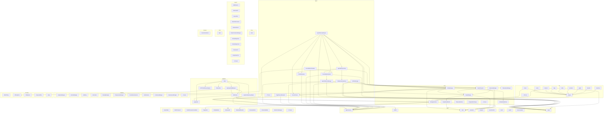

# @danielsimonjr/memoryjs - Dependency Graph

**Version**: 2.9.0 | **Last Updated**: 2026-07-24

This document provides a comprehensive dependency graph of all files, components, imports, functions, and variables in the codebase.

---

## Table of Contents

1. [Overview](#overview)
2. [Entry Points & Reachability](#entry-points--reachability)
3. [Adapters Dependencies](#adapters-dependencies)
4. [Agent Dependencies](#agent-dependencies)
5. [Cli Dependencies](#cli-dependencies)
6. [Core Dependencies](#core-dependencies)
7. [Features Dependencies](#features-dependencies)
8. [Entry Dependencies](#entry-dependencies)
9. [Search Dependencies](#search-dependencies)
10. [Security Dependencies](#security-dependencies)
11. [Root Dependencies](#root-dependencies)
12. [Types Dependencies](#types-dependencies)
13. [Utils Dependencies](#utils-dependencies)
14. [Workers Dependencies](#workers-dependencies)
15. [Dependency Matrix](#dependency-matrix)
16. [Circular Dependency Analysis](#circular-dependency-analysis)
17. [Visual Dependency Graph](#visual-dependency-graph)
18. [Summary Statistics](#summary-statistics)

---

## Overview

The codebase is organized into the following modules:

- **adapters**: 7 files
- **agent**: 80 files
- **cli**: 29 files
- **core**: 24 files
- **features**: 18 files
- **entry**: 1 file
- **search**: 49 files
- **security**: 5 files
- **root**: 1 file
- **types**: 10 files
- **utils**: 34 files
- **workers**: 1 file

---

## Entry Points & Reachability

Seeded build/entry roots (package `exports`, `bin` targets, tsup entries, script entries):

- `src/cli/index.ts`
- `src/index.ts`
- `src/sqlite.ts`
- `src/workers/levenshteinWorker.ts`

Reachable from a root: **259** of 259 files. Dormant: **0** (0 orphaned, 0 test-only) — see `unused-analysis.md` for the file lists.

---

## Adapters Dependencies

### `src/adapters/ApiKeyAuthMiddleware.ts` - API-Key Auth Middleware (Sec9)

**Internal Dependencies:**
| File | Imports | Type |
|------|---------|------|
| `../security/APIKeyStore.js` | `APIKeyStore, KeyValidationResult` | Import (type-only) |
| `./RestRouter.js` | `RestMethod, RestRequest, RestResponse` | Import (type-only) |

**Exports:**
- Classes: `ApiKeyAuthMiddleware`
- Interfaces: `AuthContext`, `ApiKeyAuthOptions`
- Types: `AuthOutcome`
- Constants: `DEFAULT_WRITE_SCOPE`

---

### `src/adapters/LangChainMemoryAdapter.ts` - LangChain Memory Adapter

**Internal Dependencies:**
| File | Imports | Type |
|------|---------|------|
| `../core/ManagerContext.js` | `ManagerContext` | Import (type-only) |
| `../agent/MemoryEngine.js` | `MemoryEngine` | Import (type-only) |
| `../types/agent-memory.js` | `AgentEntity` | Import (type-only) |

**Exports:**
- Classes: `LangChainMemoryAdapter`
- Interfaces: `ChatMessage`, `MemoryInputs`, `MemoryVariables`, `LangChainMemoryAdapterOptions`

---

### `src/adapters/MCPToolObserverAdapter.ts` - MCPToolObserverAdapter — Phase Tool C protocol shim.

**Internal Dependencies:**
| File | Imports | Type |
|------|---------|------|
| `../agent/ToolCallObserver.js` | `ToolCallObserver` | Import (type-only) |

**Exports:**
- Classes: `MCPToolObserverAdapter`
- Functions: `extractToolName`

---

### `src/adapters/RateLimiter.ts` - RateLimiter — in-memory token-bucket rate limiter for REST handlers.

**Exports:**
- Classes: `RateLimiter`
- Interfaces: `RateLimiterConfig`, `RateLimitVerdict`

---

### `src/adapters/RestRouter.ts` - REST Router

**Node.js Built-in Dependencies:**
| Module | Import |
|--------|--------|
| `http` | `IncomingMessage, ServerResponse` |

**Internal Dependencies:**
| File | Imports | Type |
|------|---------|------|
| `../core/ManagerContext.js` | `ManagerContext` | Import (type-only) |
| `../utils/logger.js` | `logger` | Import |
| `./pagination.js` | `paginate, parsePaginationParams` | Import |
| `./ApiKeyAuthMiddleware.js` | `ApiKeyAuthMiddleware, AuthContext` | Import (type-only) |

**Exports:**
- Classes: `RestRouter`
- Interfaces: `RestRequest`, `RestResponse`, `RouteDefinition`, `RestRouterOptions`
- Types: `RestMethod`, `RestHandler`

---

### `src/adapters/index.ts` - Adapters Module — Barrel Export

**Internal Dependencies:**
| File | Imports | Type |
|------|---------|------|
| `./RestRouter.js` | `RestRouter, RestMethod, RestRequest, RestResponse, RestHandler, RouteDefinition, RestRouterOptions` | Re-export |
| `./ApiKeyAuthMiddleware.js` | `ApiKeyAuthMiddleware, DEFAULT_WRITE_SCOPE, ApiKeyAuthOptions, AuthContext, AuthOutcome` | Re-export |
| `./RateLimiter.js` | `RateLimiter, RateLimiterConfig, RateLimitVerdict` | Re-export |
| `./pagination.js` | `paginate, parsePaginationParams, PaginationParams, ParsePaginationOptions, PaginatedResult` | Re-export |
| `./MCPToolObserverAdapter.js` | `MCPToolObserverAdapter, extractToolName` | Re-export |
| `./LangChainMemoryAdapter.js` | `LangChainMemoryAdapter` | Re-export |

**Exports:**
- Re-exports: `RestRouter`, `RestMethod`, `RestRequest`, `RestResponse`, `RestHandler`, `RouteDefinition`, `RestRouterOptions`, `ApiKeyAuthMiddleware`, `DEFAULT_WRITE_SCOPE`, `ApiKeyAuthOptions`, `AuthContext`, `AuthOutcome`, `RateLimiter`, `RateLimiterConfig`, `RateLimitVerdict`, `paginate`, `parsePaginationParams`, `PaginationParams`, `ParsePaginationOptions`, `PaginatedResult`, `MCPToolObserverAdapter`, `extractToolName`, `LangChainMemoryAdapter`

---

### `src/adapters/pagination.ts` - pagination — offset/limit + next-cursor helpers for REST handlers.

**Exports:**
- Interfaces: `PaginationParams`, `ParsePaginationOptions`, `PaginatedResult`
- Functions: `parsePaginationParams`, `paginate`

---

## Agent Dependencies

### `src/agent/AccessTracker.ts` - Access Tracker

**Internal Dependencies:**
| File | Imports | Type |
|------|---------|------|
| `../types/types.js` | `IGraphStorage` | Import (type-only) |
| `../types/agent-memory.js` | `AgentEntity, AccessContext, AccessPattern` | Import (type-only) |
| `../types/agent-memory.js` | `AccessContext` | Re-export (type-only) |

**Exports:**
- Classes: `AccessTracker`
- Interfaces: `AccessStats`, `AccessTrackerConfig`
- Re-exports: `AccessContext`

---

### `src/agent/AgentMemoryConfig.ts` - Agent Memory Configuration - env var and programmatic config for all agent memory components.

**Internal Dependencies:**
| File | Imports | Type |
|------|---------|------|
| `./WorkingMemoryManager.js` | `WorkingMemoryConfig` | Import (type-only) |
| `./SessionManager.js` | `SessionConfig` | Import (type-only) |
| `./EpisodicMemoryManager.js` | `EpisodicMemoryConfig` | Import (type-only) |
| `./ConsolidationPipeline.js` | `ConsolidationPipelineConfig` | Import (type-only) |
| `./SummarizationService.js` | `SummarizationConfig` | Import (type-only) |
| `./DecayEngine.js` | `DecayEngineConfig` | Import (type-only) |
| `./DecayScheduler.js` | `DecaySchedulerConfig` | Import (type-only) |
| `./SalienceEngine.js` | `SalienceEngineConfig` | Import (type-only) |
| `./ContextWindowManager.js` | `ContextWindowManagerConfig` | Import (type-only) |
| `./MemoryFormatter.js` | `MemoryFormatterConfig` | Import (type-only) |
| `./MultiAgentMemoryManager.js` | `MultiAgentConfig` | Import (type-only) |
| `./ConflictResolver.js` | `ConflictResolverConfig` | Import (type-only) |
| `./CollaborativeSynthesis.js` | `CollaborativeSynthesisConfig` | Import (type-only) |
| `../core/GraphTraversal.js` | `GraphTraversal` | Import (type-only) |
| `./ProfileManager.js` | `ProfileManagerConfig` | Import (type-only) |

**Exports:**
- Interfaces: `AgentMemoryConfig`
- Functions: `loadConfigFromEnv`, `mergeConfig`, `validateConfig`

---

### `src/agent/AgentMemoryManager.ts` - Agent Memory Manager - Unified Facade

**Node.js Built-in Dependencies:**
| Module | Import |
|--------|--------|
| `events` | `EventEmitter` |

**Internal Dependencies:**
| File | Imports | Type |
|------|---------|------|
| `../utils/logger.js` | `logger` | Import |
| `../types/types.js` | `IGraphStorage, Entity` | Import (type-only) |
| `../core/GraphStorage.js` | `GraphStorage` | Import (type-only) |
| `../core/EntityManager.js` | `EntityManager` | Import |
| `../core/ObservationManager.js` | `ObservationManager` | Import |
| `../core/RelationManager.js` | `RelationManager` | Import |
| `../types/agent-memory.js` | `AgentEntity, AgentMetadata, MemoryVisibility, ConflictStrategy, ConflictInfo, SessionEntity, ForgetResult, ConsolidationResult, ContextRetrievalOptions, ContextPackage` | Import (type-only) |
| `./AccessTracker.js` | `AccessTracker, AccessContext` | Import |
| `./DecayEngine.js` | `DecayEngine, ForgetOptions` | Import |
| `./DecayScheduler.js` | `DecayScheduler, DecayCycleResult` | Import |
| `./WorkingMemoryManager.js` | `WorkingMemoryManager, PromotionResult, ConfirmationResult` | Import |
| `./SessionManager.js` | `SessionManager, StartSessionOptions, EndSessionResult` | Import |
| `./EpisodicMemoryManager.js` | `EpisodicMemoryManager, CreateEpisodeOptions, TimelineOptions` | Import |
| `./ConsolidationPipeline.js` | `ConsolidationPipeline` | Import |
| `./SummarizationService.js` | `SummarizationService, ISummarizationProvider` | Import |
| `./PatternDetector.js` | `PatternDetector` | Import |
| `./RuleEvaluator.js` | `RuleEvaluator` | Import |
| `./SalienceEngine.js` | `SalienceEngine` | Import |
| `./ContextWindowManager.js` | `ContextWindowManager` | Import |
| `./MemoryFormatter.js` | `MemoryFormatter` | Import |
| `./MultiAgentMemoryManager.js` | `MultiAgentMemoryManager` | Import |
| `./ConflictResolver.js` | `ConflictResolver, ResolutionResult` | Import |
| `./SessionCheckpoint.js` | `SessionCheckpointManager, SessionCheckpointData` | Import |
| `./WorkThreadManager.js` | `WorkThreadManager` | Import |
| `./AgentMemoryConfig.js` | `AgentMemoryConfig, loadConfigFromEnv, mergeConfig, validateConfig` | Import |
| `./DistillationPolicy.js` | `IDistillationPolicy` | Import (type-only) |
| `./RoleProfiles.js` | `resolveRoleProfile` | Import |
| `./DreamEngine.js` | `DreamEngine, DreamEngineConfig, DreamCycleResult` | Import |
| `./ProfileManager.js` | `ProfileManager` | Import |

**Exports:**
- Classes: `AgentMemoryManager`
- Interfaces: `CreateMemoryOptions`, `RetrieveContextOptions`

---

### `src/agent/AgentReflectionManager.ts` - Reflection Memory Manager (Phase 2 Sprint 8)

**Node.js Built-in Dependencies:**
| Module | Import |
|--------|--------|
| `crypto` | `createHash, randomUUID` |

**Internal Dependencies:**
| File | Imports | Type |
|------|---------|------|
| `../types/types.js` | `Entity, IGraphStorage` | Import (type-only) |
| `../types/agent-memory.js` | `ReflectionEntity, ReflectionId, ReflectionRecord, ReflectionScope` | Import (type-only) |
| `../types/agent-memory.js` | `isReflectionMemory, toIsoDateTime` | Import |
| `../core/EntityManager.js` | `EntityManager` | Import (type-only) |
| `../utils/errors.js` | `VersionConflictError, EntityNotFoundError` | Import |
| `../utils/index.js` | `validateNonEmpty, validateNonEmptyArray` | Import |

**Exports:**
- Classes: `AgentReflectionManager`
- Interfaces: `ReflectionManagerConfig`, `ReflectionInput`, `ReflectionEntityOptions`, `ListReflectionsOptions`, `RelevanceOptions`
- Types: `ArchiveReflectionResult`

---

### `src/agent/ArtifactManager.ts` - Artifact Manager

**Node.js Built-in Dependencies:**
| Module | Import |
|--------|--------|
| `crypto` | `randomBytes` |

**Internal Dependencies:**
| File | Imports | Type |
|------|---------|------|
| `../types/types.js` | `IGraphStorage, Entity` | Import (type-only) |
| `../core/EntityManager.js` | `EntityManager` | Import (type-only) |
| `../core/RefIndex.js` | `RefIndex` | Import (type-only) |
| `../utils/errors.js` | `RefConflictError` | Import |
| `../types/artifact.js` | `ArtifactType, CreateArtifactOptions, ArtifactEntity, ArtifactFilter` | Import (type-only) |
| `../types/artifact.js` | `isArtifactEntity` | Import |

**Exports:**
- Classes: `ArtifactManager`

---

### `src/agent/CognitiveLoadAnalyzer.ts` - Cognitive Load Analyzer

**Internal Dependencies:**
| File | Imports | Type |
|------|---------|------|
| `../types/agent-memory.js` | `AgentEntity, CognitiveLoadMetrics, AdaptiveReductionResult` | Import (type-only) |

**Exports:**
- Classes: `CognitiveLoadAnalyzer`
- Interfaces: `CognitiveLoadConfig`

---

### `src/agent/CollaborativeSynthesis.ts` - Collaborative Memory Synthesis

**Internal Dependencies:**
| File | Imports | Type |
|------|---------|------|
| `../types/types.js` | `IGraphStorage` | Import (type-only) |
| `../types/agent-memory.js` | `AgentEntity, SalienceContext, ScoredEntity` | Import (type-only) |
| `../types/agent-memory.js` | `compareTrustLevel, inferTrustLevel` | Import |
| `../core/GraphTraversal.js` | `GraphTraversal` | Import (type-only) |
| `./SalienceEngine.js` | `SalienceEngine` | Import (type-only) |

**Exports:**
- Classes: `CollaborativeSynthesis`
- Interfaces: `CollaborativeSynthesisConfig`, `ConflictView`, `SynthesisResult`
- Types: `ConflictResolutionPolicy`

---

### `src/agent/ConflictResolver.ts` - Conflict Resolver

**Node.js Built-in Dependencies:**
| Module | Import |
|--------|--------|
| `events` | `EventEmitter` |

**Internal Dependencies:**
| File | Imports | Type |
|------|---------|------|
| `../types/agent-memory.js` | `AgentEntity, AgentMetadata, ConflictInfo, ConflictStrategy` | Import (type-only) |
| `../types/agent-memory.js` | `compareTrustLevel, inferTrustLevel` | Import |

**Exports:**
- Classes: `ConflictResolver`
- Interfaces: `ConflictResolverConfig`, `ResolutionResult`

---

### `src/agent/ConsolidationPipeline.ts` - Consolidation Pipeline

**Node.js Built-in Dependencies:**
| Module | Import |
|--------|--------|
| `crypto` | `createHash` |

**Internal Dependencies:**
| File | Imports | Type |
|------|---------|------|
| `../types/types.js` | `IGraphStorage, Entity` | Import (type-only) |
| `../types/agent-memory.js` | `AgentEntity, ConsolidateOptions, ConsolidationResult, SummarizationResult, PatternResult, MemoryType, MemoryMergeStrategy, MergeResult, DuplicatePair, ConsolidationTrigger, ConsolidationRule` | Import (type-only) |
| `../types/agent-memory.js` | `isAgentEntity, isFailureMemory, isProspectiveMemory, isReflectionMemory` | Import |
| `../utils/textSimilarity.js` | `tokenizeStripped` | Import |
| `./WorkingMemoryManager.js` | `WorkingMemoryManager` | Import (type-only) |
| `./DecayEngine.js` | `DecayEngine` | Import (type-only) |
| `./SummarizationService.js` | `SummarizationService` | Import |
| `./PatternDetector.js` | `PatternDetector` | Import |
| `./RuleEvaluator.js` | `RuleEvaluator` | Import |
| `./AgentReflectionManager.js` | `AgentReflectionManager` | Import (type-only) |
| `./TrajectoryCompressor.js` | `TrajectoryCompressor` | Import (type-only) |
| `./ExperienceExtractor.js` | `ExperienceExtractor, Trajectory, TrajectoryCluster` | Import (type-only) |
| `./HeuristicManager.js` | `HeuristicManager` | Import (type-only) |
| `../types/agent-memory.js` | `HeuristicId` | Import (type-only) |
| `./ObservationDedupManager.js` | `ObservationDedupManager, ObservationDedupFilter` | Import (type-only) |
| `../types/agent-memory.js` | `ReflectionScope` | Import (type-only) |

**Exports:**
- Classes: `ConsolidationPipeline`, `ProspectivePromotionStage`, `ReflectionStage`, `HeuristicExtractionStage`, `ObservationDedupReportStage`
- Interfaces: `ConsolidationPipelineConfig`, `PipelineStage`, `StageResult`, `ReflectionStageConfig`, `HeuristicExtractionStageConfig`, `ObservationDedupReportStageConfig`

---

### `src/agent/ConsolidationScheduler.ts` - Consolidation Scheduler

**Node.js Built-in Dependencies:**
| Module | Import |
|--------|--------|
| `events` | `EventEmitter` |

**Internal Dependencies:**
| File | Imports | Type |
|------|---------|------|
| `../utils/logger.js` | `logger` | Import |
| `./ConsolidationPipeline.js` | `ConsolidationPipeline` | Import (type-only) |
| `../features/CompressionManager.js` | `CompressionManager` | Import (type-only) |
| `../types/agent-memory.js` | `ConsolidationResult` | Import (type-only) |

**Exports:**
- Classes: `ConsolidationScheduler`
- Interfaces: `ConsolidationSchedulerConfig`, `ConsolidationCycleResult`

---

### `src/agent/ContextProfileManager.ts` - Context Profile Manager

**Internal Dependencies:**
| File | Imports | Type |
|------|---------|------|
| `../types/agent-memory.js` | `SalienceContext, TemporalFocus, ContextProfile` | Import (type-only) |

**Exports:**
- Classes: `ContextProfileManager`
- Interfaces: `ProfileConfig`

---

### `src/agent/ContextWindowManager.ts` - Context Window Manager

**Internal Dependencies:**
| File | Imports | Type |
|------|---------|------|
| `../utils/logger.js` | `logger` | Import |
| `../types/types.js` | `IGraphStorage, Entity, ReadonlyKnowledgeGraph` | Import (type-only) |
| `../core/GraphStorage.js` | `GraphStorage` | Import (type-only) |
| `../types/agent-memory.js` | `AgentEntity, SalienceContext, ContextRetrievalOptions, ContextPackage, TokenBreakdown, ExcludedEntity, ScoredEntity, ProspectiveTrigger, TriggerCondition` | Import (type-only) |
| `../types/agent-memory.js` | `isAgentEntity` | Import |
| `./SalienceEngine.js` | `SalienceEngine` | Import |
| `./DistillationPolicy.js` | `IDistillationPolicy` | Import (type-only) |
| `./ContextProfileManager.js` | `ContextProfileManager, ProfileConfig` | Import |
| `../types/agent-memory.js` | `ContextWindowManagerConfig` | Import (type-only) |
| `./ProjectContextManager.js` | `ProjectContextManager` | Dynamic import |
| `../core/EntityManager.js` | `EntityManager` | Dynamic import |
| `./ProfileManager.js` | `ProfileManager` | Dynamic import |
| `../core/ObservationManager.js` | `ObservationManager` | Dynamic import |
| `./ProspectiveMemoryManager.js` | `ProspectiveMemoryManager` | Dynamic import |

**Exports:**
- Classes: `ContextWindowManager`
- Interfaces: `ContextCompressionResult`, `WakeUpOptions`, `WakeUpResult`, `SpilloverResult`
- Types: `CompressionLevel`

---

### `src/agent/DecayEngine.ts` - Decay Engine

**Internal Dependencies:**
| File | Imports | Type |
|------|---------|------|
| `../types/types.js` | `IGraphStorage, ReadonlyKnowledgeGraph` | Import (type-only) |
| `../types/agent-memory.js` | `AgentEntity, DecayResult, ForgetOptions, ForgetResult` | Import (type-only) |
| `../types/agent-memory.js` | `isAgentEntity` | Import |
| `./AccessTracker.js` | `AccessTracker` | Import |
| `../features/FreshnessManager.js` | `FreshnessManager` | Import |
| `../utils/textSimilarity.js` | `tokenizeToSet` | Import |
| `./connectivity.js` | `computeDegreeMap, normalizedDegree, DegreeMap` | Import |
| `../types/agent-memory.js` | `DecayResult, ForgetOptions, ForgetResult` | Re-export (type-only) |

**Exports:**
- Classes: `DecayEngine`
- Interfaces: `DecayEngineConfig`, `DecayOperationOptions`, `ReinforcementOptions`
- Re-exports: `DecayResult`, `ForgetOptions`, `ForgetResult`

---

### `src/agent/DecayScheduler.ts` - Decay Scheduler

**Internal Dependencies:**
| File | Imports | Type |
|------|---------|------|
| `../types/agent-memory.js` | `DecayResult, ForgetResult, ForgetOptions` | Import (type-only) |
| `./DecayEngine.js` | `DecayEngine` | Import (type-only) |
| `../utils/logger.js` | `logger` | Import |
| `../types/agent-memory.js` | `DecayResult, ForgetResult` | Re-export (type-only) |

**Exports:**
- Classes: `DecayScheduler`
- Interfaces: `DecaySchedulerConfig`, `DecayCycleResult`
- Re-exports: `DecayResult`, `ForgetResult`

---

### `src/agent/DecisionManager.ts` - DecisionManager — Phase 3 Decision Rationale (Type 1).

**Node.js Built-in Dependencies:**
| Module | Import |
|--------|--------|
| `crypto` | `randomUUID` |

**Internal Dependencies:**
| File | Imports | Type |
|------|---------|------|
| `../types/types.js` | `Entity, IGraphStorage` | Import (type-only) |
| `../types/agent-memory.js` | `DecisionEntity, DecisionId, DecisionLifecycle, DecisionRecord, DecisionStatus` | Import (type-only) |
| `../types/agent-memory.js` | `isDecisionMemory, toIsoDateTime` | Import |
| `../core/EntityManager.js` | `EntityManager` | Import (type-only) |
| `../utils/errors.js` | `VersionConflictError, EntityNotFoundError` | Import |
| `../utils/index.js` | `validateNonEmpty` | Import |

**Exports:**
- Classes: `DecisionManager`
- Interfaces: `DecisionInput`, `DecisionEntityOptions`, `ListDecisionsOptions`
- Types: `AcceptDecisionResult`, `RejectDecisionResult`, `SupersedeDecisionResult`

---

### `src/agent/DistillationPipeline.ts` - Distillation Pipeline

**Internal Dependencies:**
| File | Imports | Type |
|------|---------|------|
| `../types/types.js` | `HybridSearchResult` | Import (type-only) |
| `./DistillationPolicy.js` | `IDistillationPolicy, DistilledMemory, DistillationConfig` | Import (type-only) |

**Exports:**
- Classes: `DistillationPipeline`
- Interfaces: `DistillationStats`, `DistillationResult`

---

### `src/agent/DistillationPolicy.ts` - Memory Distillation Policy

**Internal Dependencies:**
| File | Imports | Type |
|------|---------|------|
| `../types/types.js` | `Entity` | Import (type-only) |
| `../types/types.js` | `HybridSearchResult` | Import (type-only) |
| `../features/FreshnessManager.js` | `FreshnessManager` | Import |

**Exports:**
- Classes: `NoOpDistillationPolicy`, `DefaultDistillationPolicy`, `CompositeDistillationPolicy`
- Interfaces: `DistilledMemory`, `DistillationConfig`, `IDistillationPolicy`

---

### `src/agent/DreamEngine.ts` - DreamEngine — Background Memory Maintenance System

**Node.js Built-in Dependencies:**
| Module | Import |
|--------|--------|
| `events` | `EventEmitter` |
| `crypto` | `randomUUID` |

**Internal Dependencies:**
| File | Imports | Type |
|------|---------|------|
| `../types/types.js` | `Entity, IGraphStorage, ReadonlyKnowledgeGraph, Relation` | Import (type-only) |
| `../core/GraphStorage.js` | `GraphStorage` | Import (type-only) |
| `../features/FreshnessManager.js` | `FreshnessManager` | Import |
| `../features/CompressionManager.js` | `CompressionManager` | Import |
| `../features/ObservationNormalizer.js` | `ObservationNormalizer` | Import |
| `./PatternDetector.js` | `PatternDetector` | Import |
| `./ConsolidationPipeline.js` | `ConsolidationPipeline` | Import |
| `./EntropyFilter.js` | `passesEntropyFilter` | Import |

**Exports:**
- Classes: `DreamEngine`
- Interfaces: `DreamPhaseConfig`, `DreamEngineCallbacks`, `DreamEngineConfig`, `DreamPhaseResult`, `DreamCycleResult`

---

### `src/agent/EntropyFilter.ts` - Entropy-Aware Content Filter

**Internal Dependencies:**
| File | Imports | Type |
|------|---------|------|
| `../types/agent-memory.js` | `AgentEntity, ConsolidateOptions` | Import (type-only) |
| `./ConsolidationPipeline.js` | `PipelineStage, StageResult` | Import (type-only) |
| `../utils/errors.js` | `LowEntropyContentError` | Re-export |

**Exports:**
- Classes: `EntropyFilterStage`
- Interfaces: `EntropyFilterConfig`
- Functions: `computeEntropy`, `passesEntropyFilter`
- Re-exports: `LowEntropyContentError`

---

### `src/agent/EpisodicMemoryManager.ts` - Episodic Memory Manager

**Node.js Built-in Dependencies:**
| Module | Import |
|--------|--------|
| `crypto` | `randomBytes` |

**Internal Dependencies:**
| File | Imports | Type |
|------|---------|------|
| `../types/types.js` | `IGraphStorage, Entity, Relation` | Import (type-only) |
| `../types/agent-memory.js` | `AgentEntity` | Import (type-only) |
| `../types/agent-memory.js` | `isAgentEntity` | Import |

**Exports:**
- Classes: `EpisodicMemoryManager`
- Interfaces: `EpisodicMemoryConfig`, `CreateEpisodeOptions`, `TimelineOptions`
- Constants: `EpisodicRelations`

---

### `src/agent/ExclusionManager.ts` - ExclusionManager — `do_not_remember` content-pattern exclusions

**Node.js Built-in Dependencies:**
| Module | Import |
|--------|--------|
| `crypto` | `randomUUID` |

**Internal Dependencies:**
| File | Imports | Type |
|------|---------|------|
| `../types/types.js` | `Entity, IGraphStorage` | Import (type-only) |
| `../types/agent-memory.js` | `ExclusionEntity, ExclusionMode, ExclusionRule, ExclusionScope` | Import (type-only) |
| `../types/agent-memory.js` | `isExclusionMemory, toIsoDateTime` | Import |
| `../core/EntityManager.js` | `EntityManager` | Import (type-only) |

**Exports:**
- Classes: `ExclusionManager`
- Interfaces: `AddExclusionRuleInput`, `ExclusionCheckResult`

---

### `src/agent/ExperienceExtractor.ts` - ExperienceExtractor — Phase δ.3 (ROADMAP §3B.3).

**Node.js Built-in Dependencies:**
| Module | Import |
|--------|--------|
| `crypto` | `randomUUID` |

**Internal Dependencies:**
| File | Imports | Type |
|------|---------|------|
| `./PatternDetector.js` | `PatternDetector` | Import (type-only) |
| `../types/agent-memory.js` | `PatternResult` | Import (type-only) |
| `../utils/textSimilarity.js` | `tokenizeToSet, jaccard` | Import |

**Exports:**
- Classes: `ExperienceExtractor`
- Interfaces: `Action`, `Trajectory`, `Rule`, `HeuristicGuideline`, `DecisionRule`, `TrajectoryCluster`, `Experience`, `ExperienceExtractorConfig`
- Types: `Outcome`, `ClusterMethod`, `ExperienceType`

---

### `src/agent/FailureDistillation.ts` - Failure-Driven Memory Distillation

**Node.js Built-in Dependencies:**
| Module | Import |
|--------|--------|
| `crypto` | `randomUUID` |

**Internal Dependencies:**
| File | Imports | Type |
|------|---------|------|
| `../types/types.js` | `IGraphStorage, Entity` | Import (type-only) |
| `../types/agent-memory.js` | `AgentEntity, DistilledLesson` | Import (type-only) |
| `../types/agent-memory.js` | `isAgentEntity, isSessionEntity` | Import |
| `./EpisodicMemoryManager.js` | `EpisodicRelations` | Import |

**Exports:**
- Classes: `FailureDistillation`
- Interfaces: `FailureDistillationConfig`, `FailureDistillationResult`

---

### `src/agent/FailureManager.ts` - Failure Memory Manager (Phase 2 Sprint 4)

**Node.js Built-in Dependencies:**
| Module | Import |
|--------|--------|
| `crypto` | `randomUUID` |

**Internal Dependencies:**
| File | Imports | Type |
|------|---------|------|
| `../types/types.js` | `Entity, IGraphStorage` | Import (type-only) |
| `../types/agent-memory.js` | `FailureEntity, FailureLifecycle, FailureRecord, MarkResolvedResult` | Import (type-only) |
| `../types/agent-memory.js` | `isFailureMemory, toIsoDateTime` | Import |
| `../core/EntityManager.js` | `EntityManager` | Import (type-only) |
| `../utils/errors.js` | `VersionConflictError, EntityNotFoundError` | Import |
| `../utils/index.js` | `validateNonEmpty` | Import |

**Exports:**
- Classes: `FailureManager`
- Interfaces: `FailureManagerConfig`, `FailureEntityOptions`, `LookupOptions`, `GetAllOptions`
- Types: `FailureInput`

---

### `src/agent/HeuristicManager.ts` - Heuristic Guidelines Manager — Phase 3B.8 (storage-backed, v2.0.x).

**Node.js Built-in Dependencies:**
| Module | Import |
|--------|--------|
| `crypto` | `randomUUID` |

**Internal Dependencies:**
| File | Imports | Type |
|------|---------|------|
| `../types/types.js` | `Entity, IGraphStorage` | Import (type-only) |
| `../types/agent-memory.js` | `Heuristic, HeuristicEntity, HeuristicId` | Import (type-only) |
| `../types/agent-memory.js` | `isHeuristicMemory, toIsoDateTime` | Import |
| `../core/EntityManager.js` | `EntityManager` | Import (type-only) |
| `../utils/errors.js` | `VersionConflictError, EntityNotFoundError` | Import |

**Exports:**
- Classes: `HeuristicManager`
- Interfaces: `AddHeuristicOptions`, `HeuristicMatch`, `HeuristicConflict`
- Types: `HeuristicUpdateResult`

---

### `src/agent/ImportanceScorer.ts` - Score new content at creation time.

**Exports:**
- Classes: `ImportanceScorer`
- Interfaces: `ImportanceScorerConfig`, `ScoreOptions`

---

### `src/agent/InMemoryBackend.ts` - `InMemoryBackend` — ephemeral, process-lifetime `IMemoryBackend` adapter.

**Internal Dependencies:**
| File | Imports | Type |
|------|---------|------|
| `./DecayEngine.js` | `DecayEngine` | Import (type-only) |
| `./MemoryBackend.js` | `IMemoryBackend, MemoryTurn, WeightedTurn, GetWeightedOptions` | Import (type-only) |
| `../types/agent-memory.js` | `AgentEntity` | Import (type-only) |

**Exports:**
- Classes: `InMemoryBackend`

---

### `src/agent/MemoryBackend.ts` - Memory Backend Interface (`IMemoryBackend`)

**Exports:**
- Interfaces: `MemoryTurn`, `WeightedTurn`, `GetWeightedOptions`, `IMemoryBackend`

---

### `src/agent/MemoryEngine.ts` - Optional `ExclusionManager` (Phase 3 `do_not_remember`). When

**Node.js Built-in Dependencies:**
| Module | Import |
|--------|--------|
| `events` | `EventEmitter` |
| `crypto` | `createHash` |

**Internal Dependencies:**
| File | Imports | Type |
|------|---------|------|
| `../types/types.js` | `IGraphStorage, ReadonlyKnowledgeGraph` | Import (type-only) |
| `../types/agent-memory.js` | `AgentEntity` | Import (type-only) |
| `../core/EntityManager.js` | `EntityManager` | Import (type-only) |
| `./EpisodicMemoryManager.js` | `EpisodicMemoryManager` | Import (type-only) |
| `./WorkingMemoryManager.js` | `WorkingMemoryManager` | Import (type-only) |
| `../search/SemanticSearch.js` | `SemanticSearch` | Import (type-only) |
| `../types/index.js` | `EmbeddingService` | Import (type-only) |
| `./ImportanceScorer.js` | `ImportanceScorer` | Import (type-only) |
| `./ExclusionManager.js` | `ExclusionManager` | Import (type-only) |

**Exports:**
- Classes: `MemoryEngine`
- Interfaces: `MemoryEngineConfig`, `AddTurnOptions`, `AddTurnResult`, `DuplicateCheckResult`
- Types: `DedupTier`, `MemoryEngineEventName`

---

### `src/agent/MemoryFormatter.ts` - Memory Formatter

**Internal Dependencies:**
| File | Imports | Type |
|------|---------|------|
| `../types/agent-memory.js` | `AgentEntity, ContextPackage` | Import (type-only) |

**Exports:**
- Classes: `MemoryFormatter`
- Interfaces: `MemoryFormatterConfig`

---

### `src/agent/MemoryValidator.ts` - MemoryValidator — Phase δ.1 (ROADMAP §3B.1).

**Internal Dependencies:**
| File | Imports | Type |
|------|---------|------|
| `../types/types.js` | `Entity` | Import (type-only) |
| `../types/agent-memory.js` | `AgentEntity, AgentMetadata, ConflictStrategy` | Import (type-only) |
| `../features/ContradictionDetector.js` | `ContradictionDetector, Contradiction` | Import (type-only) |
| `./ConflictResolver.js` | `ConflictResolver` | Import (type-only) |

**Exports:**
- Classes: `MemoryValidator`
- Interfaces: `MemoryValidationIssue`, `MemoryValidationResult`, `MemoryContradiction`, `MemoryValidatorConfig`

---

### `src/agent/MultiAgentMemoryManager.ts` - Multi-Agent Memory Manager

**Node.js Built-in Dependencies:**
| Module | Import |
|--------|--------|
| `events` | `EventEmitter` |

**Internal Dependencies:**
| File | Imports | Type |
|------|---------|------|
| `../types/types.js` | `IGraphStorage, Entity` | Import (type-only) |
| `../types/agent-memory.js` | `AgentEntity, AgentMetadata, AgentType, MemoryVisibility, ConflictStrategy, ConflictInfo` | Import (type-only) |
| `../types/agent-memory.js` | `isAgentEntity` | Import |
| `./ConflictResolver.js` | `ConflictResolver, ResolutionResult` | Import |
| `./VisibilityResolver.js` | `VisibilityResolver` | Import |

**Exports:**
- Classes: `MultiAgentMemoryManager`
- Interfaces: `MultiAgentConfig`

---

### `src/agent/ObservationDedupManager.ts` - ObservationDedupManager — entity-level cross-observation dedup.

**Node.js Built-in Dependencies:**
| Module | Import |
|--------|--------|
| `crypto` | `createHash` |

**Internal Dependencies:**
| File | Imports | Type |
|------|---------|------|
| `../types/types.js` | `Entity, IGraphStorage` | Import (type-only) |

**Exports:**
- Classes: `ObservationDedupManager`
- Interfaces: `DuplicateObservationOccurrence`, `DuplicateObservationGroup`, `ObservationDedupFilter`, `ObservationDedupManagerConfig`

---

### `src/agent/ObserverPipeline.ts` - Observer Pipeline

**Internal Dependencies:**
| File | Imports | Type |
|------|---------|------|
| `../core/EntityManager.js` | `EntityManager` | Import (type-only) |
| `../core/GraphEventEmitter.js` | `GraphEventEmitter` | Import (type-only) |
| `../types/types.js` | `ObservationAddedEvent` | Import (type-only) |

**Exports:**
- Classes: `ObserverPipeline`
- Interfaces: `ObservationScore`, `ObserverPipelineOptions`, `ObserverPipelineStats`

---

### `src/agent/PatternDetector.ts` - Pattern Detector

**Internal Dependencies:**
| File | Imports | Type |
|------|---------|------|
| `../types/agent-memory.js` | `PatternResult` | Import (type-only) |

**Exports:**
- Classes: `PatternDetector`

---

### `src/agent/PlanManager.ts` - Plan / Goal-Stack Manager (Phase 2 Sprint 5)

**Node.js Built-in Dependencies:**
| Module | Import |
|--------|--------|
| `crypto` | `randomUUID` |

**Internal Dependencies:**
| File | Imports | Type |
|------|---------|------|
| `../types/types.js` | `Entity, IGraphStorage` | Import (type-only) |
| `../types/agent-memory.js` | `GoalNode, GoalNodeId, GoalNodeLifecycle, GoalNodeTransition, MarkResolvedResult, PlanEntity, PlanId, PlanLifecycle, PlanRecord` | Import (type-only) |
| `../types/agent-memory.js` | `isPlanMemory, toIsoDateTime` | Import |
| `../utils/index.js` | `validateNonEmpty` | Import |

**Exports:**
- Classes: `PlanManager`
- Interfaces: `PlanManagerConfig`, `CreatePlanOptions`, `PushSubGoalOptions`, `ListPlansOptions`

---

### `src/agent/ProfileManager.ts` - Profile Manager

**Internal Dependencies:**
| File | Imports | Type |
|------|---------|------|
| `../types/types.js` | `IGraphStorage` | Import (type-only) |
| `../core/EntityManager.js` | `EntityManager` | Import (type-only) |
| `../core/ObservationManager.js` | `ObservationManager` | Import (type-only) |
| `./SessionManager.js` | `SessionManager` | Import (type-only) |
| `../types/agent-memory.js` | `isSessionEntity` | Import |
| `../types/agent-memory.js` | `AgentEntity` | Import (type-only) |
| `./SalienceEngine.js` | `SalienceEngine` | Import (type-only) |

**Exports:**
- Classes: `ProfileManager`
- Interfaces: `ProfileResponse`, `ProfileManagerConfig`, `ProfileOptions`

---

### `src/agent/ProjectContextManager.ts` - ProjectContextManager — Phase 3 Project Context (Type 2).

**Internal Dependencies:**
| File | Imports | Type |
|------|---------|------|
| `../types/types.js` | `Entity, IGraphStorage` | Import (type-only) |
| `../types/agent-memory.js` | `ProjectContextCommand, ProjectContextEntity, ProjectContextGlossaryTerm, ProjectContextRecord` | Import (type-only) |
| `../types/agent-memory.js` | `isProjectContextMemory, toIsoDateTime` | Import |
| `../core/EntityManager.js` | `EntityManager` | Import (type-only) |
| `../utils/index.js` | `validateNonEmpty` | Import |

**Exports:**
- Classes: `ProjectContextManager`
- Interfaces: `ProjectContextUpsertInput`, `ProjectContextManagerConfig`, `ForContextOptions`

---

### `src/agent/ProspectiveMemoryManager.ts` - Prospective Memory Manager

**Node.js Built-in Dependencies:**
| Module | Import |
|--------|--------|
| `crypto` | `randomBytes` |

**Internal Dependencies:**
| File | Imports | Type |
|------|---------|------|
| `../types/types.js` | `Entity, IGraphStorage` | Import (type-only) |
| `../types/agent-memory.js` | `CancelResult, FiredEvent, IsoDateTime, ObservationContext, ProspectiveAction, ProspectiveEntity, ProspectiveLifecycle, ProspectiveTrigger, TriggerCondition` | Import (type-only) |
| `../types/agent-memory.js` | `isProspectiveMemory, toIsoDateTime, toPositiveInt` | Import |
| `../utils/logger.js` | `logger` | Import |

**Exports:**
- Classes: `ProspectiveMemoryManager`
- Interfaces: `ProspectiveMemoryConfig`, `ScheduleOptions`
- Types: `ProcedureInvoker`

---

### `src/agent/RoleProfiles.ts` - Role Profiles

**Internal Dependencies:**
| File | Imports | Type |
|------|---------|------|
| `../types/agent-memory.js` | `AgentType, AgentRole, RoleProfile, SalienceEngineConfig, ContextWindowManagerConfig` | Import (type-only) |

**Exports:**
- Functions: `getRoleProfile`, `listRoleProfiles`, `resolveRoleProfile`, `createCustomProfile`

---

### `src/agent/RuleEvaluator.ts` - Rule Evaluator

**Internal Dependencies:**
| File | Imports | Type |
|------|---------|------|
| `../types/agent-memory.js` | `AgentEntity, RuleConditions, RuleEvaluationResult` | Import (type-only) |
| `../utils/logger.js` | `logger` | Import |

**Exports:**
- Classes: `RuleEvaluator`
- Interfaces: `EvaluatorRule`

---

### `src/agent/SQLiteBackend.ts` - `SQLiteBackend` — durable `IMemoryBackend` adapter wrapping the

**Internal Dependencies:**
| File | Imports | Type |
|------|---------|------|
| `./DecayEngine.js` | `DecayEngine` | Import (type-only) |
| `./MemoryEngine.js` | `MemoryEngine` | Import (type-only) |
| `./MemoryBackend.js` | `IMemoryBackend, MemoryTurn, WeightedTurn, GetWeightedOptions` | Import (type-only) |
| `../types/agent-memory.js` | `AgentEntity` | Import (type-only) |

**Exports:**
- Classes: `SQLiteBackend`
- Interfaces: `SQLiteBackendOptions`

---

### `src/agent/SalienceEngine.ts` - Salience Engine

**Internal Dependencies:**
| File | Imports | Type |
|------|---------|------|
| `../types/types.js` | `IGraphStorage` | Import (type-only) |
| `../types/agent-memory.js` | `AgentEntity, SalienceContext, ScoredEntity, SalienceComponents` | Import (type-only) |
| `../types/agent-memory.js` | `isAgentEntity` | Import |
| `./AccessTracker.js` | `AccessTracker` | Import |
| `./DecayEngine.js` | `DecayEngine` | Import |
| `./SummarizationService.js` | `SummarizationService` | Import |
| `../features/FreshnessManager.js` | `FreshnessManager` | Import |
| `./connectivity.js` | `computeDegreeMap, normalizedDegree, DegreeMap` | Import |
| `../types/agent-memory.js` | `SalienceEngineConfig` | Import (type-only) |

**Exports:**
- Classes: `SalienceEngine`

---

### `src/agent/SessionCheckpoint.ts` - Session Checkpoint Manager

**Internal Dependencies:**
| File | Imports | Type |
|------|---------|------|
| `../types/types.js` | `Entity, IGraphStorage, Relation` | Import (type-only) |
| `../types/agent-memory.js` | `SessionEntity` | Import (type-only) |
| `../types/agent-memory.js` | `isSessionEntity` | Import |
| `../utils/errors.js` | `EntityNotFoundError` | Import |
| `../core/EntityManager.js` | `EntityManager` | Import (type-only) |
| `../core/RelationManager.js` | `RelationManager` | Import (type-only) |
| `./WorkingMemoryManager.js` | `WorkingMemoryManager` | Import (type-only) |
| `./DecayEngine.js` | `DecayEngine` | Import (type-only) |

**Exports:**
- Classes: `SessionCheckpointManager`
- Interfaces: `SessionCheckpointData`
- Functions: `migrateLegacySessionCheckpoints`, `decodeLegacyCheckpoint`
- Constants: `SESSION_CHECKPOINT_ENTITY_TYPE`, `HAS_CHECKPOINT_RELATION`, `SNAPSHOTS_RELATION`

---

### `src/agent/SessionManager.ts` - Session Manager

**Node.js Built-in Dependencies:**
| Module | Import |
|--------|--------|
| `crypto` | `randomBytes` |

**Internal Dependencies:**
| File | Imports | Type |
|------|---------|------|
| `../types/types.js` | `IGraphStorage, Entity, Relation` | Import (type-only) |
| `../types/agent-memory.js` | `AgentEntity, SessionEntity, SessionStatus, SessionOutcome` | Import (type-only) |
| `../types/agent-memory.js` | `isSessionEntity` | Import |
| `./WorkingMemoryManager.js` | `WorkingMemoryManager` | Import |
| `./EpisodicMemoryManager.js` | `EpisodicMemoryManager` | Import (type-only) |

**Exports:**
- Classes: `SessionManager`
- Interfaces: `SessionConfig`, `StartSessionOptions`, `SessionHistoryOptions`, `EndSessionResult`

---

### `src/agent/SessionQueryBuilder.ts` - Session Query Builder

**Internal Dependencies:**
| File | Imports | Type |
|------|---------|------|
| `../types/types.js` | `Entity, SearchResult` | Import (type-only) |
| `../types/agent-memory.js` | `AgentEntity, SessionEntity, MemoryType` | Import (type-only) |
| `../types/agent-memory.js` | `isAgentEntity, isSessionEntity` | Import |
| `../types/types.js` | `IGraphStorage` | Import (type-only) |
| `./SessionManager.js` | `SessionManager` | Import (type-only) |

**Exports:**
- Classes: `SessionQueryBuilder`
- Interfaces: `SessionSearchOptions`, `EntityWithContext`
- Types: `SearchFunction`

---

### `src/agent/SummarizationService.ts` - Summarization Service

**Internal Dependencies:**
| File | Imports | Type |
|------|---------|------|
| `../utils/textSimilarity.js` | `calculateTextSimilarity` | Import |

**Exports:**
- Classes: `SummarizationService`
- Interfaces: `ISummarizationProvider`, `SummarizationConfig`, `GroupingResult`

---

### `src/agent/ToolAffordanceManager.ts` - ToolAffordanceManager — Phase Tool A (catalog Type 8).

**Internal Dependencies:**
| File | Imports | Type |
|------|---------|------|
| `../types/types.js` | `Entity, IGraphStorage` | Import (type-only) |
| `../types/agent-memory.js` | `ToolAffordanceEntity, ToolAffordanceId, ToolAffordanceRecord, ToolCallOutcome` | Import (type-only) |
| `../types/agent-memory.js` | `isToolAffordanceMemory, toIsoDateTime` | Import |
| `../core/EntityManager.js` | `EntityManager` | Import (type-only) |
| `../utils/errors.js` | `VersionConflictError` | Import |

**Exports:**
- Classes: `ToolAffordanceManager`
- Interfaces: `ToolAffordanceManagerConfig`, `RecordOutcomeInput`, `ToolAffordanceStats`, `SuggestToolOptions`, `ToolSuggestion`

---

### `src/agent/ToolCallObserver.ts` - ToolCallObserver — Phase Tool B producer pipeline.

**Node.js Built-in Dependencies:**
| Module | Import |
|--------|--------|
| `events` | `EventEmitter` |
| `crypto` | `randomUUID` |

**Internal Dependencies:**
| File | Imports | Type |
|------|---------|------|
| `./ToolAffordanceManager.js` | `ToolAffordanceManager` | Import (type-only) |

**Exports:**
- Classes: `ToolCallObserver`
- Types: `ToolCallEvent`

---

### `src/agent/TrajectoryCompressor.ts` - TrajectoryCompressor — Phase δ.2 (ROADMAP §3B.2).

**Internal Dependencies:**
| File | Imports | Type |
|------|---------|------|
| `../types/types.js` | `Entity` | Import (type-only) |
| `../utils/textSimilarity.js` | `jaccard, tokenizeToSet` | Import |
| `./ContextWindowManager.js` | `ContextWindowManager` | Import (type-only) |

**Exports:**
- Classes: `TrajectoryCompressor`
- Interfaces: `DistillOptions`, `CompressedMemory`, `RedundancyGroup`, `TrajectoryCompressorConfig`
- Types: `Granularity`, `TrajectoryMergeStrategy`

---

### `src/agent/VisibilityResolver.ts` - Visibility Resolver

**Internal Dependencies:**
| File | Imports | Type |
|------|---------|------|
| `../types/agent-memory.js` | `AgentEntity, AgentMetadata` | Import (type-only) |

**Exports:**
- Classes: `VisibilityResolver`

---

### `src/agent/WorkThreadManager.ts` - Work Thread Manager

**Node.js Built-in Dependencies:**
| Module | Import |
|--------|--------|
| `crypto` | `randomBytes` |

**Internal Dependencies:**
| File | Imports | Type |
|------|---------|------|
| `../types/types.js` | `IGraphStorage, Entity, Relation` | Import (type-only) |

**Exports:**
- Classes: `WorkThreadManager`
- Interfaces: `WorkThread`, `WorkThreadFilter`, `CreateWorkThreadOptions`
- Types: `WorkThreadStatus`
- Functions: `migrateLegacyWorkThreads`, `decodeLegacyWorkThread`
- Constants: `CHILD_OF_RELATION`, `BLOCKED_BY_RELATION`, `WORK_THREAD_ENTITY_TYPE`

---

### `src/agent/WorkingMemoryManager.ts` - Working Memory Manager

**Internal Dependencies:**
| File | Imports | Type |
|------|---------|------|
| `../types/types.js` | `IGraphStorage, Entity` | Import (type-only) |
| `../types/agent-memory.js` | `AgentEntity, WorkingMemoryOptions` | Import (type-only) |
| `../types/agent-memory.js` | `isAgentEntity` | Import |
| `./EntropyFilter.js` | `passesEntropyFilter, EntropyFilterConfig` | Import |
| `../utils/errors.js` | `LowEntropyContentError, MemoryWriteBlockedError` | Import |
| `./ExclusionManager.js` | `ExclusionManager` | Import (type-only) |

**Exports:**
- Classes: `WorkingMemoryManager`
- Interfaces: `WorkingMemoryConfig`, `SessionMemoryFilter`, `PromotionMarkOptions`, `PromotionCriteria`, `PromotionResult`, `ConfirmationResult`

---

### `src/agent/causal/CausalReasoner.ts` - Causal Reasoner (3B.6)

**Internal Dependencies:**
| File | Imports | Type |
|------|---------|------|
| `../../core/GraphTraversal.js` | `GraphTraversal` | Import (type-only) |
| `../../types/index.js` | `Relation` | Import (type-only) |

**Exports:**
- Classes: `CausalReasoner`
- Interfaces: `CausalChain`, `CausalCycle`, `CausalReasonerConfig`
- Types: `CausalRelationType`
- Constants: `DEFAULT_CAUSAL_RELATION_TYPES`

---

### `src/agent/causal/index.ts` - Causal Module — Barrel Export (3B.6)

**Internal Dependencies:**
| File | Imports | Type |
|------|---------|------|
| `./CausalReasoner.js` | `CausalReasoner, DEFAULT_CAUSAL_RELATION_TYPES, CausalRelationType, CausalChain, CausalCycle, CausalReasonerConfig` | Re-export |

**Exports:**
- Re-exports: `CausalReasoner`, `DEFAULT_CAUSAL_RELATION_TYPES`, `CausalRelationType`, `CausalChain`, `CausalCycle`, `CausalReasonerConfig`

---

### `src/agent/collaboration/CollaborationAuditEnforcer.ts` - Collaboration Audit Enforcer (η.5.5.d)

**Internal Dependencies:**
| File | Imports | Type |
|------|---------|------|
| `../../types/index.js` | `Entity` | Import (type-only) |
| `../../core/EntityManager.js` | `EntityManager` | Import (type-only) |
| `../../features/AuditLog.js` | `AuditLog` | Import (type-only) |
| `../../utils/errors.js` | `AttributionRequiredError` | Import |

**Exports:**
- Classes: `CollaborationAuditEnforcer`
- Interfaces: `CollaborationAuditEnforcerOptions`
- Types: `AttributionMode`

---

### `src/agent/connectivity.ts` - Graph Connectivity Helpers

**Internal Dependencies:**
| File | Imports | Type |
|------|---------|------|
| `../types/types.js` | `Relation` | Import (type-only) |

**Exports:**
- Interfaces: `DegreeMap`
- Functions: `computeDegreeMap`, `normalizedDegree`

---

### `src/agent/index.ts` - Agent Module - Barrel Export

**Internal Dependencies:**
| File | Imports | Type |
|------|---------|------|
| `./AccessTracker.js` | `AccessTracker, AccessStats, AccessTrackerConfig, AccessContext` | Re-export |
| `./DecayEngine.js` | `DecayEngine, DecayEngineConfig, DecayOperationOptions, ReinforcementOptions, DecayResult, ForgetOptions, ForgetResult` | Re-export |
| `./DecayScheduler.js` | `DecayScheduler, DecaySchedulerConfig, DecayCycleResult` | Re-export |
| `./WorkingMemoryManager.js` | `WorkingMemoryManager, WorkingMemoryConfig, SessionMemoryFilter, PromotionMarkOptions, PromotionCriteria, PromotionResult, ConfirmationResult` | Re-export |
| `./SessionManager.js` | `SessionManager, SessionConfig, StartSessionOptions, SessionHistoryOptions, EndSessionResult` | Re-export |
| `./SessionQueryBuilder.js` | `SessionQueryBuilder, SessionSearchOptions, EntityWithContext, SearchFunction` | Re-export |
| `./EpisodicMemoryManager.js` | `EpisodicMemoryManager, EpisodicRelations, EpisodicMemoryConfig, CreateEpisodeOptions, TimelineOptions` | Re-export |
| `./ProspectiveMemoryManager.js` | `ProspectiveMemoryManager, ProspectiveMemoryConfig, ProcedureInvoker, ScheduleOptions` | Re-export |
| `./FailureManager.js` | `FailureManager, FailureManagerConfig, FailureInput, FailureEntityOptions, LookupOptions, GetAllOptions` | Re-export |
| `./PlanManager.js` | `PlanManager, PlanManagerConfig, CreatePlanOptions, PushSubGoalOptions, ListPlansOptions` | Re-export |
| `./AgentReflectionManager.js` | `AgentReflectionManager, AgentReflectionManager, ArchiveReflectionResult, ReflectionManagerConfig, ReflectionInput, ReflectionEntityOptions, ListReflectionsOptions, RelevanceOptions` | Re-export |
| `./ConsolidationPipeline.js` | `ConsolidationPipeline, ProspectivePromotionStage, ReflectionStage, ConsolidationPipelineConfig, PipelineStage, ReflectionStageConfig, StageResult` | Re-export |
| `./SummarizationService.js` | `SummarizationService, ISummarizationProvider, SummarizationConfig, GroupingResult` | Re-export |
| `./PatternDetector.js` | `PatternDetector` | Re-export |
| `./RuleEvaluator.js` | `RuleEvaluator, EvaluatorRule` | Re-export |
| `./SalienceEngine.js` | `SalienceEngine, SalienceEngineConfig` | Re-export |
| `./ContextWindowManager.js` | `ContextWindowManager, ContextWindowManagerConfig, SpilloverResult, WakeUpOptions, WakeUpResult` | Re-export |
| `./MemoryFormatter.js` | `MemoryFormatter, MemoryFormatterConfig` | Re-export |
| `./MultiAgentMemoryManager.js` | `MultiAgentMemoryManager, MultiAgentConfig` | Re-export |
| `./ConflictResolver.js` | `ConflictResolver, ConflictResolverConfig, ResolutionResult` | Re-export |
| `./SessionCheckpoint.js` | `SessionCheckpointManager, SessionCheckpointData, SESSION_CHECKPOINT_ENTITY_TYPE, HAS_CHECKPOINT_RELATION, SNAPSHOTS_RELATION, migrateLegacySessionCheckpoints, decodeLegacyCheckpoint` | Re-export |
| `./AgentMemoryManager.js` | `AgentMemoryManager, CreateMemoryOptions, RetrieveContextOptions` | Re-export |
| `./CollaborativeSynthesis.js` | `CollaborativeSynthesis, CollaborativeSynthesisConfig, SynthesisResult` | Re-export |
| `./AgentMemoryConfig.js` | `AgentMemoryConfig, loadConfigFromEnv, mergeConfig, validateConfig` | Re-export |
| `./ArtifactManager.js` | `ArtifactManager` | Re-export |
| `./DistillationPolicy.js` | `IDistillationPolicy, DistilledMemory, DistillationConfig, NoOpDistillationPolicy, DefaultDistillationPolicy, CompositeDistillationPolicy` | Re-export |
| `./DistillationPipeline.js` | `DistillationPipeline, DistillationStats, DistillationResult` | Re-export |
| `./RoleProfiles.js` | `AgentRole, RoleProfile, getRoleProfile, listRoleProfiles, resolveRoleProfile, createCustomProfile` | Re-export |
| `./EntropyFilter.js` | `EntropyFilterStage, computeEntropy, passesEntropyFilter, EntropyFilterConfig, LowEntropyContentError` | Re-export |
| `./FailureDistillation.js` | `FailureDistillation, FailureDistillationResult, FailureDistillationConfig` | Re-export |
| `./CognitiveLoadAnalyzer.js` | `CognitiveLoadAnalyzer, CognitiveLoadConfig` | Re-export |
| `./VisibilityResolver.js` | `VisibilityResolver` | Re-export |
| `./ConsolidationScheduler.js` | `ConsolidationScheduler, ConsolidationSchedulerConfig, ConsolidationCycleResult` | Re-export |
| `./DreamEngine.js` | `DreamEngine, DreamEngineConfig, DreamPhaseConfig, DreamEngineCallbacks, DreamPhaseResult, DreamCycleResult` | Re-export |
| `./ProfileManager.js` | `ProfileManager, ProfileResponse, ProfileManagerConfig, ProfileOptions` | Re-export |
| `./ObserverPipeline.js` | `ObserverPipeline, ObservationScore, ObserverPipelineOptions, ObserverPipelineStats` | Re-export |
| `./WorkThreadManager.js` | `WorkThreadManager, migrateLegacyWorkThreads, decodeLegacyWorkThread, WORK_THREAD_ENTITY_TYPE, CHILD_OF_RELATION, BLOCKED_BY_RELATION, WorkThread, WorkThreadStatus, WorkThreadFilter, CreateWorkThreadOptions` | Re-export |
| `./ContextProfileManager.js` | `ContextProfileManager, ContextProfile, ProfileConfig` | Re-export |
| `./MemoryEngine.js` | `MemoryEngine, MemoryEngineConfig, AddTurnOptions, AddTurnResult, DedupTier, DuplicateCheckResult, MemoryEngineEventName` | Re-export |
| `./ImportanceScorer.js` | `ImportanceScorer, ImportanceScorerConfig, ScoreOptions` | Re-export |
| `./InMemoryBackend.js` | `InMemoryBackend` | Re-export |
| `./SQLiteBackend.js` | `SQLiteBackend, SQLiteBackendOptions` | Re-export |
| `./MemoryValidator.js` | `MemoryValidator, MemoryValidatorConfig, MemoryValidationResult, MemoryValidationIssue, MemoryContradiction, MemoryContradiction` | Re-export |
| `./TrajectoryCompressor.js` | `TrajectoryCompressor, TrajectoryCompressorConfig, DistillOptions, CompressedMemory, Granularity, RedundancyGroup, TrajectoryMergeStrategy` | Re-export |
| `./ExperienceExtractor.js` | `ExperienceExtractor, ExperienceExtractorConfig, Trajectory, Action, Outcome, Rule, HeuristicGuideline, DecisionRule, ClusterMethod, TrajectoryCluster, ExperienceType, Experience` | Re-export |
| `./collaboration/CollaborationAuditEnforcer.js` | `CollaborationAuditEnforcer, AttributionMode, CollaborationAuditEnforcerOptions` | Re-export |
| `./retrieval/index.js` | `QueryRewriter, ActiveRetrievalController, RewriteResult, RetrievalContext, RetrievalDecision, RetrievalRound, AdaptiveResult, ActiveRetrievalConfig` | Re-export |
| `./world/index.js` | `WorldStateSnapshot, WorldModelManager, WorldStateEntity, WorldStateChange, WorldModelManagerOptions` | Re-export |
| `./procedural/index.js` | `ProcedureManager, ProcedureStore, StepSequencer, decodeProcedure, PROCEDURE_ENTITY_TYPE, ProcedureManagerConfig` | Re-export |
| `./causal/index.js` | `CausalReasoner, DEFAULT_CAUSAL_RELATION_TYPES, CausalRelationType, CausalChain, CausalCycle, CausalReasonerConfig` | Re-export |
| `./HeuristicManager.js` | `HeuristicManager, AddHeuristicOptions, HeuristicMatch, HeuristicConflict, HeuristicUpdateResult` | Re-export |
| `./ExclusionManager.js` | `ExclusionManager, AddExclusionRuleInput, ExclusionCheckResult` | Re-export |
| `./DecisionManager.js` | `DecisionManager, DecisionInput, DecisionEntityOptions, AcceptDecisionResult, RejectDecisionResult, SupersedeDecisionResult, ListDecisionsOptions` | Re-export |
| `./ProjectContextManager.js` | `ProjectContextManager, ProjectContextManagerConfig, ProjectContextUpsertInput, ForContextOptions` | Re-export |
| `./ObservationDedupManager.js` | `ObservationDedupManager, DuplicateObservationOccurrence, DuplicateObservationGroup, ObservationDedupFilter, ObservationDedupManagerConfig` | Re-export |
| `./ToolAffordanceManager.js` | `ToolAffordanceManager, ToolAffordanceManagerConfig, RecordOutcomeInput, ToolAffordanceStats, SuggestToolOptions, ToolSuggestion` | Re-export |
| `./ToolCallObserver.js` | `ToolCallObserver, ToolCallEvent` | Re-export |
| `./ConsolidationPipeline.js` | `ObservationDedupReportStage, HeuristicExtractionStage, ObservationDedupReportStageConfig, HeuristicExtractionStageConfig` | Re-export |
| `./rbac/index.js` | `DEFAULT_PERMISSION_MATRIX, permissionsForRole, RoleAssignmentStore, RbacMiddleware, Role, Permission, ResourceType, RoleAssignment, RbacPolicy, PermissionMatrix, PermissionMatrixRow, ResourcePermissionOverrides, RoleAssignmentStoreOptions, RbacMiddlewareOptions` | Re-export |
| `./reconstruction/index.js` | `CueTagContentGraph, normalizeKey, MemoryToolkit, EventKeywords, MemoryDistiller, extractJson, MemoryReconstructor, ReconstructiveMemory, ReconstructiveMemoryConfig, MemoryGraphBridge, TOPIC_SUMMARIZES, ReconstructiveBacking, BridgePersistResult` | Re-export |
| `./MemoryBackend.js` | `IMemoryBackend, MemoryTurn, WeightedTurn, GetWeightedOptions` | Re-export (type-only) |

**Exports:**
- Re-exports: `AccessTracker`, `AccessStats`, `AccessTrackerConfig`, `AccessContext`, `DecayEngine`, `DecayEngineConfig`, `DecayOperationOptions`, `ReinforcementOptions`, `DecayResult`, `ForgetOptions`, `ForgetResult`, `DecayScheduler`, `DecaySchedulerConfig`, `DecayCycleResult`, `WorkingMemoryManager`, `WorkingMemoryConfig`, `SessionMemoryFilter`, `PromotionMarkOptions`, `PromotionCriteria`, `PromotionResult`, `ConfirmationResult`, `SessionManager`, `SessionConfig`, `StartSessionOptions`, `SessionHistoryOptions`, `EndSessionResult`, `SessionQueryBuilder`, `SessionSearchOptions`, `EntityWithContext`, `SearchFunction`, `EpisodicMemoryManager`, `EpisodicRelations`, `EpisodicMemoryConfig`, `CreateEpisodeOptions`, `TimelineOptions`, `ProspectiveMemoryManager`, `ProspectiveMemoryConfig`, `ProcedureInvoker`, `ScheduleOptions`, `FailureManager`, `FailureManagerConfig`, `FailureInput`, `FailureEntityOptions`, `LookupOptions`, `GetAllOptions`, `PlanManager`, `PlanManagerConfig`, `CreatePlanOptions`, `PushSubGoalOptions`, `ListPlansOptions`, `AgentReflectionManager`, `ArchiveReflectionResult`, `ReflectionManagerConfig`, `ReflectionInput`, `ReflectionEntityOptions`, `ListReflectionsOptions`, `RelevanceOptions`, `ConsolidationPipeline`, `ProspectivePromotionStage`, `ReflectionStage`, `ConsolidationPipelineConfig`, `PipelineStage`, `ReflectionStageConfig`, `StageResult`, `SummarizationService`, `ISummarizationProvider`, `SummarizationConfig`, `GroupingResult`, `PatternDetector`, `RuleEvaluator`, `EvaluatorRule`, `SalienceEngine`, `SalienceEngineConfig`, `ContextWindowManager`, `ContextWindowManagerConfig`, `SpilloverResult`, `WakeUpOptions`, `WakeUpResult`, `MemoryFormatter`, `MemoryFormatterConfig`, `MultiAgentMemoryManager`, `MultiAgentConfig`, `ConflictResolver`, `ConflictResolverConfig`, `ResolutionResult`, `SessionCheckpointManager`, `SessionCheckpointData`, `SESSION_CHECKPOINT_ENTITY_TYPE`, `HAS_CHECKPOINT_RELATION`, `SNAPSHOTS_RELATION`, `migrateLegacySessionCheckpoints`, `decodeLegacyCheckpoint`, `AgentMemoryManager`, `CreateMemoryOptions`, `RetrieveContextOptions`, `CollaborativeSynthesis`, `CollaborativeSynthesisConfig`, `SynthesisResult`, `AgentMemoryConfig`, `loadConfigFromEnv`, `mergeConfig`, `validateConfig`, `ArtifactManager`, `IDistillationPolicy`, `DistilledMemory`, `DistillationConfig`, `NoOpDistillationPolicy`, `DefaultDistillationPolicy`, `CompositeDistillationPolicy`, `DistillationPipeline`, `DistillationStats`, `DistillationResult`, `AgentRole`, `RoleProfile`, `getRoleProfile`, `listRoleProfiles`, `resolveRoleProfile`, `createCustomProfile`, `EntropyFilterStage`, `computeEntropy`, `passesEntropyFilter`, `EntropyFilterConfig`, `LowEntropyContentError`, `FailureDistillation`, `FailureDistillationResult`, `FailureDistillationConfig`, `CognitiveLoadAnalyzer`, `CognitiveLoadConfig`, `VisibilityResolver`, `ConsolidationScheduler`, `ConsolidationSchedulerConfig`, `ConsolidationCycleResult`, `DreamEngine`, `DreamEngineConfig`, `DreamPhaseConfig`, `DreamEngineCallbacks`, `DreamPhaseResult`, `DreamCycleResult`, `ProfileManager`, `ProfileResponse`, `ProfileManagerConfig`, `ProfileOptions`, `ObserverPipeline`, `ObservationScore`, `ObserverPipelineOptions`, `ObserverPipelineStats`, `WorkThreadManager`, `migrateLegacyWorkThreads`, `decodeLegacyWorkThread`, `WORK_THREAD_ENTITY_TYPE`, `CHILD_OF_RELATION`, `BLOCKED_BY_RELATION`, `WorkThread`, `WorkThreadStatus`, `WorkThreadFilter`, `CreateWorkThreadOptions`, `ContextProfileManager`, `ContextProfile`, `ProfileConfig`, `MemoryEngine`, `MemoryEngineConfig`, `AddTurnOptions`, `AddTurnResult`, `DedupTier`, `DuplicateCheckResult`, `MemoryEngineEventName`, `ImportanceScorer`, `ImportanceScorerConfig`, `ScoreOptions`, `InMemoryBackend`, `SQLiteBackend`, `SQLiteBackendOptions`, `MemoryValidator`, `MemoryValidatorConfig`, `MemoryValidationResult`, `MemoryValidationIssue`, `MemoryContradiction`, `TrajectoryCompressor`, `TrajectoryCompressorConfig`, `DistillOptions`, `CompressedMemory`, `Granularity`, `RedundancyGroup`, `TrajectoryMergeStrategy`, `ExperienceExtractor`, `ExperienceExtractorConfig`, `Trajectory`, `Action`, `Outcome`, `Rule`, `HeuristicGuideline`, `DecisionRule`, `ClusterMethod`, `TrajectoryCluster`, `ExperienceType`, `Experience`, `CollaborationAuditEnforcer`, `AttributionMode`, `CollaborationAuditEnforcerOptions`, `QueryRewriter`, `ActiveRetrievalController`, `RewriteResult`, `RetrievalContext`, `RetrievalDecision`, `RetrievalRound`, `AdaptiveResult`, `ActiveRetrievalConfig`, `WorldStateSnapshot`, `WorldModelManager`, `WorldStateEntity`, `WorldStateChange`, `WorldModelManagerOptions`, `ProcedureManager`, `ProcedureStore`, `StepSequencer`, `decodeProcedure`, `PROCEDURE_ENTITY_TYPE`, `ProcedureManagerConfig`, `CausalReasoner`, `DEFAULT_CAUSAL_RELATION_TYPES`, `CausalRelationType`, `CausalChain`, `CausalCycle`, `CausalReasonerConfig`, `HeuristicManager`, `AddHeuristicOptions`, `HeuristicMatch`, `HeuristicConflict`, `HeuristicUpdateResult`, `ExclusionManager`, `AddExclusionRuleInput`, `ExclusionCheckResult`, `DecisionManager`, `DecisionInput`, `DecisionEntityOptions`, `AcceptDecisionResult`, `RejectDecisionResult`, `SupersedeDecisionResult`, `ListDecisionsOptions`, `ProjectContextManager`, `ProjectContextManagerConfig`, `ProjectContextUpsertInput`, `ForContextOptions`, `ObservationDedupManager`, `DuplicateObservationOccurrence`, `DuplicateObservationGroup`, `ObservationDedupFilter`, `ObservationDedupManagerConfig`, `ToolAffordanceManager`, `ToolAffordanceManagerConfig`, `RecordOutcomeInput`, `ToolAffordanceStats`, `SuggestToolOptions`, `ToolSuggestion`, `ToolCallObserver`, `ToolCallEvent`, `ObservationDedupReportStage`, `HeuristicExtractionStage`, `ObservationDedupReportStageConfig`, `HeuristicExtractionStageConfig`, `DEFAULT_PERMISSION_MATRIX`, `permissionsForRole`, `RoleAssignmentStore`, `RbacMiddleware`, `Role`, `Permission`, `ResourceType`, `RoleAssignment`, `RbacPolicy`, `PermissionMatrix`, `PermissionMatrixRow`, `ResourcePermissionOverrides`, `RoleAssignmentStoreOptions`, `RbacMiddlewareOptions`, `CueTagContentGraph`, `normalizeKey`, `MemoryToolkit`, `EventKeywords`, `MemoryDistiller`, `extractJson`, `MemoryReconstructor`, `ReconstructiveMemory`, `ReconstructiveMemoryConfig`, `MemoryGraphBridge`, `TOPIC_SUMMARIZES`, `ReconstructiveBacking`, `BridgePersistResult`, `IMemoryBackend`, `MemoryTurn`, `WeightedTurn`, `GetWeightedOptions`

---

### `src/agent/procedural/ProcedureManager.ts` - Procedure Manager (3B.4)

**Node.js Built-in Dependencies:**
| Module | Import |
|--------|--------|
| `crypto` | `randomUUID` |

**Internal Dependencies:**
| File | Imports | Type |
|------|---------|------|
| `../../core/EntityManager.js` | `EntityManager` | Import (type-only) |
| `../../core/RelationManager.js` | `RelationManager` | Import (type-only) |
| `../../types/procedure.js` | `Procedure, ProcedureStep, ProcedureMatch, ProcedureFeedback` | Import (type-only) |
| `./ProcedureStore.js` | `ProcedureStore` | Import |
| `./StepSequencer.js` | `StepSequencer` | Import |
| `../../utils/textSimilarity.js` | `tokenizeToSet` | Import |

**Exports:**
- Classes: `ProcedureManager`
- Interfaces: `ProcedureManagerConfig`
- Types: `InvocationResult`

---

### `src/agent/procedural/ProcedureStore.ts` - Procedure Store (3B.4)

**Internal Dependencies:**
| File | Imports | Type |
|------|---------|------|
| `../../types/index.js` | `Entity, Relation` | Import (type-only) |
| `../../core/EntityManager.js` | `EntityManager` | Import (type-only) |
| `../../core/RelationManager.js` | `RelationManager` | Import (type-only) |
| `../../types/procedure.js` | `Procedure, ProcedureStep` | Import (type-only) |

**Exports:**
- Classes: `ProcedureStore`
- Functions: `stepEntityName`, `fallbackEntityName`, `migrateLegacyProcedures`, `decodeProcedure`
- Constants: `PROCEDURE_ENTITY_TYPE`, `PROCEDURE_STEP_ENTITY_TYPE`, `HAS_STEP_RELATION`, `PRECEDES_RELATION`, `HAS_FALLBACK_RELATION`

---

### `src/agent/procedural/StepSequencer.ts` - Step Sequencer (3B.4)

**Internal Dependencies:**
| File | Imports | Type |
|------|---------|------|
| `../../types/procedure.js` | `Procedure, ProcedureStep` | Import (type-only) |

**Exports:**
- Classes: `StepSequencer`

---

### `src/agent/procedural/index.ts` - Procedural Memory Module — Barrel Export (3B.4)

**Internal Dependencies:**
| File | Imports | Type |
|------|---------|------|
| `./ProcedureManager.js` | `ProcedureManager, ProcedureManagerConfig, InvocationResult` | Re-export |
| `./ProcedureStore.js` | `ProcedureStore, decodeProcedure, migrateLegacyProcedures, stepEntityName, fallbackEntityName, PROCEDURE_ENTITY_TYPE, PROCEDURE_STEP_ENTITY_TYPE, HAS_STEP_RELATION, PRECEDES_RELATION, HAS_FALLBACK_RELATION` | Re-export |
| `./StepSequencer.js` | `StepSequencer` | Re-export |

**Exports:**
- Re-exports: `ProcedureManager`, `ProcedureManagerConfig`, `InvocationResult`, `ProcedureStore`, `decodeProcedure`, `migrateLegacyProcedures`, `stepEntityName`, `fallbackEntityName`, `PROCEDURE_ENTITY_TYPE`, `PROCEDURE_STEP_ENTITY_TYPE`, `HAS_STEP_RELATION`, `PRECEDES_RELATION`, `HAS_FALLBACK_RELATION`, `StepSequencer`

---

### `src/agent/rbac/PermissionMatrix.ts` - Permission Matrix (η.6.1)

**Internal Dependencies:**
| File | Imports | Type |
|------|---------|------|
| `./RbacTypes.js` | `Permission, ResourceType, Role` | Import (type-only) |

**Exports:**
- Types: `PermissionMatrixRow`, `PermissionMatrix`, `ResourcePermissionOverrides`
- Functions: `permissionsForRole`
- Constants: `DEFAULT_PERMISSION_MATRIX`

---

### `src/agent/rbac/RbacMiddleware.ts` - RBAC Middleware (η.6.1)

**Internal Dependencies:**
| File | Imports | Type |
|------|---------|------|
| `./RbacTypes.js` | `Permission, ResourceType, RbacPolicy, RoleAssignment` | Import (type-only) |
| `./PermissionMatrix.js` | `DEFAULT_PERMISSION_MATRIX, PermissionMatrix, ResourcePermissionOverrides, permissionsForRole` | Import |
| `./RoleAssignmentStore.js` | `RoleAssignmentStore` | Import (type-only) |

**Exports:**
- Classes: `RbacMiddleware`
- Interfaces: `RbacMiddlewareOptions`

---

### `src/agent/rbac/RbacTypes.ts` - RBAC Types (η.6.1)

**Exports:**
- Interfaces: `RoleAssignment`, `RbacPolicy`
- Types: `Role`, `Permission`, `ResourceType`

---

### `src/agent/rbac/RoleAssignmentStore.ts` - Role Assignment Store (η.6.1)

**Node.js Built-in Dependencies:**
| Module | Import |
|--------|--------|
| `fs` | `promises` |

**Internal Dependencies:**
| File | Imports | Type |
|------|---------|------|
| `./RbacTypes.js` | `RoleAssignment, Role, ResourceType` | Import (type-only) |

**Exports:**
- Classes: `RoleAssignmentStore`
- Interfaces: `RoleAssignmentStoreOptions`

---

### `src/agent/rbac/index.ts` - RBAC Module — Barrel Export (η.6.1)

**Internal Dependencies:**
| File | Imports | Type |
|------|---------|------|
| `./PermissionMatrix.js` | `DEFAULT_PERMISSION_MATRIX, permissionsForRole, PermissionMatrix, PermissionMatrixRow, ResourcePermissionOverrides` | Re-export |
| `./RoleAssignmentStore.js` | `RoleAssignmentStore, RoleAssignmentStoreOptions` | Re-export |
| `./RbacMiddleware.js` | `RbacMiddleware, RbacMiddlewareOptions` | Re-export |
| `./RbacTypes.js` | `Role, Permission, ResourceType, RoleAssignment, RbacPolicy` | Re-export (type-only) |

**Exports:**
- Re-exports: `DEFAULT_PERMISSION_MATRIX`, `permissionsForRole`, `PermissionMatrix`, `PermissionMatrixRow`, `ResourcePermissionOverrides`, `RoleAssignmentStore`, `RoleAssignmentStoreOptions`, `RbacMiddleware`, `RbacMiddlewareOptions`, `Role`, `Permission`, `ResourceType`, `RoleAssignment`, `RbacPolicy`

---

### `src/agent/reconstruction/CueTagContentGraph.ts` - Cue–Tag–Content (CTC) associative memory graph.

**Internal Dependencies:**
| File | Imports | Type |
|------|---------|------|
| `../../types/reconstruction.js` | `CTCGraphSnapshot, CTCTriple, ContentLayer, ContentNode, CueNode, TagNode` | Import (type-only) |

**Exports:**
- Classes: `CueTagContentGraph`
- Functions: `normalizeKey`

---

### `src/agent/reconstruction/MemoryDistiller.ts` - Memory distillation pipeline — populates the Cue–Tag–Content graph from raw

**Internal Dependencies:**
| File | Imports | Type |
|------|---------|------|
| `../../search/LLMQueryPlanner.js` | `LLMProvider` | Import (type-only) |
| `../../features/KeywordExtractor.js` | `KeywordExtractor` | Import |
| `../../types/reconstruction.js` | `DialogueTurn, ConversationDistillationResult, DistilledSentence, PersonalFact` | Import (type-only) |
| `./CueTagContentGraph.js` | `CueTagContentGraph` | Import |

**Exports:**
- Classes: `MemoryDistiller`
- Functions: `extractJson`

---

### `src/agent/reconstruction/MemoryGraphBridge.ts` - Bridge between the Cue–Tag–Content graph and MemoryJS's live memory modules.

**Internal Dependencies:**
| File | Imports | Type |
|------|---------|------|
| `../../types/types.js` | `Entity, Relation` | Import (type-only) |
| `../../types/agent-memory.js` | `AgentEntity` | Import (type-only) |
| `../EpisodicMemoryManager.js` | `EpisodicRelations` | Import |
| `../../types/reconstruction.js` | `ConversationDistillationResult` | Import (type-only) |
| `./CueTagContentGraph.js` | `CueTagContentGraph, normalizeKey` | Import |

**Exports:**
- Classes: `MemoryGraphBridge`
- Interfaces: `ReconstructiveBacking`, `BridgePersistResult`
- Constants: `TOPIC_SUMMARIZES`

---

### `src/agent/reconstruction/MemoryReconstructor.ts` - Active memory reconstruction (MRAgent §4 / Algorithm 1).

**Internal Dependencies:**
| File | Imports | Type |
|------|---------|------|
| `../../search/LLMQueryPlanner.js` | `LLMProvider` | Import (type-only) |
| `../../features/KeywordExtractor.js` | `KeywordExtractor` | Import |
| `../../types/reconstruction.js` | `ContentNode, CueNode, ReconstructionOptions, ReconstructionResult, TagNode, TraversalActionType, TraversalStep` | Import (type-only) |
| `./CueTagContentGraph.js` | `CueTagContentGraph` | Import |
| `./MemoryToolkit.js` | `MemoryToolkit` | Import |
| `./MemoryDistiller.js` | `extractJson` | Import |

**Exports:**
- Classes: `MemoryReconstructor`

---

### `src/agent/reconstruction/MemoryToolkit.ts` - Memory toolkit for controlled traversal of the Cue–Tag–Content graph.

**Internal Dependencies:**
| File | Imports | Type |
|------|---------|------|
| `../../types/reconstruction.js` | `ContentNode, TagNode` | Import (type-only) |
| `./CueTagContentGraph.js` | `CueTagContentGraph` | Import |

**Exports:**
- Classes: `MemoryToolkit`
- Interfaces: `EventKeywords`

---

### `src/agent/reconstruction/ReconstructiveMemory.ts` - Reconstructive memory facade — the public entry point for the MRAgent-style

**Internal Dependencies:**
| File | Imports | Type |
|------|---------|------|
| `../../search/LLMQueryPlanner.js` | `LLMProvider` | Import (type-only) |
| `../../types/reconstruction.js` | `CTCGraphSnapshot, DialogueTurn, ConversationDistillationResult, ReconstructionOptions, ReconstructionResult` | Import (type-only) |
| `./CueTagContentGraph.js` | `CueTagContentGraph` | Import |
| `./MemoryDistiller.js` | `MemoryDistiller` | Import |
| `./MemoryReconstructor.js` | `MemoryReconstructor` | Import |
| `./MemoryToolkit.js` | `MemoryToolkit` | Import |
| `./MemoryGraphBridge.js` | `MemoryGraphBridge, BridgePersistResult, ReconstructiveBacking` | Import |

**Exports:**
- Classes: `ReconstructiveMemory`
- Interfaces: `ReconstructiveMemoryConfig`

---

### `src/agent/reconstruction/index.ts` - Reconstructive (MRAgent-style) associative memory.

**Internal Dependencies:**
| File | Imports | Type |
|------|---------|------|
| `./CueTagContentGraph.js` | `CueTagContentGraph, normalizeKey` | Re-export |
| `./MemoryToolkit.js` | `MemoryToolkit` | Re-export |
| `./MemoryDistiller.js` | `MemoryDistiller, extractJson` | Re-export |
| `./MemoryReconstructor.js` | `MemoryReconstructor` | Re-export |
| `./ReconstructiveMemory.js` | `ReconstructiveMemory` | Re-export |
| `./MemoryGraphBridge.js` | `MemoryGraphBridge, TOPIC_SUMMARIZES` | Re-export |
| `./MemoryToolkit.js` | `EventKeywords` | Re-export (type-only) |
| `./ReconstructiveMemory.js` | `ReconstructiveMemoryConfig` | Re-export (type-only) |
| `./MemoryGraphBridge.js` | `ReconstructiveBacking, BridgePersistResult` | Re-export (type-only) |

**Exports:**
- Re-exports: `CueTagContentGraph`, `normalizeKey`, `MemoryToolkit`, `MemoryDistiller`, `extractJson`, `MemoryReconstructor`, `ReconstructiveMemory`, `MemoryGraphBridge`, `TOPIC_SUMMARIZES`, `EventKeywords`, `ReconstructiveMemoryConfig`, `ReconstructiveBacking`, `BridgePersistResult`

---

### `src/agent/retrieval/ActiveRetrievalController.ts` - Active Retrieval Controller (3B.5)

**Internal Dependencies:**
| File | Imports | Type |
|------|---------|------|
| `../../search/RankedSearch.js` | `RankedSearch` | Import (type-only) |
| `../../types/index.js` | `SearchResult` | Import (type-only) |
| `./QueryRewriter.js` | `QueryRewriter` | Import |

**Exports:**
- Classes: `ActiveRetrievalController`
- Interfaces: `RetrievalContext`, `RetrievalDecision`, `RetrievalRound`, `AdaptiveResult`, `ActiveRetrievalConfig`

---

### `src/agent/retrieval/QueryRewriter.ts` - Query Rewriter (3B.5)

**Internal Dependencies:**
| File | Imports | Type |
|------|---------|------|
| `../../utils/textSimilarity.js` | `tokenizeStripped` | Import |

**Exports:**
- Classes: `QueryRewriter`
- Interfaces: `RewriteResult`

---

### `src/agent/retrieval/index.ts` - Active Retrieval Module — Barrel Export (3B.5)

**Internal Dependencies:**
| File | Imports | Type |
|------|---------|------|
| `./QueryRewriter.js` | `QueryRewriter, RewriteResult` | Re-export |
| `./ActiveRetrievalController.js` | `ActiveRetrievalController, RetrievalContext, RetrievalDecision, RetrievalRound, AdaptiveResult, ActiveRetrievalConfig` | Re-export |

**Exports:**
- Re-exports: `QueryRewriter`, `RewriteResult`, `ActiveRetrievalController`, `RetrievalContext`, `RetrievalDecision`, `RetrievalRound`, `AdaptiveResult`, `ActiveRetrievalConfig`

---

### `src/agent/world/WorldModelManager.ts` - World Model Manager (3B.7)

**Internal Dependencies:**
| File | Imports | Type |
|------|---------|------|
| `../../types/index.js` | `Entity` | Import (type-only) |
| `../../core/EntityManager.js` | `EntityManager` | Import (type-only) |
| `../causal/CausalReasoner.js` | `CausalReasoner, CausalChain` | Import (type-only) |
| `../MemoryValidator.js` | `MemoryValidator, MemoryValidationResult` | Import (type-only) |
| `./WorldStateSnapshot.js` | `WorldStateSnapshot, WorldStateChange, WorldStateEntity` | Import |

**Exports:**
- Classes: `WorldModelManager`
- Interfaces: `WorldModelManagerOptions`

---

### `src/agent/world/WorldStateSnapshot.ts` - World State Snapshot (3B.7)

**Exports:**
- Classes: `WorldStateSnapshot`
- Interfaces: `WorldStateEntity`, `WorldStateChange`

---

### `src/agent/world/index.ts` - World Model Module — Barrel Export (3B.7)

**Internal Dependencies:**
| File | Imports | Type |
|------|---------|------|
| `./WorldStateSnapshot.js` | `WorldStateSnapshot, WorldStateEntity, WorldStateChange` | Re-export |
| `./WorldModelManager.js` | `WorldModelManager, WorldModelManagerOptions` | Re-export |

**Exports:**
- Re-exports: `WorldStateSnapshot`, `WorldStateEntity`, `WorldStateChange`, `WorldModelManager`, `WorldModelManagerOptions`

---

## Cli Dependencies

### `src/cli/commands/cache.ts` - Cache CLI commands — `memory cache`.

**External Dependencies:**
| Package | Import |
|---------|--------|
| `commander` | `Command` |

**Internal Dependencies:**
| File | Imports | Type |
|------|---------|------|
| `../../utils/searchCache.js` | `clearAllSearchCaches, cleanupAllCaches, getAllCacheStats` | Import |
| `./helpers.js` | `getOptions, createLogger` | Import |
| `../formatters.js` | `formatError` | Import |

**Exports:**
- Functions: `registerCacheCommands`

---

### `src/cli/commands/check.ts` - Graph repair CLI command — `memory check`.

**External Dependencies:**
| Package | Import |
|---------|--------|
| `commander` | `Command` |

**Internal Dependencies:**
| File | Imports | Type |
|------|---------|------|
| `../../core/ManagerContext.js` | `ManagerContext` | Import |
| `./helpers.js` | `getOptions, createContext, createLogger` | Import |
| `../formatters.js` | `formatError` | Import |

**Exports:**
- Functions: `registerCheckCommand`

---

### `src/cli/commands/decision.ts` - Decision CLI Commands — `memory decision` (Phase 3 Decision Rationale).

**External Dependencies:**
| Package | Import |
|---------|--------|
| `commander` | `Command` |

**Node.js Built-in Dependencies:**
| Module | Import |
|--------|--------|
| `fs` | `readFileSync, writeFileSync` |

**Internal Dependencies:**
| File | Imports | Type |
|------|---------|------|
| `../../agent/DecisionManager.js` | `DecisionManager` | Import |
| `./helpers.js` | `getOptions, createContext, createLogger` | Import |
| `../formatters.js` | `formatSuccess, formatError` | Import |

**Exports:**
- Functions: `registerDecisionCommands`

---

### `src/cli/commands/diag.ts` - Diagnostic CLI commands.

**External Dependencies:**
| Package | Import |
|---------|--------|
| `commander` | `Command` |

**Node.js Built-in Dependencies:**
| Module | Import |
|--------|--------|
| `fs` | `promises` |
| `perf_hooks` | `performance` |
| `fs` | `readFileSync` |
| `url` | `fileURLToPath` |
| `path` | `dirname, join` |

**Internal Dependencies:**
| File | Imports | Type |
|------|---------|------|
| `../../core/ManagerContext.js` | `ManagerContext` | Import |
| `../../types/types.js` | `Entity` | Import (type-only) |
| `./helpers.js` | `getOptions, createContext, createLogger` | Import |
| `../formatters.js` | `formatError` | Import |

**Exports:**
- Functions: `registerDiagCommand`

---

### `src/cli/commands/entity.ts` - Entity CLI Commands

**External Dependencies:**
| Package | Import |
|---------|--------|
| `commander` | `Command` |

**Internal Dependencies:**
| File | Imports | Type |
|------|---------|------|
| `./helpers.js` | `getOptions, createContext, createLogger` | Import |
| `../formatters.js` | `formatEntities, formatEntityDetail, formatSuccess, formatError` | Import |

**Exports:**
- Functions: `registerEntityCommands`

---

### `src/cli/commands/exclusion.ts` - Exclusion CLI Commands — `memory exclude` (Phase 3 do_not_remember).

**External Dependencies:**
| Package | Import |
|---------|--------|
| `commander` | `Command` |

**Internal Dependencies:**
| File | Imports | Type |
|------|---------|------|
| `./helpers.js` | `getOptions, createContext, createLogger` | Import |
| `../formatters.js` | `formatSuccess, formatError` | Import |

**Exports:**
- Functions: `registerExclusionCommands`

---

### `src/cli/commands/graph.ts` - Graph Algorithm CLI Commands

**External Dependencies:**
| Package | Import |
|---------|--------|
| `commander` | `Command` |

**Internal Dependencies:**
| File | Imports | Type |
|------|---------|------|
| `./helpers.js` | `getOptions, createContext, createLogger` | Import |
| `../formatters.js` | `formatPath, formatCentrality, formatComponents, formatError` | Import |

**Exports:**
- Functions: `registerGraphCommands`

---

### `src/cli/commands/helpers.ts` - CLI Command Helpers

**External Dependencies:**
| Package | Import |
|---------|--------|
| `commander` | `Command` |

**Internal Dependencies:**
| File | Imports | Type |
|------|---------|------|
| `../../core/ManagerContext.js` | `ManagerContext` | Import |
| `../options.js` | `parseGlobalOptions, createLogger, GlobalOptions` | Import |
| `../config.js` | `findConfigFile, loadConfig, mergeCliConfig` | Import |

**Exports:**
- Functions: `getOptions`, `createContext`

---

### `src/cli/commands/heuristic.ts` - Heuristic CLI commands — `memory heuristic` (Phase 3B.8).

**External Dependencies:**
| Package | Import |
|---------|--------|
| `commander` | `Command` |

**Internal Dependencies:**
| File | Imports | Type |
|------|---------|------|
| `./helpers.js` | `getOptions, createContext, createLogger` | Import |
| `../formatters.js` | `formatError` | Import |

**Exports:**
- Functions: `registerHeuristicCommands`

---

### `src/cli/commands/hierarchy.ts` - Hierarchy CLI Commands

**External Dependencies:**
| Package | Import |
|---------|--------|
| `commander` | `Command` |

**Internal Dependencies:**
| File | Imports | Type |
|------|---------|------|
| `./helpers.js` | `getOptions, createContext, createLogger` | Import |
| `../formatters.js` | `formatEntities, formatSuccess, formatError` | Import |

**Exports:**
- Functions: `registerHierarchyCommands`

---

### `src/cli/commands/index.ts` - CLI Command Registry

**External Dependencies:**
| Package | Import |
|---------|--------|
| `commander` | `Command` |

**Internal Dependencies:**
| File | Imports | Type |
|------|---------|------|
| `./entity.js` | `registerEntityCommands` | Import |
| `./relation.js` | `registerRelationCommands` | Import |
| `./search.js` | `registerSearchCommands` | Import |
| `./observation.js` | `registerObservationCommands` | Import |
| `./tag.js` | `registerTagCommands` | Import |
| `./hierarchy.js` | `registerHierarchyCommands` | Import |
| `./graph.js` | `registerGraphCommands` | Import |
| `./io.js` | `registerIOCommands` | Import |
| `./maintenance.js` | `registerMaintenanceCommands` | Import |
| `./exclusion.js` | `registerExclusionCommands` | Import |
| `./decision.js` | `registerDecisionCommands` | Import |
| `./projectContext.js` | `registerProjectContextCommands` | Import |
| `./toolAffordance.js` | `registerToolAffordanceCommands` | Import |
| `./smoke.js` | `registerSmokeCommand` | Import |
| `./diag.js` | `registerDiagCommand` | Import |
| `./inspect.js` | `registerInspectCommands` | Import |
| `./heuristic.js` | `registerHeuristicCommands` | Import |
| `./observationDedup.js` | `registerObservationDedupCommands` | Import |
| `./spell.js` | `registerSpellCommands` | Import |
| `./check.js` | `registerCheckCommand` | Import |
| `./cache.js` | `registerCacheCommands` | Import |
| `./reindex.js` | `registerReindexCommand` | Import |

**Exports:**
- Functions: `registerCommands`

---

### `src/cli/commands/inspect.ts` - Inspection CLI commands.

**External Dependencies:**
| Package | Import |
|---------|--------|
| `commander` | `Command` |

**Node.js Built-in Dependencies:**
| Module | Import |
|--------|--------|
| `fs` | `promises` |

**Internal Dependencies:**
| File | Imports | Type |
|------|---------|------|
| `../../core/ManagerContext.js` | `ManagerContext` | Import |
| `../../types/types.js` | `Relation, ReadonlyKnowledgeGraph` | Import (type-only) |
| `./helpers.js` | `getOptions, createContext, createLogger` | Import |
| `../formatters.js` | `formatError` | Import |

**Exports:**
- Functions: `registerInspectCommands`

---

### `src/cli/commands/io.ts` - Import/Export CLI Commands

**External Dependencies:**
| Package | Import |
|---------|--------|
| `commander` | `Command, Option` |

**Node.js Built-in Dependencies:**
| Module | Import |
|--------|--------|
| `fs` | `readFileSync, writeFileSync` |
| `path` | `resolve` |

**Internal Dependencies:**
| File | Imports | Type |
|------|---------|------|
| `./helpers.js` | `getOptions, createContext, createLogger` | Import |
| `../formatters.js` | `formatSuccess, formatError` | Import |
| `../../utils/entityUtils.js` | `validateFilePath` | Import |

**Exports:**
- Functions: `registerIOCommands`

---

### `src/cli/commands/maintenance.ts` - Maintenance CLI Commands (stats, archive, compress, validate)

**External Dependencies:**
| Package | Import |
|---------|--------|
| `commander` | `Command` |

**Internal Dependencies:**
| File | Imports | Type |
|------|---------|------|
| `./helpers.js` | `getOptions, createContext, createLogger` | Import |
| `../formatters.js` | `formatValidation, formatSuccess, formatError` | Import |
| `../interactive.js` | `startInteractiveMode` | Dynamic import |

**Exports:**
- Functions: `registerMaintenanceCommands`

---

### `src/cli/commands/observation.ts` - Observation CLI Commands

**External Dependencies:**
| Package | Import |
|---------|--------|
| `commander` | `Command` |

**Internal Dependencies:**
| File | Imports | Type |
|------|---------|------|
| `./helpers.js` | `getOptions, createContext, createLogger` | Import |
| `../formatters.js` | `formatSuccess, formatError, escapeCSV` | Import |

**Exports:**
- Functions: `registerObservationCommands`

---

### `src/cli/commands/observationDedup.ts` - Observation-dedup CLI commands — `memory obs-dedup`.

**External Dependencies:**
| Package | Import |
|---------|--------|
| `commander` | `Command` |

**Internal Dependencies:**
| File | Imports | Type |
|------|---------|------|
| `./helpers.js` | `getOptions, createContext, createLogger` | Import |
| `../formatters.js` | `formatError` | Import |

**Exports:**
- Functions: `registerObservationDedupCommands`

---

### `src/cli/commands/projectContext.ts` - Project Context CLI Commands — `memory project-context` (Phase 3 Type 2).

**External Dependencies:**
| Package | Import |
|---------|--------|
| `commander` | `Command` |

**Internal Dependencies:**
| File | Imports | Type |
|------|---------|------|
| `./helpers.js` | `getOptions, createContext, createLogger` | Import |
| `../formatters.js` | `formatSuccess, formatError` | Import |

**Exports:**
- Functions: `registerProjectContextCommands`

---

### `src/cli/commands/reindex.ts` - Reindex CLI command — `memory reindex`.

**External Dependencies:**
| Package | Import |
|---------|--------|
| `commander` | `Command` |

**Node.js Built-in Dependencies:**
| Module | Import |
|--------|--------|
| `path` | `dirname` |
| `perf_hooks` | `performance` |

**Internal Dependencies:**
| File | Imports | Type |
|------|---------|------|
| `../../search/RankedSearch.js` | `RankedSearch` | Import |
| `../../core/GraphStorage.js` | `GraphStorage` | Import (type-only) |
| `./helpers.js` | `getOptions, createContext, createLogger` | Import |
| `../formatters.js` | `formatError` | Import |

**Exports:**
- Functions: `registerReindexCommand`

---

### `src/cli/commands/relation.ts` - Relation CLI Commands

**External Dependencies:**
| Package | Import |
|---------|--------|
| `commander` | `Command` |

**Internal Dependencies:**
| File | Imports | Type |
|------|---------|------|
| `./helpers.js` | `getOptions, createContext, createLogger` | Import |
| `../formatters.js` | `formatRelations, formatSuccess, formatError` | Import |

**Exports:**
- Functions: `registerRelationCommands`

---

### `src/cli/commands/search.ts` - Search CLI Commands

**External Dependencies:**
| Package | Import |
|---------|--------|
| `commander` | `Command` |

**Internal Dependencies:**
| File | Imports | Type |
|------|---------|------|
| `./helpers.js` | `getOptions, createContext, createLogger` | Import |
| `../formatters.js` | `formatSearchResults, formatError` | Import |
| `../../types/types.js` | `Entity` | Import (type-only) |

**Exports:**
- Functions: `registerSearchCommands`

---

### `src/cli/commands/smoke.ts` - Smoke CLI command.

**External Dependencies:**
| Package | Import |
|---------|--------|
| `commander` | `Command` |

**Node.js Built-in Dependencies:**
| Module | Import |
|--------|--------|
| `fs` | `promises` |
| `path` | `join` |
| `os` | `tmpdir` |
| `perf_hooks` | `performance` |

**Internal Dependencies:**
| File | Imports | Type |
|------|---------|------|
| `../../core/ManagerContext.js` | `ManagerContext` | Import |
| `../formatters.js` | `formatSuccess, formatError` | Import |

**Exports:**
- Functions: `registerSmokeCommand`

---

### `src/cli/commands/spell.ts` - Spell CLI commands — `memory spell`.

**External Dependencies:**
| Package | Import |
|---------|--------|
| `commander` | `Command` |

**Internal Dependencies:**
| File | Imports | Type |
|------|---------|------|
| `./helpers.js` | `getOptions, createContext, createLogger` | Import |
| `../formatters.js` | `formatError` | Import |

**Exports:**
- Functions: `registerSpellCommands`

---

### `src/cli/commands/tag.ts` - Tag CLI Commands

**External Dependencies:**
| Package | Import |
|---------|--------|
| `commander` | `Command` |

**Internal Dependencies:**
| File | Imports | Type |
|------|---------|------|
| `./helpers.js` | `getOptions, createContext, createLogger` | Import |
| `../formatters.js` | `formatSuccess, formatError, escapeCSV` | Import |

**Exports:**
- Functions: `registerTagCommands`

---

### `src/cli/commands/toolAffordance.ts` - Tool Affordance CLI Commands — `memory tool-affordance` (Phase Tool D).

**External Dependencies:**
| Package | Import |
|---------|--------|
| `commander` | `Command` |

**Internal Dependencies:**
| File | Imports | Type |
|------|---------|------|
| `./helpers.js` | `getOptions, createContext, createLogger` | Import |
| `../formatters.js` | `formatError` | Import |

**Exports:**
- Functions: `registerToolAffordanceCommands`

---

### `src/cli/config.ts` - CLI Configuration File Support

**Node.js Built-in Dependencies:**
| Module | Import |
|--------|--------|
| `fs` | `existsSync, readFileSync` |
| `path` | `resolve, dirname` |

**Internal Dependencies:**
| File | Imports | Type |
|------|---------|------|
| `./options.js` | `GlobalOptions` | Import (type-only) |

**Exports:**
- Functions: `findConfigFile`, `loadConfig`, `mergeCliConfig`

---

### `src/cli/formatters.ts` - CLI Output Formatters

**External Dependencies:**
| Package | Import |
|---------|--------|
| `cli-table3` | `Table` |
| `chalk` | `chalk` |

**Internal Dependencies:**
| File | Imports | Type |
|------|---------|------|
| `../types/types.js` | `Entity, Relation, PathResult, CentralityResult, ConnectedComponentsResult, ValidationReport` | Import (type-only) |

**Exports:**
- Types: `OutputFormat`
- Functions: `formatEntities`, `formatRelations`, `formatSearchResults`, `formatEntityDetail`, `formatSuccess`, `formatError`, `formatPath`, `formatCentrality`, `formatComponents`, `formatValidation`, `escapeCSV`

---

### `src/cli/index.ts` - MemoryJS CLI

**External Dependencies:**
| Package | Import |
|---------|--------|
| `commander` | `Command` |

**Node.js Built-in Dependencies:**
| Module | Import |
|--------|--------|
| `fs` | `readFileSync` |
| `readline` | `createInterface` |
| `url` | `fileURLToPath` |
| `path` | `dirname, join` |

**Internal Dependencies:**
| File | Imports | Type |
|------|---------|------|
| `./commands/index.js` | `registerCommands` | Import |
| `../utils/logger.js` | `logger` | Import |

---

### `src/cli/interactive.ts` - Interactive CLI Mode (REPL)

**External Dependencies:**
| Package | Import |
|---------|--------|
| `chalk` | `chalk` |

**Node.js Built-in Dependencies:**
| Module | Import |
|--------|--------|
| `readline` | `* as readline` |

**Internal Dependencies:**
| File | Imports | Type |
|------|---------|------|
| `../core/ManagerContext.js` | `ManagerContext` | Import |
| `./options.js` | `GlobalOptions` | Import (type-only) |
| `./commands/inspect.js` | `snapshotEntity, buildTree, renderTreeAscii, neighbors, buildSizeReport` | Dynamic import |
| `./commands/check.js` | `detectIssues, applyFixes` | Dynamic import |
| `../utils/searchCache.js` | `getAllCacheStats, clearAllSearchCaches` | Dynamic import |

**Exports:**
- Functions: `startInteractiveMode`

---

### `src/cli/options.ts` - CLI Global Options

**Exports:**
- Interfaces: `GlobalOptions`
- Functions: `parseGlobalOptions`, `createLogger`
- Constants: `defaultOptions`

---

## Core Dependencies

### `src/core/EntityManager.ts` - Entity Manager

**Node.js Built-in Dependencies:**
| Module | Import |
|--------|--------|
| `crypto` | `randomUUID` |

**Internal Dependencies:**
| File | Imports | Type |
|------|---------|------|
| `../types/index.js` | `Entity, LongRunningOperationOptions, AccessContext` | Import (type-only) |
| `./GraphStorage.js` | `GraphStorage` | Import (type-only) |
| `../agent/AccessTracker.js` | `AccessTracker` | Import (type-only) |
| `../utils/errors.js` | `EntityNotFoundError, InvalidImportanceError, ValidationError, VersionConflictError` | Import |
| `./RefIndex.js` | `RefIndex, RefEntry` | Import (type-only) |
| `./EntityStateMachine.js` | `EntityStateMachine` | Import |
| `../features/GovernanceManager.js` | `GovernanceError, GovernancePolicy` | Import |
| `../utils/logger.js` | `logger` | Import |
| `../utils/index.js` | `BatchCreateEntitiesSchema, UpdateEntitySchema, EntityNamesSchema, checkCancellation, createProgressReporter, createProgress` | Import |
| `../utils/constants.js` | `GRAPH_LIMITS` | Import |

**Exports:**
- Classes: `EntityManager`
- Interfaces: `EntityManagerOptions`, `GovernanceAuditEvent`, `GovernanceHooks`, `GetEntityOptions`

---

### `src/core/EntityStateMachine.ts` - Entity State Machine

**Internal Dependencies:**
| File | Imports | Type |
|------|---------|------|
| `../types/types.js` | `ENTITY_STATUS_TRANSITIONS, EntityStatus` | Import |

**Exports:**
- Classes: `IllegalStatusTransitionError`, `EntityStateMachine`
- Functions: `effectiveStatus`, `canTransition`
- Constants: `DEFAULT_ENTITY_STATUS`

---

### `src/core/GraphEventEmitter.ts` - Graph Event Emitter

**Internal Dependencies:**
| File | Imports | Type |
|------|---------|------|
| `../types/index.js` | `GraphEventType, GraphEvent, GraphEventListener, GraphEventMap, IGraphEventEmitter, Entity, Relation, EntityCreatedEvent, EntityUpdatedEvent, EntityDeletedEvent, EntityRenamedEvent, RelationCreatedEvent, RelationDeletedEvent, ObservationAddedEvent, ObservationDeletedEvent, GraphSavedEvent, GraphLoadedEvent` | Import (type-only) |
| `../utils/logger.js` | `logger` | Import |

**Exports:**
- Classes: `GraphEventEmitter`

---

### `src/core/GraphStorage.ts` - Graph Storage

**External Dependencies:**
| Package | Import |
|---------|--------|
| `async-mutex` | `Mutex` |

**Node.js Built-in Dependencies:**
| Module | Import |
|--------|--------|
| `fs` | `promises` |
| `path` | `dirname` |

**Internal Dependencies:**
| File | Imports | Type |
|------|---------|------|
| `../utils/durableWriteFile.js` | `durableWriteFile` | Import |
| `../types/index.js` | `KnowledgeGraph, Entity, Relation, ReadonlyKnowledgeGraph, IGraphStorage, LowercaseData` | Import (type-only) |
| `../utils/searchCache.js` | `clearAllSearchCaches, bumpEntityGeneration, bumpRelationGeneration` | Import |
| `../utils/indexes.js` | `NameIndex, TypeIndex, LowercaseCache, RelationIndex, ObservationIndex` | Import |
| `../utils/index.js` | `sanitizeObject, validateFilePath, AsyncMutex` | Import |
| `../utils/errors.js` | `EntityNotFoundError, DuplicateEntityError` | Import |
| `./TransactionManager.js` | `BatchTransaction` | Import |
| `./GraphEventEmitter.js` | `GraphEventEmitter` | Import |
| `./segments/FileSegmentStorage.js` | `FileSegmentStorage` | Import |
| `./segments/ISegmentStorage.js` | `FnvSegmentRouter` | Import |
| `./mmap/FsReadMmapBackend.js` | `FsReadMmapBackend` | Import |
| `./mmap/IMmapBackend.js` | `streamLines` | Import |

**Exports:**
- Classes: `GraphStorage`

---

### `src/core/GraphTraversal.ts` - Graph Traversal

**Internal Dependencies:**
| File | Imports | Type |
|------|---------|------|
| `../types/index.js` | `Entity, Relation, TraversalOptions, TraversalResult, PathResult, ConnectedComponentsResult, CentralityResult, AccessContext` | Import (type-only) |
| `./GraphStorage.js` | `GraphStorage` | Import (type-only) |
| `../agent/AccessTracker.js` | `AccessTracker` | Import (type-only) |
| `../utils/index.js` | `checkCancellation` | Import |

**Exports:**
- Classes: `GraphTraversal`
- Interfaces: `TraversalOptionsWithTracking`

---

### `src/core/HierarchyManager.ts` - Hierarchy Manager

**Internal Dependencies:**
| File | Imports | Type |
|------|---------|------|
| `../types/index.js` | `Entity, KnowledgeGraph, ReadonlyKnowledgeGraph` | Import (type-only) |
| `./GraphStorage.js` | `GraphStorage` | Import (type-only) |
| `../utils/errors.js` | `EntityNotFoundError, CycleDetectedError` | Import |

**Exports:**
- Classes: `HierarchyManager`

---

### `src/core/ManagerContext.ts` - Manager Context

**Node.js Built-in Dependencies:**
| Module | Import |
|--------|--------|
| `path` | `path` |

**Internal Dependencies:**
| File | Imports | Type |
|------|---------|------|
| `../utils/logger.js` | `logger` | Import |
| `../utils/IndexHealthMonitor.js` | `IndexHealthMonitor, IndexHealthReport` | Import |
| `../utils/Diagnostics.js` | `buildDiagnosticsReport, DiagnosticsReport` | Import |
| `./TransactionManager.js` | `BatchTransaction` | Import |
| `../types/index.js` | `BatchResult, BatchOptions, Entity` | Import (type-only) |
| `../utils/CachePressureCoordinator.js` | `CachePressureCoordinator` | Import |
| `../search/MaterializedViews.js` | `MaterializedViewsManager` | Import |
| `../search/SpellChecker.js` | `SpellChecker` | Import |
| `./ObservationStore.js` | `ObservationStore` | Import |
| `./GraphStorage.js` | `GraphStorage` | Import |
| `./StorageFactory.js` | `createStorageFromPath` | Import |
| `./EntityManager.js` | `EntityManager` | Import |
| `./RelationManager.js` | `RelationManager` | Import |
| `./ObservationManager.js` | `ObservationManager` | Import |
| `./columns/JsonlColumnStore.js` | `JsonlColumnStore` | Import |
| `../search/tiered/TieredIndex.js` | `TieredIndex, buildTieredIndex` | Import |
| `../search/tiered/LRUHotTier.js` | `LRUHotTier` | Import |
| `../search/tiered/DiskWarmTier.js` | `DiskWarmTier` | Import |
| `../search/tiered/BrotliColdTier.js` | `BrotliColdTier` | Import |
| `../utils/compression/CompressedMap.js` | `CompressedMap` | Import |
| `../utils/compression/ICompressionAdapter.js` | `ZlibCompressionAdapter` | Import |
| `./columns/IColumnStore.js` | `IColumnStore, ObservationColumn` | Import (type-only) |
| `./HierarchyManager.js` | `HierarchyManager` | Import |
| `./GraphTraversal.js` | `GraphTraversal` | Import |
| `../search/SearchManager.js` | `SearchManager` | Import |
| `../search/RankedSearch.js` | `RankedSearch` | Import |
| `../search/GraphRankPrior.js` | `GraphRankPrior` | Import |
| `../search/HybridSearchManager.js` | `HybridSearchManager` | Import |
| `../search/LLMQueryPlanner.js` | `LLMQueryPlanner` | Import |
| `../search/LLMSearchExecutor.js` | `LLMSearchExecutor` | Import |
| `../search/LLMQueryPlanner.js` | `LLMQueryPlannerConfig` | Import (type-only) |
| `../search/SemanticSearch.js` | `SemanticSearch` | Import |
| `../search/EmbeddingService.js` | `createEmbeddingService` | Import |
| `../search/VectorStore.js` | `createVectorStore` | Import |
| `../features/IOManager.js` | `IOManager` | Import |
| `../features/TagManager.js` | `TagManager` | Import |
| `../features/AnalyticsManager.js` | `AnalyticsManager` | Import |
| `../features/CompressionManager.js` | `CompressionManager` | Import |
| `../features/ArchiveManager.js` | `ArchiveManager` | Import |
| `../features/AutoLinker.js` | `AutoLinker` | Import |
| `../features/FactExtractor.js` | `FactExtractor` | Import |
| `./TransitionLedger.js` | `TransitionLedger` | Import |
| `../agent/AccessTracker.js` | `AccessTracker` | Import |
| `../agent/DecayEngine.js` | `DecayEngine` | Import |
| `../agent/DecayScheduler.js` | `DecayScheduler` | Import |
| `../agent/ConsolidationScheduler.js` | `ConsolidationScheduler` | Import |
| `../agent/SalienceEngine.js` | `SalienceEngine` | Import |
| `../agent/ContextWindowManager.js` | `ContextWindowManager` | Import |
| `../agent/MemoryFormatter.js` | `MemoryFormatter` | Import |
| `../agent/AgentMemoryManager.js` | `AgentMemoryManager` | Import |
| `../agent/ArtifactManager.js` | `ArtifactManager` | Import |
| `../agent/DreamEngine.js` | `DreamEngine, DreamEngineConfig` | Import |
| `./RefIndex.js` | `RefIndex` | Import |
| `../agent/ObserverPipeline.js` | `ObserverPipeline` | Import |
| `../agent/ObserverPipeline.js` | `ObserverPipelineOptions` | Import (type-only) |
| `../agent/AgentMemoryConfig.js` | `AgentMemoryConfig` | Import (type-only) |
| `../utils/constants.js` | `getEmbeddingConfig` | Import |
| `../utils/index.js` | `validateFilePath` | Import |
| `../features/ContradictionDetector.js` | `ContradictionDetector` | Import |
| `../features/SemanticForget.js` | `SemanticForget` | Import |
| `../agent/MemoryEngine.js` | `MemoryEngine` | Import |
| `../agent/ImportanceScorer.js` | `ImportanceScorer` | Import |
| `../agent/MemoryBackend.js` | `IMemoryBackend` | Import (type-only) |
| `../agent/InMemoryBackend.js` | `InMemoryBackend` | Import |
| `../agent/SQLiteBackend.js` | `SQLiteBackend` | Import |
| `../agent/MemoryValidator.js` | `MemoryValidator` | Import |
| `../agent/TrajectoryCompressor.js` | `TrajectoryCompressor` | Import |
| `../agent/ExperienceExtractor.js` | `ExperienceExtractor` | Import |
| `../agent/HeuristicManager.js` | `HeuristicManager` | Import |
| `../agent/ObservationDedupManager.js` | `ObservationDedupManager` | Import |
| `../agent/ExclusionManager.js` | `ExclusionManager` | Import |
| `../agent/DecisionManager.js` | `DecisionManager` | Import |
| `../agent/ProjectContextManager.js` | `ProjectContextManager` | Import |
| `../agent/ToolAffordanceManager.js` | `ToolAffordanceManager` | Import |
| `../agent/ToolCallObserver.js` | `ToolCallObserver` | Import |
| `../agent/PatternDetector.js` | `PatternDetector` | Import |
| `../agent/procedural/ProcedureManager.js` | `ProcedureManager` | Import |
| `../agent/ProspectiveMemoryManager.js` | `ProspectiveMemoryManager, ProcedureInvoker` | Import |
| `../agent/FailureManager.js` | `FailureManager` | Import |
| `../agent/PlanManager.js` | `PlanManager` | Import |
| `../agent/AgentReflectionManager.js` | `AgentReflectionManager` | Import |
| `../agent/causal/CausalReasoner.js` | `CausalReasoner` | Import |
| `../agent/rbac/RbacMiddleware.js` | `RbacMiddleware` | Import |
| `../agent/rbac/RoleAssignmentStore.js` | `RoleAssignmentStore` | Import |
| `../agent/world/WorldModelManager.js` | `WorldModelManager` | Import |
| `../agent/retrieval/ActiveRetrievalController.js` | `ActiveRetrievalController` | Import |
| `../agent/reconstruction/index.js` | `ReconstructiveMemory, ReconstructiveMemoryConfig, ReconstructiveBacking` | Import |
| `../features/GovernanceManager.js` | `GovernanceManager` | Import |
| `../features/AuditLog.js` | `AuditLog` | Import |
| `./sqlite-register.js` | `` | Import |

**Exports:**
- Classes: `ManagerContext`
- Interfaces: `ManagerContextOptions`

---

### `src/core/ObservationManager.ts` - Observation Manager

**Internal Dependencies:**
| File | Imports | Type |
|------|---------|------|
| `./GraphStorage.js` | `GraphStorage` | Import (type-only) |
| `../utils/logger.js` | `logger` | Import |
| `../features/AutoLinker.js` | `AutoLinker, AutoLinkOptions, AutoLinkResult` | Import (type-only) |
| `../types/types.js` | `DeduplicationOptions, Entity` | Import (type-only) |
| `../utils/errors.js` | `EntityNotFoundError, ValidationError` | Import |
| `../features/ContradictionDetector.js` | `ContradictionDetector` | Import (type-only) |
| `../agent/MemoryValidator.js` | `MemoryValidator, MemoryValidationIssue` | Import (type-only) |
| `./EntityManager.js` | `EntityManager` | Import (type-only) |
| `../utils/textSimilarity.js` | `calculateTextSimilarity` | Import |
| `./columns/IColumnStore.js` | `IColumnStore, ObservationColumn` | Import (type-only) |
| `../types/types.js` | `EntityCreatedEvent, EntityUpdatedEvent, EntityDeletedEvent, GraphSavedEvent` | Import (type-only) |

**Exports:**
- Classes: `ObservationManager`

---

### `src/core/ObservationStore.ts` - Observation Store

**Node.js Built-in Dependencies:**
| Module | Import |
|--------|--------|
| `crypto` | `createHash` |

**Exports:**
- Classes: `ObservationStore`
- Interfaces: `ObservationStoreStats`

---

### `src/core/PostgreSQLStorage.ts` - PostgreSQL-backed graph storage.

**Internal Dependencies:**
| File | Imports | Type |
|------|---------|------|
| `../utils/logger.js` | `logger` | Import |
| `../types/index.js` | `Entity, Relation, IGraphStorage, KnowledgeGraph, ReadonlyKnowledgeGraph, LowercaseData` | Import (type-only) |

**Exports:**
- Classes: `PostgreSQLStorage`

---

### `src/core/RefIndex.ts` - Ref Index

**External Dependencies:**
| Package | Import |
|---------|--------|
| `async-mutex` | `Mutex` |

**Node.js Built-in Dependencies:**
| Module | Import |
|--------|--------|
| `fs` | `promises` |

**Internal Dependencies:**
| File | Imports | Type |
|------|---------|------|
| `../utils/errors.js` | `RefConflictError` | Import |

**Exports:**
- Classes: `RefIndex`
- Interfaces: `RefEntry`, `RefIndexStats`

---

### `src/core/RelationManager.ts` - Relation Manager

**Internal Dependencies:**
| File | Imports | Type |
|------|---------|------|
| `../types/index.js` | `Relation` | Import (type-only) |
| `./GraphStorage.js` | `GraphStorage` | Import (type-only) |
| `../utils/errors.js` | `ValidationError, RelationNotFoundError` | Import |
| `../utils/index.js` | `BatchCreateRelationsSchema, DeleteRelationsSchema` | Import |
| `../utils/constants.js` | `GRAPH_LIMITS` | Import |

**Exports:**
- Classes: `RelationManager`

---

### `src/core/SQLiteStorage.ts` - SQLite Storage

**External Dependencies:**
| Package | Import |
|---------|--------|
| `better-sqlite3` | `Database` |
| `better-sqlite3` | `Database, Statement` |
| `async-mutex` | `Mutex` |

**Node.js Built-in Dependencies:**
| Module | Import |
|--------|--------|
| `crypto` | `randomUUID` |

**Internal Dependencies:**
| File | Imports | Type |
|------|---------|------|
| `../types/index.js` | `KnowledgeGraph, Entity, Relation, ReadonlyKnowledgeGraph, IGraphStorage, LowercaseData` | Import (type-only) |
| `../utils/searchCache.js` | `clearAllSearchCaches, bumpEntityGeneration, bumpRelationGeneration` | Import |
| `../utils/indexes.js` | `NameIndex, TypeIndex` | Import |
| `../utils/index.js` | `sanitizeObject, validateFilePath, AsyncMutex` | Import |
| `../utils/errors.js` | `EntityNotFoundError, DuplicateEntityError` | Import |
| `../utils/logger.js` | `logger` | Import |
| `../search/PartialIndexAdvisor.js` | `PartialIndexAdvisor, FilterObservation` | Import |
| `./GraphEventEmitter.js` | `GraphEventEmitter` | Import |

**Exports:**
- Classes: `SQLiteStorage`

---

### `src/core/StorageFactory.ts` - Storage Factory

**Internal Dependencies:**
| File | Imports | Type |
|------|---------|------|
| `./GraphStorage.js` | `GraphStorage` | Import |
| `./PostgreSQLStorage.js` | `PostgreSQLStorage` | Import |
| `../types/index.js` | `IGraphStorage, StorageConfig` | Import (type-only) |
| `./SQLiteStorage.js` | `` | Dynamic import |

**Exports:**
- Functions: `registerSQLiteStorage`, `preloadSQLiteStorage`, `createStorage`, `createStorageFromPath`

---

### `src/core/TransactionManager.ts` - Validate all operations before executing.

**Internal Dependencies:**
| File | Imports | Type |
|------|---------|------|
| `../types/index.js` | `Entity, Relation, KnowledgeGraph, LongRunningOperationOptions, BatchOperation, BatchResult, BatchOptions` | Import (type-only) |
| `./GraphStorage.js` | `GraphStorage` | Import (type-only) |
| `../features/IOManager.js` | `IOManager` | Import |
| `../utils/errors.js` | `KnowledgeGraphError` | Import |
| `../utils/index.js` | `checkCancellation, createProgressReporter, createProgress, sanitizeObject` | Import |

**Exports:**
- Classes: `TransactionManager`, `BatchTransaction`
- Interfaces: `TransactionResult`
- Types: `TransactionOperation`
- Enums: `OperationType`

---

### `src/core/TransitionLedger.ts` - Transition Ledger

**Node.js Built-in Dependencies:**
| Module | Import |
|--------|--------|
| `fs` | `promises` |
| `crypto` | `randomBytes` |
| `path` | `* as path` |

**Internal Dependencies:**
| File | Imports | Type |
|------|---------|------|
| `./GraphEventEmitter.js` | `GraphEventEmitter` | Import (type-only) |
| `../types/index.js` | `Entity, EntityCreatedEvent, EntityUpdatedEvent, EntityDeletedEvent, RelationCreatedEvent, RelationDeletedEvent, ObservationAddedEvent, ObservationDeletedEvent` | Import (type-only) |

**Exports:**
- Classes: `TransitionLedger`
- Interfaces: `TransitionEvent`, `TransitionFilter`

---

### `src/core/columns/IColumnStore.ts` - Column Store — Interface + In-Memory Reference Impl

**Exports:**
- Classes: `InMemoryColumnStore`
- Interfaces: `IColumnStore`
- Types: `ObservationColumn`

---

### `src/core/columns/JsonlColumnStore.ts` - JsonlColumnStore — JSONL-sidecar-backed `IColumnStore<T>`

**Node.js Built-in Dependencies:**
| Module | Import |
|--------|--------|
| `fs` | `promises` |

**Internal Dependencies:**
| File | Imports | Type |
|------|---------|------|
| `../../utils/logger.js` | `logger` | Import |
| `../../utils/durableWriteFile.js` | `durableWriteFile` | Import |
| `./IColumnStore.js` | `IColumnStore` | Import (type-only) |

**Exports:**
- Classes: `JsonlColumnStore`

---

### `src/core/index.ts` - Core Module Barrel Export

**Internal Dependencies:**
| File | Imports | Type |
|------|---------|------|
| `./GraphStorage.js` | `GraphStorage` | Re-export |
| `./sqlite-register.js` | `SQLiteStorage` | Re-export |
| `./EntityManager.js` | `EntityManager` | Re-export |
| `./RelationManager.js` | `RelationManager` | Re-export |
| `./ObservationManager.js` | `ObservationManager` | Re-export |
| `./HierarchyManager.js` | `HierarchyManager` | Re-export |
| `./ManagerContext.js` | `ManagerContext` | Re-export |
| `./GraphTraversal.js` | `GraphTraversal` | Re-export |
| `./ManagerContext.js` | `ManagerContext` | Re-export |
| `./TransactionManager.js` | `TransactionManager, OperationType, BatchTransaction, TransactionOperation, TransactionResult` | Re-export |
| `./StorageFactory.js` | `createStorage, createStorageFromPath, preloadSQLiteStorage, registerSQLiteStorage` | Re-export |
| `./GraphEventEmitter.js` | `GraphEventEmitter` | Re-export |
| `./RefIndex.js` | `RefIndex, RefEntry, RefIndexStats` | Re-export |
| `./TransitionLedger.js` | `TransitionLedger` | Re-export |
| `./EntityManager.js` | `EntityManagerOptions` | Re-export (type-only) |
| `./ManagerContext.js` | `ManagerContextOptions` | Re-export (type-only) |
| `./TransitionLedger.js` | `TransitionEvent, TransitionFilter` | Re-export (type-only) |

**Exports:**
- Re-exports: `GraphStorage`, `SQLiteStorage`, `EntityManager`, `RelationManager`, `ObservationManager`, `HierarchyManager`, `ManagerContext`, `GraphTraversal`, `TransactionManager`, `OperationType`, `BatchTransaction`, `TransactionOperation`, `TransactionResult`, `createStorage`, `createStorageFromPath`, `preloadSQLiteStorage`, `registerSQLiteStorage`, `GraphEventEmitter`, `RefIndex`, `RefEntry`, `RefIndexStats`, `TransitionLedger`, `EntityManagerOptions`, `ManagerContextOptions`, `TransitionEvent`, `TransitionFilter`

---

### `src/core/mmap/FsReadMmapBackend.ts` - FsReadMmapBackend — Range-Read Over a Pinned File Descriptor

**Node.js Built-in Dependencies:**
| Module | Import |
|--------|--------|
| `fs` | `promises` |
| `path` | `resolve` |
| `fs/promises` | `FileHandle` |

**Internal Dependencies:**
| File | Imports | Type |
|------|---------|------|
| `./IMmapBackend.js` | `IMmapBackend, MmapHandle` | Import (type-only) |

**Exports:**
- Classes: `FsReadMmapBackend`
- Interfaces: `FsReadMmapBackendOptions`

---

### `src/core/mmap/IMmapBackend.ts` - IMmapBackend — Range-Read Interface

**Exports:**
- Interfaces: `MmapHandle`, `IMmapBackend`

---

### `src/core/segments/FileSegmentStorage.ts` - File Segment Storage — JSONL-per-segment backend

**Node.js Built-in Dependencies:**
| Module | Import |
|--------|--------|
| `fs` | `promises` |
| `crypto` | `randomBytes` |
| `path` | `join` |

**Internal Dependencies:**
| File | Imports | Type |
|------|---------|------|
| `../../types/types.js` | `Entity, KnowledgeGraph, Relation` | Import (type-only) |
| `../../utils/logger.js` | `logger` | Import |
| `../../utils/durableWriteFile.js` | `durableWriteFile` | Import |
| `./ISegmentStorage.js` | `ISegmentStorage, Segment, SegmentId, SegmentRouter, mergeSegmentsIntoGraph, splitGraphIntoSegments` | Import |

**Exports:**
- Classes: `FileSegmentStorage`

---

### `src/core/segments/ISegmentStorage.ts` - Segment Storage — Interface + Reference Impl

**Internal Dependencies:**
| File | Imports | Type |
|------|---------|------|
| `../../types/types.js` | `Entity, Relation, KnowledgeGraph` | Import (type-only) |

**Exports:**
- Classes: `FnvSegmentRouter`, `InMemorySegmentStorage`
- Interfaces: `SegmentRouter`, `Segment`, `ISegmentStorage`
- Types: `SegmentId`
- Functions: `fnv1a32`, `splitGraphIntoSegments`, `mergeSegmentsIntoGraph`

---

### `src/core/sqlite-register.ts` - SQLiteStorage registration shim (S9).

**Internal Dependencies:**
| File | Imports | Type |
|------|---------|------|
| `./SQLiteStorage.js` | `SQLiteStorage` | Import |
| `./StorageFactory.js` | `registerSQLiteStorage` | Import |
| `../types/index.js` | `IGraphStorage` | Import (type-only) |

**Exports:**

---

## Features Dependencies

### `src/features/AnalyticsManager.ts` - Analytics Manager

**Internal Dependencies:**
| File | Imports | Type |
|------|---------|------|
| `../core/GraphStorage.js` | `GraphStorage` | Import (type-only) |
| `../types/index.js` | `GraphStats, ValidationReport, ValidationIssue, ValidationWarning, ReadonlyKnowledgeGraph` | Import (type-only) |

**Exports:**
- Classes: `AnalyticsManager`

---

### `src/features/ArchiveManager.ts` - Archive Manager

**Node.js Built-in Dependencies:**
| Module | Import |
|--------|--------|
| `fs` | `promises` |
| `path` | `dirname, join` |

**Internal Dependencies:**
| File | Imports | Type |
|------|---------|------|
| `../types/index.js` | `Entity, LongRunningOperationOptions` | Import (type-only) |
| `../core/GraphStorage.js` | `GraphStorage` | Import (type-only) |
| `../utils/index.js` | `compress, COMPRESSION_CONFIG, checkCancellation, createProgressReporter, createProgress` | Import |

**Exports:**
- Classes: `ArchiveManager`
- Interfaces: `ArchiveCriteria`, `ArchiveOptions`, `ArchiveResult`

---

### `src/features/AuditLog.ts` - Audit Log

**Node.js Built-in Dependencies:**
| Module | Import |
|--------|--------|
| `fs` | `promises` |
| `crypto` | `randomUUID, createHash` |

**Exports:**
- Classes: `AuditLog`
- Interfaces: `AuditEntry`, `AuditFilter`, `AuditStats`, `ChainVerificationResult`
- Types: `AuditOperation`
- Constants: `AUDIT_GENESIS_HASH`

---

### `src/features/AutoLinker.ts` - Auto-Linker

**Internal Dependencies:**
| File | Imports | Type |
|------|---------|------|
| `../types/index.js` | `Entity, Relation, IGraphStorage` | Import (type-only) |
| `../core/RelationManager.js` | `RelationManager` | Import (type-only) |

**Exports:**
- Classes: `AutoLinker`
- Interfaces: `AutoLinkOptions`, `AutoLinkResult`

---

### `src/features/BackupManager.ts` - Backup Manager

**Node.js Built-in Dependencies:**
| Module | Import |
|--------|--------|
| `fs` | `promises` |
| `path` | `basename, join` |

**Internal Dependencies:**
| File | Imports | Type |
|------|---------|------|
| `../core/GraphStorage.js` | `GraphStorage` | Import (type-only) |
| `../utils/errors.js` | `FileOperationError` | Import |
| `../utils/index.js` | `compress, decompress, hasBrotliExtension, COMPRESSION_CONFIG` | Import |
| `../utils/entityUtils.js` | `validateFilePath` | Import |
| `../security/PiiRedactor.js` | `PiiRedactor` | Import |
| `../types/index.js` | `BackupOptions, BackupResult, RestoreResult` | Import (type-only) |
| `./IOManager.js` | `BackupMetadata, BackupInfo, PiiRedactionOption` | Import (type-only) |
| `./IOManager.js` | `BackupMetadata, BackupInfo` | Re-export (type-only) |

**Exports:**
- Classes: `BackupManager`
- Re-exports: `BackupMetadata`, `BackupInfo`

---

### `src/features/CompressionManager.ts` - Compression Manager

**Internal Dependencies:**
| File | Imports | Type |
|------|---------|------|
| `../types/index.js` | `Entity, Relation, GraphCompressionResult, KnowledgeGraph, LongRunningOperationOptions, PreparedEntity` | Import (type-only) |
| `../core/GraphStorage.js` | `GraphStorage` | Import (type-only) |
| `../utils/index.js` | `levenshteinDistance, checkCancellation, createProgressReporter, createProgress, fnv1aHash` | Import |
| `../utils/errors.js` | `EntityNotFoundError, InsufficientEntitiesError, ValidationError` | Import |
| `../utils/logger.js` | `logger` | Import |
| `../utils/constants.js` | `SIMILARITY_WEIGHTS, DEFAULT_DUPLICATE_THRESHOLD` | Import |

**Exports:**
- Classes: `CompressionManager`

---

### `src/features/ContradictionDetector.ts` - Contradiction Detector

**Internal Dependencies:**
| File | Imports | Type |
|------|---------|------|
| `../types/types.js` | `Entity` | Import (type-only) |
| `../search/SemanticSearch.js` | `SemanticSearch` | Import (type-only) |
| `../core/EntityManager.js` | `EntityManager` | Import (type-only) |

**Exports:**
- Classes: `ContradictionDetector`
- Interfaces: `Contradiction`

---

### `src/features/FactExtractor.ts` - Fact Extractor

**Internal Dependencies:**
| File | Imports | Type |
|------|---------|------|
| `../core/EntityManager.js` | `EntityManager` | Import (type-only) |
| `../core/RelationManager.js` | `RelationManager` | Import (type-only) |

**Exports:**
- Classes: `FactExtractor`
- Interfaces: `ExtractedFact`, `FactExtractionOptions`, `FactExtractionResult`

---

### `src/features/FreshnessManager.ts` - Freshness Manager

**Internal Dependencies:**
| File | Imports | Type |
|------|---------|------|
| `../types/types.js` | `Entity, IGraphStorage` | Import (type-only) |

**Exports:**
- Classes: `FreshnessManager`
- Interfaces: `FreshnessReport`, `FreshnessManagerConfig`

---

### `src/features/GovernanceManager.ts` - Governance Manager

**Internal Dependencies:**
| File | Imports | Type |
|------|---------|------|
| `../types/index.js` | `Entity` | Import (type-only) |
| `../core/GraphStorage.js` | `GraphStorage` | Import (type-only) |
| `./AuditLog.js` | `AuditLog, AuditEntry, AuditOperation` | Import |
| `../utils/errors.js` | `KnowledgeGraphError` | Import |
| `../utils/entityUtils.js` | `sanitizeObject` | Import |
| `../security/PiiRedactor.js` | `PiiRedactor` | Import |

**Exports:**
- Classes: `GovernanceError`, `GovernanceTransaction`, `GovernanceManager`
- Interfaces: `GovernancePolicy`, `GovernanceOperationOptions`, `GovernanceManagerOptions`

---

### `src/features/IOManager.ts` - Sec6 — opt-in PII redaction for export/backup surfaces.

**Node.js Built-in Dependencies:**
| Module | Import |
|--------|--------|
| `fs` | `promises` |
| `path` | `dirname, join` |

**Internal Dependencies:**
| File | Imports | Type |
|------|---------|------|
| `../types/index.js` | `Entity, Relation, KnowledgeGraph, ReadonlyKnowledgeGraph, ImportResult, BackupOptions, BackupResult, RestoreResult, ExportOptions, ExportResult, LongRunningOperationOptions` | Import (type-only) |
| `../core/GraphStorage.js` | `GraphStorage` | Import (type-only) |
| `../utils/errors.js` | `FileOperationError` | Import |
| `../utils/index.js` | `compress, COMPRESSION_CONFIG, STREAMING_CONFIG, checkCancellation, createProgressReporter, createProgress, validateFilePath, sanitizeObject, escapeCsvFormula` | Import |
| `./StreamingExporter.js` | `StreamingExporter, StreamResult` | Import |
| `./BackupManager.js` | `BackupManager` | Import |
| `../utils/schemas.js` | `EntitySchema, RelationSchema` | Import |
| `../security/PiiRedactor.js` | `PiiRedactor` | Import |
| `../core/EntityManager.js` | `EntityManager` | Dynamic import |

**Exports:**
- Classes: `IOManager`
- Interfaces: `PiiRedactionOption`, `IngestInput`, `IngestOptions`, `IngestResult`, `BackupMetadata`, `BackupInfo`, `SplitOptions`, `SplitResult`, `VisualizeOptions`, `VisualizeOptions`
- Types: `ExportFormat`, `ImportFormat`, `MergeStrategy`

---

### `src/features/KeywordExtractor.ts` - Keyword Extractor

**Exports:**
- Classes: `KeywordExtractor`
- Interfaces: `ScoredKeyword`

---

### `src/features/ObservableDataModelAdapter.ts` - ObservableDataModel Adapter

**Internal Dependencies:**
| File | Imports | Type |
|------|---------|------|
| `../core/GraphStorage.js` | `GraphStorage` | Import (type-only) |
| `../types/types.js` | `Entity, Relation` | Import (type-only) |
| `../utils/logger.js` | `logger` | Import |

**Exports:**
- Classes: `ReadOnlyMemoryGraphDataError`
- Interfaces: `ObservableDataModelShape`, `ObservableDataModelAdapterOptions`
- Types: `JSONValue`, `GraphProjection`
- Functions: `createObservableDataModelFromGraph`

---

### `src/features/ObservationNormalizer.ts` - Observation Normalizer

**Internal Dependencies:**
| File | Imports | Type |
|------|---------|------|
| `../types/index.js` | `Entity` | Import (type-only) |

**Exports:**
- Classes: `ObservationNormalizer`
- Interfaces: `NormalizationOptions`, `NormalizationResult`

---

### `src/features/SemanticForget.ts` - Semantic Forget

**Internal Dependencies:**
| File | Imports | Type |
|------|---------|------|
| `../core/GraphStorage.js` | `GraphStorage` | Import (type-only) |
| `../core/ObservationManager.js` | `ObservationManager` | Import (type-only) |
| `../core/EntityManager.js` | `EntityManager` | Import (type-only) |
| `../search/SemanticSearch.js` | `SemanticSearch` | Import (type-only) |
| `./AuditLog.js` | `AuditLog` | Import (type-only) |
| `../types/types.js` | `Entity` | Import (type-only) |

**Exports:**
- Classes: `SemanticForget`
- Interfaces: `SemanticForgetResult`, `SemanticForgetOptions`

---

### `src/features/StreamingExporter.ts` - Streaming Export Module

**Node.js Built-in Dependencies:**
| Module | Import |
|--------|--------|
| `fs` | `createWriteStream` |

**Internal Dependencies:**
| File | Imports | Type |
|------|---------|------|
| `../types/types.js` | `Entity, ReadonlyKnowledgeGraph, LongRunningOperationOptions` | Import (type-only) |
| `../utils/index.js` | `checkCancellation, createProgressReporter, createProgress, validateFilePath` | Import |
| `../security/PiiRedactor.js` | `PiiRedactor` | Import |

**Exports:**
- Classes: `StreamingExporter`
- Interfaces: `StreamResult`
- Types: `StreamingExportOptions`

---

### `src/features/TagManager.ts` - Tag Manager

**Node.js Built-in Dependencies:**
| Module | Import |
|--------|--------|
| `fs/promises` | `* as fs` |

**Internal Dependencies:**
| File | Imports | Type |
|------|---------|------|
| `../types/index.js` | `TagAlias` | Import (type-only) |

**Exports:**
- Classes: `TagManager`

---

### `src/features/index.ts` - Features Module Barrel Export

**Internal Dependencies:**
| File | Imports | Type |
|------|---------|------|
| `./TagManager.js` | `TagManager` | Re-export |
| `./IOManager.js` | `IOManager, ExportFormat, ImportFormat, MergeStrategy, BackupMetadata, BackupInfo, IngestInput, IngestOptions, IngestResult, SplitOptions, SplitResult, VisualizeOptions, PiiRedactionOption` | Re-export |
| `./AnalyticsManager.js` | `AnalyticsManager` | Re-export |
| `./CompressionManager.js` | `CompressionManager` | Re-export |
| `./ArchiveManager.js` | `ArchiveManager, ArchiveCriteria, ArchiveOptions, ArchiveResult` | Re-export |
| `./StreamingExporter.js` | `StreamingExporter, StreamResult, StreamingExportOptions` | Re-export |
| `./AutoLinker.js` | `AutoLinker, AutoLinkOptions, AutoLinkResult` | Re-export |
| `./FactExtractor.js` | `FactExtractor, ExtractedFact, FactExtractionOptions, FactExtractionResult` | Re-export |
| `./ObservationNormalizer.js` | `ObservationNormalizer, NormalizationOptions, NormalizationResult` | Re-export |
| `./KeywordExtractor.js` | `KeywordExtractor, ScoredKeyword` | Re-export |
| `./AuditLog.js` | `AuditLog, AuditEntry, AuditOperation, AuditFilter, AuditStats` | Re-export |
| `./GovernanceManager.js` | `GovernanceManager, GovernanceTransaction, GovernanceError, GovernanceManagerOptions, GovernancePolicy, GovernanceOperationOptions` | Re-export |
| `./FreshnessManager.js` | `FreshnessManager, FreshnessManagerConfig, FreshnessReport` | Re-export |
| `./ContradictionDetector.js` | `ContradictionDetector` | Re-export |
| `./SemanticForget.js` | `SemanticForget` | Re-export |
| `./ObservableDataModelAdapter.js` | `createObservableDataModelFromGraph, ReadOnlyMemoryGraphDataError, ObservableDataModelShape, ObservableDataModelAdapterOptions, GraphProjection, JSONValue` | Re-export |
| `./ContradictionDetector.js` | `Contradiction` | Re-export (type-only) |
| `./SemanticForget.js` | `SemanticForgetResult, SemanticForgetOptions` | Re-export (type-only) |

**Exports:**
- Re-exports: `TagManager`, `IOManager`, `ExportFormat`, `ImportFormat`, `MergeStrategy`, `BackupMetadata`, `BackupInfo`, `IngestInput`, `IngestOptions`, `IngestResult`, `SplitOptions`, `SplitResult`, `VisualizeOptions`, `PiiRedactionOption`, `AnalyticsManager`, `CompressionManager`, `ArchiveManager`, `ArchiveCriteria`, `ArchiveOptions`, `ArchiveResult`, `StreamingExporter`, `StreamResult`, `StreamingExportOptions`, `AutoLinker`, `AutoLinkOptions`, `AutoLinkResult`, `FactExtractor`, `ExtractedFact`, `FactExtractionOptions`, `FactExtractionResult`, `ObservationNormalizer`, `NormalizationOptions`, `NormalizationResult`, `KeywordExtractor`, `ScoredKeyword`, `AuditLog`, `AuditEntry`, `AuditOperation`, `AuditFilter`, `AuditStats`, `GovernanceManager`, `GovernanceTransaction`, `GovernanceError`, `GovernanceManagerOptions`, `GovernancePolicy`, `GovernanceOperationOptions`, `FreshnessManager`, `FreshnessManagerConfig`, `FreshnessReport`, `ContradictionDetector`, `SemanticForget`, `createObservableDataModelFromGraph`, `ReadOnlyMemoryGraphDataError`, `ObservableDataModelShape`, `ObservableDataModelAdapterOptions`, `GraphProjection`, `JSONValue`, `Contradiction`, `SemanticForgetResult`, `SemanticForgetOptions`

---

## Entry Dependencies

### `src/index.ts` - MemoryJS - Knowledge Graph Storage Library

**Internal Dependencies:**
| File | Imports | Type |
|------|---------|------|
| `./types/index.js` | `*` | Re-export |
| `./utils/index.js` | `*` | Re-export |
| `./core/index.js` | `*` | Re-export |
| `./features/index.js` | `*` | Re-export |
| `./search/index.js` | `*` | Re-export |
| `./agent/index.js` | `*` | Re-export |
| `./security/index.js` | `*` | Re-export |
| `./adapters/index.js` | `*` | Re-export |

**Exports:**
- Re-exports: `* from ./types/index.js`, `* from ./utils/index.js`, `* from ./core/index.js`, `* from ./features/index.js`, `* from ./search/index.js`, `* from ./agent/index.js`, `* from ./security/index.js`, `* from ./adapters/index.js`

---

## Search Dependencies

### `src/search/BM25Search.ts` - BM25 Search

**Internal Dependencies:**
| File | Imports | Type |
|------|---------|------|
| `../types/index.js` | `Entity, SearchResult` | Import (type-only) |
| `../core/GraphStorage.js` | `GraphStorage` | Import (type-only) |
| `../utils/constants.js` | `SEARCH_LIMITS` | Import |

**Exports:**
- Classes: `BM25Search`
- Interfaces: `BM25DocumentEntry`, `BM25Index`, `BM25Config`
- Constants: `STOPWORDS`, `DEFAULT_BM25_CONFIG`

---

### `src/search/BasicSearch.ts` - Basic Search

**Internal Dependencies:**
| File | Imports | Type |
|------|---------|------|
| `../types/index.js` | `KnowledgeGraph` | Import (type-only) |
| `../core/GraphStorage.js` | `GraphStorage` | Import (type-only) |
| `../utils/index.js` | `isWithinDateRange, SEARCH_LIMITS, searchCaches` | Import |
| `./SearchFilterChain.js` | `SearchFilterChain, SearchFilters` | Import |

**Exports:**
- Classes: `BasicSearch`

---

### `src/search/BloomFilter.ts` - Bloom Filter

**Exports:**
- Classes: `BloomFilter`
- Functions: `bloomParams`

---

### `src/search/BloomPreScreener.ts` - Bloom Pre-Screener

**Internal Dependencies:**
| File | Imports | Type |
|------|---------|------|
| `../core/GraphStorage.js` | `GraphStorage` | Import (type-only) |
| `./BloomFilter.js` | `BloomFilter` | Import |
| `../utils/textSimilarity.js` | `tokenizeAlphanumeric` | Import |

**Exports:**
- Classes: `BloomPreScreener`
- Interfaces: `BloomPreScreenerOptions`

---

### `src/search/BooleanSearch.ts` - Boolean Search

**Internal Dependencies:**
| File | Imports | Type |
|------|---------|------|
| `../types/index.js` | `BooleanQueryNode, Entity, KnowledgeGraph` | Import (type-only) |
| `../core/GraphStorage.js` | `GraphStorage` | Import (type-only) |
| `../utils/constants.js` | `SEARCH_LIMITS, QUERY_LIMITS` | Import |
| `../utils/errors.js` | `ValidationError` | Import |
| `./SearchFilterChain.js` | `SearchFilterChain, SearchFilters` | Import |

**Exports:**
- Classes: `BooleanSearch`

---

### `src/search/EarlyTerminationManager.ts` - Early Termination Manager

**Internal Dependencies:**
| File | Imports | Type |
|------|---------|------|
| `../types/index.js` | `HybridSearchResult, QueryAnalysis, ReadonlyKnowledgeGraph` | Import (type-only) |
| `./HybridSearchManager.js` | `HybridSearchManager` | Import (type-only) |
| `./QueryCostEstimator.js` | `SearchLayer` | Import (type-only) |
| `./QueryCostEstimator.js` | `QueryCostEstimator` | Import |

**Exports:**
- Classes: `EarlyTerminationManager`
- Interfaces: `AdequacyCheck`, `EarlyTerminationOptions`, `EarlyTerminationResult`

---

### `src/search/EmbeddingCache.ts` - Embedding Cache

**Node.js Built-in Dependencies:**
| Module | Import |
|--------|--------|
| `crypto` | `createHash` |

**Exports:**
- Classes: `EmbeddingCache`
- Interfaces: `EmbeddingCacheStats`, `EmbeddingCacheOptions`
- Constants: `DEFAULT_EMBEDDING_CACHE_OPTIONS`

---

### `src/search/EmbeddingService.ts` - Embedding Service

**Internal Dependencies:**
| File | Imports | Type |
|------|---------|------|
| `../types/index.js` | `EmbeddingService, EmbeddingConfig, EmbeddingMode` | Import (type-only) |
| `../utils/constants.js` | `EMBEDDING_DEFAULTS, OPENAI_API_CONFIG, getEmbeddingConfig` | Import |

**Exports:**
- Classes: `OpenAIEmbeddingService`, `LocalEmbeddingService`, `MockEmbeddingService`
- Types: `EmbeddingProgressCallback`
- Functions: `l2Normalize`, `createEmbeddingService`
- Constants: `QUERY_PREFIX`, `DOCUMENT_PREFIX`

---

### `src/search/FuzzySearch.ts` - Fuzzy Search

**External Dependencies:**
| Package | Import |
|---------|--------|
| `@danielsimonjr/workerpool` | `Pool, workerpool` |

**Node.js Built-in Dependencies:**
| Module | Import |
|--------|--------|
| `url` | `fileURLToPath` |
| `path` | `dirname, join, sep, normalize` |
| `fs` | `existsSync` |

**Internal Dependencies:**
| File | Imports | Type |
|------|---------|------|
| `../types/index.js` | `Entity, KnowledgeGraph` | Import (type-only) |
| `../core/GraphStorage.js` | `GraphStorage` | Import (type-only) |
| `../utils/index.js` | `levenshteinDistance` | Import |
| `../utils/logger.js` | `logger` | Import |
| `../utils/constants.js` | `SEARCH_LIMITS` | Import |
| `./SearchFilterChain.js` | `SearchFilterChain, SearchFilters` | Import |
| `./NGramIndex.js` | `NGramIndex` | Import |
| `./BloomPreScreener.js` | `BloomPreScreener` | Import (type-only) |

**Exports:**
- Classes: `FuzzySearch`
- Interfaces: `FuzzySearchOptions`
- Constants: `DEFAULT_FUZZY_THRESHOLD`

---

### `src/search/GraphRankPrior.ts` - Graph Rank Prior

**Internal Dependencies:**
| File | Imports | Type |
|------|---------|------|
| `../core/GraphTraversal.js` | `GraphTraversal` | Import |
| `../core/GraphStorage.js` | `GraphStorage` | Import (type-only) |
| `../core/GraphEventEmitter.js` | `GraphEventEmitter` | Import (type-only) |
| `../types/types.js` | `EntityUpdatedEvent` | Import (type-only) |

**Exports:**
- Classes: `GraphRankPrior`
- Interfaces: `GraphRankPriorOptions`
- Constants: `DEFAULT_MAX_PAGERANK_ENTITIES`

---

### `src/search/HybridScorer.ts` - Hybrid Scorer - combines search scores with min-max normalization and configurable weights.

**Internal Dependencies:**
| File | Imports | Type |
|------|---------|------|
| `../types/index.js` | `Entity` | Import (type-only) |

**Exports:**
- Classes: `HybridScorer`
- Interfaces: `SemanticLayerResult`, `LexicalSearchResult`, `SymbolicSearchResult`, `ScoredResult`, `HybridWeights`, `HybridScorerOptions`
- Types: `GraphLayerResult`
- Constants: `DEFAULT_SCORER_WEIGHTS`

---

### `src/search/HybridSearchManager.ts` - Hybrid Search Manager - orchestrates semantic, lexical, symbolic, and

**Internal Dependencies:**
| File | Imports | Type |
|------|---------|------|
| `../types/index.js` | `Entity, HybridSearchOptions, HybridSearchResult, ReadonlyKnowledgeGraph, SymbolicFilters` | Import (type-only) |
| `./SemanticSearch.js` | `SemanticSearch` | Import (type-only) |
| `./RankedSearch.js` | `RankedSearch` | Import (type-only) |
| `./GraphRankPrior.js` | `GraphRankPrior` | Import (type-only) |
| `./SymbolicSearch.js` | `SymbolicSearch` | Import |
| `../utils/constants.js` | `SEMANTIC_SEARCH_LIMITS` | Import |

**Exports:**
- Classes: `HybridSearchManager`
- Interfaces: `GraphHybridSearchResult`, `NeighborExpansionOptions`, `GraphHybridOptions`
- Types: `HybridSearchLayer`
- Constants: `DEFAULT_HYBRID_WEIGHTS`, `DEFAULT_NEIGHBOR_TOP_K`, `DEFAULT_NEIGHBOR_DAMPING`

---

### `src/search/IncrementalIndexer.ts` - Incremental Indexer

**Internal Dependencies:**
| File | Imports | Type |
|------|---------|------|
| `../types/index.js` | `EmbeddingService, EmbeddingMode` | Import (type-only) |
| `../types/index.js` | `IVectorStore` | Import (type-only) |
| `./EmbeddingService.js` | `EmbeddingProgressCallback` | Import (type-only) |

**Exports:**
- Classes: `IncrementalIndexer`
- Interfaces: `IndexOperation`, `IncrementalIndexerOptions`, `FlushResult`
- Types: `IndexOperationType`
- Constants: `DEFAULT_INDEXER_OPTIONS`

---

### `src/search/LLMQueryPlanner.ts` - LLM Query Planner

**Exports:**
- Classes: `LLMQueryPlanner`
- Interfaces: `LLMProvider`, `StructuredQuery`, `LLMQueryPlannerConfig`

---

### `src/search/LLMSearchExecutor.ts` - LLM Search Executor

**Internal Dependencies:**
| File | Imports | Type |
|------|---------|------|
| `../types/index.js` | `Entity` | Import (type-only) |
| `./SearchManager.js` | `SearchManager` | Import (type-only) |
| `./LLMQueryPlanner.js` | `StructuredQuery` | Import (type-only) |

**Exports:**
- Classes: `LLMSearchExecutor`
- Interfaces: `LLMSearchExecutorOptions`

---

### `src/search/MaterializedViews.ts` - Materialized Search Views

**Internal Dependencies:**
| File | Imports | Type |
|------|---------|------|
| `../core/GraphEventEmitter.js` | `GraphEventEmitter` | Import (type-only) |
| `../core/GraphStorage.js` | `GraphStorage` | Import (type-only) |
| `../types/types.js` | `Entity` | Import (type-only) |
| `./SearchFilterChain.js` | `SearchFilterChain, SearchFilters` | Import |

**Exports:**
- Classes: `MaterializedViewsManager`
- Interfaces: `ViewDefinition`, `ViewSnapshot`

---

### `src/search/NGramIndex.ts` - N-gram Index

**Exports:**
- Classes: `NGramIndex`
- Interfaces: `NGramIndexStats`

---

### `src/search/OptimizedInvertedIndex.ts` - Optimized Inverted Index

**Internal Dependencies:**
| File | Imports | Type |
|------|---------|------|
| `../utils/IIndexHealth.js` | `IIndexHealth, IndexHealthSnapshot` | Import (type-only) |

**Exports:**
- Classes: `OptimizedInvertedIndex`
- Interfaces: `IndexMemoryUsage`, `PostingListResult`

---

### `src/search/ParallelSearchExecutor.ts` - Parallel Search Executor

**Internal Dependencies:**
| File | Imports | Type |
|------|---------|------|
| `../types/index.js` | `Entity, ReadonlyKnowledgeGraph, SymbolicFilters` | Import (type-only) |
| `./SemanticSearch.js` | `SemanticSearch` | Import (type-only) |
| `./RankedSearch.js` | `RankedSearch` | Import (type-only) |
| `./SymbolicSearch.js` | `SymbolicSearch` | Import |
| `../utils/constants.js` | `SEMANTIC_SEARCH_LIMITS` | Import |

**Exports:**
- Classes: `ParallelSearchExecutor`
- Interfaces: `LayerTiming`, `ParallelSearchResult`, `ParallelSearchOptions`

---

### `src/search/PartialIndexAdvisor.ts` - Partial Index Advisor

**External Dependencies:**
| Package | Import |
|---------|--------|
| `better-sqlite3` | `Database` |

**Exports:**
- Classes: `PartialIndexAdvisor`
- Interfaces: `FilterObservation`, `IndexRecommendation`, `PartialIndexAdvisorOptions`

---

### `src/search/ProximitySearch.ts` - Proximity Search

**Internal Dependencies:**
| File | Imports | Type |
|------|---------|------|
| `../types/types.js` | `Entity` | Import (type-only) |
| `../types/search.js` | `ProximityNode` | Import (type-only) |

**Exports:**
- Classes: `ProximitySearch`
- Interfaces: `ProximityMatch`, `ProximityMatchLocation`

---

### `src/search/QuantizedVectorStore.ts` - Quantized Vector Store

**Exports:**
- Classes: `QuantizedVectorStore`
- Interfaces: `QuantizationParams`, `QuantizedVectorStoreStats`, `QuantizedSearchResult`, `QuantizedVectorStoreOptions`

---

### `src/search/QueryAnalyzer.ts` - Query Analyzer

**Internal Dependencies:**
| File | Imports | Type |
|------|---------|------|
| `../types/index.js` | `QueryAnalysis, ExtractedEntity, TemporalRange` | Import (type-only) |

**Exports:**
- Classes: `QueryAnalyzer`

---

### `src/search/QueryCostEstimator.ts` - Estimates the cost of different search methods and recommends the optimal

**Internal Dependencies:**
| File | Imports | Type |
|------|---------|------|
| `../types/index.js` | `SearchMethod, QueryCostEstimate, QueryCostEstimatorOptions, QueryAnalysis` | Import (type-only) |

**Exports:**
- Classes: `QueryCostEstimator`
- Interfaces: `ExtendedQueryCostEstimate`, `LayerRecommendationOptions`, `TokenEstimationOptions`, `AdaptiveDepthConfig`
- Types: `SearchLayer`

---

### `src/search/QueryLogger.ts` - Query Logger

**Node.js Built-in Dependencies:**
| Module | Import |
|--------|--------|
| `fs` | `appendFileSync` |
| `crypto` | `randomBytes` |

**Internal Dependencies:**
| File | Imports | Type |
|------|---------|------|
| `../types/search.js` | `LogLevel, QueryLogEntry` | Import (type-only) |

**Exports:**
- Classes: `QueryLogger`
- Interfaces: `QueryLoggerConfig`

---

### `src/search/QueryParser.ts` - Query Parser

**Internal Dependencies:**
| File | Imports | Type |
|------|---------|------|
| `../types/search.js` | `QueryNode, BooleanOpNode` | Import (type-only) |

**Exports:**
- Classes: `QueryParser`
- Functions: `matchesPhrase`, `isPrefixPattern`, `matchesPrefix`

---

### `src/search/QueryPlanCache.ts` - Query Plan Cache

**Internal Dependencies:**
| File | Imports | Type |
|------|---------|------|
| `../types/index.js` | `QueryAnalysis, QueryPlan` | Import (type-only) |

**Exports:**
- Classes: `QueryPlanCache`
- Interfaces: `CachedQueryEntry`, `QueryPlanCacheStats`, `QueryPlanCacheOptions`

---

### `src/search/QueryPlanFormatter.ts` - Query Plan Formatter

**Internal Dependencies:**
| File | Imports | Type |
|------|---------|------|
| `../types/index.js` | `QueryPlan, SubQuery` | Import (type-only) |

**Exports:**
- Interfaces: `ExplainPlanResult`
- Functions: `formatQueryPlanAscii`

---

### `src/search/QueryPlanner.ts` - Query Planner - generates execution plans for queries based on analysis.

**Internal Dependencies:**
| File | Imports | Type |
|------|---------|------|
| `../types/index.js` | `QueryAnalysis, QueryPlan, SubQuery, SymbolicFilters` | Import (type-only) |

**Exports:**
- Classes: `QueryPlanner`

---

### `src/search/RankedSearch.ts` - Ranked Search

**Internal Dependencies:**
| File | Imports | Type |
|------|---------|------|
| `../types/index.js` | `Entity, SearchResult, TFIDFIndex, TokenizedEntity, GraphEventType` | Import (type-only) |
| `../core/GraphStorage.js` | `GraphStorage` | Import (type-only) |
| `../core/GraphEventEmitter.js` | `GraphEventEmitter` | Import (type-only) |
| `../utils/index.js` | `calculateTFFromTokens, calculateIDFFromTokenSets, tokenize` | Import |
| `../utils/constants.js` | `SEARCH_LIMITS` | Import |
| `./TFIDFIndexManager.js` | `TFIDFIndexManager` | Import |
| `./SearchFilterChain.js` | `SearchFilterChain, SearchFilters` | Import |
| `../utils/IIndexHealth.js` | `IndexHealthSnapshot` | Import (type-only) |
| `./GraphRankPrior.js` | `GraphRankPrior` | Import (type-only) |

**Exports:**
- Classes: `RankedSearch`

---

### `src/search/ReflectionManager.ts` - Reflection Manager

**Internal Dependencies:**
| File | Imports | Type |
|------|---------|------|
| `../types/index.js` | `ReadonlyKnowledgeGraph, QueryAnalysis, HybridSearchResult, HybridSearchOptions` | Import (type-only) |
| `./HybridSearchManager.js` | `HybridSearchManager` | Import (type-only) |
| `./QueryAnalyzer.js` | `QueryAnalyzer` | Import (type-only) |

**Exports:**
- Classes: `ReflectionManager`
- Interfaces: `ReflectionOptions`, `RefinementHistoryEntry`, `ReflectionResult`

---

### `src/search/SavedSearchManager.ts` - Saved Search Manager

**Node.js Built-in Dependencies:**
| Module | Import |
|--------|--------|
| `fs/promises` | `* as fs` |

**Internal Dependencies:**
| File | Imports | Type |
|------|---------|------|
| `../types/index.js` | `SavedSearch, KnowledgeGraph` | Import (type-only) |
| `./BasicSearch.js` | `BasicSearch` | Import (type-only) |
| `../utils/index.js` | `sanitizeObject` | Import |

**Exports:**
- Classes: `SavedSearchManager`

---

### `src/search/SearchFilterChain.ts` - Search Filter Chain

**Internal Dependencies:**
| File | Imports | Type |
|------|---------|------|
| `../types/index.js` | `Entity, EntityStatus` | Import (type-only) |
| `../core/EntityStateMachine.js` | `DEFAULT_ENTITY_STATUS` | Import |
| `../utils/index.js` | `normalizeTags, hasMatchingTag, isWithinImportanceRange, validatePagination, applyPagination, ValidatedPagination` | Import |

**Exports:**
- Classes: `SearchFilterChain`
- Interfaces: `SearchFilters`

---

### `src/search/SearchManager.ts` - Search Manager

**Internal Dependencies:**
| File | Imports | Type |
|------|---------|------|
| `../types/index.js` | `KnowledgeGraph, SearchResult, SavedSearch, AutoSearchResult, Entity, AccessContext` | Import (type-only) |
| `../core/GraphStorage.js` | `GraphStorage` | Import (type-only) |
| `./TemporalSearch.js` | `TemporalSearch, TemporalSearchOptions` | Import |
| `./BasicSearch.js` | `BasicSearch` | Import |
| `./RankedSearch.js` | `RankedSearch` | Import |
| `./BooleanSearch.js` | `BooleanSearch` | Import |
| `./FuzzySearch.js` | `FuzzySearch` | Import |
| `./SearchSuggestions.js` | `SearchSuggestions` | Import |
| `./SavedSearchManager.js` | `SavedSearchManager` | Import |
| `./QueryCostEstimator.js` | `QueryCostEstimator` | Import |
| `./QueryAnalyzer.js` | `QueryAnalyzer` | Import |
| `./QueryPlanner.js` | `QueryPlanner` | Import |
| `./QueryPlanFormatter.js` | `formatQueryPlanAscii, ExplainPlanResult` | Import |
| `../agent/AccessTracker.js` | `AccessTracker` | Import (type-only) |

**Exports:**
- Classes: `SearchManager`
- Interfaces: `SearchOptionsWithTracking`

---

### `src/search/SearchSuggestions.ts` - Search Suggestions

**Internal Dependencies:**
| File | Imports | Type |
|------|---------|------|
| `../core/GraphStorage.js` | `GraphStorage` | Import (type-only) |
| `../core/GraphEventEmitter.js` | `GraphEventEmitter` | Import (type-only) |
| `../utils/index.js` | `levenshteinDistance` | Import |

**Exports:**
- Classes: `SearchSuggestions`
- Interfaces: `CorrectedQuery`, `CorrectQueryOptions`

---

### `src/search/SemanticSearch.ts` - Semantic Search Manager

**Internal Dependencies:**
| File | Imports | Type |
|------|---------|------|
| `../types/index.js` | `Entity, EmbeddingService, IVectorStore, SemanticSearchResult, SemanticIndexOptions, ReadonlyKnowledgeGraph` | Import (type-only) |
| `./VectorStore.js` | `InMemoryVectorStore, cosineSimilarity` | Import |
| `../utils/constants.js` | `EMBEDDING_DEFAULTS, SEMANTIC_SEARCH_LIMITS` | Import |
| `../utils/index.js` | `checkCancellation` | Import |

**Exports:**
- Classes: `SemanticSearch`
- Functions: `entityToText`

---

### `src/search/SpellChecker.ts` - SpellChecker — spell-correction layer for entity names and tags.

**Internal Dependencies:**
| File | Imports | Type |
|------|---------|------|
| `../types/types.js` | `IGraphStorage` | Import (type-only) |
| `./NGramIndex.js` | `NGramIndex` | Import |
| `../utils/index.js` | `levenshteinDistance` | Import |

**Exports:**
- Classes: `SpellChecker`
- Interfaces: `SpellCheckerConfig`, `SuggestOptions`, `SpellSuggestion`

---

### `src/search/SymbolicSearch.ts` - Symbolic Search Layer - metadata-based filtering using structured predicates.

**Internal Dependencies:**
| File | Imports | Type |
|------|---------|------|
| `../types/index.js` | `Entity, SymbolicFilters` | Import (type-only) |

**Exports:**
- Classes: `SymbolicSearch`
- Interfaces: `SymbolicResult`

---

### `src/search/TFIDFEventSync.ts` - TF-IDF Event Sync

**Internal Dependencies:**
| File | Imports | Type |
|------|---------|------|
| `../core/GraphEventEmitter.js` | `GraphEventEmitter` | Import (type-only) |
| `./TFIDFIndexManager.js` | `TFIDFIndexManager` | Import (type-only) |
| `../types/index.js` | `IGraphStorage` | Import (type-only) |
| `../types/types.js` | `EntityCreatedEvent, EntityUpdatedEvent, EntityDeletedEvent` | Import (type-only) |

**Exports:**
- Classes: `TFIDFEventSync`

---

### `src/search/TFIDFIndexManager.ts` - TF-IDF Index Manager

**Node.js Built-in Dependencies:**
| Module | Import |
|--------|--------|
| `fs/promises` | `* as fs` |
| `path` | `* as path` |

**Internal Dependencies:**
| File | Imports | Type |
|------|---------|------|
| `../types/index.js` | `TFIDFIndex, DocumentVector, KnowledgeGraph, ReadonlyKnowledgeGraph` | Import (type-only) |
| `../utils/index.js` | `calculateIDFFromTokenSets, tokenize` | Import |
| `../utils/IIndexHealth.js` | `IIndexHealth, IndexHealthSnapshot` | Import (type-only) |

**Exports:**
- Classes: `TFIDFIndexManager`

---

### `src/search/TemporalQueryParser.ts` - Temporal Query Parser

**Node.js Built-in Dependencies:**
| Module | Import |
|--------|--------|
| `module` | `createRequire` |

**Exports:**
- Classes: `TemporalQueryParser`
- Interfaces: `ParsedTemporalRange`

---

### `src/search/TemporalSearch.ts` - Temporal Search

**Internal Dependencies:**
| File | Imports | Type |
|------|---------|------|
| `../types/index.js` | `Entity` | Import (type-only) |
| `../core/GraphStorage.js` | `GraphStorage` | Import (type-only) |
| `./TemporalQueryParser.js` | `ParsedTemporalRange` | Import (type-only) |
| `./TemporalQueryParser.js` | `TemporalQueryParser` | Import |

**Exports:**
- Classes: `TemporalSearch`
- Interfaces: `TemporalSearchOptions`
- Types: `TemporalFilterField`

---

### `src/search/VectorStore.ts` - Vector Store

**Internal Dependencies:**
| File | Imports | Type |
|------|---------|------|
| `../types/index.js` | `IVectorStore, VectorSearchResult` | Import (type-only) |
| `../utils/textSimilarity.js` | `cosineSimilarity` | Import |
| `../utils/textSimilarity.js` | `cosineSimilarity` | Re-export |

**Exports:**
- Classes: `InMemoryVectorStore`, `SQLiteVectorStore`
- Interfaces: `SQLiteStorageWithEmbeddings`
- Functions: `createVectorStore`
- Re-exports: `cosineSimilarity`

---

### `src/search/index.ts` - Search Module Barrel Export

**Internal Dependencies:**
| File | Imports | Type |
|------|---------|------|
| `./BasicSearch.js` | `BasicSearch` | Re-export |
| `./RankedSearch.js` | `RankedSearch` | Re-export |
| `./BooleanSearch.js` | `BooleanSearch` | Re-export |
| `./FuzzySearch.js` | `FuzzySearch, FuzzySearchOptions` | Re-export |
| `./SearchSuggestions.js` | `SearchSuggestions` | Re-export |
| `./SavedSearchManager.js` | `SavedSearchManager` | Re-export |
| `./SearchManager.js` | `SearchManager` | Re-export |
| `./SearchFilterChain.js` | `SearchFilterChain, SearchFilters, ValidatedPagination` | Re-export |
| `./EmbeddingService.js` | `OpenAIEmbeddingService, LocalEmbeddingService, MockEmbeddingService, createEmbeddingService, l2Normalize, QUERY_PREFIX, DOCUMENT_PREFIX, EmbeddingProgressCallback` | Re-export |
| `./EmbeddingCache.js` | `EmbeddingCache, DEFAULT_EMBEDDING_CACHE_OPTIONS, EmbeddingCacheStats, EmbeddingCacheOptions` | Re-export |
| `./IncrementalIndexer.js` | `IncrementalIndexer, DEFAULT_INDEXER_OPTIONS, IndexOperationType, IndexOperation, IncrementalIndexerOptions, FlushResult` | Re-export |
| `./VectorStore.js` | `InMemoryVectorStore, SQLiteVectorStore, createVectorStore, cosineSimilarity, SQLiteStorageWithEmbeddings` | Re-export |
| `./SemanticSearch.js` | `SemanticSearch, entityToText` | Re-export |
| `./TFIDFIndexManager.js` | `TFIDFIndexManager` | Re-export |
| `./TFIDFEventSync.js` | `TFIDFEventSync` | Re-export |
| `./QueryCostEstimator.js` | `QueryCostEstimator, SearchLayer, ExtendedQueryCostEstimate, LayerRecommendationOptions, TokenEstimationOptions, AdaptiveDepthConfig` | Re-export |
| `./SymbolicSearch.js` | `SymbolicSearch, SymbolicResult` | Re-export |
| `./HybridSearchManager.js` | `HybridSearchManager, DEFAULT_HYBRID_WEIGHTS, DEFAULT_NEIGHBOR_TOP_K, DEFAULT_NEIGHBOR_DAMPING, HybridSearchLayer, GraphHybridOptions, GraphHybridSearchResult, NeighborExpansionOptions` | Re-export |
| `./GraphRankPrior.js` | `GraphRankPrior, DEFAULT_MAX_PAGERANK_ENTITIES, GraphRankPriorOptions` | Re-export |
| `./QueryAnalyzer.js` | `QueryAnalyzer` | Re-export |
| `./QueryPlanner.js` | `QueryPlanner` | Re-export |
| `./ReflectionManager.js` | `ReflectionManager, ReflectionOptions, ReflectionResult, RefinementHistoryEntry` | Re-export |
| `./BM25Search.js` | `BM25Search, STOPWORDS, DEFAULT_BM25_CONFIG, BM25DocumentEntry, BM25Index, BM25Config` | Re-export |
| `./OptimizedInvertedIndex.js` | `OptimizedInvertedIndex, IndexMemoryUsage, PostingListResult` | Re-export |
| `./HybridScorer.js` | `HybridScorer, DEFAULT_SCORER_WEIGHTS, SemanticLayerResult, LexicalSearchResult, SymbolicSearchResult, GraphLayerResult, ScoredResult, HybridWeights, HybridScorerOptions` | Re-export |
| `./ParallelSearchExecutor.js` | `ParallelSearchExecutor, LayerTiming, ParallelSearchResult, ParallelSearchOptions` | Re-export |
| `./EarlyTerminationManager.js` | `EarlyTerminationManager, AdequacyCheck, EarlyTerminationOptions, EarlyTerminationResult` | Re-export |
| `./QueryPlanCache.js` | `QueryPlanCache, CachedQueryEntry, QueryPlanCacheStats, QueryPlanCacheOptions` | Re-export |
| `./QuantizedVectorStore.js` | `QuantizedVectorStore, QuantizationParams, QuantizedVectorStoreStats, QuantizedSearchResult, QuantizedVectorStoreOptions` | Re-export |
| `./QueryLogger.js` | `QueryLogger, QueryLoggerConfig` | Re-export |
| `./QueryParser.js` | `QueryParser, matchesPhrase, isPrefixPattern, matchesPrefix` | Re-export |
| `./ProximitySearch.js` | `ProximitySearch, ProximityMatch, ProximityMatchLocation` | Re-export |
| `./TemporalQueryParser.js` | `TemporalQueryParser, ParsedTemporalRange` | Re-export |
| `./TemporalSearch.js` | `TemporalSearch, TemporalFilterField, TemporalSearchOptions` | Re-export |
| `./NGramIndex.js` | `NGramIndex, NGramIndexStats` | Re-export |
| `./LLMQueryPlanner.js` | `LLMQueryPlanner, LLMProvider, StructuredQuery, LLMQueryPlannerConfig` | Re-export |
| `./LLMSearchExecutor.js` | `LLMSearchExecutor, LLMSearchExecutorOptions` | Re-export |
| `./SpellChecker.js` | `SpellChecker, SpellCheckerConfig, SuggestOptions, SpellSuggestion` | Re-export |

**Exports:**
- Re-exports: `BasicSearch`, `RankedSearch`, `BooleanSearch`, `FuzzySearch`, `FuzzySearchOptions`, `SearchSuggestions`, `SavedSearchManager`, `SearchManager`, `SearchFilterChain`, `SearchFilters`, `ValidatedPagination`, `OpenAIEmbeddingService`, `LocalEmbeddingService`, `MockEmbeddingService`, `createEmbeddingService`, `l2Normalize`, `QUERY_PREFIX`, `DOCUMENT_PREFIX`, `EmbeddingProgressCallback`, `EmbeddingCache`, `DEFAULT_EMBEDDING_CACHE_OPTIONS`, `EmbeddingCacheStats`, `EmbeddingCacheOptions`, `IncrementalIndexer`, `DEFAULT_INDEXER_OPTIONS`, `IndexOperationType`, `IndexOperation`, `IncrementalIndexerOptions`, `FlushResult`, `InMemoryVectorStore`, `SQLiteVectorStore`, `createVectorStore`, `cosineSimilarity`, `SQLiteStorageWithEmbeddings`, `SemanticSearch`, `entityToText`, `TFIDFIndexManager`, `TFIDFEventSync`, `QueryCostEstimator`, `SearchLayer`, `ExtendedQueryCostEstimate`, `LayerRecommendationOptions`, `TokenEstimationOptions`, `AdaptiveDepthConfig`, `SymbolicSearch`, `SymbolicResult`, `HybridSearchManager`, `DEFAULT_HYBRID_WEIGHTS`, `DEFAULT_NEIGHBOR_TOP_K`, `DEFAULT_NEIGHBOR_DAMPING`, `HybridSearchLayer`, `GraphHybridOptions`, `GraphHybridSearchResult`, `NeighborExpansionOptions`, `GraphRankPrior`, `DEFAULT_MAX_PAGERANK_ENTITIES`, `GraphRankPriorOptions`, `QueryAnalyzer`, `QueryPlanner`, `ReflectionManager`, `ReflectionOptions`, `ReflectionResult`, `RefinementHistoryEntry`, `BM25Search`, `STOPWORDS`, `DEFAULT_BM25_CONFIG`, `BM25DocumentEntry`, `BM25Index`, `BM25Config`, `OptimizedInvertedIndex`, `IndexMemoryUsage`, `PostingListResult`, `HybridScorer`, `DEFAULT_SCORER_WEIGHTS`, `SemanticLayerResult`, `LexicalSearchResult`, `SymbolicSearchResult`, `GraphLayerResult`, `ScoredResult`, `HybridWeights`, `HybridScorerOptions`, `ParallelSearchExecutor`, `LayerTiming`, `ParallelSearchResult`, `ParallelSearchOptions`, `EarlyTerminationManager`, `AdequacyCheck`, `EarlyTerminationOptions`, `EarlyTerminationResult`, `QueryPlanCache`, `CachedQueryEntry`, `QueryPlanCacheStats`, `QueryPlanCacheOptions`, `QuantizedVectorStore`, `QuantizationParams`, `QuantizedVectorStoreStats`, `QuantizedSearchResult`, `QuantizedVectorStoreOptions`, `QueryLogger`, `QueryLoggerConfig`, `QueryParser`, `matchesPhrase`, `isPrefixPattern`, `matchesPrefix`, `ProximitySearch`, `ProximityMatch`, `ProximityMatchLocation`, `TemporalQueryParser`, `ParsedTemporalRange`, `TemporalSearch`, `TemporalFilterField`, `TemporalSearchOptions`, `NGramIndex`, `NGramIndexStats`, `LLMQueryPlanner`, `LLMProvider`, `StructuredQuery`, `LLMQueryPlannerConfig`, `LLMSearchExecutor`, `LLMSearchExecutorOptions`, `SpellChecker`, `SpellCheckerConfig`, `SuggestOptions`, `SpellSuggestion`

---

### `src/search/tiered/BrotliColdTier.ts` - BrotliColdTier — Brotli-compressed JSONL shard `IIndexTier<string, V>`

**Node.js Built-in Dependencies:**
| Module | Import |
|--------|--------|
| `fs` | `promises` |

**Internal Dependencies:**
| File | Imports | Type |
|------|---------|------|
| `../../utils/logger.js` | `logger` | Import |
| `../../utils/compressionUtil.js` | `compress, decompress` | Import |
| `../../utils/durableWriteFile.js` | `durableWriteFile` | Import |
| `./ITieredIndex.js` | `IIndexTier` | Import (type-only) |

**Exports:**
- Classes: `BrotliColdTier`
- Interfaces: `BrotliColdTierOptions`

---

### `src/search/tiered/DiskWarmTier.ts` - DiskWarmTier — JSONL-sidecar-backed `IIndexTier<string, V>`

**Node.js Built-in Dependencies:**
| Module | Import |
|--------|--------|
| `fs` | `promises` |

**Internal Dependencies:**
| File | Imports | Type |
|------|---------|------|
| `../../utils/logger.js` | `logger` | Import |
| `../../utils/durableWriteFile.js` | `durableWriteFile` | Import |
| `./ITieredIndex.js` | `IIndexTier` | Import (type-only) |

**Exports:**
- Classes: `DiskWarmTier`
- Interfaces: `DiskWarmTierOptions`

---

### `src/search/tiered/ITieredIndex.ts` - Tiered Index — Interface + Single-Tier Reference Impl

**Exports:**
- Classes: `InMemoryTier`, `HotOnlyIndex`
- Interfaces: `TierAccessStats`, `IIndexTier`, `ITieredIndex`
- Functions: `makeFreshStats`

---

### `src/search/tiered/LRUHotTier.ts` - LRU Hot Tier

**Internal Dependencies:**
| File | Imports | Type |
|------|---------|------|
| `./ITieredIndex.js` | `IIndexTier` | Import (type-only) |

**Exports:**
- Classes: `LRUHotTier`
- Interfaces: `LRUHotTierOptions`

---

### `src/search/tiered/TieredIndex.ts` - Tiered Index Composer (hot → warm → cold)

**Internal Dependencies:**
| File | Imports | Type |
|------|---------|------|
| `./ITieredIndex.js` | `IIndexTier, ITieredIndex, TierAccessStats, makeFreshStats` | Import |
| `../../utils/logger.js` | `logger` | Import |

**Exports:**
- Classes: `TieredIndex`
- Interfaces: `TieredIndexOptions`, `TieredIndexBuildOptions`
- Functions: `buildTieredIndex`

---

## Security Dependencies

### `src/security/ABACPolicy.ts` - ABAC Policy

**Exports:**
- Classes: `ABACPolicyError`, `ABACPolicy`
- Interfaces: `ABACContext`, `ABACCondition`, `ABACRule`
- Types: `ABACDecision`, `ABACEffect`, `ABACOp`

---

### `src/security/APIKeyStore.ts` - API Key Store

**Node.js Built-in Dependencies:**
| Module | Import |
|--------|--------|
| `crypto` | `createHash, randomBytes, timingSafeEqual` |

**Exports:**
- Classes: `APIKeyStore`
- Interfaces: `KeyValidationResult`, `KeyRecord`, `IssueOptions`, `IssueResult`, `APIKeyStoreOptions`

---

### `src/security/PiiRedactor.ts` - PII Redactor (η.6.3)

**Exports:**
- Classes: `PiiRedactor`
- Interfaces: `PiiPattern`, `PiiRedactorOptions`, `RedactionStats`, `RedactionResult`
- Constants: `DEFAULT_PII_PATTERNS`

---

### `src/security/RowLevelFilter.ts` - Row-Level Filter

**Internal Dependencies:**
| File | Imports | Type |
|------|---------|------|
| `../types/types.js` | `Entity, Relation` | Import (type-only) |

**Exports:**
- Classes: `RowLevelFilter`
- Types: `RowPredicate`

---

### `src/security/index.ts` - Security Module — Barrel Export (η.6.3)

**Internal Dependencies:**
| File | Imports | Type |
|------|---------|------|
| `./PiiRedactor.js` | `PiiRedactor, DEFAULT_PII_PATTERNS, PiiPattern, PiiRedactorOptions, RedactionStats, RedactionResult` | Re-export |
| `./ABACPolicy.js` | `ABACPolicy, ABACContext, ABACCondition, ABACDecision, ABACEffect, ABACOp, ABACRule` | Re-export |
| `./RowLevelFilter.js` | `RowLevelFilter, RowPredicate` | Re-export |
| `./APIKeyStore.js` | `APIKeyStore, APIKeyStoreOptions, IssueOptions, IssueResult, KeyRecord, KeyValidationResult` | Re-export |

**Exports:**
- Re-exports: `PiiRedactor`, `DEFAULT_PII_PATTERNS`, `PiiPattern`, `PiiRedactorOptions`, `RedactionStats`, `RedactionResult`, `ABACPolicy`, `ABACContext`, `ABACCondition`, `ABACDecision`, `ABACEffect`, `ABACOp`, `ABACRule`, `RowLevelFilter`, `RowPredicate`, `APIKeyStore`, `APIKeyStoreOptions`, `IssueOptions`, `IssueResult`, `KeyRecord`, `KeyValidationResult`

---

## Root Dependencies

### `src/sqlite.ts` - SQLite subpath entry (`@danielsimonjr/memoryjs/sqlite`).

**Internal Dependencies:**
| File | Imports | Type |
|------|---------|------|
| `./core/sqlite-register.js` | `SQLiteStorage` | Re-export |
| `./core/StorageFactory.js` | `preloadSQLiteStorage, registerSQLiteStorage` | Re-export |

**Exports:**
- Re-exports: `SQLiteStorage`, `preloadSQLiteStorage`, `registerSQLiteStorage`

---

## Types Dependencies

### `src/types/agent-memory.ts` - Agent Memory Type Definitions

**Internal Dependencies:**
| File | Imports | Type |
|------|---------|------|
| `./types.js` | `Entity` | Import (type-only) |

**Exports:**
- Classes: `AccessContextBuilder`
- Interfaces: `SalienceEngineConfig`, `ContextWindowManagerConfig`, `RoleProfile`, `ConflictInfo`, `ObservationSource`, `MemorySource`, `AgentEntity`, `AgentObservation`, `SessionEntity`, `ProfileEntity`, `AccessContext`, `SalienceContext`, `SalienceWeights`, `SalienceComponents`, `ScoredEntity`, `WorkingMemoryOptions`, `DecayOptions`, `ForgetOptions`, `DecayResult`, `ForgetResult`, `ProspectiveEntity`, `FiredEvent`, `ObservationContext`, `FailureRecord`, `FailureEntity`, `GoalNode`, `GoalEvent`, `PlanRecord`, `PlanEntity`, `ReflectionRecord`, `ReflectionEntity`, `Heuristic`, `HeuristicEntity`, `ExclusionRule`, `ExclusionEntity`, `DecisionRecord`, `DecisionEntity`, `ProjectContextCommand`, `ProjectContextGlossaryTerm`, `ProjectContextRecord`, `ProjectContextEntity`, `ToolCallOutcome`, `ToolAffordanceRecord`, `ToolAffordanceEntity`, `ConsolidateOptions`, `ConsolidationResult`, `SummarizationResult`, `PatternResult`, `MergeResult`, `DuplicatePair`, `DistilledLesson`, `CognitiveLoadMetrics`, `AdaptiveReductionResult`, `RuleConditions`, `ConsolidationRule`, `RuleEvaluationResult`, `ContextRetrievalOptions`, `TokenBreakdown`, `ContextPackage`, `ExcludedEntity`, `GroupMembership`, `AgentMetadata`
- Types: `ContextProfile`, `AgentRole`, `MemoryType`, `AccessPattern`, `MemoryVisibility`, `MemoryAcquisitionMethod`, `TrustLevel`, `SessionStatus`, `SessionOutcome`, `TemporalFocus`, `ConflictStrategy`, `IsoDateTime`, `PositiveInt`, `AtLeastOne`, `TriggerCondition`, `ProspectiveTrigger`, `ProspectiveAction`, `ProspectiveLifecycle`, `CancelResult`, `FailureLifecycle`, `MarkResolvedResult`, `PlanId`, `GoalNodeId`, `GoalNodeLifecycle`, `PlanLifecycle`, `GoalNodeTransition`, `ReflectionId`, `ReflectionScope`, `HeuristicId`, `ExclusionMode`, `ExclusionScope`, `DecisionId`, `DecisionLifecycle`, `DecisionStatus`, `ToolAffordanceId`, `WorkingMemoryEntity`, `EpisodicMemoryEntity`, `SemanticMemoryEntity`, `ProceduralMemoryEntity`, `MemoryMergeStrategy`, `ConsolidationTrigger`, `ConsolidationAction`, `AgentType`
- Functions: `compareTrustLevel`, `inferTrustLevel`, `isProfileEntity`, `isAgentEntity`, `isSessionEntity`, `isWorkingMemory`, `isEpisodicMemory`, `isSemanticMemory`, `isProceduralMemory`, `toIsoDateTime`, `toPositiveInt`, `isProspectiveMemory`, `isFailureMemory`, `isPlanMemory`, `isReflectionMemory`, `isHeuristicMemory`, `isExclusionMemory`, `isDecisionMemory`, `isProjectContextMemory`, `isToolAffordanceMemory`
- Constants: `MEMORY_TYPES`, `TRUST_LEVEL_ORDER`, `DEFAULT_TRUST_THRESHOLDS`

---

### `src/types/artifact.ts` - Artifact Type Definitions

**Internal Dependencies:**
| File | Imports | Type |
|------|---------|------|
| `./types.js` | `Entity` | Import (type-only) |

**Exports:**
- Interfaces: `CreateArtifactOptions`, `ArtifactEntity`, `ArtifactFilter`
- Types: `ArtifactType`
- Functions: `isArtifactEntity`

---

### `src/types/index.ts` - Types Module - Barrel Export

**Internal Dependencies:**
| File | Imports | Type |
|------|---------|------|
| `./search.js` | `QueryTraceBuilder` | Re-export |
| `./types.js` | `ENTITY_STATUS_TRANSITIONS` | Re-export |
| `./task-scheduler.js` | `TaskPriority` | Re-export |
| `./agent-memory.js` | `MEMORY_TYPES, isAgentEntity, isSessionEntity, isProfileEntity, isWorkingMemory, isEpisodicMemory, isSemanticMemory, isProceduralMemory, AccessContextBuilder` | Re-export |
| `./artifact.js` | `isArtifactEntity` | Re-export |
| `./progress.js` | `createProgressInfo, createThrottledProgress, createDetailedProgressReporter` | Re-export |
| `./result.js` | `ok, err, isOk, isErr, unwrap, unwrapOr, mapOk` | Re-export |
| `./search.js` | `LogLevel, QueryLogEntry, QueryTrace, QueryStage, SearchExplanation, ScoringSignal, MatchedTerm, ScoreBoost, ExplainedSearchResult, QueryNode, TermNode, PhraseNode, WildcardNode, ProximityNode, FieldNode, BooleanOpNode` | Re-export (type-only) |
| `./types.js` | `Entity, Relation, KnowledgeGraph, ReadonlyKnowledgeGraph, SearchResult, SavedSearch, BooleanQueryNode, DocumentVector, TFIDFIndex, FuzzyCacheKey, BooleanCacheEntry, PaginatedCacheEntry, TokenizedEntity, GraphStats, ValidationReport, ValidationIssue, ValidationWarning, CacheCompressionStats, ArchiveResultExtended, ExportFilter, ExportOptions, ExportResult, ImportResult, GraphCompressionResult, BackupOptions, BackupResult, RestoreResult, BackupMetadataExtended, BackupInfoExtended, TagAlias, IGraphStorage, StorageConfig, LowercaseData, RelationProperties, TemporalRelation, BidirectionalRelation, TraversalOptions, TraversalResult, PathResult, ConnectedComponentsResult, CentralityResult, WeightedRelation, EmbeddingMode, EmbeddingService, SemanticSearchResult, IVectorStore, VectorSearchResult, EmbeddingConfig, SemanticIndexOptions, LongRunningOperationOptions, BatchOperationType, BatchOperation, BatchResult, OperationResult, BatchOptions, GraphEventType, GraphEventBase, EntityCreatedEvent, EntityUpdatedEvent, EntityDeletedEvent, EntityRenamedEvent, RelationCreatedEvent, RelationDeletedEvent, ObservationAddedEvent, ObservationDeletedEvent, GraphSavedEvent, GraphLoadedEvent, GraphEvent, GraphEventListener, GraphEventMap, IGraphEventEmitter, SearchMethod, QueryCostEstimate, AutoSearchResult, QueryCostEstimatorOptions, PreparedEntity, SymbolicFilters, HybridSearchOptions, HybridSearchResult, ExtractedEntity, TemporalRange, QueryAnalysis, SubQuery, QueryPlan, DeduplicationOptions, EntityStatus` | Re-export (type-only) |
| `./agent-memory.js` | `MemoryType, AccessPattern, MemoryVisibility, MemoryAcquisitionMethod, SessionStatus, SessionOutcome, TemporalFocus, ObservationSource, MemorySource, AgentEntity, AgentObservation, SessionEntity, ProfileEntity, AccessContext, SalienceContext, SalienceWeights, SalienceComponents, ScoredEntity, WorkingMemoryOptions, DecayOptions, ForgetOptions, DecayResult, ForgetResult, WorkingMemoryEntity, EpisodicMemoryEntity, SemanticMemoryEntity, ProceduralMemoryEntity, ConsolidateOptions, ConsolidationResult, SummarizationResult, PatternResult, MemoryMergeStrategy, MergeResult, DuplicatePair, ConsolidationTrigger, ConsolidationAction, RuleConditions, ConsolidationRule, RuleEvaluationResult, ContextRetrievalOptions, TokenBreakdown, ContextPackage, ExcludedEntity, DistilledLesson, CognitiveLoadMetrics, AdaptiveReductionResult, GroupMembership, ConflictInfo, ConflictStrategy, ContextProfile, SalienceEngineConfig, ContextWindowManagerConfig, AgentRole, RoleProfile` | Re-export (type-only) |
| `./task-scheduler.js` | `ProgressCallback` | Re-export (type-only) |
| `./artifact.js` | `ArtifactType, CreateArtifactOptions, ArtifactEntity, ArtifactFilter` | Re-export (type-only) |
| `./progress.js` | `ProgressInfo, ProgressInfoCallback, ProgressOptions` | Re-export (type-only) |
| `./reconstruction.js` | `ContentLayer, CueNode, TagNode, ContentNode, CTCTriple, CTCGraphSnapshot, DistilledSentence, PersonalFact, ConversationDistillationResult, ConversationDistillationResult, DialogueTurn, TraversalActionType, TraversalStep, ReconstructionResult, ReconstructionOptions` | Re-export (type-only) |
| `./result.js` | `Result` | Re-export (type-only) |

**Exports:**
- Re-exports: `QueryTraceBuilder`, `ENTITY_STATUS_TRANSITIONS`, `TaskPriority`, `MEMORY_TYPES`, `isAgentEntity`, `isSessionEntity`, `isProfileEntity`, `isWorkingMemory`, `isEpisodicMemory`, `isSemanticMemory`, `isProceduralMemory`, `AccessContextBuilder`, `isArtifactEntity`, `createProgressInfo`, `createThrottledProgress`, `createDetailedProgressReporter`, `ok`, `err`, `isOk`, `isErr`, `unwrap`, `unwrapOr`, `mapOk`, `LogLevel`, `QueryLogEntry`, `QueryTrace`, `QueryStage`, `SearchExplanation`, `ScoringSignal`, `MatchedTerm`, `ScoreBoost`, `ExplainedSearchResult`, `QueryNode`, `TermNode`, `PhraseNode`, `WildcardNode`, `ProximityNode`, `FieldNode`, `BooleanOpNode`, `Entity`, `Relation`, `KnowledgeGraph`, `ReadonlyKnowledgeGraph`, `SearchResult`, `SavedSearch`, `BooleanQueryNode`, `DocumentVector`, `TFIDFIndex`, `FuzzyCacheKey`, `BooleanCacheEntry`, `PaginatedCacheEntry`, `TokenizedEntity`, `GraphStats`, `ValidationReport`, `ValidationIssue`, `ValidationWarning`, `CacheCompressionStats`, `ArchiveResultExtended`, `ExportFilter`, `ExportOptions`, `ExportResult`, `ImportResult`, `GraphCompressionResult`, `BackupOptions`, `BackupResult`, `RestoreResult`, `BackupMetadataExtended`, `BackupInfoExtended`, `TagAlias`, `IGraphStorage`, `StorageConfig`, `LowercaseData`, `RelationProperties`, `TemporalRelation`, `BidirectionalRelation`, `TraversalOptions`, `TraversalResult`, `PathResult`, `ConnectedComponentsResult`, `CentralityResult`, `WeightedRelation`, `EmbeddingMode`, `EmbeddingService`, `SemanticSearchResult`, `IVectorStore`, `VectorSearchResult`, `EmbeddingConfig`, `SemanticIndexOptions`, `LongRunningOperationOptions`, `BatchOperationType`, `BatchOperation`, `BatchResult`, `OperationResult`, `BatchOptions`, `GraphEventType`, `GraphEventBase`, `EntityCreatedEvent`, `EntityUpdatedEvent`, `EntityDeletedEvent`, `EntityRenamedEvent`, `RelationCreatedEvent`, `RelationDeletedEvent`, `ObservationAddedEvent`, `ObservationDeletedEvent`, `GraphSavedEvent`, `GraphLoadedEvent`, `GraphEvent`, `GraphEventListener`, `GraphEventMap`, `IGraphEventEmitter`, `SearchMethod`, `QueryCostEstimate`, `AutoSearchResult`, `QueryCostEstimatorOptions`, `PreparedEntity`, `SymbolicFilters`, `HybridSearchOptions`, `HybridSearchResult`, `ExtractedEntity`, `TemporalRange`, `QueryAnalysis`, `SubQuery`, `QueryPlan`, `DeduplicationOptions`, `EntityStatus`, `MemoryType`, `AccessPattern`, `MemoryVisibility`, `MemoryAcquisitionMethod`, `SessionStatus`, `SessionOutcome`, `TemporalFocus`, `ObservationSource`, `MemorySource`, `AgentEntity`, `AgentObservation`, `SessionEntity`, `ProfileEntity`, `AccessContext`, `SalienceContext`, `SalienceWeights`, `SalienceComponents`, `ScoredEntity`, `WorkingMemoryOptions`, `DecayOptions`, `ForgetOptions`, `DecayResult`, `ForgetResult`, `WorkingMemoryEntity`, `EpisodicMemoryEntity`, `SemanticMemoryEntity`, `ProceduralMemoryEntity`, `ConsolidateOptions`, `ConsolidationResult`, `SummarizationResult`, `PatternResult`, `MemoryMergeStrategy`, `MergeResult`, `DuplicatePair`, `ConsolidationTrigger`, `ConsolidationAction`, `RuleConditions`, `ConsolidationRule`, `RuleEvaluationResult`, `ContextRetrievalOptions`, `TokenBreakdown`, `ContextPackage`, `ExcludedEntity`, `DistilledLesson`, `CognitiveLoadMetrics`, `AdaptiveReductionResult`, `GroupMembership`, `ConflictInfo`, `ConflictStrategy`, `ContextProfile`, `SalienceEngineConfig`, `ContextWindowManagerConfig`, `AgentRole`, `RoleProfile`, `ProgressCallback`, `ArtifactType`, `CreateArtifactOptions`, `ArtifactEntity`, `ArtifactFilter`, `ProgressInfo`, `ProgressInfoCallback`, `ProgressOptions`, `ContentLayer`, `CueNode`, `TagNode`, `ContentNode`, `CTCTriple`, `CTCGraphSnapshot`, `DistilledSentence`, `PersonalFact`, `ConversationDistillationResult`, `DialogueTurn`, `TraversalActionType`, `TraversalStep`, `ReconstructionResult`, `ReconstructionOptions`, `Result`

---

### `src/types/procedure.ts` - Procedural Memory Types (3B.4)

**Exports:**
- Interfaces: `ProcedureStep`, `Procedure`, `ProcedureMatch`, `ProcedureFeedback`

---

### `src/types/progress.ts` - Progress Types

**Exports:**
- Interfaces: `ProgressInfo`, `ProgressOptions`
- Types: `ProgressInfoCallback`
- Functions: `createProgressInfo`, `createThrottledProgress`, `createDetailedProgressReporter`

---

### `src/types/reconstruction.ts` - Types for the Cue–Tag–Content associative memory graph and active memory

**Exports:**
- Interfaces: `CueNode`, `TagNode`, `ContentNode`, `CTCTriple`, `CTCGraphSnapshot`, `DistilledSentence`, `PersonalFact`, `ConversationDistillationResult`, `DialogueTurn`, `TraversalStep`, `ReconstructionResult`, `ReconstructionOptions`
- Types: `ContentLayer`, `TraversalActionType`

---

### `src/types/result.ts` - Result<T, E> — discriminated-union return type for operations with

**Exports:**
- Types: `Result`
- Functions: `ok`, `err`, `isOk`, `isErr`, `unwrap`, `unwrapOr`, `mapOk`

---

### `src/types/search.ts` - Search Types

**Exports:**
- Classes: `QueryTraceBuilder`
- Interfaces: `QueryLogEntry`, `QueryTrace`, `QueryStage`, `SearchExplanation`, `ScoringSignal`, `MatchedTerm`, `ScoreBoost`, `ExplainedSearchResult`, `TermNode`, `PhraseNode`, `WildcardNode`, `ProximityNode`, `FieldNode`, `BooleanOpNode`
- Types: `LogLevel`, `QueryNode`

---

### `src/types/task-scheduler.ts` - Task Scheduler shared types (S10 — types-layer leaf).

**Exports:**
- Types: `ProgressCallback`
- Enums: `TaskPriority`

---

### `src/types/types.ts` - Type Definitions

**Internal Dependencies:**
| File | Imports | Type |
|------|---------|------|
| `./task-scheduler.js` | `ProgressCallback, TaskPriority` | Import (type-only) |

**Exports:**
- Interfaces: `Entity`, `DeduplicationOptions`, `RelationProperties`, `Relation`, `KnowledgeGraph`, `FuzzyCacheKey`, `BooleanCacheEntry`, `PaginatedCacheEntry`, `TokenizedEntity`, `SearchResult`, `SavedSearch`, `DocumentVector`, `TFIDFIndex`, `GraphStats`, `ValidationReport`, `ValidationIssue`, `ValidationWarning`, `ExportFilter`, `ImportResult`, `GraphCompressionResult`, `BackupOptions`, `BackupResult`, `RestoreResult`, `BackupMetadataExtended`, `BackupInfoExtended`, `ExportOptions`, `ExportResult`, `ArchiveResultExtended`, `CacheCompressionStats`, `TagAlias`, `LowercaseData`, `StorageConfig`, `IGraphStorage`, `TraversalOptions`, `TraversalResult`, `PathResult`, `ConnectedComponentsResult`, `CentralityResult`, `WeightedRelation`, `TemporalRelation`, `BidirectionalRelation`, `EmbeddingService`, `SemanticSearchResult`, `IVectorStore`, `VectorSearchResult`, `EmbeddingConfig`, `SemanticIndexOptions`, `LongRunningOperationOptions`, `BatchResult`, `OperationResult`, `BatchOptions`, `GraphEventBase`, `EntityCreatedEvent`, `EntityUpdatedEvent`, `EntityDeletedEvent`, `EntityRenamedEvent`, `RelationCreatedEvent`, `RelationDeletedEvent`, `ObservationAddedEvent`, `ObservationDeletedEvent`, `GraphSavedEvent`, `GraphLoadedEvent`, `GraphEventMap`, `IGraphEventEmitter`, `QueryCostEstimate`, `AutoSearchResult`, `QueryCostEstimatorOptions`, `PreparedEntity`, `SymbolicFilters`, `HybridSearchOptions`, `HybridSearchResult`, `ExtractedEntity`, `TemporalRange`, `QueryAnalysis`, `SubQuery`, `QueryPlan`
- Types: `EntityStatus`, `ReadonlyKnowledgeGraph`, `BooleanQueryNode`, `EmbeddingMode`, `BatchOperationType`, `BatchOperation`, `GraphEventType`, `GraphEvent`, `GraphEventListener`, `SearchMethod`
- Constants: `ENTITY_STATUS_TRANSITIONS`

---

## Utils Dependencies

### `src/utils/AsyncMutex.ts` - Async Mutex

**Exports:**
- Classes: `AsyncMutex`
- Interfaces: `AsyncMutexOptions`

---

### `src/utils/BatchProcessor.ts` - Batch Processor

**Exports:**
- Classes: `BatchProcessor`
- Interfaces: `BatchProgress`, `BatchItemResult`, `BatchProcessResult`, `BatchProcessorOptions`
- Types: `BatchProgressCallback`
- Functions: `processBatch`, `processWithRetry`, `chunkArray`, `parallelLimit`, `mapParallel`, `filterParallel`

---

### `src/utils/CachePressureCoordinator.ts` - Cache Pressure Coordinator

**Exports:**
- Classes: `CachePressureCoordinator`
- Interfaces: `PressureAwareCache`, `CachePressureSnapshot`

---

### `src/utils/Diagnostics.ts` - Diagnostics

**Internal Dependencies:**
| File | Imports | Type |
|------|---------|------|
| `./IndexHealthMonitor.js` | `IndexHealthReport` | Import (type-only) |

**Exports:**
- Interfaces: `EntityCounts`, `TieredIndexStatsSnapshot`, `DiagnosticsReport`
- Functions: `buildDiagnosticsReport`

---

### `src/utils/EntityValidator.ts` - Entity Validator

**Internal Dependencies:**
| File | Imports | Type |
|------|---------|------|
| `../types/types.js` | `Entity` | Import (type-only) |

**Exports:**
- Classes: `EntityValidator`
- Interfaces: `EntityValidationRule`, `EntityRuleResult`, `EntityValidationIssue`, `EntityValidationResult`, `EntityValidatorConfig`

---

### `src/utils/IIndexHealth.ts` - Index Health interface.

**Exports:**
- Interfaces: `IndexHealthSnapshot`, `IIndexHealth`

---

### `src/utils/IndexHealthMonitor.ts` - Index Health Monitor

**Internal Dependencies:**
| File | Imports | Type |
|------|---------|------|
| `./IIndexHealth.js` | `IndexHealthSnapshot` | Import (type-only) |

**Exports:**
- Classes: `IndexHealthMonitor`
- Interfaces: `IndexHealthReport`, `IndexHealthSources`

---

### `src/utils/MemoryMonitor.ts` - Memory Usage Monitor

**Exports:**
- Classes: `MemoryMonitor`
- Interfaces: `ComponentMemoryUsage`, `MemoryUsageStats`, `MemoryThresholds`, `MemoryAlert`
- Types: `MemoryChangeCallback`
- Constants: `globalMemoryMonitor`

---

### `src/utils/SchemaValidator.ts` - Schema Validator

**Internal Dependencies:**
| File | Imports | Type |
|------|---------|------|
| `../types/types.js` | `Entity` | Import (type-only) |
| `./EntityValidator.js` | `EntityValidationResult, EntityValidationIssue` | Import (type-only) |
| `./logger.js` | `logger` | Import |

**Exports:**
- Classes: `SchemaValidator`
- Interfaces: `JsonSchema`

---

### `src/utils/WorkerPoolManager.ts` - WorkerPoolManager module

**External Dependencies:**
| Package | Import |
|---------|--------|
| `@danielsimonjr/workerpool` | `workerpool` |
| `@danielsimonjr/workerpool` | `Pool, PoolStats` |

**Internal Dependencies:**
| File | Imports | Type |
|------|---------|------|
| `./logger.js` | `logger` | Import |

**Exports:**
- Classes: `WorkerPoolManager`
- Interfaces: `WorkerPoolConfig`, `ExtendedPoolStats`
- Types: `PoolEventCallback`
- Functions: `getWorkerPoolManager`

---

### `src/utils/WorkerTaskManager.ts` - WorkerTaskManager — unified facade over `WorkerPoolManager` + `TaskQueue`.

**Internal Dependencies:**
| File | Imports | Type |
|------|---------|------|
| `./taskScheduler.js` | `TaskQueue, TaskPriority, TaskStatus, Task, TaskResult, QueueStats` | Import |
| `./WorkerPoolManager.js` | `getWorkerPoolManager, WorkerPoolManager, WorkerPoolConfig` | Import |
| `./logger.js` | `logger` | Import |

**Exports:**
- Classes: `WorkerTaskManager`
- Interfaces: `TaskSubmitOptions`, `TaskHandle`, `WorkerTaskManagerStats`
- Functions: `getWorkerTaskManager`, `_resetWorkerTaskManagerForTests`, `batchProcessViaWorkers`

---

### `src/utils/compressedCache.ts` - Compressed Cache Utility

**Node.js Built-in Dependencies:**
| Module | Import |
|--------|--------|
| `zlib` | `brotliCompressSync, brotliDecompressSync, constants` |

**Internal Dependencies:**
| File | Imports | Type |
|------|---------|------|
| `../types/index.js` | `Entity` | Import (type-only) |
| `./constants.js` | `COMPRESSION_CONFIG` | Import |

**Exports:**
- Classes: `CompressedCache`
- Interfaces: `CompressedCacheOptions`, `CompressedCacheStats`

---

### `src/utils/compression/CompressedMap.ts` - CompressedMap<K, V> — Hot/Cold Tiered Map with Compression

**Internal Dependencies:**
| File | Imports | Type |
|------|---------|------|
| `./ICompressionAdapter.js` | `ICompressionAdapter, ZlibCompressionAdapter` | Import |

**Exports:**
- Classes: `CompressedMap`
- Interfaces: `CompressedMapOptions`

---

### `src/utils/compression/ICompressionAdapter.ts` - Compression Adapter — Interface + Zlib Reference Impl

**Node.js Built-in Dependencies:**
| Module | Import |
|--------|--------|
| `zlib` | `deflateSync, inflateSync` |

**Exports:**
- Classes: `ZlibCompressionAdapter`, `IdentityCompressionAdapter`
- Interfaces: `ICompressionAdapter`

---

### `src/utils/compressionUtil.ts` - Compression Utility Module

**Node.js Built-in Dependencies:**
| Module | Import |
|--------|--------|
| `zlib` | `brotliCompress, brotliDecompress, constants` |
| `util` | `promisify` |
| `fs` | `promises` |

**Internal Dependencies:**
| File | Imports | Type |
|------|---------|------|
| `./constants.js` | `COMPRESSION_CONFIG` | Import |

**Exports:**
- Interfaces: `DecompressionOptions`, `CompressionOptions`, `CompressionResult`, `CompressionMetadata`
- Functions: `hasBrotliExtension`, `compress`, `decompress`, `getCompressionRatio`, `compressFile`, `decompressFile`, `createMetadata`, `createUncompressedMetadata`, `compressToBase64`, `decompressFromBase64`
- Constants: `DEFAULT_MAX_DECOMPRESSED_BYTES`

---

### `src/utils/constants.ts` - Application Constants

**Exports:**
- Types: `CompressionQuality`
- Functions: `getEmbeddingConfig`
- Constants: `FILE_EXTENSIONS`, `FILE_SUFFIXES`, `DEFAULT_FILE_NAMES`, `ENV_VARS`, `DEFAULT_BASE_DIR`, `LOG_PREFIXES`, `SIMILARITY_WEIGHTS`, `DEFAULT_DUPLICATE_THRESHOLD`, `SEARCH_LIMITS`, `IMPORTANCE_RANGE`, `GRAPH_LIMITS`, `QUERY_LIMITS`, `COMPRESSION_CONFIG`, `EMBEDDING_ENV_VARS`, `EMBEDDING_DEFAULTS`, `SEMANTIC_SEARCH_LIMITS`, `OPENAI_API_CONFIG`, `STREAMING_CONFIG`

---

### `src/utils/durableWriteFile.ts` - Durable file write helper

**Node.js Built-in Dependencies:**
| Module | Import |
|--------|--------|
| `fs` | `promises` |
| `crypto` | `randomBytes` |
| `path` | `dirname` |

**Exports:**
- Functions: `durableWriteFile`

---

### `src/utils/entityUtils.ts` - Entity Utilities

**Node.js Built-in Dependencies:**
| Module | Import |
|--------|--------|
| `fs` | `promises` |
| `path` | `path` |

**Internal Dependencies:**
| File | Imports | Type |
|------|---------|------|
| `../types/index.js` | `Entity, KnowledgeGraph` | Import (type-only) |
| `./errors.js` | `EntityNotFoundError, FileOperationError` | Import |
| `./logger.js` | `logger` | Import |

**Exports:**
- Interfaces: `CommonSearchFilters`
- Functions: `fnv1aHash`, `findEntityByName`, `findEntityByName`, `findEntityByName`, `findEntityByName`, `findEntitiesByNames`, `entityExists`, `getEntityIndex`, `removeEntityByName`, `getEntityNameSet`, `groupEntitiesByType`, `touchEntity`, `normalizeTag`, `normalizeTags`, `hasMatchingTag`, `hasAllTags`, `filterByTags`, `addUniqueTags`, `removeTags`, `isWithinDateRange`, `parseDateRange`, `isValidISODate`, `getCurrentTimestamp`, `isWithinImportanceRange`, `filterByImportance`, `filterByCreatedDate`, `filterByModifiedDate`, `filterByEntityType`, `entityPassesFilters`, `sanitizeObject`, `escapeCsvFormula`, `validateFilePath`, `ensureMemoryFilePath`
- Constants: `defaultMemoryPath`

---

### `src/utils/errorSuggestions.ts` - Error Suggestion Generator

**Internal Dependencies:**
| File | Imports | Type |
|------|---------|------|
| `./errors.js` | `ErrorCode` | Import |

**Exports:**
- Functions: `generateSuggestions`, `getQuickHint`

---

### `src/utils/errors.ts` - Error thrown when a ref alias is already registered.

**Exports:**
- Classes: `KnowledgeGraphError`, `EntityNotFoundError`, `RelationNotFoundError`, `DuplicateEntityError`, `ValidationError`, `CycleDetectedError`, `InvalidImportanceError`, `FileOperationError`, `ImportError`, `ExportError`, `InsufficientEntitiesError`, `RefConflictError`, `RefNotFoundError`, `AttributionRequiredError`, `VersionConflictError`, `LowEntropyContentError`, `MemoryWriteBlockedError`, `OperationCancelledError`
- Interfaces: `ErrorOptions`
- Enums: `ErrorCode`

---

### `src/utils/formatters.ts` - Response and Pagination Formatters

**Internal Dependencies:**
| File | Imports | Type |
|------|---------|------|
| `./constants.js` | `SEARCH_LIMITS` | Import |

**Exports:**
- Interfaces: `ValidatedPagination`
- Types: `ToolResponse`
- Functions: `formatToolResponse`, `formatTextResponse`, `formatRawResponse`, `formatErrorResponse`, `validatePagination`, `applyPagination`, `paginateArray`, `getPaginationMeta`

---

### `src/utils/index.ts` - Utilities Module Barrel Export

**Internal Dependencies:**
| File | Imports | Type |
|------|---------|------|
| `./errors.js` | `ErrorCode, KnowledgeGraphError, EntityNotFoundError, RelationNotFoundError, DuplicateEntityError, ValidationError, CycleDetectedError, InvalidImportanceError, FileOperationError, ImportError, ExportError, InsufficientEntitiesError, OperationCancelledError, RefConflictError, RefNotFoundError, ErrorOptions` | Re-export |
| `./errorSuggestions.js` | `generateSuggestions, getQuickHint` | Re-export |
| `./constants.js` | `FILE_EXTENSIONS, FILE_SUFFIXES, DEFAULT_FILE_NAMES, ENV_VARS, DEFAULT_BASE_DIR, LOG_PREFIXES, SIMILARITY_WEIGHTS, DEFAULT_DUPLICATE_THRESHOLD, SEARCH_LIMITS, IMPORTANCE_RANGE, GRAPH_LIMITS, QUERY_LIMITS, COMPRESSION_CONFIG, STREAMING_CONFIG, CompressionQuality` | Re-export |
| `./compressionUtil.js` | `compress, decompress, compressFile, decompressFile, compressToBase64, decompressFromBase64, hasBrotliExtension, getCompressionRatio, createMetadata, createUncompressedMetadata, CompressionOptions, CompressionResult, CompressionMetadata` | Re-export |
| `./compressedCache.js` | `CompressedCache, CompressedCacheOptions, CompressedCacheStats` | Re-export |
| `./logger.js` | `logger` | Re-export |
| `./searchAlgorithms.js` | `levenshteinDistance, calculateTF, calculateTFFromTokens, calculateIDF, calculateIDFFromTokenSets, calculateTFIDF, tokenize` | Re-export |
| `./indexes.js` | `NameIndex, TypeIndex, LowercaseCache, RelationIndex` | Re-export |
| `./searchCache.js` | `SearchCache, searchCaches, clearAllSearchCaches, getAllCacheStats, cleanupAllCaches, CacheStats` | Re-export |
| `./schemas.js` | `EntitySchema, CreateEntitySchema, UpdateEntitySchema, RelationSchema, CreateRelationSchema, SearchQuerySchema, DateRangeSchema, TagAliasSchema, ExportFormatSchema, BatchCreateEntitiesSchema, BatchCreateRelationsSchema, EntityNamesSchema, DeleteRelationsSchema, AddObservationInputSchema, AddObservationsInputSchema, DeleteObservationInputSchema, DeleteObservationsInputSchema, ArchiveCriteriaSchema, SavedSearchInputSchema, SavedSearchUpdateSchema, ImportFormatSchema, ExtendedExportFormatSchema, MergeStrategySchema, ExportFilterSchema, OptionalTagsSchema, OptionalEntityNamesSchema, EntityInput, CreateEntityInput, UpdateEntityInput, RelationInput, CreateRelationInput, SearchQuery, DateRange, TagAliasInput, AddObservationInput, DeleteObservationInput, ArchiveCriteriaInput, SavedSearchInput, SavedSearchUpdateInput, ImportFormatInput, ExtendedExportFormatInput, MergeStrategyInput, ExportFilterInput, ValidationResult, formatZodErrors, validateWithSchema, validateSafe, validateArrayWithSchema, validateEntity, validateRelation, validateImportance, validateTags, validateNonEmpty, validateNonEmptyArray` | Re-export |
| `./formatters.js` | `formatToolResponse, formatTextResponse, formatRawResponse, formatErrorResponse, ToolResponse, validatePagination, applyPagination, paginateArray, getPaginationMeta, ValidatedPagination` | Re-export |
| `./entityUtils.js` | `fnv1aHash, findEntityByName, findEntitiesByNames, entityExists, getEntityIndex, removeEntityByName, getEntityNameSet, groupEntitiesByType, touchEntity, normalizeTag, normalizeTags, hasMatchingTag, hasAllTags, filterByTags, addUniqueTags, removeTags, isWithinDateRange, parseDateRange, isValidISODate, getCurrentTimestamp, isWithinImportanceRange, filterByImportance, filterByCreatedDate, filterByModifiedDate, filterByEntityType, entityPassesFilters, CommonSearchFilters, validateFilePath, defaultMemoryPath, ensureMemoryFilePath, sanitizeObject, escapeCsvFormula` | Re-export |
| `./parallelUtils.js` | `parallelMap, parallelFilter, getPoolStats, shutdownParallelUtils` | Re-export |
| `./taskScheduler.js` | `TaskPriority, TaskStatus, Task, TaskResult, ProgressCallback, TaskBatchOptions, QueueStats, TaskQueue, batchProcess, rateLimitedProcess, withRetry, debounce, throttle` | Re-export |
| `./operationUtils.js` | `checkCancellation, createProgressReporter, createProgress, executeWithPhases, processBatchesWithProgress, PhaseDefinition` | Re-export |
| `./WorkerPoolManager.js` | `WorkerPoolManager, getWorkerPoolManager, WorkerPoolConfig, ExtendedPoolStats, PoolEventCallback` | Re-export |
| `./WorkerTaskManager.js` | `WorkerTaskManager, getWorkerTaskManager, batchProcessViaWorkers, TaskSubmitOptions, TaskHandle, WorkerTaskManagerStats` | Re-export |
| `./BatchProcessor.js` | `BatchProcessor, processBatch, processWithRetry, chunkArray, parallelLimit, mapParallel, filterParallel, BatchProgress, BatchProgressCallback, BatchItemResult, BatchProcessResult, BatchProcessorOptions` | Re-export |
| `./MemoryMonitor.js` | `MemoryMonitor, globalMemoryMonitor, ComponentMemoryUsage, MemoryUsageStats, MemoryThresholds, MemoryAlert, MemoryChangeCallback` | Re-export |
| `./relationHelpers.js` | `isWeightedRelation, isTemporalRelation, isBidirectionalRelation, hasConfidence, isCurrentlyValid, RelationBuilder` | Re-export |
| `./relationValidation.js` | `validateRelationMetadata, validateRelationsMetadata, allRelationsValidMetadata, RelationValidationResult, RelationValidationError, RelationValidationWarning` | Re-export |
| `./EntityValidator.js` | `EntityValidator, EntityValidatorConfig, EntityValidationRule, EntityRuleResult, EntityValidationIssue, EntityValidationResult` | Re-export |
| `./validators.js` | `required, minLength, maxLength, pattern, range, min, max, oneOf, minItems, maxItems, email, url, isoDate, typeOf, custom, customSync, asWarning, all, when` | Re-export |
| `./SchemaValidator.js` | `SchemaValidator, JsonSchema` | Re-export |
| `./AsyncMutex.js` | `AsyncMutex, AsyncMutexOptions` | Re-export |
| `./textSimilarity.js` | `tokenizeStripped, tokenizeStripped, buildTFVector, cosineSimilarity, calculateTextSimilarity` | Re-export |

**Exports:**
- Re-exports: `ErrorCode`, `KnowledgeGraphError`, `EntityNotFoundError`, `RelationNotFoundError`, `DuplicateEntityError`, `ValidationError`, `CycleDetectedError`, `InvalidImportanceError`, `FileOperationError`, `ImportError`, `ExportError`, `InsufficientEntitiesError`, `OperationCancelledError`, `RefConflictError`, `RefNotFoundError`, `ErrorOptions`, `generateSuggestions`, `getQuickHint`, `FILE_EXTENSIONS`, `FILE_SUFFIXES`, `DEFAULT_FILE_NAMES`, `ENV_VARS`, `DEFAULT_BASE_DIR`, `LOG_PREFIXES`, `SIMILARITY_WEIGHTS`, `DEFAULT_DUPLICATE_THRESHOLD`, `SEARCH_LIMITS`, `IMPORTANCE_RANGE`, `GRAPH_LIMITS`, `QUERY_LIMITS`, `COMPRESSION_CONFIG`, `STREAMING_CONFIG`, `CompressionQuality`, `compress`, `decompress`, `compressFile`, `decompressFile`, `compressToBase64`, `decompressFromBase64`, `hasBrotliExtension`, `getCompressionRatio`, `createMetadata`, `createUncompressedMetadata`, `CompressionOptions`, `CompressionResult`, `CompressionMetadata`, `CompressedCache`, `CompressedCacheOptions`, `CompressedCacheStats`, `logger`, `levenshteinDistance`, `calculateTF`, `calculateTFFromTokens`, `calculateIDF`, `calculateIDFFromTokenSets`, `calculateTFIDF`, `tokenize`, `NameIndex`, `TypeIndex`, `LowercaseCache`, `RelationIndex`, `SearchCache`, `searchCaches`, `clearAllSearchCaches`, `getAllCacheStats`, `cleanupAllCaches`, `CacheStats`, `EntitySchema`, `CreateEntitySchema`, `UpdateEntitySchema`, `RelationSchema`, `CreateRelationSchema`, `SearchQuerySchema`, `DateRangeSchema`, `TagAliasSchema`, `ExportFormatSchema`, `BatchCreateEntitiesSchema`, `BatchCreateRelationsSchema`, `EntityNamesSchema`, `DeleteRelationsSchema`, `AddObservationInputSchema`, `AddObservationsInputSchema`, `DeleteObservationInputSchema`, `DeleteObservationsInputSchema`, `ArchiveCriteriaSchema`, `SavedSearchInputSchema`, `SavedSearchUpdateSchema`, `ImportFormatSchema`, `ExtendedExportFormatSchema`, `MergeStrategySchema`, `ExportFilterSchema`, `OptionalTagsSchema`, `OptionalEntityNamesSchema`, `EntityInput`, `CreateEntityInput`, `UpdateEntityInput`, `RelationInput`, `CreateRelationInput`, `SearchQuery`, `DateRange`, `TagAliasInput`, `AddObservationInput`, `DeleteObservationInput`, `ArchiveCriteriaInput`, `SavedSearchInput`, `SavedSearchUpdateInput`, `ImportFormatInput`, `ExtendedExportFormatInput`, `MergeStrategyInput`, `ExportFilterInput`, `ValidationResult`, `formatZodErrors`, `validateWithSchema`, `validateSafe`, `validateArrayWithSchema`, `validateEntity`, `validateRelation`, `validateImportance`, `validateTags`, `validateNonEmpty`, `validateNonEmptyArray`, `formatToolResponse`, `formatTextResponse`, `formatRawResponse`, `formatErrorResponse`, `ToolResponse`, `validatePagination`, `applyPagination`, `paginateArray`, `getPaginationMeta`, `ValidatedPagination`, `fnv1aHash`, `findEntityByName`, `findEntitiesByNames`, `entityExists`, `getEntityIndex`, `removeEntityByName`, `getEntityNameSet`, `groupEntitiesByType`, `touchEntity`, `normalizeTag`, `normalizeTags`, `hasMatchingTag`, `hasAllTags`, `filterByTags`, `addUniqueTags`, `removeTags`, `isWithinDateRange`, `parseDateRange`, `isValidISODate`, `getCurrentTimestamp`, `isWithinImportanceRange`, `filterByImportance`, `filterByCreatedDate`, `filterByModifiedDate`, `filterByEntityType`, `entityPassesFilters`, `CommonSearchFilters`, `validateFilePath`, `defaultMemoryPath`, `ensureMemoryFilePath`, `sanitizeObject`, `escapeCsvFormula`, `parallelMap`, `parallelFilter`, `getPoolStats`, `shutdownParallelUtils`, `TaskPriority`, `TaskStatus`, `Task`, `TaskResult`, `ProgressCallback`, `TaskBatchOptions`, `QueueStats`, `TaskQueue`, `batchProcess`, `rateLimitedProcess`, `withRetry`, `debounce`, `throttle`, `checkCancellation`, `createProgressReporter`, `createProgress`, `executeWithPhases`, `processBatchesWithProgress`, `PhaseDefinition`, `WorkerPoolManager`, `getWorkerPoolManager`, `WorkerPoolConfig`, `ExtendedPoolStats`, `PoolEventCallback`, `WorkerTaskManager`, `getWorkerTaskManager`, `batchProcessViaWorkers`, `TaskSubmitOptions`, `TaskHandle`, `WorkerTaskManagerStats`, `BatchProcessor`, `processBatch`, `processWithRetry`, `chunkArray`, `parallelLimit`, `mapParallel`, `filterParallel`, `BatchProgress`, `BatchProgressCallback`, `BatchItemResult`, `BatchProcessResult`, `BatchProcessorOptions`, `MemoryMonitor`, `globalMemoryMonitor`, `ComponentMemoryUsage`, `MemoryUsageStats`, `MemoryThresholds`, `MemoryAlert`, `MemoryChangeCallback`, `isWeightedRelation`, `isTemporalRelation`, `isBidirectionalRelation`, `hasConfidence`, `isCurrentlyValid`, `RelationBuilder`, `validateRelationMetadata`, `validateRelationsMetadata`, `allRelationsValidMetadata`, `RelationValidationResult`, `RelationValidationError`, `RelationValidationWarning`, `EntityValidator`, `EntityValidatorConfig`, `EntityValidationRule`, `EntityRuleResult`, `EntityValidationIssue`, `EntityValidationResult`, `required`, `minLength`, `maxLength`, `pattern`, `range`, `min`, `max`, `oneOf`, `minItems`, `maxItems`, `email`, `url`, `isoDate`, `typeOf`, `custom`, `customSync`, `asWarning`, `all`, `when`, `SchemaValidator`, `JsonSchema`, `AsyncMutex`, `AsyncMutexOptions`, `tokenizeStripped`, `buildTFVector`, `cosineSimilarity`, `calculateTextSimilarity`

---

### `src/utils/indexes.ts` - O(1) lookup indexes for entities, types, relations, and observations.

**Internal Dependencies:**
| File | Imports | Type |
|------|---------|------|
| `../types/index.js` | `Entity, LowercaseData, Relation` | Import (type-only) |

**Exports:**
- Classes: `NameIndex`, `TypeIndex`, `LowercaseCache`, `RelationIndex`, `ObservationIndex`

---

### `src/utils/logger.ts` - Simple logging utility for the Memory MCP Server

**Exports:**
- Constants: `logger`

---

### `src/utils/operationUtils.ts` - Operation Utilities

**Internal Dependencies:**
| File | Imports | Type |
|------|---------|------|
| `./errors.js` | `OperationCancelledError` | Import |
| `./taskScheduler.js` | `ProgressCallback` | Import (type-only) |

**Exports:**
- Interfaces: `PhaseDefinition`
- Functions: `checkCancellation`, `createProgressReporter`, `createProgress`, `executeWithPhases`, `processBatchesWithProgress`

---

### `src/utils/parallelUtils.ts` - Parallel Utilities

**Node.js Built-in Dependencies:**
| Module | Import |
|--------|--------|
| `os` | `os` |

**Exports:**
- Functions: `shutdownParallelUtils`, `parallelMap`, `parallelFilter`, `getPoolStats`

---

### `src/utils/relationHelpers.ts` - Relation Helper Utilities

**Internal Dependencies:**
| File | Imports | Type |
|------|---------|------|
| `../types/types.js` | `Relation, WeightedRelation, TemporalRelation, BidirectionalRelation, RelationProperties` | Import (type-only) |

**Exports:**
- Classes: `RelationBuilder`
- Functions: `isWeightedRelation`, `isTemporalRelation`, `isBidirectionalRelation`, `hasConfidence`, `isCurrentlyValid`

---

### `src/utils/relationValidation.ts` - Relation Validation Utilities

**Internal Dependencies:**
| File | Imports | Type |
|------|---------|------|
| `../types/types.js` | `Relation` | Import (type-only) |

**Exports:**
- Interfaces: `RelationValidationError`, `RelationValidationWarning`, `RelationValidationResult`
- Functions: `validateRelationMetadata`, `validateRelationsMetadata`, `allRelationsValidMetadata`

---

### `src/utils/schemas.ts` - Validation Schemas and Helpers

**External Dependencies:**
| Package | Import |
|---------|--------|
| `zod` | `z, ZodSchema, ZodError` |

**Internal Dependencies:**
| File | Imports | Type |
|------|---------|------|
| `./constants.js` | `IMPORTANCE_RANGE` | Import |
| `./errors.js` | `ValidationError` | Import |

**Exports:**
- Interfaces: `ValidationResult`
- Types: `EntityInput`, `CreateEntityInput`, `UpdateEntityInput`, `RelationInput`, `CreateRelationInput`, `SearchQuery`, `DateRange`, `TagAliasInput`, `AddObservationInput`, `DeleteObservationInput`, `ArchiveCriteriaInput`, `SavedSearchInput`, `SavedSearchUpdateInput`, `ImportFormatInput`, `ExtendedExportFormatInput`, `MergeStrategyInput`, `ExportFilterInput`
- Functions: `formatZodErrors`, `validateWithSchema`, `validateSafe`, `validateArrayWithSchema`, `validateEntity`, `validateRelation`, `validateImportance`, `validateTags`, `validateNonEmpty`, `validateNonEmptyArray`
- Constants: `EntitySchema`, `CreateEntitySchema`, `UpdateEntitySchema`, `RelationSchema`, `CreateRelationSchema`, `SearchQuerySchema`, `DateRangeSchema`, `TagAliasSchema`, `ExportFormatSchema`, `BatchCreateEntitiesSchema`, `BatchCreateRelationsSchema`, `EntityNamesSchema`, `DeleteRelationsSchema`, `AddObservationInputSchema`, `AddObservationsInputSchema`, `DeleteObservationInputSchema`, `DeleteObservationsInputSchema`, `ArchiveCriteriaSchema`, `SavedSearchInputSchema`, `SavedSearchUpdateSchema`, `ImportFormatSchema`, `ExtendedExportFormatSchema`, `MergeStrategySchema`, `ExportFilterSchema`, `OptionalTagsSchema`, `OptionalEntityNamesSchema`

---

### `src/utils/searchAlgorithms.ts` - Search Algorithms

**Exports:**
- Functions: `levenshteinDistance`, `calculateTF`, `calculateTFFromTokens`, `calculateIDF`, `calculateIDFFromTokenSets`, `calculateTFIDF`, `tokenize`

---

### `src/utils/searchCache.ts` - Search Result Cache

**Internal Dependencies:**
| File | Imports | Type |
|------|---------|------|
| `../types/index.js` | `SearchResult, KnowledgeGraph` | Import (type-only) |

**Exports:**
- Classes: `SearchCache`
- Interfaces: `CacheStats`
- Types: `GraphGenerationDependency`
- Functions: `bumpEntityGeneration`, `bumpRelationGeneration`, `getGraphGenerations`, `clearAllSearchCaches`, `getAllCacheStats`, `cleanupAllCaches`
- Constants: `searchCaches`

---

### `src/utils/taskScheduler.ts` - Task Scheduler

**Node.js Built-in Dependencies:**
| Module | Import |
|--------|--------|
| `os` | `os` |

**Internal Dependencies:**
| File | Imports | Type |
|------|---------|------|
| `./logger.js` | `logger` | Import |
| `../types/task-scheduler.js` | `TaskPriority` | Import |
| `../types/task-scheduler.js` | `ProgressCallback` | Import (type-only) |

**Exports:**
- Classes: `TaskQueue`
- Interfaces: `Task`, `TaskResult`, `TaskBatchOptions`, `QueueStats`
- Enums: `TaskStatus`
- Functions: `batchProcess`, `rateLimitedProcess`, `withRetry`, `debounce`, `throttle`

---

### `src/utils/textSimilarity.ts` - Text Similarity Utilities

**Exports:**
- Functions: `tokenizeStripped`, `tokenizeToSet`, `tokenizeAlphanumeric`, `buildTFVector`, `cosineSimilarity`, `calculateTextSimilarity`, `jaccard`

---

### `src/utils/validators.ts` - Built-in Validators

**Internal Dependencies:**
| File | Imports | Type |
|------|---------|------|
| `../types/types.js` | `Entity` | Import (type-only) |
| `./EntityValidator.js` | `EntityValidationRule, EntityRuleResult` | Import (type-only) |

**Exports:**
- Functions: `required`, `minLength`, `maxLength`, `pattern`, `range`, `min`, `max`, `oneOf`, `minItems`, `maxItems`, `email`, `url`, `isoDate`, `typeOf`, `custom`, `customSync`, `asWarning`, `all`, `when`

---

## Workers Dependencies

### `src/workers/levenshteinWorker.ts` - Levenshtein Worker

**External Dependencies:**
| Package | Import |
|---------|--------|
| `@danielsimonjr/workerpool` | `workerpool` |

**Exports:**
- Interfaces: `WorkerInput`, `MatchResult`
- Functions: `levenshteinDistance`, `similarity`, `searchEntities`

---

## Dependency Matrix

### File Import/Export Matrix (top 40 by connectivity)

| File | Imports From | Exports To |
|------|--------------|------------|
| `src/core/ManagerContext` | 88 files | 9 files |
| `src/types/index` | 8 files | 60 files |
| `src/types/types` | 1 file | 63 files |
| `src/agent/index` | 60 files | 1 file |
| `src/utils/index` | 26 files | 27 files |
| `src/core/GraphStorage` | 12 files | 32 files |
| `src/types/agent-memory` | 1 file | 43 files |
| `src/search/index` | 38 files | 1 file |
| `src/core/EntityManager` | 10 files | 25 files |
| `src/agent/AgentMemoryManager` | 29 files | 2 files |
| `src/utils/errors` | 0 files | 28 files |
| `src/utils/logger` | 0 files | 28 files |
| `src/cli/commands/helpers` | 3 files | 21 files |
| `src/cli/commands/index` | 22 files | 1 file |
| `src/cli/formatters` | 1 file | 22 files |
| `src/agent/ConsolidationPipeline` | 13 files | 6 files |
| `src/agent/AgentMemoryConfig` | 15 files | 3 files |
| `src/agent/ContextWindowManager` | 12 files | 5 files |
| `src/features/index` | 16 files | 1 file |
| `src/search/SearchManager` | 14 files | 3 files |
| `src/utils/constants` | 0 files | 17 files |
| `src/agent/DecayEngine` | 6 files | 10 files |
| `src/core/ObservationManager` | 10 files | 6 files |
| `src/search/RankedSearch` | 9 files | 7 files |
| `src/agent/SalienceEngine` | 7 files | 7 files |
| `src/core/index` | 13 files | 1 file |
| `src/agent/MemoryEngine` | 9 files | 4 files |
| `src/core/RelationManager` | 5 files | 8 files |
| `src/features/IOManager` | 9 files | 4 files |
| `src/agent/WorkingMemoryManager` | 5 files | 7 files |
| `src/core/GraphEventEmitter` | 2 files | 10 files |
| `src/agent/DreamEngine` | 8 files | 3 files |
| `src/search/SemanticSearch` | 4 files | 7 files |
| `src/utils/textSimilarity` | 0 files | 11 files |
| `src/agent/AccessTracker` | 2 files | 8 files |
| `src/agent/ProfileManager` | 6 files | 4 files |
| `src/core/GraphTraversal` | 4 files | 6 files |
| `src/core/SQLiteStorage` | 8 files | 2 files |
| `src/features/CompressionManager` | 6 files | 4 files |
| `src/search/FuzzySearch` | 8 files | 2 files |

---

## Circular Dependency Analysis

**4 circular dependencies detected:**

- **Runtime cycles**: 0 (require attention)
- **Type-only cycles**: 4 (safe, no runtime impact)

### Type-Only Circular Dependencies

These cycles only involve type imports and are safe (erased at runtime):

- src/core/TransactionManager.ts -> src/core/GraphStorage.ts -> src/core/TransactionManager.ts
- src/features/IOManager.ts -> src/features/BackupManager.ts -> src/features/IOManager.ts
- src/agent/ConsolidationPipeline.ts -> src/agent/WorkingMemoryManager.ts -> src/agent/EntropyFilter.ts -> src/agent/ConsolidationPipeline.ts
- src/adapters/ApiKeyAuthMiddleware.ts -> src/adapters/RestRouter.ts -> src/adapters/ApiKeyAuthMiddleware.ts

---

## Visual Dependency Graph

```mermaid
graph TD
    subgraph Adapters
        N0[ApiKeyAuthMiddleware]
        N1[LangChainMemoryAdapter]
        N2[MCPToolObserverAdapter]
        N3[RateLimiter]
        N4[RestRouter]
        N5[index]
        N6[pagination]
    end

    subgraph Agent
        N7[AccessTracker]
        N8[AgentMemoryConfig]
        N9[AgentMemoryManager]
        N10[AgentReflectionManager]
        N11[ArtifactManager]
        N12[CognitiveLoadAnalyzer]
        N13[CollaborativeSynthesis]
        N14[ConflictResolver]
        N15[ConsolidationPipeline]
        N16[ConsolidationScheduler]
        N17[...70 more]
    end

    subgraph Cli
        N18[cache]
        N19[check]
        N20[decision]
        N21[diag]
        N22[entity]
        N23[exclusion]
        N24[graph]
        N25[helpers]
        N26[heuristic]
        N27[hierarchy]
        N28[...19 more]
    end

    subgraph Core
        N29[EntityManager]
        N30[EntityStateMachine]
        N31[GraphEventEmitter]
        N32[GraphStorage]
        N33[GraphTraversal]
        N34[HierarchyManager]
        N35[ManagerContext]
        N36[ObservationManager]
        N37[ObservationStore]
        N38[PostgreSQLStorage]
        N39[...14 more]
    end

    subgraph Features
        N40[AnalyticsManager]
        N41[ArchiveManager]
        N42[AuditLog]
        N43[AutoLinker]
        N44[BackupManager]
        N45[CompressionManager]
        N46[ContradictionDetector]
        N47[FactExtractor]
        N48[FreshnessManager]
        N49[GovernanceManager]
        N50[...8 more]
    end

    subgraph Entry
        N51[index]
    end

    subgraph Search
        N52[BM25Search]
        N53[BasicSearch]
        N54[BloomFilter]
        N55[BloomPreScreener]
        N56[BooleanSearch]
        N57[EarlyTerminationManager]
        N58[EmbeddingCache]
        N59[EmbeddingService]
        N60[FuzzySearch]
        N61[GraphRankPrior]
        N62[...39 more]
    end

    subgraph Security
        N63[ABACPolicy]
        N64[APIKeyStore]
        N65[PiiRedactor]
        N66[RowLevelFilter]
        N67[index]
    end

    subgraph Root
        N68[sqlite]
    end

    subgraph Types
        N69[agent-memory]
        N70[artifact]
        N71[index]
        N72[procedure]
        N73[progress]
        N74[reconstruction]
        N75[result]
        N76[search]
        N77[task-scheduler]
        N78[types]
    end

    subgraph Utils
        N79[AsyncMutex]
        N80[BatchProcessor]
        N81[CachePressureCoordinator]
        N82[Diagnostics]
        N83[EntityValidator]
        N84[IIndexHealth]
        N85[IndexHealthMonitor]
        N86[MemoryMonitor]
        N87[SchemaValidator]
        N88[WorkerPoolManager]
        N89[...24 more]
    end

    subgraph Workers
        N90[levenshteinWorker]
    end

    N0 --> N64
    N0 --> N4
    N1 --> N35
    N1 --> N69
    N4 --> N35
    N4 --> N6
    N4 --> N0
    N5 --> N4
    N5 --> N0
    N5 --> N3
    N5 --> N6
    N5 --> N2
    N5 --> N1
    N7 --> N78
    N7 --> N69
    N8 --> N15
    N8 --> N14
    N8 --> N13
    N8 --> N33
    N9 --> N78
    N9 --> N32
    N9 --> N29
    N9 --> N36
    N9 --> N69
    N9 --> N7
    N9 --> N15
    N9 --> N14
    N9 --> N8
    N10 --> N78
    N10 --> N69
    N10 --> N29
    N11 --> N78
    N11 --> N29
    N11 --> N70
    N12 --> N69
    N13 --> N78
    N13 --> N69
    N13 --> N33
    N14 --> N69
    N15 --> N78
    N15 --> N69
    N15 --> N10
    N16 --> N15
    N16 --> N45
    N16 --> N69
    N18 --> N25
    N19 --> N35
    N19 --> N25
    N20 --> N25
    N21 --> N35
    N21 --> N78
    N21 --> N25
    N22 --> N25
    N23 --> N25
    N24 --> N25
    N25 --> N35
    N26 --> N25
    N27 --> N25
    N29 --> N71
    N29 --> N32
    N29 --> N7
    N29 --> N30
    N29 --> N49
    N30 --> N78
    N31 --> N71
    N32 --> N71
    N32 --> N31
    N33 --> N71
    N33 --> N32
    N33 --> N7
    N34 --> N71
    N34 --> N32
    N35 --> N85
    N35 --> N82
    N35 --> N71
```

---

## Summary Statistics

| Category | Count |
|----------|-------|
| Total TypeScript Files | 259 |
| Total Modules | 12 |
| Total Lines of Code | 89064 |
| Total Exports | 1663 |
| Total Re-exports | 1089 |
| Total Classes | 217 |
| Total Interfaces | 541 |
| Total Functions | 259 |
| Total Type Guards | 28 |
| Total Enums | 4 |
| Type-only Imports | 403 |
| Runtime Circular Deps | 0 |
| Type-only Circular Deps | 4 |
| Entry/Build Roots | 4 |
| Reachable Files | 259 |
| Dormant Files (orphaned / test-only) | 0 (0 / 0) |

---

*Last Updated*: 2026-07-24
*Version*: 2.9.0
