# Context Engine — Product Requirements Document

> **Full specification for building a production-grade context engineering system:**  
> retrieval · re-ranking · memory decay · semantic compression · token budgeting · observability

---

| Field | Value |
|---|---|
| **Document** | PRD v1.0 |
| **Status** | ✅ Approved |
| **Date** | April 2026 |
| **Build Horizon** | 4 Phases · 16 Weeks |
| **Target Stack** | Python 3.12+ · asyncio · FastAPI |
| **Companion** | [CONTEXT_ENGINE_WHITEPAPER.md](./CONTEXT_ENGINE_WHITEPAPER.md) |

---

## Table of Contents

1. [Product Overview](#1-product-overview)
2. [Problem Statement](#2-problem-statement)
3. [Goals & Non-Goals](#3-goals--non-goals)
4. [Users & Use Cases](#4-users--use-cases)
5. [System Architecture](#5-system-architecture)
6. [Component: Hybrid Retriever](#6-component-hybrid-retriever)
7. [Component: Two-Phase Re-ranker](#7-component-two-phase-re-ranker)
8. [Component: Memory Engine](#8-component-memory-engine)
9. [Component: Semantic Compressor](#9-component-semantic-compressor)
10. [Component: Token Budget Enforcer](#10-component-token-budget-enforcer)
11. [Component: Pipeline Orchestrator](#11-component-pipeline-orchestrator)
12. [API Design](#12-api-design)
13. [Core Data Models](#13-core-data-models)
14. [Performance Requirements (NFRs)](#14-performance-requirements-nfrs)
15. [Observability & Evaluation](#15-observability--evaluation)
16. [Implementation Phases](#16-implementation-phases)
17. [Testing Strategy](#17-testing-strategy)
18. [Success Metrics](#18-success-metrics)
19. [Risks & Mitigations](#19-risks--mitigations)
20. [Appendix: Configuration Reference](#20-appendix-configuration-reference)

---

## 1. Product Overview

The **Context Engine** is a standalone infrastructure component that sits between a document retrieval system and an LLM generation call. It implements **context engineering** — the discipline of deciding what information enters the model's context window, how much of it, in what order, and at what level of compression — as an explicit, observable, configurable software layer.

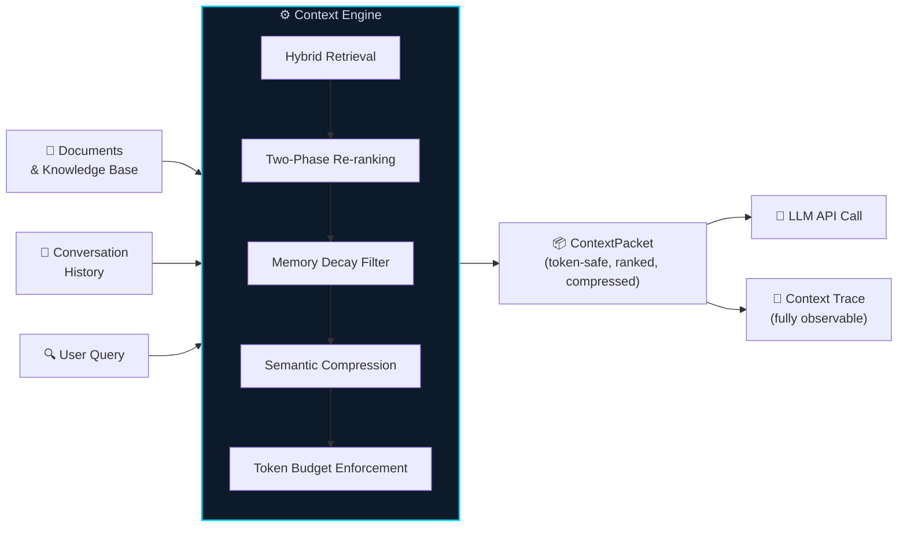

### Why It Exists

Without a context engine, LLM systems operating under multi-turn, multi-document, token-constrained conditions degrade **predictably and immediately**:

| Symptom | Root Cause |
|---|---|
| Prompt overflows | No token budget enforcement |
| Model "forgets" recent turns | No memory decay; old turns crowd new ones |
| Relevant docs dropped | No re-ranking; near-duplicates fill top-K |
| 39% performance drop | Fragmented multi-turn context (Microsoft/Salesforce, 2025) |
| Accuracy cliff at unpredictable length | Context rot — confirmed on 18 models (Chroma, 2025) |

---

## 2. Problem Statement

### The Core Failure Mode

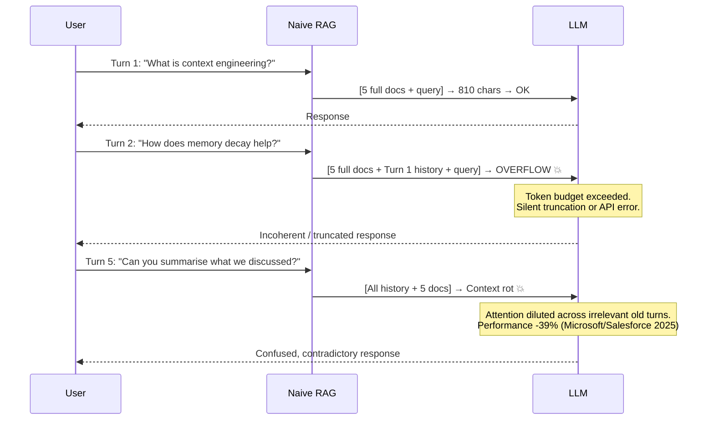

### What Existing Solutions Miss

| Tool | What It Provides | What It Misses |
|---|---|---|
| LangChain / LlamaIndex | RAG pipeline orchestration | Context assembly discipline; budget enforcement |
| Vector databases | Document storage + retrieval | Compression; memory decay; token budgeting |
| Prompt engineering libraries | Instruction quality | Information flow control |
| LLM APIs | Token acceptance | Context curation — they accept, not curate |
| Memory libraries (Mem0, Zep) | Session persistence | Integrated pipeline orchestration |

> **No existing off-the-shelf component addresses context engineering as a complete, integrated pipeline.  
> The Context Engine fills this gap.**

---

## 3. Goals & Non-Goals

### Goals

| ID | Requirement | Priority |
|---|---|---|
| `GOAL-01` | Guarantee context packets never exceed configured token budget, under any combination of document count, history depth, or query type | 🔴 Must |
| `GOAL-02` | Deliver measurably higher retrieval relevance than TF-IDF-only or embedding-only, validated by NDCG@5 (+15% minimum) | 🔴 Must |
| `GOAL-03` | Implement exponential memory decay with configurable parameters; high-importance turns must survive longer than low-importance turns without manual annotation | 🔴 Must |
| `GOAL-04` | Produce a full `ContextTrace` for every `build()` call — a serialised, queryable record of every allocation decision | 🔴 Must |
| `GOAL-05` | Persist memory state across sessions (SQLite single-user; PostgreSQL multi-user) with identical API across backends | 🟡 Should |
| `GOAL-06` | Expose the pipeline as an MCP server for integration with LangGraph, AutoGen, Semantic Kernel | 🟢 Could |

### Non-Goals

> ❌ This is **NOT** an LLM. The Context Engine assembles context; it does not generate responses.  
> ❌ This is **NOT** a vector database. It integrates with one; it does not replace one.  
> ❌ This is **NOT** a prompt engineering library. Prompt construction is a separate concern.  
> ❌ This is **NOT** a fine-tuning pipeline. Knowledge is retrieved, not baked into weights.  
> ❌ This is **NOT** a UI or chat interface. It is infrastructure consumed via API.

---

## 4. Users & Use Cases

### Primary Users

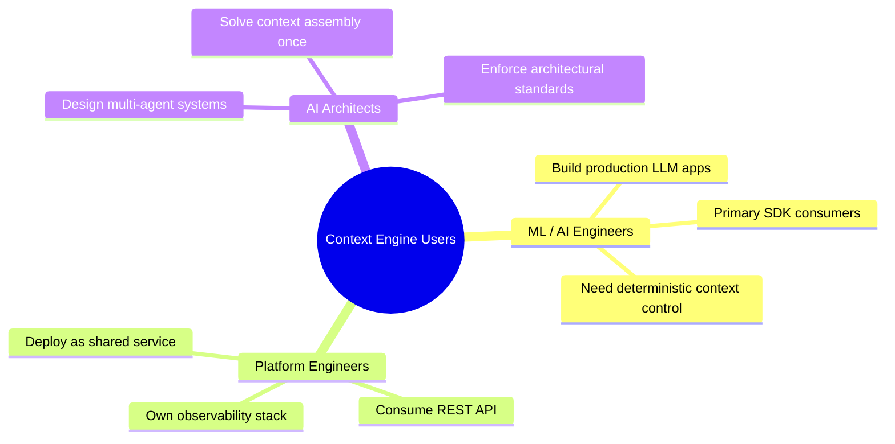

### Use Cases by Profile

| Use Case | Key Requirements | Config Profile |
|---|---|---|
| Multi-turn chatbot | Memory decay · deduplication · session persistence | `profile: conversational` |
| Enterprise RAG (large KB) | Two-phase re-ranking · adaptive α · semantic compression | `profile: knowledge-retrieval` |
| AI Copilot / Code Assistant | tiktoken (code-aware) · file context injection · low latency | `profile: developer-copilot` |
| Multi-agent orchestration | MCP server · shared memory across agents · tool-call context | `profile: agent` |
| Long-document Research QA | Dense ingestion · LLM Wiki compiler · extractive compression | `profile: research` |

### When to Skip the Context Engine

> ℹ️ The full pipeline overhead is not justified for:
> - Single-turn queries with < 20 documents
> - Latency requirements < 50ms without embedding caching  
> - Fully deterministic keyword-only retrieval domains (legal contract parsing)
>
> A `lightweight` mode (keyword retrieval + truncation + no memory) must be available for these cases.

---

## 5. System Architecture

### Full Architecture

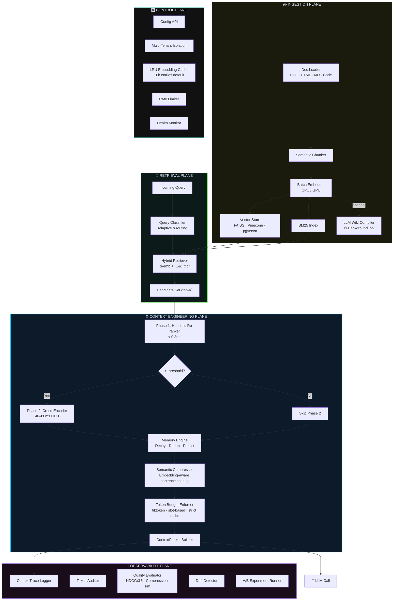

### Component Dependency Map

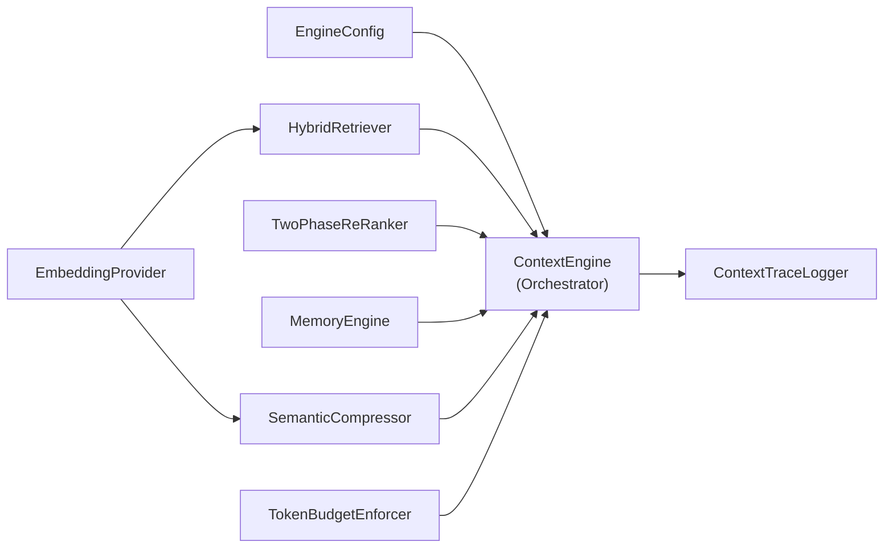

---

## 6. Component: Hybrid Retriever

### Functional Requirements

| ID | Requirement | Priority |
|---|---|---|
| `RET-01` | Support three retrieval modes: `keyword` (BM25), `tfidf` (TF-IDF + cosine), `hybrid` (adaptive-α blend) | 🔴 Must |
| `RET-02` | Implement `QueryClassifier` that selects α dynamically: keyword-heavy (0.35–0.45), balanced (0.60–0.70), semantic (0.75–0.85) | 🔴 Must |
| `RET-03` | Implement LRU embedding cache (default: 10,000 entries). Cache hit < 2ms; miss triggers fresh computation | 🔴 Must |
| `RET-04` | Expose pluggable embedding provider interface: `LocalTransformer`, `OpenAIEmbeddings`, `CohereEmbeddings` | 🟡 Should |
| `RET-05` | Degrade gracefully when `sentence-transformers` unavailable: fall back to TF-IDF with logged `WARNING`. Random embeddings forbidden in production mode | 🔴 Must |

### Alpha Selection Decision Tree

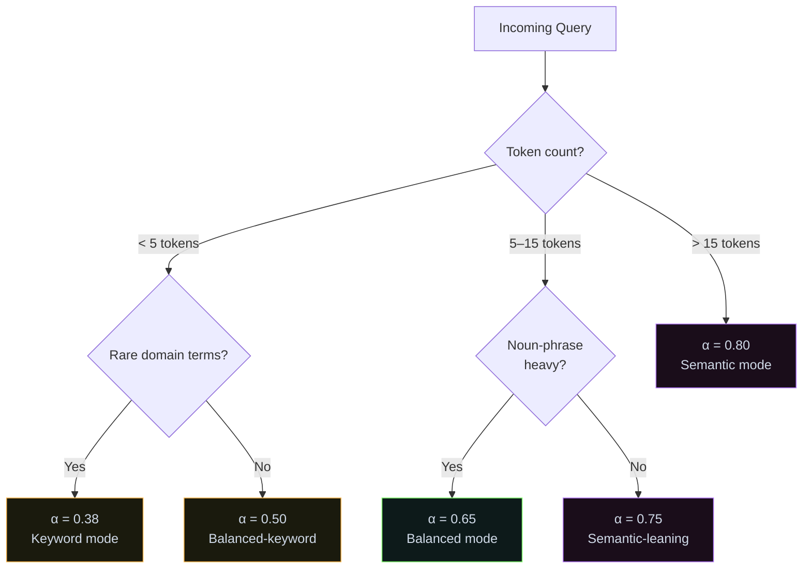

### Performance Targets

| Mode | P95 Latency Target | Notes |
|---|---|---|
| `keyword` | < 1ms | In-memory inverted index |
| `tfidf` | < 5ms | Pre-computed matrix |
| `hybrid` (CPU, cache hit) | < 30ms | LRU cache hit rate target > 80% |
| `hybrid` (GPU) | < 10ms | Batch inference |

---

## 7. Component: Two-Phase Re-ranker

### Functional Requirements

| ID | Requirement | Priority |
|---|---|---|
| `RNK-01` | Phase 1 heuristic: `score = retrieval × 0.65 + tag_importance × 0.25 + freshness_bonus × 0.10`. All weights configurable | 🔴 Must |
| `RNK-02` | Domain tag sets and importance multipliers must be configurable per deployment | 🔴 Must |
| `RNK-03` | Phase 2 cross-encoder invoked when doc count > configurable threshold (default: 20). Default model: `cross-encoder/ms-marco-MiniLM-L-6-v2` | 🟡 Should |
| `RNK-04` | Cross-encoder interface must be pluggable: local BERT, Cohere Rerank API, custom provider | 🟡 Should |

### Two-Phase Decision Flow

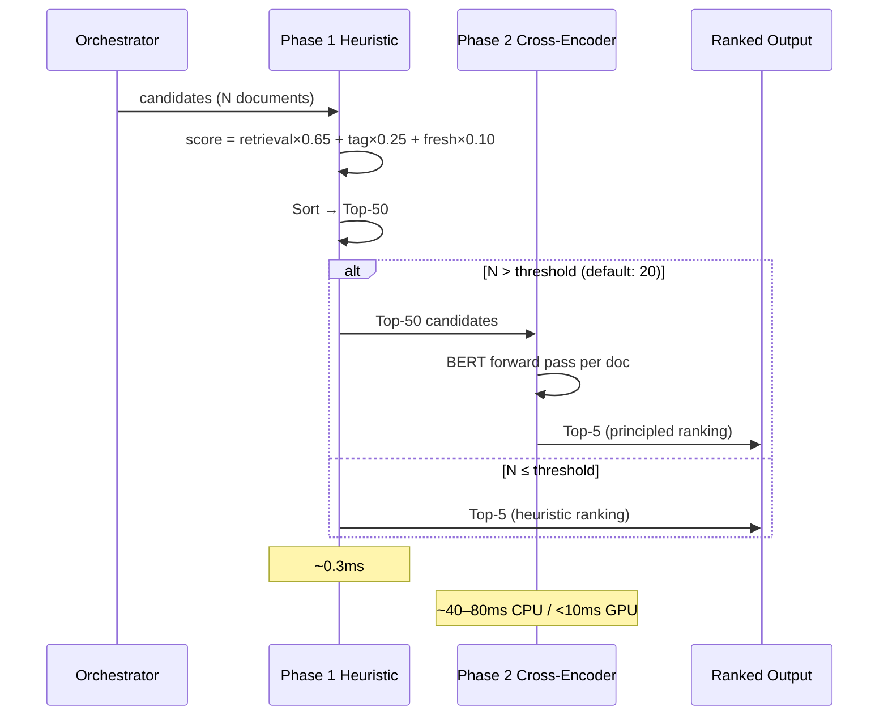

---

## 8. Component: Memory Engine

### Decay Model

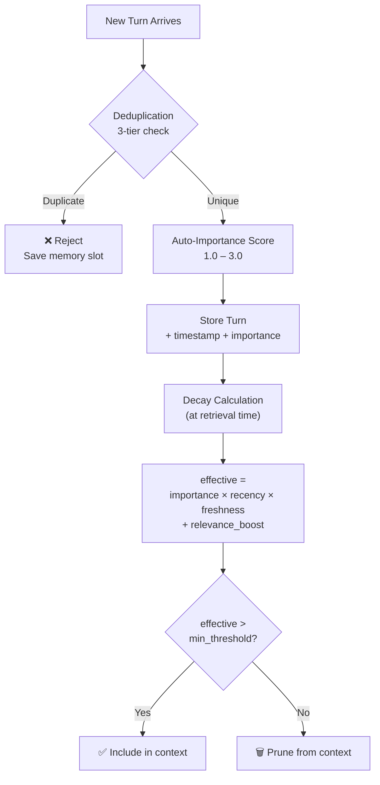

### Decay Formula Components

```
effective = importance × recency × freshness + relevance_boost

recency         = e^(−decay_rate × age_seconds)          [time-based forgetting]
freshness       = e^(−0.01 × seconds_since_last_access)  [recency-of-use bonus]
relevance_boost = (|query_tokens ∩ turn_tokens| / |query|) × 0.35  [topic alignment]
importance      = auto_score(content)  range: [1.0, 3.0]
```

### Functional Requirements

| ID | Requirement | Priority |
|---|---|---|
| `MEM-01` | All decay parameters (`decay_rate`, `freshness_coefficient`, `relevance_weight`, `min_importance_threshold`) configurable per instance | 🔴 Must |
| `MEM-02` | Auto-importance scoring evaluates: content length (log-scaled), domain keyword presence, query token overlap with recent turns | 🔴 Must |
| `MEM-03` | Three-tier deduplication before storage: (1) exact containment, (2) 50% prefix overlap, (3) Jaccard token similarity ≥ threshold (default 0.72) | 🔴 Must |
| `MEM-04` | Storage backend interface with `InMemoryBackend` (default) and `SQLiteBackend` (persistent). Identical `add()` / `get_weighted()` API | 🔴 Must |
| `MEM-05` | `PostgreSQLBackend` for multi-user deployment. Tenant isolation via `session_id` + `user_id` scoping | 🟡 Should |
| `MEM-06` | `VectorMemoryBackend` storing turn embeddings for semantic recall across sessions | 🟢 Could |

### Storage Backend Architecture

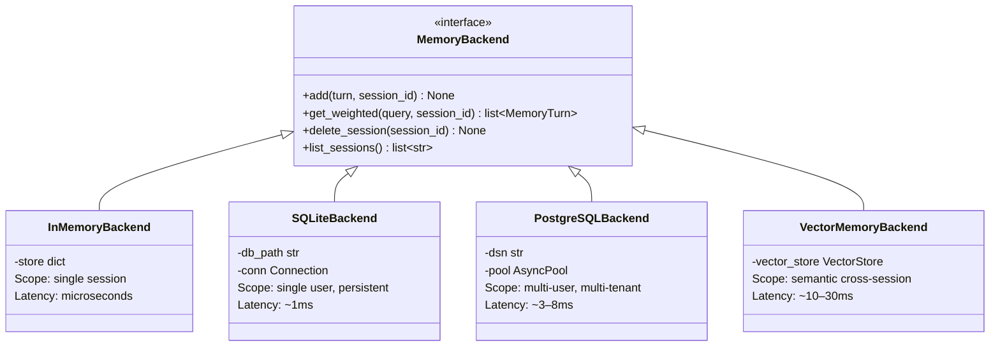

---

## 9. Component: Semantic Compressor

### Strategy Comparison

| Strategy | Algorithm | Speed | Quality | Use When |
|---|---|---|---|---|
| `truncate` | Proportional character cutoff per chunk | ⚡ ~0.1ms | Low — blindly cuts tail | Legacy compatibility only |
| `sentence` | Greedy sentence-boundary selection | ⚡ ~1ms | Medium — clean stops | Budget very tight |
| `extractive_token` | Query-token recall scoring | ✅ ~4ms | Good — relevant sentences | Default |
| `extractive_semantic` | Cosine similarity of sentence embeddings to query | ✅✅ ~12ms | Best — catches paraphrases | Production default |

### Semantic Compression Flow

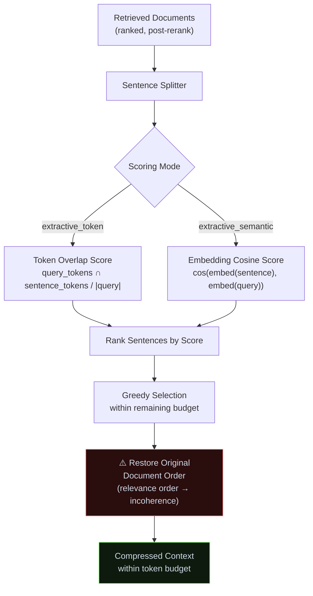

### Functional Requirements

| ID | Requirement | Priority |
|---|---|---|
| `CMP-01` | Support all four strategies: `truncate`, `sentence`, `extractive_token`, `extractive_semantic` | 🔴 Must |
| `CMP-02` | **All strategies must restore original document order.** Relevance-rank order is explicitly forbidden — it produces incoherent context | 🔴 Must |
| `CMP-03` | `extractive_semantic` uses cosine similarity between sentence and query embeddings, reusing the retrieval model (no additional model loading) | 🟡 Should |
| `CMP-04` | Report `compression_ratio`, `strategy_used`, `sentences_selected`, `sentences_dropped` in result, for context trace | 🔴 Must |

---

## 10. Component: Token Budget Enforcer

### Slot Reservation Order (Non-Negotiable)

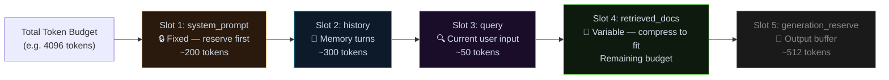

> ⚠️ **Reserve in the wrong order and documents silently overflow the budget before history is accounted for. The reservation order is the entire design.**

### Functional Requirements

| ID | Requirement | Priority |
|---|---|---|
| `BDG-01` | Token estimation configurable: `char_heuristic` (÷4, < 1ms), `tiktoken` (~5ms/1k tokens), `model_specific`. Non-English or code content **must** use tiktoken | 🔴 Must |
| `BDG-02` | Raise structured `BudgetExceededError` (never silent truncation) if system prompt alone exceeds total budget | 🔴 Must |
| `BDG-03` | `budget_report()` returns per-slot allocation, remaining budget, overflow risk flag. Must be included in context trace | 🔴 Must |
| `BDG-04` | Support configurable `generation_reserve` slot (default: 512 tokens) that is never consumed by input content | 🟡 Should |

---

## 11. Component: Pipeline Orchestrator

### `build()` Sequence

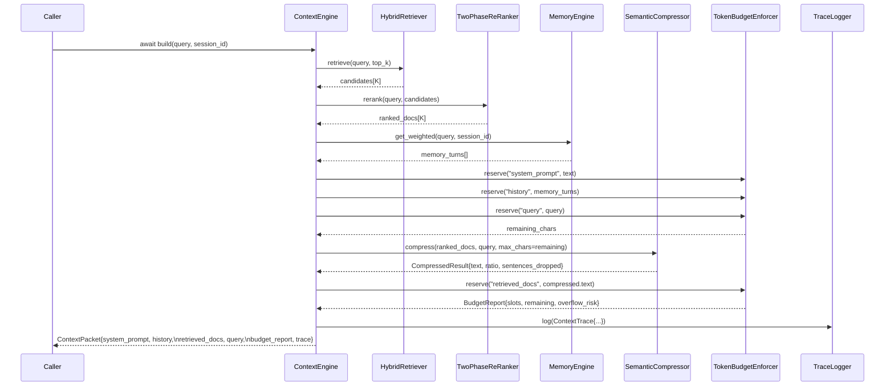

### Functional Requirements

| ID | Requirement | Priority |
|---|---|---|
| `ORC-01` | `build()` must be fully async. All I/O (embedding calls, DB reads, cache lookups) must be awaitable. Sync `build_sync()` wrapper acceptable as convenience | 🔴 Must |
| `ORC-02` | Config profiles (`conversational`, `knowledge-retrieval`, `developer-copilot`, `agent`, `research`, `lightweight`) must set all component defaults | 🔴 Must |
| `ORC-03` | All components must implement their degraded mode. Context assembly must always produce a valid `ContextPacket`, even under partial failure | 🔴 Must |
| `ORC-04` | Support `dry_run=True` mode: execute full pipeline, return trace + budget report, but do not consume memory slots or modify state | 🟡 Should |

---

## 12. API Design

### Python SDK (Primary Interface)

```python
from context_engine import ContextEngine, EngineConfig

# Initialise from a config profile
engine = ContextEngine.from_config(EngineConfig(
    profile="conversational",
    total_token_budget=4096,
    compression_strategy="extractive_semantic",
    memory_backend="sqlite",
    memory_db_path="./memory.db",
    reranker_mode="two_phase",
    reranker_cross_encoder_threshold=20,
    embedding_provider="local",        # or "openai", "cohere"
    embedding_cache_size=10_000,
    token_estimator="tiktoken",
))

# Build a context packet for an LLM call
packet = await engine.build(
    query="How does memory decay work in context engines?",
    session_id="user-abc-123",
)

# Use the packet to assemble your prompt (caller's responsibility)
prompt = f"{packet.system_prompt}\n\n{packet.retrieved_docs}\n\n{packet.query}"

# After the LLM responds, store the exchange
await engine.memory.add(
    content="How does memory decay work in context engines?",
    role="user",
    session_id="user-abc-123",
)
await engine.memory.add(
    content=llm_response,
    role="assistant",
    session_id="user-abc-123",
)

# Inspect the context trace
print(packet.trace.compression_ratio)   # e.g. 0.51
print(packet.budget_report.overflow_risk)  # False
```

### REST API Endpoints

| Method | Endpoint | Description | Auth |
|---|---|---|---|
| `POST` | `/v1/build` | Build a context packet. Returns `ContextPacket` JSON | Bearer token |
| `POST` | `/v1/memory/add` | Add conversation turn to session memory | Bearer token |
| `GET` | `/v1/memory/{session_id}` | Get weighted memory turns | Bearer token |
| `DELETE` | `/v1/memory/{session_id}` | Clear all memory for a session | Bearer token |
| `POST` | `/v1/documents/ingest` | Ingest documents (chunk + embed + index) | Admin |
| `GET` | `/v1/documents/{doc_id}` | Retrieve document metadata | Bearer token |
| `GET` | `/v1/traces/{trace_id}` | Retrieve stored context trace by ID | Bearer token |
| `GET` | `/v1/traces?session_id=&limit=` | List traces for a session | Bearer token |
| `GET` | `/v1/health` | Health check with per-component status | Public |
| `GET` | `/v1/metrics` | Prometheus-compatible metrics | Internal |

### Request / Response Shape

```python
# POST /v1/build
{
  "query": "How does memory decay work?",
  "session_id": "user-abc-123",
  "profile": "conversational",          # optional override
  "token_budget": 4096,                 # optional override
  "compression_strategy": "extractive_semantic"
}

# Response: ContextPacket
{
  "system_prompt": "You are a helpful assistant...",
  "history": [
    {"role": "user", "content": "...", "effective_score": 2.31},
    {"role": "assistant", "content": "...", "effective_score": 1.87}
  ],
  "retrieved_docs": "...(compressed, ordered)...",
  "query": "How does memory decay work?",
  "total_tokens": 1842,
  "overflow_risk": false,
  "budget_report": {
    "slots": {"system_prompt": 200, "history": 380, "retrieved_docs": 1200, "query": 62},
    "remaining": 254,
    "generation_reserve": 512
  },
  "trace": {
    "trace_id": "trc_7f3a...",
    "compression_ratio": 0.51,
    "reranker_phase": 1,
    "memory_turns_in": 8,
    "memory_turns_out": 2,
    "alpha_used": 0.65,
    "docs_before_compression": ["doc-001", "doc-003", "doc-007"],
    "docs_after_compression": ["doc-001", "doc-003", "doc-007"]
  }
}
```

---

## 13. Core Data Models

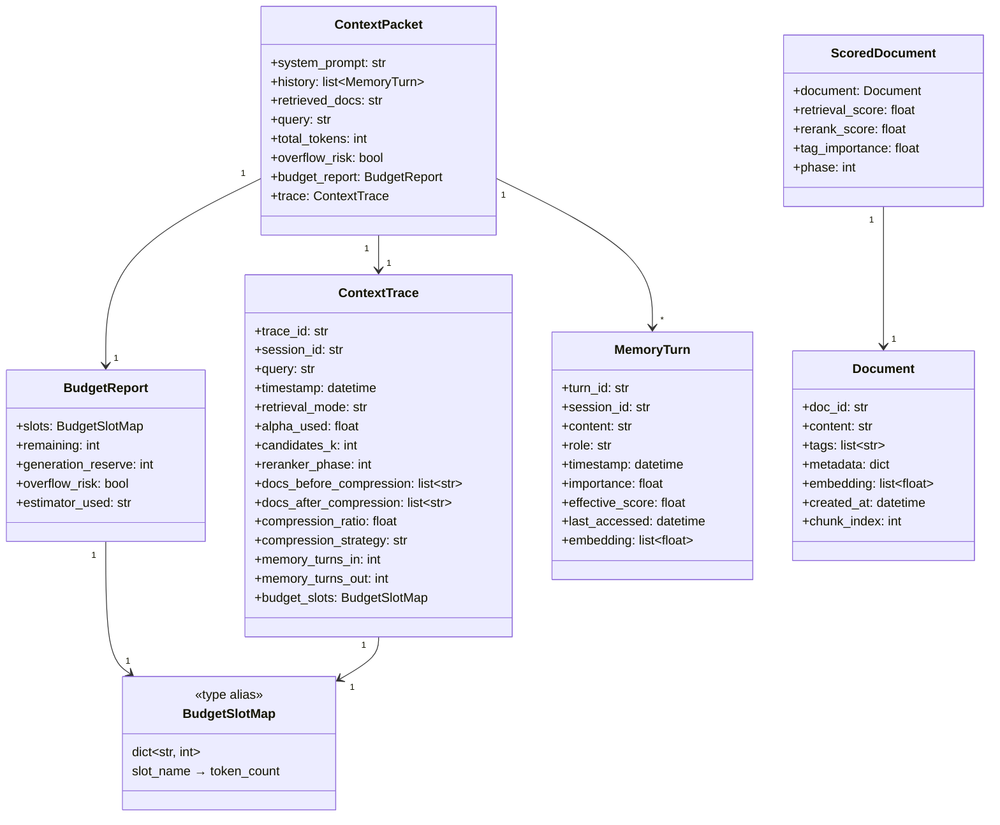

> **Field notes.**
> - `trace_id` and `turn_id` are UUIDs serialised as strings — represented as `str` so the diagram renders cleanly across all Mermaid versions.
> - `embedding` on `MemoryTurn` and `Document` is optional in practice (populated only when the backend supports vector recall); implementations should accept `None` / empty list.
> - `BudgetSlotMap` is a typed alias for `dict[str, int]` (slot name → token count) extracted into its own class to keep the diagram Mermaid-safe. In code it is a plain dict.

---

## 14. Performance Requirements (NFRs)

| ID | Requirement | Target | Measurement | Priority |
|---|---|---|---|---|
| `PERF-01` | P95 `build()` latency — hybrid mode, CPU, cached | < 120ms | Load test: 100 concurrent, 5 min | 🔴 Must |
| `PERF-02` | P95 `build()` latency — tfidf mode, CPU | < 15ms | Same load test | 🔴 Must |
| `PERF-03` | Embedding cache hit rate at steady state | > 80% | Metrics endpoint | 🟡 Should |
| `PERF-04` | Token budget accuracy (tiktoken mode) | ≤ 2% over-budget | Unit tests: 1,000 packet samples | 🔴 Must |
| `PERF-05` | Memory deduplication false-positive rate | < 5% | Eval: 500-turn conversation dataset | 🔴 Must |
| `PERF-06` | Retrieval NDCG@5 vs TF-IDF baseline | +15% minimum | Domain eval set: 100 queries, 50 docs | 🔴 Must |
| `PERF-07` | Max memory per engine instance | < 500MB | Memory profiling at steady-state | 🟡 Should |
| `PERF-08` | Throughput — CPU, hybrid, cached, 4 workers | > 200 req/sec | Load test: 500 concurrent, 10 min | 🟡 Should |

### Latency Budget Breakdown

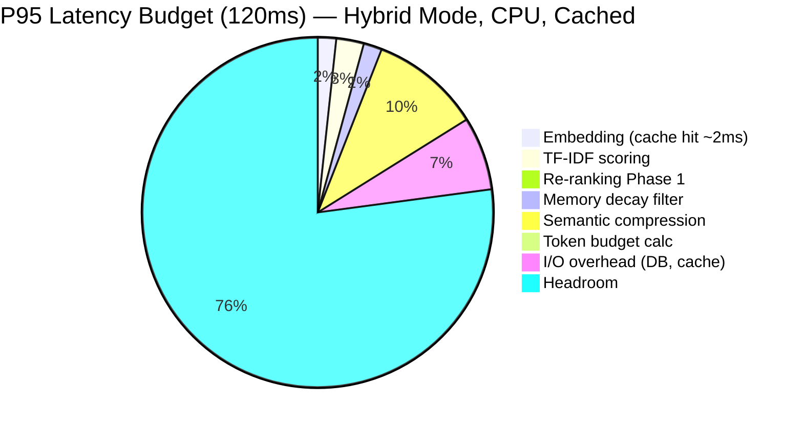

---

## 15. Observability & Evaluation

### Context Trace Coverage (Required for Production)

Every `build()` call produces a `ContextTrace`. No production deployment is complete without traces enabled.

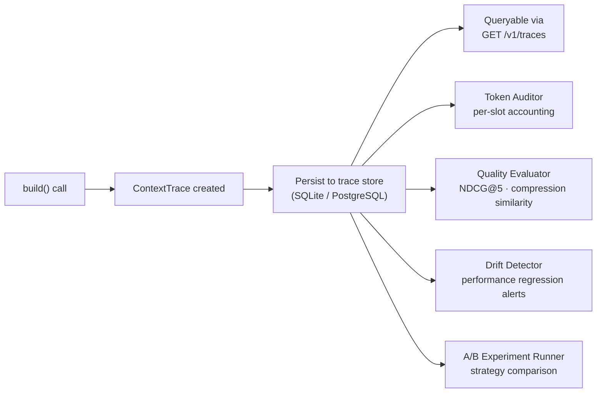

### Prometheus Metrics

| Metric | Type | Labels |
|---|---|---|
| `context_engine_build_latency_seconds` | Histogram | `mode`, `profile`, `cached` |
| `context_engine_token_budget_used_ratio` | Gauge | `slot`, `session_id` |
| `context_engine_compression_ratio` | Histogram | `strategy` |
| `context_engine_memory_turns_retained` | Gauge | `session_id` |
| `context_engine_cache_hits_total` | Counter | `cache_type` |
| `context_engine_cache_misses_total` | Counter | `cache_type` |
| `context_engine_reranker_phase_invocations` | Counter | `phase` |
| `context_engine_budget_overflow_total` | Counter | `slot` |

### Quality Evaluator (Background Job)

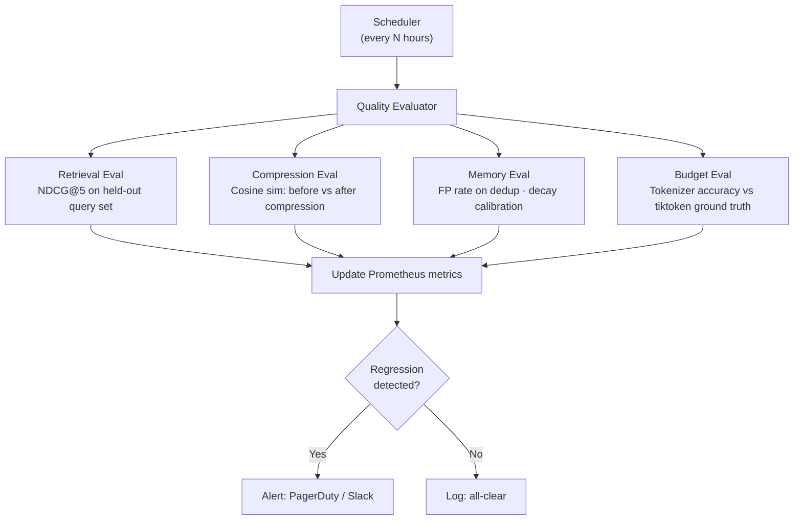

---

## 16. Implementation Phases

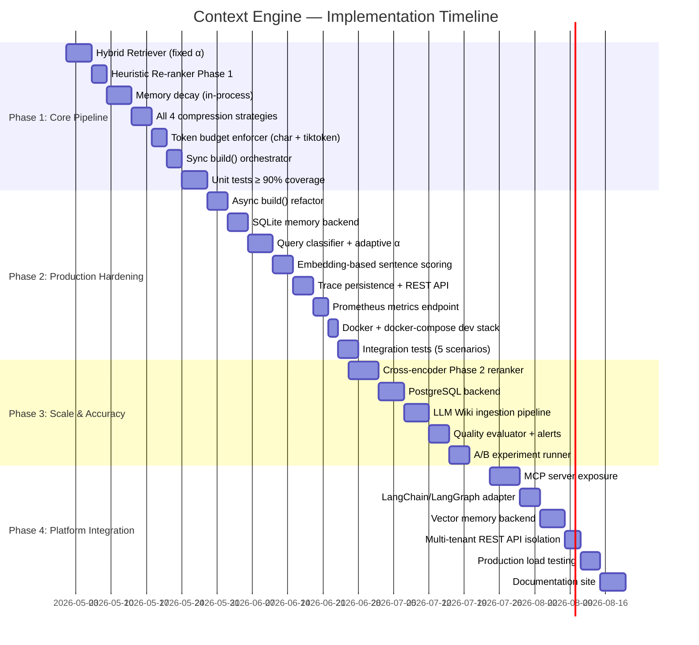

### Phase Deliverables Summary

| Phase | Duration | Key Deliverable | Accept Criteria |
|---|---|---|---|
| **Phase 1: Core Pipeline** | Weeks 1–4 | Working 5-component pipeline in Python | All unit tests pass; `build()` returns valid `ContextPacket` |
| **Phase 2: Production Hardening** | Weeks 5–8 | Async, persistent, observable system | SQLite backend; trace REST API; Prometheus metrics live |
| **Phase 3: Scale & Accuracy** | Weeks 9–12 | Cross-encoder + PostgreSQL + LLM Wiki | NDCG@5 +15% vs baseline; multi-user isolation verified |
| **Phase 4: Platform Integration** | Weeks 13–16 | MCP server + full docs + load tested | NFRs met at P95; MCP integration smoke test passes |

---

## 17. Testing Strategy

| Test Type | Scope | Coverage Target | Tooling |
|---|---|---|---|
| **Unit Tests** | Each component in isolation with mocked dependencies | ≥ 90% line coverage | `pytest`, `pytest-asyncio` |
| **Integration Tests** | Full `build()` pipeline with real retrieval store and memory backend | 5 canonical scenarios | `pytest` + in-memory SQLite |
| **Regression Eval** | NDCG@5, compression similarity, budget accuracy on fixed eval set | Run on every PR | Custom eval harness |
| **Load Tests** | 100 → 500 concurrent requests; 10-minute sustained runs | P95 within NFRs | `Locust` |
| **Property Tests** | Token budget never exceeded; dedup threshold respected; decay monotonically decreasing | Generative test suite | `Hypothesis` |
| **Chaos Tests** | Embedding provider unavailable; DB connection failure; OOM on large context | Graceful degradation verified | Manual + fault injection |

### Integration Test Scenarios

| Scenario | Description | Accept Criteria |
|---|---|---|
| `IT-01: overflow_prevention` | 5 full documents exceed 800-token budget | `ContextPacket.overflow_risk == False`; budget never exceeded |
| `IT-02: memory_decay_20turns` | 20-turn conversation; low-importance turns mixed with high | Low-importance turns pruned; high-importance turns retained after 12h |
| `IT-03: semantic_paraphrase_retrieval` | Query paraphrases document content without shared tokens | Relevant document retrieved in hybrid mode; not in TF-IDF-only |
| `IT-04: cross_session_continuity` | SQLite backend; engine restart; resume conversation | Memory turns from previous session available after restart |
| `IT-05: cross_encoder_threshold` | 25-document corpus; cross-encoder threshold = 20 | Phase 2 invoked; Phase 2 metrics logged in trace |

---

## 18. Success Metrics

```mermaid
quadrantChart
    title Success Metrics — Technical vs User-Facing
    x-axis Technical --> User-Facing
    y-axis Low Priority --> High Priority
    quadrant-1 Core Success
    quadrant-2 Must Hit
    quadrant-3 Monitor
    quadrant-4 Nice to Have

    Zero Budget Overflows: [0.2, 0.95]
    NDCG@5 Plus 15 Percent: [0.3, 0.90]
    P95 Below 120ms: [0.2, 0.85]
    100% Trace Coverage: [0.25, 0.80]
    Multi-turn Coherence: [0.75, 0.95]
    Cross-session Continuity: [0.80, 0.85]
    Cache Hit Rate 80pct: [0.15, 0.60]
    Dedup FP Rate Under 5pct: [0.2, 0.55]
```

### Technical KPIs

| KPI | Target | Measurement |
|---|---|---|
| Budget overflow rate | **0** | Count of `overflow_risk == True` in prod traces |
| NDCG@5 improvement vs TF-IDF | **+15%** | Quarterly eval on domain query set |
| P95 `build()` latency | **< 120ms** | Prometheus `p95(build_latency)` |
| Trace coverage | **100%** | `traces_logged / build_calls` |
| Embedding cache hit rate | **> 80%** | Prometheus `cache_hits / (hits + misses)` |
| Dedup false-positive rate | **< 5%** | Eval on conversation dataset |

### Product KPIs

| KPI | Target |
|---|---|
| Multi-turn chatbot coherence at turn 20 | No context overflow; high-importance turns retained |
| Enterprise RAG over 10,000-doc corpus | Zero budget overflows; relevant results in top-5 |
| Cross-session memory continuity | Users pick up where they left off after restart |
| Context auditability | Every allocation decision queryable via trace API |

---

## 19. Risks & Mitigations

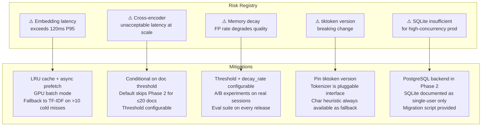

| Risk | Probability | Impact | Mitigation |
|---|---|---|---|
| Embedding latency degrades P95 beyond 120ms | Medium | High | LRU cache + async prefetch + GPU mode; TF-IDF fallback on cache cold >10 concurrent misses |
| Cross-encoder adds unacceptable latency | Medium | Medium | Phase 2 is conditional on threshold (configurable); default skips for ≤ 20 docs |
| Memory decay FP rate degrades conversation quality | Low | High | All params configurable; A/B experiments; eval suite on every release |
| tiktoken dependency breaking change | Low | Medium | Pinned version; pluggable interface; char heuristic always available as fallback |
| SQLite insufficient for production concurrency | Medium | Medium | PostgreSQL backend in Phase 2; SQLite documented single-user; migration script provided |

### Graceful Degradation Policy

> **Design Principle: Graceful Degradation Over Failure**
>
> Every component must define a degraded mode:
> - Cross-encoder unavailable → heuristic re-ranking
> - Embedding model unavailable → TF-IDF mode + `WARNING` log
> - Memory backend down → in-process fallback + `WARNING` log  
> - tiktoken unavailable → char heuristic fallback
>
> Context assembly must **always** produce a valid (possibly lower-quality) `ContextPacket`.  
> **Silent failure is never acceptable.**

---

## 20. Appendix: Configuration Reference

```yaml
# context_engine.yaml — full configuration reference

profile: conversational          # conversational | knowledge-retrieval | developer-copilot | agent | research | lightweight

# Token budget
token_budget:
  total: 4096
  generation_reserve: 512
  estimator: tiktoken             # char_heuristic | tiktoken | model_specific

# Retrieval
retrieval:
  mode: hybrid                    # keyword | tfidf | hybrid
  top_k: 5
  alpha: adaptive                 # float (fixed) | "adaptive" (query-classifier)
  alpha_fixed: 0.65               # used only when alpha != "adaptive"
  embedding_provider: local       # local | openai | cohere
  embedding_model: sentence-transformers/all-MiniLM-L6-v2
  embedding_cache_size: 10000

# Re-ranking
reranker:
  mode: two_phase                 # heuristic | two_phase
  weights:
    retrieval: 0.65
    tag_importance: 0.25
    freshness_bonus: 0.10
  cross_encoder_threshold: 20     # Phase 2 invoked when N > this
  cross_encoder_model: cross-encoder/ms-marco-MiniLM-L-6-v2
  domain_tags:
    - context
    - memory
    - rag
    - embedding
  tag_importance_multiplier: 1.4

# Memory
memory:
  backend: sqlite                 # in_memory | sqlite | postgresql | vector
  db_path: ./memory.db            # for sqlite backend
  dsn: postgresql://...           # for postgresql backend
  decay_rate: 0.001
  freshness_coefficient: 0.01
  relevance_weight: 0.35
  min_importance_threshold: 0.10
  dedup_threshold: 0.72

# Compression
compression:
  strategy: extractive_semantic   # truncate | sentence | extractive_token | extractive_semantic

# Observability
observability:
  trace_enabled: true
  trace_backend: sqlite           # sqlite | postgresql
  metrics_enabled: true
  quality_eval_schedule: "0 */6 * * *"  # every 6 hours (cron)
  drift_alert_threshold: 0.10    # alert if NDCG@5 drops >10% from baseline
```

---

<div align="center">

*Context Engine PRD v1.0 · April 2026*  
*Companion document: [CONTEXT_ENGINE_WHITEPAPER.md](./CONTEXT_ENGINE_WHITEPAPER.md)*  
*Reference implementation: [github.com/Emmimal/context-engine](https://github.com/Emmimal/context-engine/)*

</div>
