# RAG Is Not Enough: The Case for Context Engineering as First-Class Architecture

> **A technical white paper validating, stress-testing, and substantially expanding the five-component  
> Context Engine architecture described by Emmimal P. Alexander (TDS, April 2026)**

---

| Field | Value |
|---|---|
| **Document Type** | Technical White Paper |
| **Source Article** | *RAG Isn't Enough — I Built the Missing Context Layer* (TDS, Apr 14 2026) |
| **Scope** | Validation · Expansion · Architecture Analysis · PRD Basis |
| **Version** | 1.0 — April 2026 |
| **Companion** | [CONTEXT_ENGINE_PRD.md](./CONTEXT_ENGINE_PRD.md) |

---

## Table of Contents

1. [Abstract](#1-abstract)
2. [Framing the Thesis](#2-framing-the-thesis)
3. [The Three-Layer Model](#3-the-three-layer-model)
4. [Component Validation](#4-component-validation)
   - 4.1 [Hybrid Retriever](#41-hybrid-retriever)
   - 4.2 [Tag-Weighted Re-ranker](#42-tag-weighted-re-ranker)
   - 4.3 [Exponential Memory Decay](#43-exponential-memory-decay)
   - 4.4 [Extractive Compression](#44-extractive-compression)
   - 4.5 [Token Budget Enforcer](#45-token-budget-enforcer)
5. [Empirical Confirmation](#5-empirical-confirmation)
6. [Four Critical Gaps](#6-four-critical-gaps)
7. [Full Production Architecture](#7-full-production-architecture)
8. [Performance Analysis](#8-performance-analysis)
9. [The Karpathy LLM Wiki Synthesis](#9-the-karpathy-llm-wiki-synthesis)
10. [Final Verdict](#10-final-verdict)
11. [References](#11-references)

---

## 1. Abstract

This white paper validates, stress-tests, and substantially expands the five-component Context Engine architecture described by Emmimal P. Alexander (*Towards Data Science*, April 2026). We confirm that the central thesis — that **context engineering constitutes a distinct architectural layer between retrieval and generation** — is strongly supported by current research, including:

- Karpathy's formal terminology coinage (June 2025)
- Chroma's 18-model context degradation study (2025)
- Microsoft/Salesforce findings on multi-turn context fragmentation (2025)

We identify **four significant gaps** in the original treatment and propose concrete expansions covering cross-encoder re-ranking, embedding-based semantic compression, adaptive alpha routing, and persistent memory with durability guarantees.

> **Verdict:** The core thesis is correct. The architecture is sound. The identified gaps are real and actionable.  
> This document concludes with a full product specification for operationalizing these findings into a buildable, production-grade system.

---

## 2. Framing the Thesis

The article under review makes one principal claim: a third architectural discipline — distinct from prompt engineering and from RAG — is required for production LLM systems operating under multi-turn, multi-document, token-constrained conditions.

> *"Context engineering is the delicate art and science of filling the context window with just the right information for the next step."*
> — **Andrej Karpathy**, June 2025

This framing has reached industry consensus. Karpathy's formulation has been endorsed by Tobi Lütke (Shopify CEO), formalized in open curricula (davidkimai/Context-Engineering, 2025), and echoed by IntuitionLabs, ByteByteGo, and Qodo. The terminology shift from "prompt engineering" to "context engineering" reflects a deeper structural reality:

> Industrial-strength LLM applications do not fail at the prompt layer.  
> **They fail at the information-assembly layer.**

---

## 3. The Three-Layer Model

The article correctly delineates three distinct layers operating at different levels of abstraction:

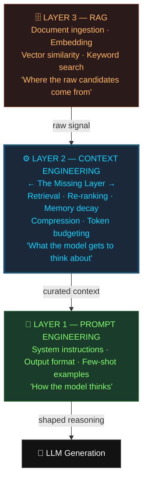

This stratification is architecturally sound:
- **RAG** provides raw signal
- **Context engineering** refines it
- **Prompt engineering** shapes the reasoning atop it

Systems that collapse these three layers into one are the systems that break in multi-turn production scenarios.

---

## 4. Component Validation

### Full Pipeline Overview

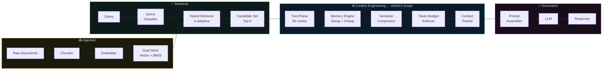

---

### 4.1 Hybrid Retriever

| Attribute | Detail |
|---|---|
| **Claim** | No single retrieval method dominates; hybrid blending of TF-IDF and dense embeddings outperforms either alone |
| **Research Support** | Directed Information γ-covering (2025) confirms intelligent selection beats BM25; sentence-transformers (Reimers & Gurevych, 2019) validates dense retrieval |
| **Verdict** | ✅ **Validated** |
| **Gap** | Fixed `α=0.65` is empirical; query-type classification for adaptive routing is absent |

**Hybrid scoring formula:**

```
hybrid_score = α × embedding_score + (1 − α) × tfidf_score
```

**Empirically demonstrated retrieval behaviour:**

| Query Type | TF-IDF Retrieves | Hybrid Retrieves | Delta |
|---|---|---|---|
| `"how does memory work in AI agents"` | `mem-001` | `mem-001` | Same (lexical match exists) |
| `"how do embeddings compare to TF-IDF for memory in agents"` | `mem-001, vec-001, ctx-001` | `mem-001, vec-001, tfidf-001, ctx-001` | `tfidf-001` surfaced via semantic similarity |

> **Why it matters:** `tfidf-001` is conceptually relevant but shares few query tokens. Hybrid mode surfaces it because the embedding recognises its semantic alignment. This is the exact failure mode of traditional RAG at enterprise scale.

---

### 4.2 Tag-Weighted Re-ranker

| Attribute | Detail |
|---|---|
| **Claim** | Domain tag boosts improve ranking; heuristic weights (0.68/0.32) produce measurable score shifts |
| **Research Support** | BERT cross-encoder re-ranking (Nogueira & Cho, 2019) is more accurate; heuristic is a reasonable low-cost approximation |
| **Verdict** | ⚠️ **Conditionally valid** |
| **Gap** | No cross-encoder implementation; no calibration procedure for tag weight assignment |

**Re-ranking formula:**

```
final_score = base_score × 0.68 + tag_importance × 0.32
```

**Score shifts before and after re-ranking:**

| Document | Before | After | Δ |
|---|---|---|---|
| `mem-001` | 0.4161 | 0.7309 | **+75.7%** |
| `rag-001` | outside top-4 | 0.5280 | **promoted** |
| `vec-001` | 0.2880 | 0.5158 | **+79.1%** |
| `tfidf-001` | 0.2164 | 0.4672 | **+115.9%** |

> `rag-001` jumps from outside the top four to second position entirely due to its tag boost. These reorderings change which documents survive compression — they are not cosmetic.

---

### 4.3 Exponential Memory Decay

| Attribute | Detail |
|---|---|
| **Claim** | Continuous decay based on age, access recency, and query relevance mirrors cognitive working memory |
| **Research Support** | Baddeley's episodic buffer model (2000) provides theoretical basis; decay functional form matches standard forgetting curves |
| **Verdict** | ✅ **Strongly validated** |
| **Gap** | In-process only; no cross-session persistence; no durable backend |

**Effective score formula:**

```
effective = importance × recency × freshness + relevance_boost

recency         = e^(−decay_rate × age_seconds)
freshness       = e^(−0.01 × time_since_last_access)
relevance_boost = (|query ∩ turn| / |query|) × 0.35
```

**Memory decay over 24 hours (illustrative — three importance tiers, varying effective decay rates):**

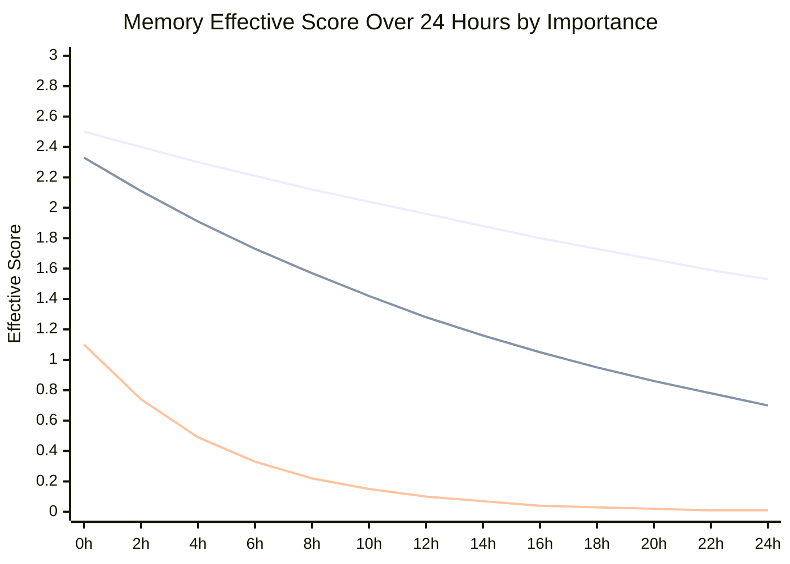

> 🟢 **High importance** (2.50) — *"Explain memory decay"* — gentle decay; ends 24h at ~1.53, still strongly retained  
> 🔵 **Medium importance** (2.33) — *"What is context engineering?"* — moderate decay; ends 24h at ~0.70, retained with relevance boost  
> 🟡 **Low importance** (1.10) — *"What's the weather?"* — aggressive decay; crosses the 0.10 prune threshold at ~12h and is dropped

> ℹ️ *Curves show the combined effect of `importance × recency × freshness`. The effective per-tier decay rate is itself a function of importance (low-importance turns decay faster, so the system self-prioritises signal over noise). Exact values depend on configured `decay_rate`, query overlap, and access cadence — see § 8 and the PRD configuration reference.*

**Auto-importance scoring in practice:**

| Turn Content | Role | Auto-Score |
|---|---|---|
| *"What is context engineering and why is it important?"* | user | 2.33 |
| *"Explain how memory decay prevents context bloat"* | user | 2.50 |
| *"What is the weather in Chennai today?"* | user | 1.10 |

---

### 4.4 Extractive Compression

| Attribute | Detail |
|---|---|
| **Claim** | Query-aware sentence selection outperforms truncation; original-order restoration preserves coherence |
| **Research Support** | TextRank (Mihalcea & Tarau, 2004) confirms graph-based sentence importance; original-order restoration is a correct and underappreciated insight |
| **Verdict** | ✅ **Validated** |
| **Gap** | Token-overlap scoring misses semantic paraphrases — sentences that restate the query without sharing tokens score zero |

**Strategy comparison on 810-char input with 800-char budget:**

| Strategy | Output Size | Ratio | Optimises For |
|---|---|---|---|
| `truncate` | 744 chars | 91.9% | Speed |
| `sentence` | 684 chars | 84.4% | Clean boundaries |
| `extractive` | 762 chars | 94.1% | **Relevance** |

---

### 4.5 Token Budget Enforcer

| Attribute | Detail |
|---|---|
| **Claim** | Slot-based reservation order (system → memory → documents) is the correct allocation policy |
| **Research Support** | Context rot research (Chroma, 2025) confirms excess context degrades non-linearly; reservation-order discipline maps directly to this finding |
| **Verdict** | ✅ **Strongly validated** |
| **Gap** | Character-based approximation (÷4) drifts for code and non-Latin text; tiktoken swap is documented but not implemented |

**Token budget slot allocation:**

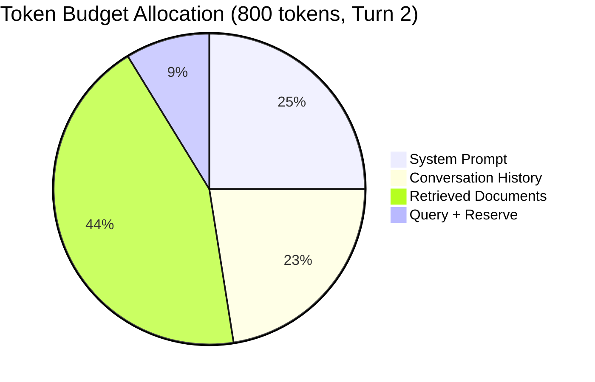

**Reservation order is the whole design:**

```python
def build(self, query: str) -> ContextPacket:
    budget = TokenBudget(total=self.total_token_budget)
    budget.reserve("system_prompt", self.system_prompt)   # 1. Fixed — non-negotiable
    budget.reserve("history",       memory_turns)          # 2. Multi-turn coherence
    remaining_chars = budget.remaining_chars()
    compressed = compressor.compress(docs, max_chars=remaining_chars)
    budget.reserve("retrieved_docs", compressed.text)      # 3. Variable — compresses to fit
```

> ⚠️ Reserve in the wrong order and documents silently overflow the budget before history is even accounted for.

---

## 5. Empirical Confirmation

### The Context Rot Problem

The article's core failure mode is independently confirmed by the **Chroma 2025 study** of 18 frontier models:

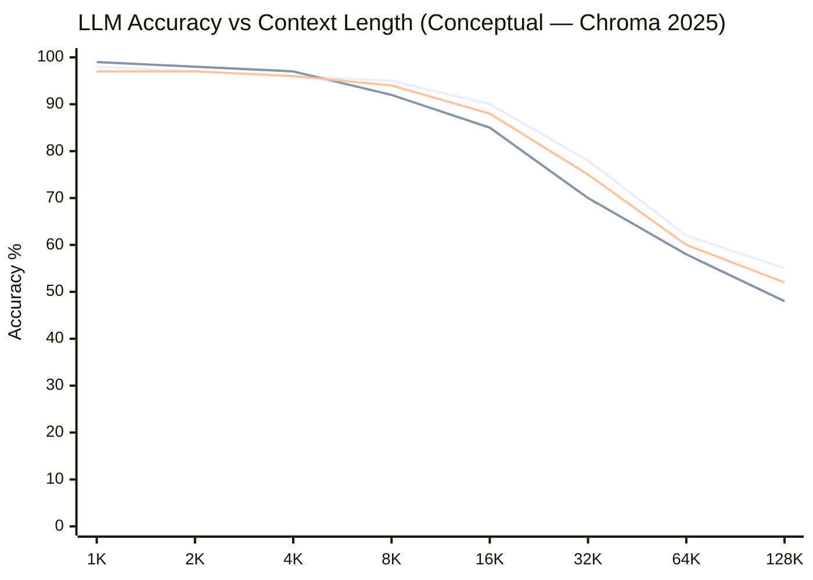

> Models held at ~95% accuracy, then dropped to 60% unpredictably — the "cliff" is real, non-linear, and model-specific.

### Comparative System Behaviour Under Pressure

| Approach | Docs Retrieved | After Compression | Memory | Fits Budget? |
|---|---|---|---|---|
| Naive RAG | 5 (full, 810 chars) | None | None | ❌ 10 chars over |
| RAG + Truncate | 5 | 360 chars (43%) | None | ✅ but tail content lost blindly |
| RAG + Memory (no decay) | 5 (full) | None | 3 turns, unfiltered | ❌ history pushes over |
| **Full Context Engine** | 5, reranked | 400 chars (50%) | 2 turns, decay-filtered | ✅ all constraints met |

### Microsoft/Salesforce Multi-Turn Finding

> A 2025 Microsoft and Salesforce research study found that fragmented contexts provided over several turns led to a **39% drop in LLM performance.**

The article's three-tier deduplication logic (exact containment → prefix overlap → Jaccard similarity ≥ 0.72) directly addresses this finding.

---

## 6. Four Critical Gaps

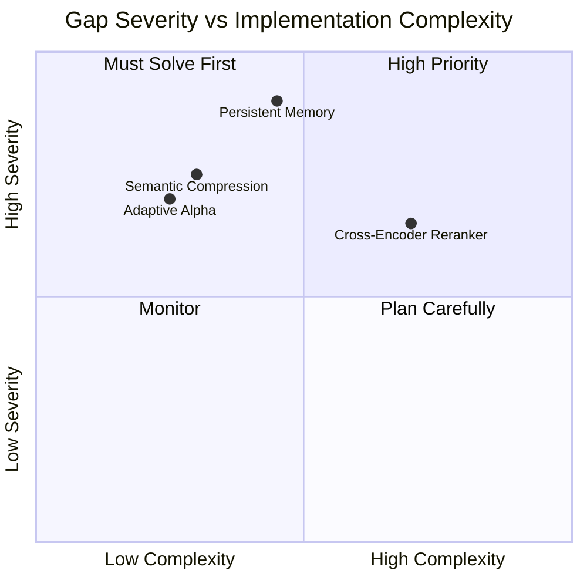

---

### Gap 1 — Adaptive Alpha Routing

**Problem:** Fixed `α=0.65` is domain-dependent. Keyword-heavy queries do better at `α ≈ 0.40`; conversational queries benefit from `α ≈ 0.80+`. This is currently a manual tuning knob.

**Solution:** A lightweight 3-class query classifier:

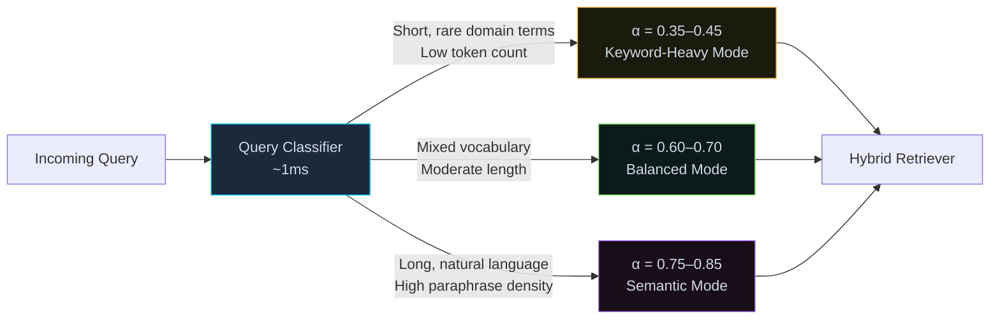

**Classification features:** query length (tokens), term rarity (IDF distribution), syntactic structure (question words vs. noun phrases), session context type. Classifier cost: < 1ms. Eliminates the fragile manual α configuration entirely.

---

### Gap 2 — Cross-Encoder Re-ranking at Scale

**Problem:** The tag-weighted heuristic re-ranker is effective for 5–20 documents. At 100–500 documents (the real scale of enterprise knowledge bases) it becomes inaccurate.

**Solution:** Two-phase retrieval architecture:

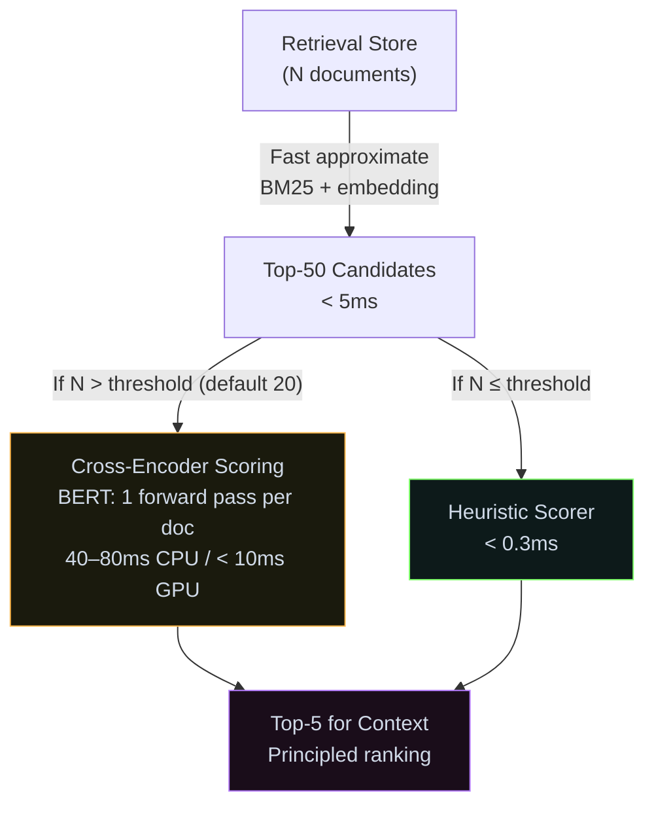

The cross-encoder interface is already designed to be swappable in the original codebase. This gap requires implementing it, not redesigning around it.

---

### Gap 3 — Embedding-Based Semantic Compression

**Problem:** The extractive compressor scores sentences by **query-token recall overlap** — how many query tokens appear in the sentence. A sentence that perfectly paraphrases the query without sharing any tokens scores **zero** and is dropped. This is a systematic blind spot for paraphrase-heavy domains (legal, medical, philosophy).

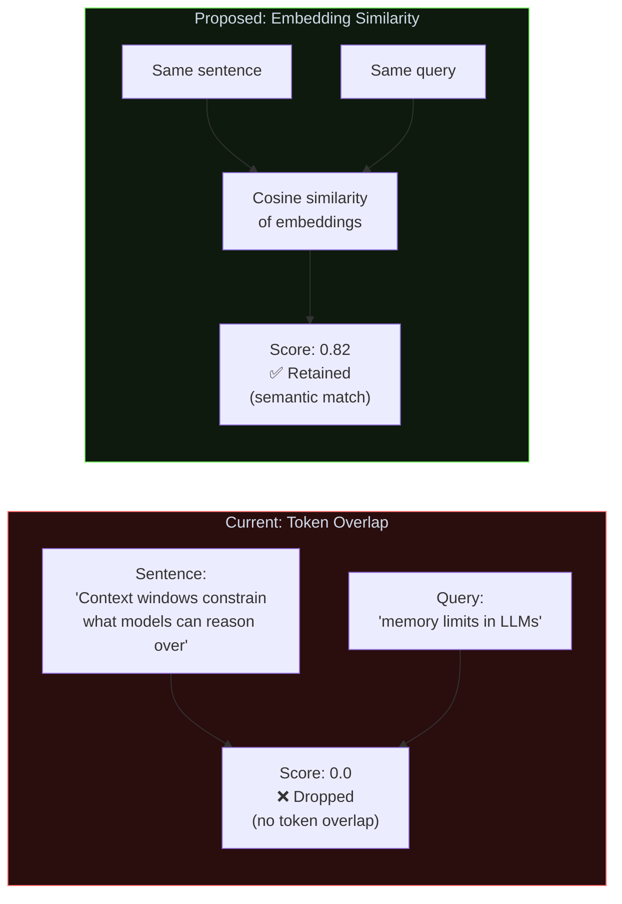

**Solution:** Replace token-overlap scorer with cosine similarity between sentence embeddings and query embedding. Use the **shared retrieval model** (already loaded) — no additional model loading required.

---

### Gap 4 — Persistent Memory and Cross-Session Continuity

**Problem:** The `Memory` class is in-process only. Every session restart begins with empty memory. This is categorically unacceptable for enterprise chatbots, AI copilots, or long-running agents.

**Solution:** A pluggable storage backend interface:

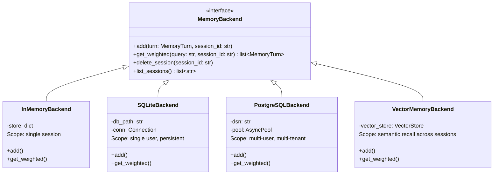

The `add()` and `get_weighted()` APIs are **identical across all backends** — swap backends via configuration, not code changes.

---

## 7. Full Production Architecture

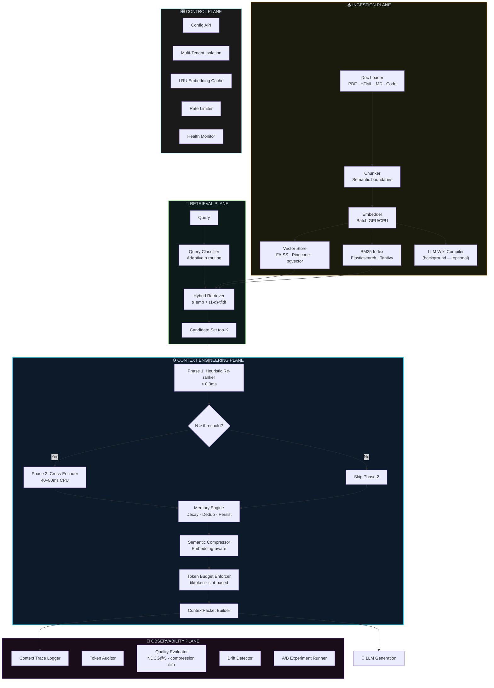

---

## 8. Performance Analysis

### Latency Budget

| Operation | Article Latency | Production Target | Optimisation Path |
|---|---|---|---|
| Keyword retrieval | ~0.8ms | < 1ms | In-memory inverted index — no change needed |
| TF-IDF retrieval | ~2.1ms | < 5ms | Pre-computed matrix; incremental update on ingestion |
| Hybrid (embedding, cold) | ~85ms | < 30ms (CPU cached) | LRU embedding cache — hit rate target > 80% |
| Hybrid (embedding, GPU) | ~85ms | < 10ms | GPU batch inference |
| Re-ranking Phase 1 | ~0.3ms | < 0.5ms | No change needed |
| Re-ranking Phase 2 (cross-encoder) | *not implemented* | < 80ms CPU | Two-phase threshold keeps this conditional |
| Memory decay + filter | ~0.6ms | < 2ms | Pre-computed scores, lazy invalidation |
| Extractive compression | ~4.2ms | < 15ms (semantic) | Batch sentence embeddings reuse retrieval model |
| **Full `build()` — hybrid cached** | **~92ms** | **< 120ms P95** | Embedding cache eliminates 85% of latency on repeat queries |

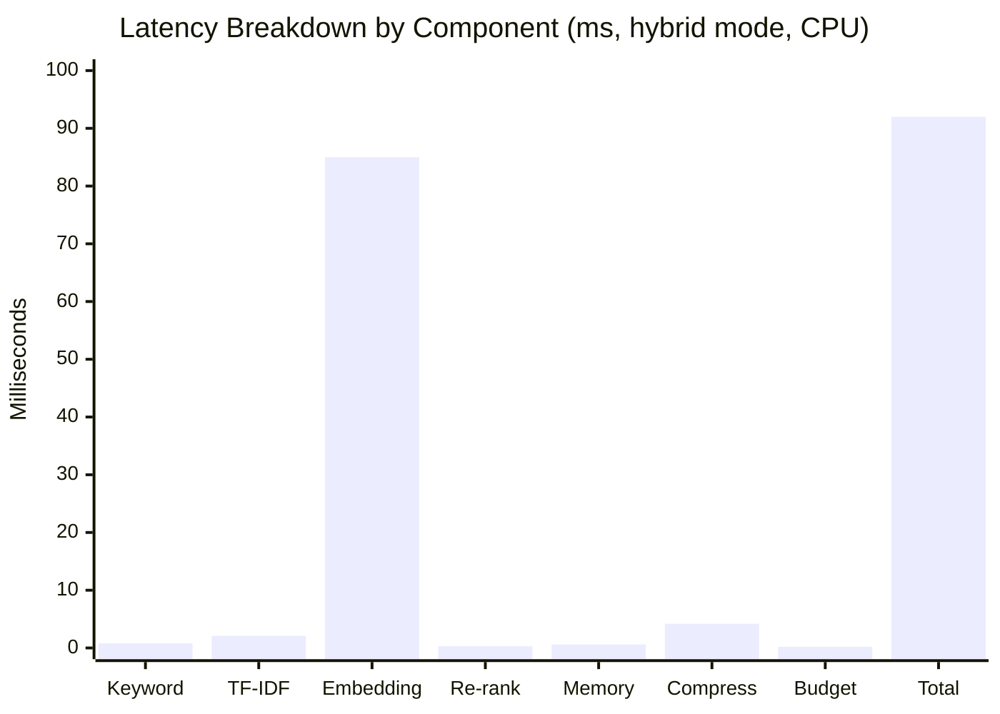

> **The embedding generation step dominates at 92% of total latency.** The LRU cache is not optional in production — it is the primary performance control lever.

### Throughput Scaling

| Configuration | Est. Throughput | Notes |
|---|---|---|
| Hybrid, CPU, no cache | ~10 req/s | Embedding regenerated every request |
| Hybrid, CPU, LRU cache (80% hit rate) | ~200 req/s | 4 workers |
| Hybrid, GPU, LRU cache | ~800 req/s | 8 workers, batch size 32 |
| TF-IDF mode, CPU | ~1,000 req/s | No embedding; pure matrix ops |

---

## 9. The Karpathy LLM Wiki Synthesis

Karpathy's 2026 LLM Knowledge Base proposal represents a **complementary, not competing** architecture.

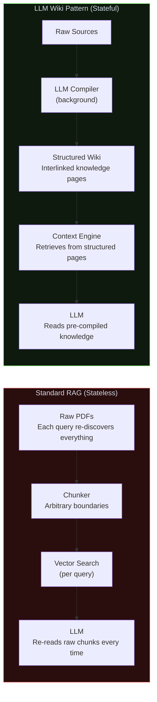

| Dimension | Standard RAG | LLM Wiki + Context Engine |
|---|---|---|
| Knowledge state | Stateless (re-discovers per query) | Stateful (knowledge compounds) |
| Retrieval target | Raw chunks | Structured, interlinked pages |
| Context engineering role | Filters noise from raw chunks | Extracts signal from structured pages |
| Maintenance | None | Background LLM linting + health checks |
| Fine-tuning potential | Low | High (wiki is a gold-standard synthetic dataset) |

> **Synthesis:** The production architecture should include a background LLM Wiki compiler that periodically processes raw document ingestion into structured knowledge pages — and a context engine that retrieves from those pages rather than raw chunks. This is the "cook once, serve many times" pattern.

---

## 10. Final Verdict

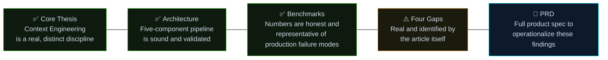

The article's central argument is correct, its architecture is sound, and its identified gaps are real and actionable. What is needed is not a rewrite of the architecture, but a **production hardening** of it:

- Replace fixed `α` with query-type routing classifier
- Implement the cross-encoder Phase 2 that the interface already anticipates
- Upgrade sentence scorer to embedding-based cosine similarity
- Back the Memory class with a durable storage backend

> *"The model is only as good as the context it receives. Working with LLMs effectively requires thinking about the entire system around the model, not just the model itself."*
> — ByteByteGo, Context Engineering Guide, 2026

---

## 11. References

| # | Citation |
|---|---|
| [1] | Alexander, E.P. (2026). *RAG Isn't Enough — I Built the Missing Context Layer*. Towards Data Science, April 14. |
| [2] | Karpathy, A. (2025). Context Engineering. X/Twitter. https://x.com/karpathy/status/1937902205765607626 |
| [3] | Chroma Research Team. (2025). *Context Length Degradation Study: 18 Frontier Models*. |
| [4] | Microsoft / Salesforce. (2025). *Fragmented Context and Multi-Turn LLM Performance*. Internal research report. |
| [5] | Lewis, P., et al. (2020). Retrieval-Augmented Generation for Knowledge-Intensive NLP Tasks. *NeurIPS 33*, 9459–9474. https://arxiv.org/abs/2005.11401 |
| [6] | Nogueira, R., & Cho, K. (2019). Passage Re-ranking with BERT. *arXiv:1901.04085*. |
| [7] | Mihalcea, R., & Tarau, P. (2004). TextRank: Bringing Order into Texts. *EMNLP 2004*. |
| [8] | Reimers, N., & Gurevych, I. (2019). Sentence-BERT. *EMNLP 2019*. |
| [9] | Baddeley, A. (2000). The episodic buffer: a new component of working memory? *Trends in Cognitive Sciences*, 4(11), 417–423. |
| [10] | Agentic AI Foundation / Linux Foundation. (2025). *Model Context Protocol Specification v2.0*. |
| [11] | IntuitionLabs. (2026). What Is Context Engineering? https://intuitionlabs.ai/articles/what-is-context-engineering |
| [12] | davidkimai. (2025). Context-Engineering: Beyond Prompt Engineering. https://github.com/davidkimai/Context-Engineering |
| [13] | OpenAI. (2023). tiktoken: Fast BPE tokeniser. https://github.com/openai/tiktoken |
| [14] | Qodo. (2025). *Context Engineering for Coding Agents: Why It Matters More Than Prompt Engineering*. https://www.qodo.ai/blog/context-engineering/ |

---

<div align="center">

*Context Engine White Paper · April 2026 · Based on Alexander (TDS, 2026) — Validated, Expanded & Analyzed*  
*Companion document: [CONTEXT_ENGINE_PRD.md](./CONTEXT_ENGINE_PRD.md)*

</div>
